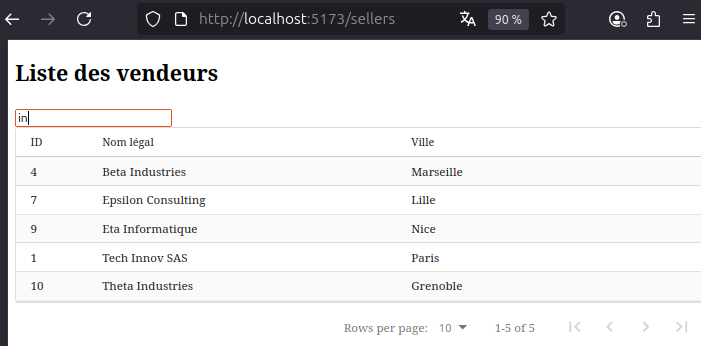

# Jour 5 – Sécuriser les accès et améliorer l’interface utilisateur 🎨

Aujourd’hui, j’ai fait deux pas importants pour rendre le projet plus robuste et agréable à utiliser.

## Sécurisation des mots de passe

Je me suis d’abord attaqué à un point crucial : la gestion des mots de passe dans la configuration de la base de données. Jusqu’ici, ils étaient stockés en clair dans un fichier, ce qui n’est vraiment pas une bonne pratique.

J’ai donc choisi de stocker ces informations sensibles dans des variables d’environnement côté serveur. C’est beaucoup plus sûr, car ces variables ne sont pas versionnées et restent uniquement accessibles sur la machine où tourne le backend.

J’ai appris à définir ces variables dans mon environnement Ubuntu, à les charger proprement dans mon application Node.js, et à corriger quelques erreurs liées au formatage. Ça m’a aussi rappelé l’importance de vérifier le type et le format des données que je fournis aux modules, comme ici pour le mot de passe qui doit impérativement être une chaîne de caractères.

Bref, une étape qui améliore la sécurité et la qualité globale du projet.

## Réflexion et travail sur le design du site

Ensuite, je me suis penché sur la partie visible, ce qui compte aussi beaucoup : l’interface utilisateur.

Au départ, mon tableau de vendeurs était fonctionnel mais vraiment très basique, sans aucune mise en forme ni ergonomie.

Pour y remédier, j’ai intégré la bibliothèque **react-data-table-component**, qui apporte tout ce qu’il faut pour un tableau élégant, avec des bordures, un tri facile, une recherche instantanée, une pagination et un rendu responsive.
```js
import DataTable from 'react-data-table-component';

// SellerList.jsx
<DataTable
    columns={columns}
    data={filteredItems}
    pagination
    paginationPerPage={20}
    highlightOnHover
    striped
    responsive
    dense
    noHeader
    customStyles={{
        table: {
        style: {
            border: '1px solid #ddd',
            borderRadius: '4px',
        },
        },
        headRow: {
        style: {
            borderBottom: '2px solid #ccc',
        },
        },
        rows: {
        style: {
            borderBottom: '1px solid #eee',
        },
        },
    }}
/>
```

Le résultat est fluide, simple, et surtout rapide à mettre en place. Cela m’a donné une belle base pour harmoniser le style de l’ensemble du site et améliorer l’expérience utilisateur dès les premières fonctionnalités.

Je me suis aussi permis d’ajouter Bootstrap pour un peu de mise en forme générale, histoire que les champs de recherche et la structure globale soient plus agréables visuellement, sans devoir partir dans du CSS complexe.



## Ce que ça m’a appris

- La sécurité, même sur un petit projet, c’est fondamental et il ne faut pas l’oublier.  
- Utiliser des composants React adaptés permet d’aller vite tout en gardant un code propre et maintenable.  
- La première impression compte : un site bien présenté invite davantage à être utilisé et testé.

---

Demain, je compte continuer sur la lancée côté interface et ajouter des écrans pour les acheteurs et les factures.  
Je vais aussi réfléchir à la navigation entre ces différentes pages pour rendre l’application plus cohérente.

---

Un pas de plus, une victoire de plus ! 🚀
