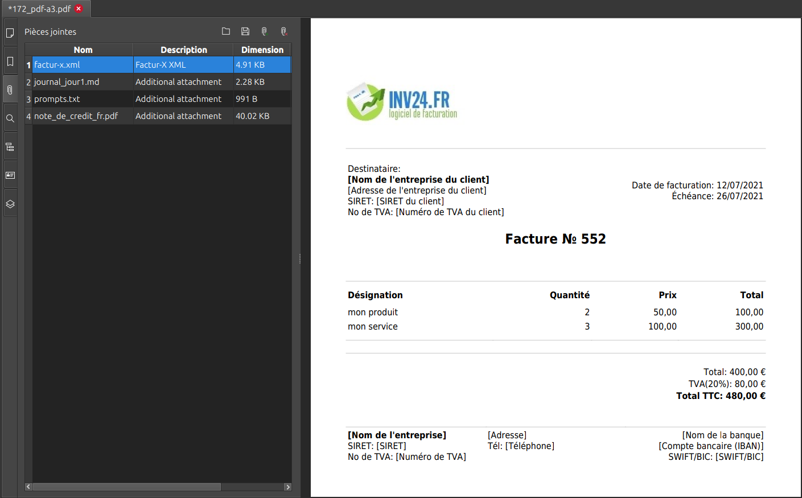

# Jour 43 – Intégration PDF et préparation PDF/A‑3 📝💻

Aujourd’hui, focus sur **l’intégration du XML Factur‑X dans le PDF de la facture et les préparatifs pour la conformité PDF/A‑3**.

---

## ✅ Ce qu’on a fait

- **Création d’un générateur PDF “safe”** :  
  - Script `pdf-generator.js` capable de charger un PDF existant.  
  - Attachement automatique du **XML Factur‑X**.  
  - Gestion des **fichiers supplémentaires** attachés à la facture (optionnel).  

- **Gestion des métadonnées PDF** :  
  - Titre et sujet définis via `pdfDoc.setTitle()` et `pdfDoc.setSubject()`.  
  - Préparation pour ajouter **XMP et OutputIntent** plus tard pour la conformité PDF/A‑3.

- **Tests avec pdf-lib** :  
  - Validation que les fichiers étaient bien attachés.  
  - Détection des erreurs initiales liées à des méthodes inexistantes (`embedXMPMetadata`) ou à des objets non conformes (`sizeInBytes`).  
  - Réflexion sur les limitations de pdf-lib pour atteindre le PDF/A‑3 complet.

- **Plan pour la conformité PDF/A‑3** :  
  - Ghostscript identifié comme **outil le plus simple et robuste** pour convertir un PDF standard + attachments en PDF/A‑3.  
  - Clarification : Ghostscript reste **installé côté système**, pas besoin de le copier dans `backend`.  
  - Objectif : automatiser la génération PDF/A‑3 à partir du PDF existant et du XML Factur‑X.

---

## 💪 Résultat

- **PDF de la facture prêt** à recevoir le XML Factur‑X et les éventuels autres attachments.  
- **Script backend opérationnel** pour créer un PDF “préparé” à la conversion PDF/A‑3.  
- Vue claire sur les **prochaines étapes pour la conformité totale PDF/A‑3**.
  

---

## 📌 Prochaines étapes

- Ajouter **OutputIntent et XMP** via Ghostscript pour obtenir un PDF/A‑3 conforme.  
- Tester la **conversion complète avec Ghostscript** sur une facture réelle.  
- Valider le PDF/A‑3 généré avec des outils officiels pour corriger les derniers avertissements ou erreurs.  
- Automatiser la **chaîne PDF + Factur‑X + conversion PDF/A‑3** côté backend pour chaque facture.

---

👉 Objectif du jour atteint : **PDF prêt pour PDF/A‑3, XML attaché, structure backend opérationnelle 🚀**
