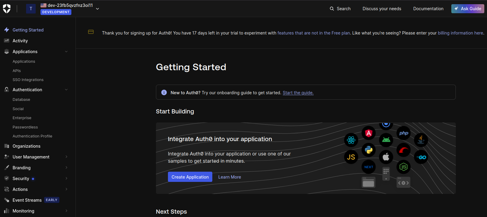
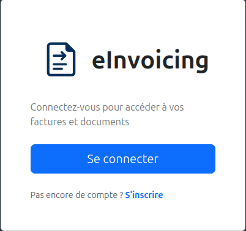
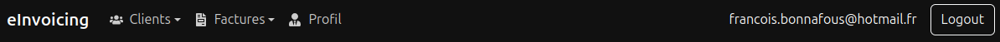

# Jour 52 – Mise en place de l’authentification avec Auth0 🔐🚀

Aujourd'hui, j'ai travaillé sur l'intégration de l'**authentification des utilisateurs** dans eInvoicing afin de sécuriser l'accès à l'application et préparer le lien entre un utilisateur connecté et un vendeur.

---

## ✅ Ce qu’on a fait

### 1. Choix de la solution Auth0

* Après analyse, Auth0 a été retenu pour sa **simplicité**, sa **fiabilité** et sa capacité à gérer un futur passage à des milliers d’utilisateurs sans maintenance lourde.
* Décision motivée par le fait que le projet est un **MVP / vitrine**, donc l’objectif était d’aller vite tout en garantissant un service fiable.

### 2. Création du compte et configuration de l’application

* Création d’un **tenant Auth0** et d’une application de type **Single Page App (SPA)** pour correspondre à notre frontend React.
* Configuration du **client ID** et du **domain**, ainsi que des **URLs autorisées pour login/logout** (`http://localhost:5173` et `/login`) pour un développement local fluide.
* Test initial pour vérifier la **connexion au dashboard Auth0**.

### 3. Installation du SDK React Auth0

* Ajout du package `@auth0/auth0-react` dans le frontend.
* Création du **AuthProvider** pour encapsuler l’application et fournir les hooks Auth0 à tous les composants.
* Mise en place du **.env** pour sécuriser le `VITE_AUTH0_DOMAIN` et `VITE_AUTH0_CLIENT_ID`.
  

### 4. Protection globale de l’application

* Mise en place de la **route privée** : toutes les pages sont accessibles uniquement si l’utilisateur est connecté.
* Les utilisateurs non connectés sont **redirigés automatiquement vers la page de login**.
* Ajustement de `main.jsx` et `App.jsx` pour éviter le conflit `<Router>` et assurer une navigation fluide avec Auth0.

### 5. Création de la page Login

* Développement d’une **LoginPage stylée**, centrée, avec un **design moderne** et responsive grâce à Bootstrap.
* Ajout d’un **LoginButton** intégré au SDK Auth0.
* Application d’un **fond sombre avec carte blanche** pour un contraste élégant et une expérience utilisateur agréable.

### 6. Mise à jour de la NavBar

* Ajout des boutons **Login / Logout** dans la NavBar existante, respectant le style et la hiérarchie des menus.
* Affichage du **nom ou email de l’utilisateur connecté** pour un feedback immédiat.
* Gestion du **Logout avec redirection vers la page Login**, assurant un flux propre et intuitif.
  

### 7. Test complet du flux Auth0

* Vérification que le login redirige vers l’app protégée et que le logout renvoie correctement à `/login`.
* Test de la navigation sur les pages vendeurs, clients et factures pour garantir que l’accès est conditionné à l’authentification.

---

## 📌 Avantages métier

* **Sécurité renforcée** : seules les personnes autorisées peuvent accéder aux données sensibles.
* **Expérience utilisateur fluide** : login/logout simple, interface claire et responsive.
* **Flexibilité future** : Auth0 gère les rôles, permissions et multi-utilisateurs sans réécriture.
* **Maintenance simplifiée** : solution externalisée et fiable, pas besoin de gérer les mots de passe et le stockage sécurisé.
* **Base pour le lien utilisateur → vendeur** : chaque utilisateur connecté pourra être associé à un enregistrement vendeur pour personnaliser l’accès aux données.

---

## 📌 Prochaines étapes

* Associer l’utilisateur Auth0 à un **enregistrement vendeur** dans la base de données.
* Créer un **champ `auth0_id` dans la table `sellers`** pour faire le lien direct.
* Adapter les composants et services pour filtrer les données selon le vendeur connecté.
* Ajouter la gestion des **rôles et permissions** (ex: admin vs vendeur).
* Tester le flux complet : login, redirection, accès aux données liées au vendeur.

---

👉 **Bilan de la journée** : l’authentification est désormais fonctionnelle et intégrée, avec un design moderne et un flux sécurisé. La base est posée pour lier un utilisateur connecté à un vendeur et préparer la gestion multi-utilisateurs. 🔐✨
