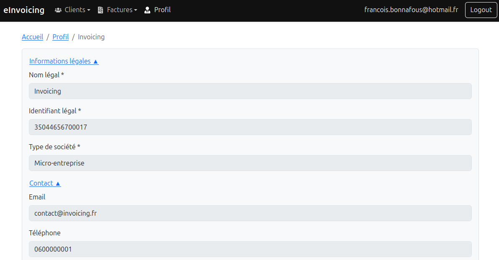

# Jour 57 – Finalisation de l’inscription vendeur et parcours utilisateur avec Auth0 🔐🛤️

Aujourd’hui, j’ai terminé toute la **partie authentification et parcours utilisateur** pour les vendeurs. Après avoir géré la connexion, la sécurisation des pages via token Auth0 et la récupération des données liées au vendeur, j’ai pu finaliser l’inscription et le flux complet pour un nouvel utilisateur.

---

## ✅ Ce qu’on a fait

### 1. Authentification et sécurisation

* Intégration complète d’**Auth0** pour gérer :
  - la connexion,
  - la récupération des tokens JWT côté frontend,
  - et la sécurisation des routes backend.
* Création du middleware **`checkJwt`** pour valider le token sur le backend et **`attachSeller`** pour attacher le vendeur correspondant à l’utilisateur connecté.
* Vérification des routes sensibles (`/me`, `/api/sellers/:id`) pour s’assurer que seul l’utilisateur authentifié peut accéder à ses données.

---

### 2. Inscription et parcours utilisateur

* Mise en place du **formulaire d’inscription vendeur** (`SellerForm`) avec :
  - validation frontend,
  - vérification backend des doublons pour l’identifiant légal (SIRET),
  - gestion asynchrone uniquement sur le submit pour éviter les appels permanents.
* Gestion des erreurs :
  - affichage d’un message clair si l’identifiant est déjà utilisé,
  - scroll automatique en haut pour que l’utilisateur voit les erreurs.
* Une fois l’inscription réussie :
  - le token est utilisé pour sécuriser toutes les requêtes futures,
  - l’utilisateur est redirigé vers la **page d’accueil** et non vers la liste des vendeurs pour ne pas casser le parcours UX.

---

### 3. Frontend – Composants et services

* **`useSellerService`** centralise tous les appels API vers le backend avec le token Auth0.
* **`ProfilePage`** et **`SellerDetail`** permettent de récupérer et d’afficher le profil du vendeur connecté.
* Gestion du cycle frontend :
  - `loading`, `error` et rendu conditionnel pour une expérience fluide,
  - logs détaillés pour suivre l’état du composant et les réponses backend.
* Tous les composants sont maintenant cohérents avec le **parcours utilisateur** : connexion → inscription → profil vendeur → accès sécurisé aux données.
  

---

### 4. Tests et vérifications

* Vérification complète que l’**inscription bloque bien en cas de doublon** et que le message est affiché correctement.
* Test des routes sécurisées et du flux JWT : aucun accès non autorisé possible.
* Vérification du comportement frontend après soumission : **redirection correcte vers l’accueil**, pas de navigation indésirable.

---

### 5. Résultats et bénéfices

* Parcours utilisateur **complet et sécurisé** pour les nouveaux vendeurs.
* Code frontend/backend **maintenable**, centralisation des appels API et gestion des tokens.
* Logs détaillés côté frontend et backend pour un suivi précis.
* Base solide pour gérer ensuite les fonctionnalités liées aux factures et à l’interopérabilité.

---

## 📌 Prochaines étapes – Évolution fonctionnelle

* **Gestion du cycle de vie des factures** : pour suivre le statut réglementaire de chaque document.
* **Préparation des flux permettant les échanges avec les plateformes de dématérialisation partenaires (PDP)** pour l’envoi des factures et réception des cycles de vie.
* Préparer les échanges et intégrations en s’appuyant sur le **swagger officiel** pour garantir l’interopérabilité maximale et respecter les contraintes réglementaires.

---

👉 **Bilan de la journée** : la partie authentification et inscription est entièrement fonctionnelle et sécurisée. L’utilisateur a maintenant un parcours clair et cohérent, du login à l’accès à son profil. Le terrain est prêt pour la prochaine phase : gérer le cycle de vie des factures et l’interopérabilité avec les PDP. 💪✨
