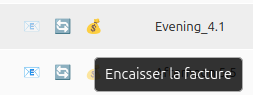
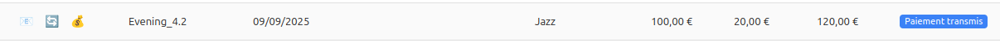
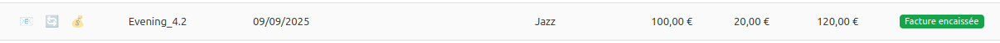

# Jour 65 – Statut d’encaissement et bouton 💰

Aujourd’hui, l’objectif principal était de **boucler le traitement des factures** en intégrant correctement le **statut d’encaissement**, obligatoire pour finaliser le cycle métier et **notifier le client que le paiement a été encaissé**.

Nous avons ajouté un **bouton 💰 “Encaisser”** directement dans le tableau :

* Activé uniquement lorsque le paiement a été transmis (`211`).
* Désactivé automatiquement dès que la facture est encaissée (`212`).
* Permet de simuler la réception effective du paiement et de notifier le client en temps réel.

### Détails techniques

* **Frontend** :

  * `handleBusinessStatusChange` et `handleTechnicalStatusChange` mettent à jour le state `invoices`.
  * `setVersion` force le re-render du DataTable pour que les boutons se mettent à jour instantanément.
  * Le bouton 💰 appelle `cashInvoice`, puis récupère le **dernier statut du cycle métier** pour actualiser le tableau.

    

* **Backend** :

  * Route `cashInvoice` renvoyant le statut final de la facture après encaissement.
  * Les statuts finaux (`210`, `212`) bloquent les actions suivantes pour assurer la cohérence réglementaire.
  
  

* **Mock PDP** :

  * Simule la progression complète du cycle métier : « Reçue par la plateforme », « Mise à disposition », puis encaissement.
  * Les logs permettent de suivre la mise à jour et le comportement du bouton en temps réel.

* **Rafraîchissement du cycle métier** :

  * Le bouton 🔄 « Rafraîchir le cycle métier » reste disponible tant que la facture n’est pas dans un statut final.
  * Synchronisation instantanée avec le backend / mock.

---

### 📌 Prochaines étapes

* **Statut encaissement** : valider le comportement et la synchronisation des boutons lors de l’évolution du cycle de vie.
* **Suspension / complément** : finaliser la suspension, avec l’envoi de la facture complétée des justificatifs.
