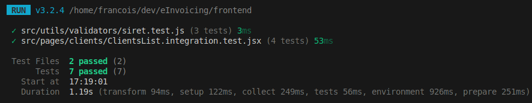

# Jour 74 – Premiers tests front et bases pour la CI 🧪💻

Aujourd’hui, j’ai commencé à poser les premières briques de tests côté frontend tout en consolidant le backend pour **eInvoicing**.  

## Le tout premier test frontend : le validator SIRET ⚙️

Avant même de toucher aux composants React, j’ai testé **le validator de SIRET côté frontend** :  

- Vérifie que la logique de validation fonctionne correctement pour différents numéros.  
- Constitue un **test unitaire simple et isolé**, idéal pour se familiariser avec Vitest côté frontend.  
- Sert de **première brique fiable** pour la stratégie de tests front : on sait qu’une donnée critique est correctement validée avant de l’afficher ou de l’envoyer au backend.  

✅ Ce test est minimal mais stratégique : il sécurise les bases et montre comment écrire des tests unitaires frontend efficaces.

## Premiers tests de composants React ⚡

Ensuite, j’ai commencé à tester des composants plus complexes comme `ClientsList` :  

- **Affichage conditionnel** : loader, table de clients, message d’erreur.  
- **Interaction simple** : filtrage via l’input de recherche.  
- **Mocks** pour les hooks et composants tiers (`useClients`, `DataTable`, `Breadcrumb`) afin d’isoler le composant testé.

Ces tests permettent de vérifier rapidement le comportement attendu sans lancer toute l’application.

## Pourquoi penser à une CI maintenant 🤖

Avec des tests unitaires backend et frontend :  

- On peut déclencher automatiquement les tests à chaque push.  
- La CI devient un **outil de confiance** pour continuer à faire évoluer le projet sans craindre de casser des fonctionnalités existantes.  
- À terme, on pourra ajouter des tests E2E pour sécuriser les parcours utilisateurs critiques.

## 📌 Prochaines étapes

- Étendre les tests unitaires frontend à d’autres règles critiques et composants importants.  
- Ajouter un **pipeline CI simple** qui lance les tests backend et frontend.  
- Prioriser les composants critiques pour garantir leur stabilité.  
- Intégrer progressivement des tests E2E pour compléter la couverture.
