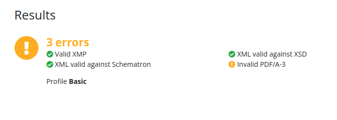

# Jour 78 – Avancée sur le PDF/A-3 et XMP 📄✨

Aujourd’hui, j’ai attaqué la partie **PDF/A-3** pour nos factures **eInvoicing** et travaillé sur les **métadonnées XMP**. L’objectif était de rendre le PDF pleinement conforme aux standards ISO et Factur‑X, et de corriger plusieurs erreurs qui bloquaient la validation.

## Une plongée dans le XMP et les métadonnées 🕵️‍♂️

Le XMP, c’est ce petit fichier **embarqué dans le PDF** qui décrit la facture : date, titre, outil utilisé, référence de document, etc.  
On a revu complètement la structure pour :  

- Séparer clairement **les informations PDF/A standards** de **l’extension Factur‑X**.  
- S’assurer que **tous les caractères spéciaux** sont correctement échappés pour éviter les soucis avec les accents et symboles.  
- Respecter la norme ISO 19005-3, afin que le validateur reconnaisse bien chaque propriété et extension.  
- Déclarer correctement toutes les propriétés **Factur‑X** (`DocumentType`, `DocumentFileName`, `Version`, `ConformanceLevel`) dans le schéma RDF et dans les extensions PDF/A.

Résultat : le XMP est maintenant **propre, clair et conforme aux attentes de la norme**, prêt à être injecté dans le PDF via `pdf-lib`.

## Correction des 10 points majeurs ✅

En pratique, on a corrigé **10 points bloquants** qui empêchaient la validation PDF/A‑3 :  

1. La structure des métadonnées XMP : chaque info est maintenant dans le bon bloc, PDF/A ou Factur‑X.  
2. Les caractères spéciaux dans le titre et la description : plus de risques de blocage lié aux accents.  
3. La distinction claire entre informations standard et extension, pour que le validateur comprenne ce qui est natif PDF/A et ce qui est spécifique à Factur‑X.  
4. Les identifiants de document (`/ID` dans le trailer) : maintenant générés de manière unique et insérés si absent.  
5. Les dates de création et de modification : correctement formatées pour la norme ISO.  
6. La description de la facture : wording simple et clair, entièrement compatible XMP.  
7. Le nom du fichier XML embarqué : correctement référencé dans l’extension Factur‑X.  
8. La version et le niveau de conformité Factur‑X : définis explicitement pour éviter toute ambiguïté.  
9. La cohérence globale de la structure RDF : toutes les balises sont bien fermées et dans le bon ordre.  
10. Les références aux fichiers attachés (`/AFRelationship` et `/EF`) : ajoutées systématiquement pour chaque attachment, avec distinction entre `Source` pour le Factur‑X et `Data` pour les autres fichiers.

## Ce que ça change concrètement ✨

- Le PDF est **plus robuste et fiable** pour nos clients et pour les systèmes comptables.  
- Les validateurs ISO ne trouvent plus d’erreur dans le XMP lui-même.  
- Le trailer `/ID` est désormais présent pour tous les PDF générés.  
- Les attachments sont correctement référencés et liés au PDF.  
- Même si certaines erreurs liées au contenu PDF (OutputIntent, DeviceRGB) restent à régler, la partie **métadonnées et structure interne** est maintenant solide.  
- On peut avancer sur l’intégration dans le flux de facturation sans craindre de blocages liés au XMP ou aux attachments.

## 📌 Prochaines étapes

- Continuer à régler les points PDF/A restants : OutputIntent, DeviceRGB et vérification complète des EF/AFRelationship.  
- Tester avec plusieurs validateurs pour s’assurer de la compatibilité totale.  
- Préparer une **version stable PDF/A‑3 + Factur‑X** utilisable pour toutes les factures futures.  
- Documenter la méthode pour que le processus soit **réutilisable et maintenable**.

