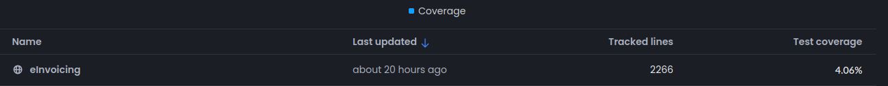

# Jour 80 – Intégration de Codecov 📊✨

Aujourd’hui, j’ai attaqué l’intégration de **Codecov** pour notre projet **eInvoicing**, afin d’avoir un suivi clair de la couverture de tests sur toutes les branches et de mieux visualiser les zones de code à renforcer.

## Mise en place

1. **Installation et configuration**  
   J’ai ajouté Codecov dans notre pipeline CI. L’idée est simple : chaque push ou pull request déclenche les tests, puis le rapport de couverture est envoyé automatiquement à Codecov.

2. **Analyse de la couverture**  
   Grâce à Codecov, on peut désormais :
   - Visualiser la couverture globale du projet.
   - Identifier les fichiers ou fonctions peu testés.
   - Suivre l’évolution de la couverture au fil du temps.
  
   

3. **Badges et reporting**  
   J’ai ajouté un badge Codecov dans le README pour avoir un aperçu rapide de la couverture depuis GitHub. C’est motivant et très utile pour garder un œil sur la qualité du code.

   

## Retours

- La configuration a été assez simple, mais j’ai dû ajuster le chemin des rapports générés par **Vitest** pour qu’ils soient correctement interprétés par Codecov.
- La vue “diff coverage” est super pratique pour voir immédiatement si une PR réduit la couverture d’une partie critique.
- Globalement, ça donne un vrai **feedback rapide** sur les tests, ce qui va nous aider à renforcer la fiabilité de notre backend.

Prochaine étape : intégrer Codecov sur toutes les branches, et commencer à fixer les fichiers les moins couverts pour atteindre un seuil de couverture satisfaisant.

