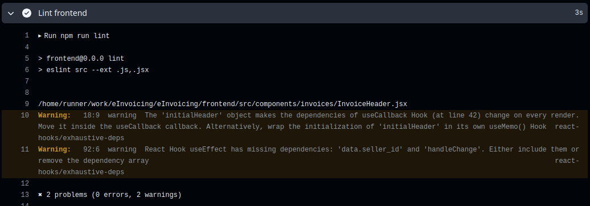

# Jour 81 – Linter partout : backend et frontend 🧹✨

Aujourd’hui, j’ai consolidé la qualité du code sur **eInvoicing** en ajoutant le **lint côté backend**, en plus du frontend déjà en place. L’objectif était de s’assurer que chaque commit respecte les bonnes pratiques, évitant les erreurs subtiles et les variables inutilisées.

## Frontend ✅

Le lint côté frontend était déjà opérationnel. Après quelques ajustements sur les règles et suppression des avertissements inutiles, le pipeline CI détecte maintenant les problèmes de manière fiable avant même le merge.

## Backend ✅

Pour le backend, j’ai ajouté un script `lint` dans le `package.json` et intégré l’exécution du lint dans le workflow GitHub Actions.  
Résultat :

* Les erreurs critiques comme les `require` ou `module` sont maintenant correctement gérées selon la configuration `ESLint`.
* Les warnings restants concernent surtout des variables déclarées mais non utilisées (`no-unused-vars`), que je vais nettoyer progressivement.
* La CI s’assure désormais que **tout commit côté backend respecte le style défini**, exactement comme pour le frontend.

## Workflow CI 🛠️

Le pipeline GitHub Actions est maintenant complet :

1. Installation et cache des dépendances backend et frontend.
2. Lint frontend et backend.
3. Exécution des tests avec couverture.
4. Upload des rapports de couverture sur Codecov.

Chaque push ou pull request sur `main` déclenche cette chaîne, garantissant une qualité constante du code sur les deux parties de l’application.

## Ressenti 🌟

Ça fait du bien de voir un **lint complet sur tout le projet**, ça clarifie les responsabilités et réduit les risques d’erreur. La mise en place côté backend a demandé un peu plus de patience, mais maintenant la CI est vraiment **cohérente et sécurisée** pour toutes les contributions.

> Prochain objectif : corriger progressivement les warnings backend pour que le lint ne laisse plus passer de petits oublis.
