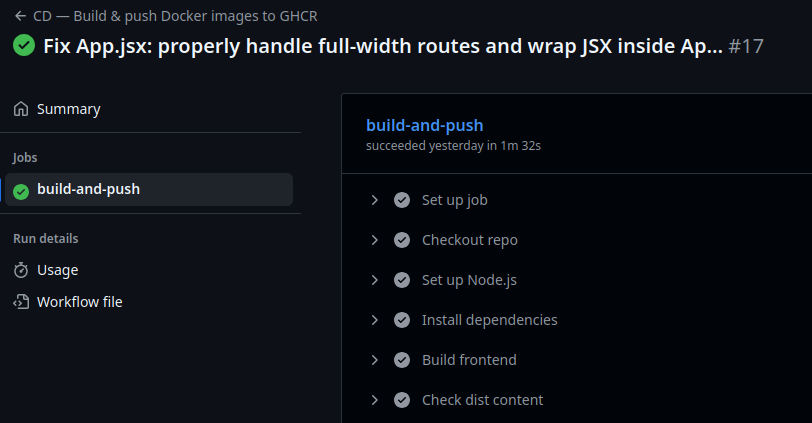

# Jour 82 – Mise en place de la CD pour backend et frontend 🚀🐳

Aujourd’hui, j’ai travaillé sur la **Continuous Deployment** de **tout le projet eInvoicing**, pour pouvoir générer des images Docker prêtes pour la production, côté frontend et backend.

## Frontend ✅

* Passage à **Node 20** pour Vite + React, indispensable pour que le build fonctionne.  
* Ajout des dépendances manquantes dans le `package.json` :  
  `react-router-dom`, `react-bootstrap`, `react-select`, `react-datepicker`, `react-icons/fa`, `iban`, `@fortawesome/fontawesome-free`.  
* Création d’un **Dockerfile multistage** :  
  1. **Build stage** : installation des dépendances et génération du build Vite (`/dist`).  
  2. **Production stage** : Nginx pour servir les fichiers statiques.  
* Nettoyage du dossier Nginx et copie des fichiers `/dist`.  
* Exposition du port 80 et lancement de Nginx.  
* Résultat : image Docker finale propre, frontend opérationnel et prête à déployer.

## Backend ✅

* Préparation d’un **Dockerfile backend** :  
  - Utilisation de `node:20-alpine`.  
  - Installation des dépendances (`npm install`) et build si nécessaire.  
  - Configuration pour que l’application écoute sur le port défini.  
* Possibilité de **lancer backend et frontend ensemble via Docker Compose** pour simuler un environnement complet.  
* Objectif : générer une image prête pour déploiement et intégrable dans un pipeline CD.
  

## Problèmes rencontrés ⚠️

* Erreurs Vite frontend liées à des modules manquants : résolues en ajoutant les dépendances.  
* Node version : nécessité de passer à Node 20 pour Vite.  
* Avertissements sur les chunks volumineux frontend (>500 kB) : non bloquants mais à optimiser plus tard.  

## Ressenti 🌟

La CD du projet est désormais opérationnelle : **images Docker frontend et backend prêtes**, testables localement et déployables dans n’importe quel environnement.  

Cette étape m’a permis de comprendre :

* L’importance de **tenir toutes les dépendances à jour** pour éviter les erreurs de build.  
* Comment **séparer build et production** avec Docker multistage.  
* Les bases pour **un pipeline CI/CD complet**, capable de générer et déployer automatiquement les images.

## 📌 Prochaines étapes

1. **Tester les images Docker** localement et via Docker Compose.  
2. **Intégrer ces images dans un pipeline CI/CD** pour déploiement automatisé.  
3. **Optimiser le build frontend** pour réduire la taille des chunks.  
4. **Ajouter monitoring et logs backend** dans l’image pour faciliter la supervision.
