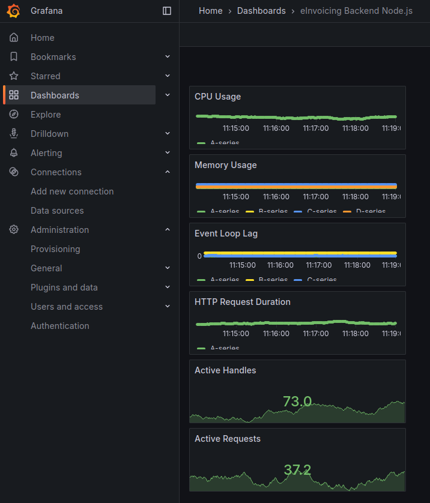

# Jour 84 – Monitoring backend avec Prometheus & Grafana 📊🚀

Aujourd’hui, nous avons posé les **fondations du monitoring de notre backend Node.js** pour le projet **eInvoicing**, en s’appuyant sur **Docker, Prometheus et Grafana**.

## 🔹 Objectif du jour

* Pouvoir **suivre en temps réel les métriques du backend** : CPU, mémoire, event loop, heap, nombre de requêtes HTTP, handles actifs…
* Préparer l’infrastructure pour une **industrialisation complète** du monitoring.
* Avoir un environnement dockerisé **backend + Prometheus + Grafana** prêt à l’emploi.

---

## 🔹 Étapes réalisées

### 1️⃣ Exposition des métriques Node.js

* Création d’un **module `metrics.js`** dans `backend/src/monitoring` avec `prom-client`.
* Collecte des métriques par défaut : CPU, mémoire, event loop.
* Création d’un **histogramme pour la durée des requêtes HTTP**.
* Middleware Express ajouté avant toutes les routes pour mesurer chaque requête.
* Endpoint `/metrics` exposé pour Prometheus.

### 2️⃣ Adaptation du serveur Node.js (`server.js`)

* Intégration du **middleware Prometheus**.
* Vérification que `/health` fonctionne.
* Routes API existantes pour `/api/sellers`, `/api/clients`, `/api/invoices`.
* Fichiers statiques `/uploads` et `/pdf-a3` toujours accessibles.
* Middleware global d’erreurs conservé.

### 3️⃣ Dockerisation du monitoring

* Création d’un **dossier `backend/monitoring`** pour tout le monitoring.
* Rédaction d’un `docker-compose.yml` avec **3 services** :

  * `backend` → le serveur Node.js
  * `prometheus` → pour scrapper `/metrics`
  * `grafana` → pour visualiser les métriques
* Fichier `prometheus.yml` pour configurer le scraping du backend (`backend:3000`).

### 4️⃣ Vérification et tests

* Lancement des conteneurs :

```bash
cd ~/dev/eInvoicing/backend/monitoring
docker-compose up -d
```

* Accès aux interfaces :

  * Prometheus → [http://localhost:9090](http://localhost:9090)
  * Grafana → [http://localhost:3001](http://localhost:3001) (admin/admin)
* Configuration de Grafana :

  * Datasource `Prometheus` → URL `http://prometheus:9090`
  * Test de la connexion réussie.
* Vérification que les métriques du backend remontent correctement dans Prometheus.



### 5️⃣ Points clés appris

* Les métriques Node.js sont cruciales pour **observer la santé et les performances** du serveur.
* Docker Compose permet de **mettre en place un environnement complet monitoring** rapidement.
* Grafana fournit une interface pour **visualiser et analyser les métriques** de manière simple.
* La bonne pratique : **isoler le monitoring dans un dossier dédié** (`backend/monitoring`).

---

## 🔹 Prochaines étapes

* Ajouter **des dashboards Grafana préconfigurés** pour CPU, mémoire, event loop et requêtes HTTP.
* Prévoir des **alertes** sur certains seuils critiques (CPU, heap, latence API).
* Étendre éventuellement le monitoring à d’autres services si nécessaire (PDP, frontend).
* Consolider l’**industrialisation** pour que le monitoring soit inclus dans les pipelines CI/CD.

---

💡 Aujourd’hui, nous avons donc posé **les bases solides pour un monitoring backend efficace et extensible**, prêt à évoluer avec le projet eInvoicing.
