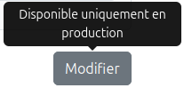

# Jour 94 – Consolidation et finalisation de l’environnement de staging 🛠️🚀  

Aujourd’hui, j’ai poursuivi le travail sur l’**environnement de staging** et je peux dire qu’il est désormais **terminé et fonctionnel**.  
L’objectif était de proposer un espace de démo **RGPD-friendly**, utilisable via Auth0 mais avec un **compte unique partagé** pour l’ensemble des testeurs.  

## 🔹 Objectif du jour  

* Bloquer toutes les actions sensibles (création/mise à jour de clients et vendeurs) pour le mode staging.  
  
* Finaliser la génération des documents (PDF, Factur-X XML, PDF/A3).  
* Mettre en place un **mock PDP** pour simuler l’envoi des factures et la réception des statuts.  

## 🔹 Avancement  

* **RGPD et staging** ✅  
  - Suppression des accès et actions de création/mise à jour des clients et vendeurs.  
  - Blocage de la création de factures et de l’import de documents.  
  - Conservation de l’authentification via **Auth0**, mais simplifiée avec un **compte unique partagé**.  

* **Génération de documents** ✅  
  - Stabilisation complète du flux de génération PDF, Factur-X XML et PDF/A3.  
  - Tous les artefacts sont maintenant produits correctement en mode démo.  

* **Mock PDP** ✅  
  - Mise en place d’un mock PDP pour **accepter les envois de factures** (`POST /invoices`).  
  - Ajout d’un **système de simulation de statuts** : chaque facture envoyée reçoit ensuite un retour fictif (`ACCEPTED`, `REJECTED`, `PENDING`).  
  - Cela permet de tester l’intégralité du cycle **envoi → suivi → réception de statut**, sans dépendre d’un tiers externe.  

## 🔹 Réflexion du jour  

Le staging est désormais **complet, stable et autonome**.  
On peut simuler le cycle vendeur → clients → factures → PDF → envoi PDP → statuts, sans risque pour les données réelles, et avec une **authentification minimale mais contrôlée via Auth0**.  

C’est une étape importante : je commence à voir le bout du périmètre après presque **50 jours d’engagement continu** 💪.  

## 🔹 Prochaines étapes  

* **Hébergement du staging** : trouver une solution pour déployer l’environnement et le rendre accessible publiquement.  
* **Mise à disposition** : partager l’accès (via le compte unique Auth0) lorsque je publierai sur LinkedIn, afin de recueillir des premiers retours “à froid”.  
* **Communication** : finaliser les présentations et carrousels LinkedIn pour accompagner l’annonce.  
* **PDF/A-3 et conformité ISO 19005** : corriger les derniers points bloquants pour obtenir une validation complète :  
  - Valid XMP  
  - XML valid against XSD  
  - XML valid against Schematron  
  - Résoudre l’Invalid PDF/A-3  

---

👉 Bref, Jour 94 marque une étape clé : **le staging est prêt** ✅.  
À partir de maintenant, l’énergie sera portée sur **l’hébergement, le partage via Auth0 et la communication**, tout en terminant la conformité stricte du PDF/A-3. 🚀  