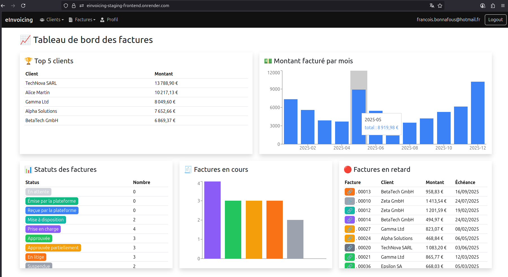

# Jour 96 – Frontend et services Auth0 / Sellers en staging 🌐🔧

Aujourd’hui, la session a été centrée sur **la mise en place du frontend en staging**, la configuration d’**Auth0**, et l’adaptation des services pour que le front et le backend communiquent correctement.

## 🔹 Objectif du jour

* Déployer le **frontend** sur Render et le connecter au backend staging.
* Vérifier la récupération des variables d’environnement Auth0 (`domain`, `clientId`, `audience`) pour dev et prod.
* Corriger les services frontend pour **utiliser correctement les tokens Auth0**.
* Stabiliser le service `Sellers` pour que `/sellers/me` fonctionne en staging.
* Préparer la base pour le futur **mock PDP**.

## 🔹 Avancement

### 1️⃣ Déploiement du frontend ✅

* Configuration du build command (`npm install && npm run build`) et du root directory (`frontend/`) sur Render.
* Vérification que l’application est **live** sur `https://einvoicing-staging-frontend.onrender.com`.
* Ajustement des variables d’environnement Auth0 dans Render : `VITE_AUTH0_DOMAIN`, `VITE_AUTH0_CLIENT_ID`, `VITE_AUTH0_AUDIENCE`.

### 2️⃣ Auth0 et variables runtime ✅

* Mise à jour des providers et hooks (`AuthProvider`, `useAuth`, `LoginPage`) pour gérer **les variables en dev et prod** via `import.meta.env` et `window.__ENV__`.
* Vérification des logs : toutes les variables Auth0 sont bien récupérées en staging.
* Correction des appels `loginWithRedirect` et `getAccessTokenSilently` pour utiliser l’audience runtime.

### 3️⃣ Services frontend – Sellers et Clients ✅

* Revue complète de `useSellerService` et `useClientService` pour **bypasser le token en staging** si nécessaire.
* Correction des URLs pour pointer vers le backend staging (`https://einvoicing-staging.onrender.com/api/...`).
* Tests sur `/sellers/me` : récupération correcte des données vendeur en mode staging.
* Gestion des erreurs 404 et logs clairs pour faciliter le debug.

### 4️⃣ Préparation du mock PDP ✅

* Discussion et planification : le mock PDP sera **exposé sur un webservice dédié** pour être accessible depuis le frontend.
* Le backend est prêt à pointer vers ce service via une URL publique, indépendamment du reste des routes.

### 5️⃣ Frontend stabilisé ✅

* Login / logout fonctionnent avec Auth0.
* Services frontend communiquent correctement avec le backend.
* Routes `/clients`, `/invoices`, `/sellers` testées depuis le frontend.
* Logs clairs pour toutes les requêtes et tokens.

## 🔹 Réflexion du jour

* Le frontend staging est maintenant **connecté et fonctionnel** avec le backend.
* Auth0 fonctionne correctement en dev et en staging.
* Le service Sellers est stable et prêt pour le futur mock PDP.
* On a posé les bases pour gérer les PDF et Factur-X plus tard.

## 🔹 Prochaines étapes

1. **Déployer le mock PDP sur un webservice dédié** et pointer le frontend dessus.
2. **Finaliser les PDFs / PDF/A-3** et tester les exports depuis le staging.
3. **Tests finaux de bout en bout** pour l’inscription, connexion, CRUD clients/factures et génération PDF.
4. Ajuster les **instructions localhost hardcodées** dans le backend pour qu’elles fonctionnent en staging.

---

👉 Jour 96 marque **la mise en place complète du frontend en staging et la stabilisation des services Auth0 et Sellers**, préparant le terrain pour les tests de génération PDF et le mock PDP. 🚀
