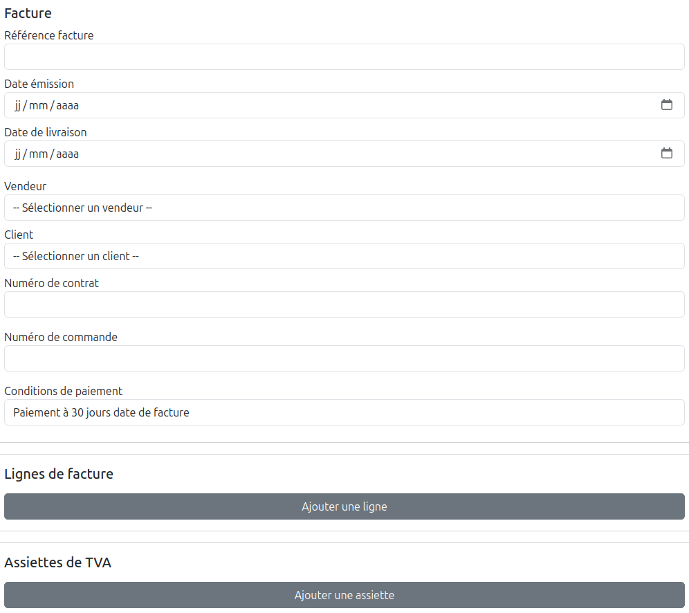

# Jour 14 – Création de l’entête de factures 📝

Aujourd’hui, j’ai finalisé la **création de l’entête de factures côté frontend** avec un formulaire complet et intégré au backend.  
L’objectif était de poser la structure principale avant de gérer les tables attachées (lignes, TVA, justificatifs).

---

## 🎯 Objectif

- Mettre en place un **formulaire dynamique pour l’entête** de facture incluant :  
  - `invoice_number`  
  - `issue_date`  
  - `supply_date`  
  - `seller_id` / `seller_legal_name`  
  - `client_id` / `client_legal_name`  
  - `contract_number`  
  - `purchase_order_number`  
  - `payment_terms` (liste prédéfinie avec valeur par défaut « Paiement à 30 jours date de facture »)  

- Préparer la structure pour **la saisie future des tables liées** : lignes, taxes, justificatifs.

---

## 💻 Côté frontend

1. **Composant `InvoiceHeader`**
   - Sélection des vendeurs et clients via dropdowns alimentés par l’API.  
   - Saisie des dates, contrat et commande.  
   - Conditions de paiement gérées via **liste externe** pour plus de lisibilité et maintenance.  

2. **Formulaire global (`InvoiceForm`)**
   - `invoiceData` centralise les données :  
     ```javascript
     const [invoiceData, setInvoiceData] = useState({
       header: {},
       lines: [],
       taxes: [],
       attachments: []
     });
     ```  
   - Validation uniquement de l’entête pour l’instant.  
   - Bouton de création positionné **en bas à droite**.  
   - Message de succès et redirection vers la liste des factures après création :  
     ```javascript
     setSuccessMessage("Facture créée avec succès ! 🎉");
     setTimeout(() => {
       setSuccessMessage('');
       navigate('/invoices');
     }, 2000);
     ```

3. **Optimisations UX**
   - Lisibilité améliorée grâce aux listes déroulantes et valeurs par défaut.  
   - Formulaire prêt à être étendu pour gérer les tables attachées.

---

## 🛠 Côté backend

- La route `/api/invoices` est prête à recevoir l’entête complet avec vérification des `seller_legal_name` et `client_legal_name`.  
- Séquences PostgreSQL synchronisées pour éviter les doublons d’ID.  
- Flux sécurisé via transactions pour assurer l’intégrité des données lors de l’insertion.

✅ Résultat : **entête fonctionnel et validé**, base prête pour la saisie des lignes, assiettes de TVA et justificatifs.

---

## 📚 Ce que j’ai appris

- Centraliser l’entête dans `invoiceData.header` simplifie la gestion et la transmission des données.  
- Externaliser les listes (comme les conditions de paiement) améliore la lisibilité et la maintenance du code.  
- Le message de succès avec redirection offre une UX fluide et rassurante.

---

## 🚀 Prochaines étapes

- Valider les **lignes de facture** (`invoice_lines`) avec calculs HT / TVA / TTC.  
- Intégrer les **assiettes de TVA** (`invoice_taxes`).  
- Ajouter les **justificatifs** (`invoice_attachments`) avec upload et gestion des types (`main` / `additional`).  
- Tester l’insertion complète dans le backend pour garantir l’intégrité des données.
