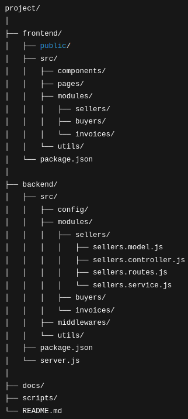

# Jour 3 – Réflexion sur l’architecture

Aujourd’hui, j’ai pris un moment pour réfléchir à l’architecture globale de mon projet.  
Comme je débute avec les technologies choisies, je ne sais pas encore très précisément vers quoi tendre à long terme. Ce qui est clair pour moi, c’est que le rôle principal du développeur, c’est de servir l’utilisateur à travers le produit.  

Pour que cela fonctionne, il faut que la structure de mon code soit claire, évolutive, et surtout cohérente avec la manière dont je conçois le métier. C’est pourquoi l’idée d’un découpage par domaine métier me semble tout à fait pertinente :  

- Chaque domaine (ici vendeur, acheteur, facture) correspond à un **ensemble logique** dans la réalité du produit.  
- Cela permet de regrouper la logique et les données liées au même concept, ce qui facilite la compréhension et la maintenance.  
- Cette organisation facilite aussi l’évolution du projet. Si demain je veux ajouter un nouveau domaine (par exemple, la gestion des paiements), je peux simplement ajouter un nouveau module sans chambouler le reste.  

Dans ce contexte, garder une séparation technique entre front-end et back-end, tout en intégrant ce découpage métier à l’intérieur des deux couches, me paraît un bon compromis.  

Voici la structure que j’ai choisie pour le projet :  

Cela me permet de :  
- conserver une séparation claire entre interface utilisateur et logique serveur,  
- avoir une architecture modulaire où chaque fonctionnalité est isolée et autonome,  
- faciliter la montée en compétence progressive, sans tout refondre à chaque changement.  

C’est aussi une manière de respecter les bonnes pratiques sans me perdre dans des architectures trop complexes pour un début.  

Je reste ouvert à faire évoluer la structure au fur et à mesure que je découvre les besoins du projet et les limites de ce premier modèle.  

---

Je suis convaincu que poser ces bases solides dès maintenant, même imparfaites, est une étape clé pour avancer sereinement et construire un outil utile et pérenne.
