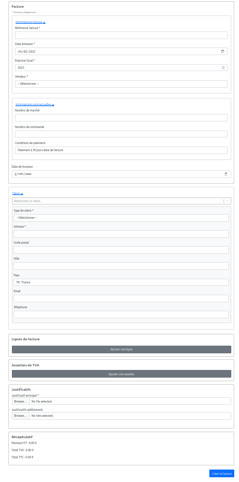
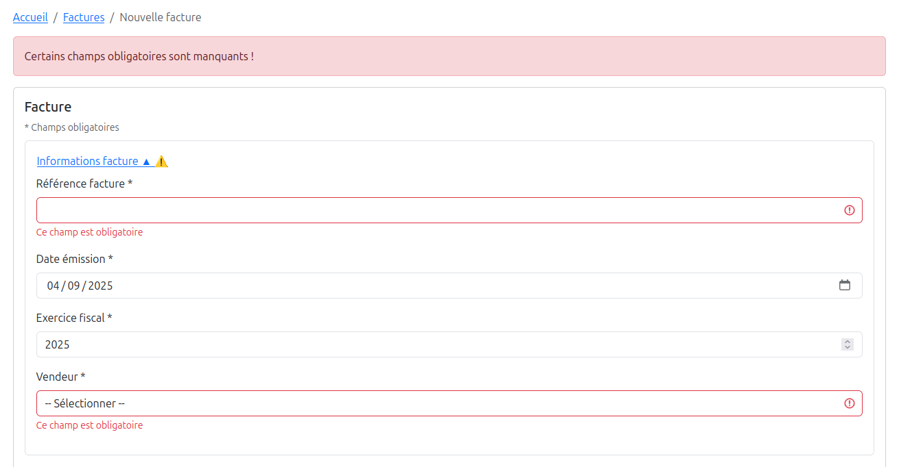

# Jour 32 – Formulaire de facture terminé 🎉🧾

Après pas mal de révisions et d’allers-retours, le **formulaire de création de facture est enfin terminé** !  
Chaque bloc a trouvé sa place et le tout fonctionne de manière fluide et cohérente.  

---

## ✅ Ce qu’on a fait

- **Architecture complète et claire** :  
  - Header (numéro, date, exercice fiscal).  
  - Bloc Client avec règles de gestion selon le type (particulier / entreprise FR / entreprise étranger).  
  - Lignes de facture + calculs HT, TVA, TTC.  
  - Section TVA avec calcul automatique des assiettes.  
  - Gestion des justificatifs intégrée.  

- **Validation au point** :  
  - Tous les champs obligatoires sont vérifiés.  
  - Les erreurs s’affichent au bon moment (blur + submit).  
  - Messages clairs pour guider l’utilisateur sans bloquer inutilement.  

- **Expérience utilisateur fluide** :  
  - Séparation visuelle nette des sections.  
  - Composants cohérents (`InputField`, `SelectField`).  
  - Plus de friction inutile → un vrai workflow complet.  
  
---

## 💪 Le résultat

- Un formulaire **complet, robuste et agréable à utiliser**.  
- Les données sont cohérentes et prêtes pour l’API.  
- Le code est organisé et suffisamment modulaire pour évoluer facilement.  

---

## 📌 Prochaines étapes

- Connecter le formulaire au backend pour persister factures et clients.  
- Gérer la distinction **création vs mise à jour** du client.  
- Ajouter des petits détails d’ergonomie (messages de confirmation, visuels).  
- Avancer ensuite sur les triggers/fonctions DB pour fiabiliser encore plus la logique.  

---

👉 Ça y est : **la base est posée** ! Le formulaire de facture est prêt à passer à la vitesse supérieure 🚀
