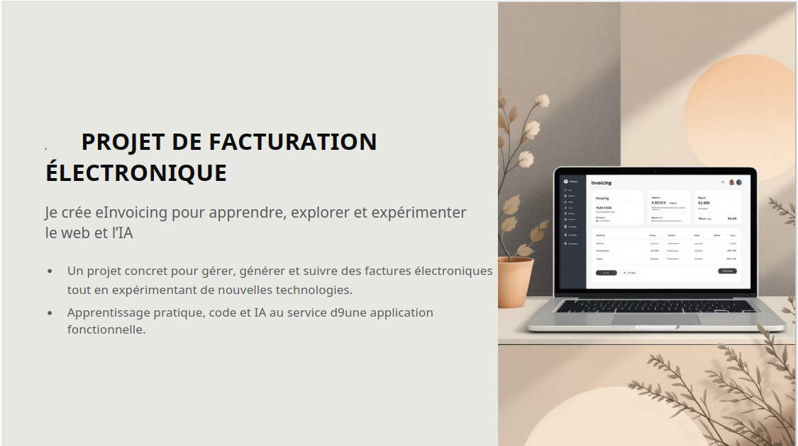

# Jour 40 – Finalisation du carousel LinkedIn 📊✨

Aujourd’hui, focus sur **la mise en forme et la finalisation du carousel eInvoicing dans Gamma** pour partager le projet et l’apprentissage web/IA.  

---

## ✅ Ce qu’on a fait

- **Finalisation des slides dans Gamma** :  
  - Slide 1 : titre accrocheur et personnel (*“Je crée eInvoicing pour apprendre, explorer et expérimenter le web et l’IA”*), mockup de l’app sur laptop/tablette, fond tech discret.  
  - Slide 2 : contexte personnel enrichi, emojis ajoutés pour rendre le storytelling plus vivant.  
  - Slides suivantes : fonctionnalités CRUD, formulaires, UX fluide, composants réutilisables, fonctionnalités back-end avancées et mention du GitHub public.  

- **Travail sur la cohérence visuelle** :  
  - Emploi d’emojis pour rendre chaque point plus lisible et engageant.  
  - Indications de design respectées : logos tech, couleurs harmonisées, mockups intégrés.  

- **Texte et phrasing LinkedIn** :  
  - Reformulation des phrases pour rester **personnel, pro et naturel**.  
  - Listes et bullets claires pour faciliter la lecture et maximiser l’impact visuel.  

---

## 💪 Résultat

- Carousel **complet et prêt à publier**, structuré pour LinkedIn.  
- Contenu vivant, professionnel et fidèle à ton expérience.  
- Slide 1 et 2 très personnelles, slides suivantes détaillent clairement les fonctionnalités et l’avancement technique.  

---

## 📌 Prochaines étapes

- Publier le carousel sur LinkedIn avec le texte d’accompagnement et le lien GitHub public.  
- Continuer à documenter les **avancées quotidiennes** avec captures d’écran ou exemples concrets.  
- Préparer la suite : authentification vendeur, génération Factur-X dynamique et communication avec PDP.  

---

👉 Objectif du jour atteint : **carousel LinkedIn finalisé, prêt à partager ton projet et ton apprentissage web/IA de manière professionnelle et personnelle 🚀**
