% 100 jours pour construire une app à son rythme
% François
% 2025


\newpage

# Jour 0 – Avant la première ligne de code

Le **10 août**, j’ai décidé de reprendre le développement à travers un projet personnel.  
L’idée est venue simplement, lors d’une discussion avec un ami qui travaillait sur un projet en React.  
Je me suis dit : *« Pourquoi ne pas apprendre ce framework sur un projet à moi ? »*  
Rien n’était défini. Pas de nom. Pas de vision produit. Juste l’envie de construire quelque chose.

---

## Contexte

Dans mes précédentes expériences, j’ai travaillé dans la **gestion financière** et la **facturation électronique**.  
J’y ai développé une bonne compréhension des normes, des contraintes réglementaires, des flux et des usages.  
Cette connaissance métier était là, quelque part, et j’avais envie de l’utiliser à nouveau — mais dans un cadre plus simple, plus direct, plus personnel.

J’ai donc choisi de créer une application autour de la **facturation électronique**, mais sans penser à l’industrialiser, la vendre ou la promouvoir.  
L’objectif était clair dès le début : **apprendre**, **construire**, **structurer**, à mon rythme.

---

## Le rythme de travail

J’ai travaillé **tous les jours** ou presque, pendant plus de **deux mois et demi**.  
Je travaillais tous les jours, porté par l’élan du moment.
Parfois le soir, parfois le week-end, parfois longtemps — juste le temps qu’il fallait, guidé par l’envie et la continuité.

Pas de pression.  
Pas d’objectif de vitesse.  
Pas de tableau de progression.  
Juste le mouvement naturel du travail qui prend, qui continue, qui se précise.

---

## Les étapes marquantes

Au fil des jours, certaines avancées ont été de véritables **paliers** :

- Mise en place de **l’authentification** et d’un parcours utilisateur cohérent
- Génération de **PDF conformes à la norme PDF/A-3**, intégrant les métadonnées et le fichier XML
- Connexion à une **plateforme externe** pour l’émission/réception des factures électroniques

Ces étapes ont changé la nature du projet.  
Elles ont transformé une simple expérimentation en quelque chose de **structuré**, **réel**, **fonctionnel**.

---

## Le rôle de l'IA

J’ai utilisé l’intelligence artificielle comme **accélérateur d’apprentissage**.  
Pas pour déléguer la création.  
Mais pour **avancer rapidement sans tout maîtriser au départ** :

- apprendre React en construisant
- clarifier des choix d’architecture backend
- comprendre et structurer les tests
- mettre en place du CI/CD et du déploiement

L’IA a servi de **compagnon technique**, pas de pilote.

---

## Intention

Ce journal documentera la progression.  
Les décisions techniques, les ajustements, les erreurs corrigées.  
Mais aussi les phases où l’énergie fluctue, où le projet semble clair puis flou, évident puis questionné.

Je ne sais pas exactement où ce projet me conduira.  
Ce n’est pas la question aujourd’hui.

L’important, c’est : **avancer, comprendre, structurer, transmettre**.

**Jour 0 — c’est simplement le début.**


\newpage

# Journal de bord - Jour 1

## Définition du projet

Aujourd'hui marque le début officiel de mon nouveau projet : développer une application web permettant la saisie et la gestion de factures fournisseurs.  
L'objectif à long terme est ambitieux : aller jusqu'à produire des factures électroniques conformes aux formats standards (UBL, Factur-X, etc.), et pourquoi pas, à terme, tendre vers une plateforme PDP (Plateforme de Dématérialisation Partenaire).  
Mais chaque chose en son temps : pour cette première étape, je veux me concentrer sur le plus simple et le plus concret possible — permettre à l'utilisateur de saisir les données essentielles d'une facture dans une interface claire et intuitive.

## Choix techniques

Pour ce projet, j'ai fait le choix de technologies modernes, largement utilisées et bien documentées, afin d'assurer à la fois une courbe d'apprentissage progressive et une bonne évolutivité :
- **Frontend : React avec Vite** → pour créer une interface dynamique, rapide et modulaire.
- **Backend : Node.js avec Express** → pour disposer d'une API REST simple à développer et à maintenir, tout en utilisant le même langage (JavaScript) que pour le frontend.
- **Base de données : PostgreSQL** → robuste et performante, parfaitement adaptée aux données relationnelles des factures.

Ces choix me permettront de démarrer vite, tout en gardant la possibilité de faire évoluer le projet vers des fonctionnalités plus complexes.

## Mise à jour et préparation de l'environnement

Mon environnement de développement est basé sur Ubuntu avec VSCode comme éditeur principal.  
Aujourd'hui, j'ai :
- Mis à jour Node.js vers la dernière version LTS grâce à NVM (Node Version Manager).
- Installé Vite et initialisé le projet frontend.
  
```bash
# Mise à jour de Node.js via NVM
nvm install --lts
nvm use --lts

# Initialisation du projet frontend avec Vite + React
npm create vite@latest frontend -- --template react
cd frontend
npm install

# Initialisation du backend Node.js + Express
mkdir backend && cd backend
npm init -y
npm install express pg cors dotenv

# Structure des dossiers (extrait)
mkdir src
touch src/index.js
```

- Configuré les extensions VSCode nécessaires : ESLint, Prettier, PostgreSQL et REST Client.
- Préparé la structure du projet avec deux dossiers séparés : **frontend** et **backend**.
  
**backend**
```
├── config
│   └── db.js
├── middlewares
├── modules
│   ├── buyers
│   ├── invoices
│   └── sellers
└── utils
```

**frontend**
```
├── App.css
├── App.jsx
├── assets
│   └── react.svg
├── components
├── index.css
├── main.jsx
├── pages
│   ├── buyers
│   ├── invoices
│   └── sellers
│── utils
```

## Prochaines étapes

Pour les prochains jours :
1. Mettre en place un premier formulaire React pour saisir les données d'une facture (numéro, date, fournisseur, montants).
2. Créer l'API Express pour enregistrer ces données dans PostgreSQL.
3. Afficher la liste des factures saisies.

C’est le début, mais la base est posée. 🚀


\newpage

# Jour 2 - Installation de la base, choix de DBeaver et modélisation métier

## Installation et configuration de la base de données

Aujourd’hui, j’ai continué à poser les fondations techniques du projet en installant PostgreSQL, la base de données relationnelle choisie pour ce projet. Après quelques ajustements sur les droits utilisateurs et la création de la base, j’ai pu établir une connexion stable avec mon utilisateur dédié.

Cela m’a permis d’avoir un environnement robuste et évolutif, capable de gérer les données structurées des factures électroniques et des entités associées.

## Choix de l’outil de gestion : DBeaver

Pour interagir avec ma base, j’ai opté pour DBeaver, un client SQL open source, riche en fonctionnalités, qui supporte PostgreSQL et offre une interface graphique complète.


DBeaver facilite la création, la visualisation et la modification des tables ainsi que l’exécution de requêtes SQL, ce qui accélère grandement la phase de développement. C’est un excellent complément à VSCode, surtout pour la partie base de données.

## Modélisation des données : structure des tables

La partie la plus intéressante de la journée a été de dessiner la structure des données qui va porter le projet :

- **Tables `sellers` et `buyers`** : elles représentent les entités commerciales impliquées dans les factures, avec leurs informations légales, fiscales et bancaires.  
- **Table `invoices`** : le cœur du système, elle regroupe toutes les informations essentielles d’une facture — numéros, dates, montants, références, et liens vers vendeur et acheteur.  
- **Tables `invoice_lines`,  `invoice_taxes` et `invoice_attachments`** : détaillent les lignes de facture, la ventilation des taxes et les justificatifs de facture, indispensables pour un traitement précis et conforme des documents.  


Les commentaires associés à chaque colonne sont un atout précieux, ils garantissent que chaque donnée a un sens clair et que la maintenance future sera plus simple.

## Conclusion du jour 2

Cette étape m’a permis de passer du concept à une base concrète, prête à être exploitée. Avec cette structure solide, je pourrai rapidement développer des fonctionnalités métier, générer des documents XML standardisés, et construire l’interface utilisateur pour la saisie des factures.

Demain, je compte approfondir l’intégration entre la base et mon backend Node.js, pour rendre les données accessibles et manipulables via une API.


\newpage

# Jour 3 – Réflexion sur l’architecture

Aujourd’hui, j’ai pris un moment pour réfléchir à l’architecture globale de mon projet.  
Comme je débute avec les technologies choisies, je ne sais pas encore très précisément vers quoi tendre à long terme. Ce qui est clair pour moi, c’est que le rôle principal du développeur, c’est de servir l’utilisateur à travers le produit.  

Pour que cela fonctionne, il faut que la structure de mon code soit claire, évolutive, et surtout cohérente avec la manière dont je conçois le métier. C’est pourquoi l’idée d’un découpage par domaine métier me semble tout à fait pertinente :  

- Chaque domaine (ici vendeur, acheteur, facture) correspond à un **ensemble logique** dans la réalité du produit.  
- Cela permet de regrouper la logique et les données liées au même concept, ce qui facilite la compréhension et la maintenance.  
- Cette organisation facilite aussi l’évolution du projet. Si demain je veux ajouter un nouveau domaine (par exemple, la gestion des paiements), je peux simplement ajouter un nouveau module sans chambouler le reste.  

Dans ce contexte, garder une séparation technique entre front-end et back-end, tout en intégrant ce découpage métier à l’intérieur des deux couches, me paraît un bon compromis.  

Voici la structure que j’ai choisie pour le projet :  

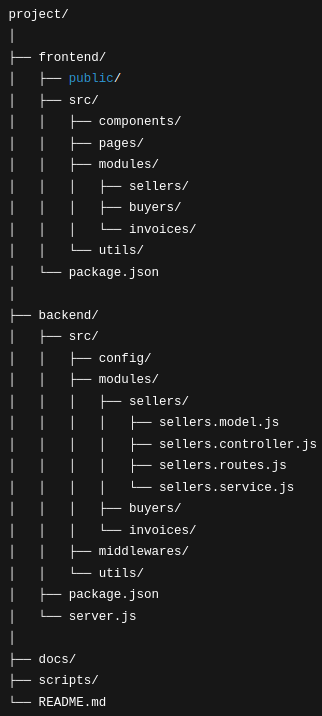

Cela me permet de :  
- conserver une séparation claire entre interface utilisateur et logique serveur,  
- avoir une architecture modulaire où chaque fonctionnalité est isolée et autonome,  
- faciliter la montée en compétence progressive, sans tout refondre à chaque changement.  

C’est aussi une manière de respecter les bonnes pratiques sans me perdre dans des architectures trop complexes pour un début.  

Je reste ouvert à faire évoluer la structure au fur et à mesure que je découvre les besoins du projet et les limites de ce premier modèle.  

---

Je suis convaincu que poser ces bases solides dès maintenant, même imparfaites, est une étape clé pour avancer sereinement et construire un outil utile et pérenne.


\newpage

# Jour 4 – Premier affichage des vendeurs : React rencontre Express 🚀⚛️

Aujourd’hui, j’ai passé la journée à connecter concrètement le frontend et le backend — une étape clé qui transforme enfin mon projet en une application « vivante ».  

## Mise en place du backend Express 🛠️

J’ai commencé par créer l’API REST permettant de récupérer la liste des vendeurs depuis ma base PostgreSQL.  
J’ai structuré mon code avec un découpage clair :  
- un modèle pour interroger la base, 
  ```js
  async function getAllSellers() {
    const result = await pool.query(
      `SELECT id, legal_name, legal_identifier, address, city, postal_code, country_code, 
              vat_number, registration_info, share_capital, bank_details, created_at, updated_at 
      FROM invoicing.sellers`
    );
    return result.rows;
  } 
  ```
- un service pour orchestrer la logique métier,  
  ```js
  async function listSellers() {
    return await SellersModel.getAllSellers();
  }
  ```
- un contrôleur pour gérer les requêtes HTTP,
  ```js
  async function getSellers(req, res) {
    try {
      const sellers = await SellersService.listSellers();
      res.json(sellers);
    } catch (err) {
      console.error(err);
      res.status(500).json({ error: 'Erreur serveur' });
    }
  }  
  ```
- une route pour exposer le point d’entrée `/api/sellers`.  
  ```js
  router.get('/', SellersController.getSellers);
  ```

C’était l’occasion de me plonger dans Express, de gérer les erreurs, et de vérifier que mes données remontaient bien via l’API.  
Après quelques ajustements (notamment le bon chemin des fichiers et la configuration CORS), le serveur tourne parfaitement sur le port 3000.

## Création du frontend avec React + Vite ⚛️✨

Côté frontend, j’ai utilisé Vite pour lancer un projet React moderne, léger et rapide.  
J’ai créé un composant React simple `SellersList` qui interroge mon API backend via un fetch sur `/api/sellers` (avec la configuration proxy dans Vite pour ne pas avoir de soucis de CORS).  

J’ai dû apprendre à gérer la syntaxe des modules, la distinction entre export par défaut et export nommé, ainsi qu’à utiliser React Router pour afficher ce composant à l’URL `/sellers`.  
C’était un premier vrai défi React, avec ses erreurs de parsing et d’import/export, mais cela m’a permis de mieux comprendre l’écosystème.

## Test et débogage 🔍🐞

L’étape suivante a été de faire communiquer correctement les deux serveurs :  
- Le backend sur le port 3000 qui expose l’API  
  

- Le frontend sur le port 5173 qui fait la requête via la proxy Vite  
  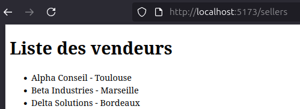

## Ce que j’ai appris 📚

- L’importance de structurer le backend pour garder un code clair et maintenable.  
- La différence entre exports par défaut et exports nommés en ES Modules React.  
- Le workflow classique du développeur fullstack : lancer deux serveurs distincts et s’assurer qu’ils communiquent bien.  

## Prochaines étapes 🎯

Pour demain, je vais :  
- Continuer à développer l’interface utilisateur avec React, notamment ajouter des détails sur chaque vendeur.  
- Ajouter des fonctionnalités côté backend pour gérer l’ajout et la modification des vendeurs.  
- Explorer les bonnes pratiques pour le développement simultané front/back (scripts automatisés, outils comme `concurrently`).  

---

Ce premier affichage fonctionnel est une belle victoire et me donne une bonne énergie pour la suite.  
Chaque petit bout de code ajouté rapproche le projet de son objectif : une application complète, utile, et bien pensée.


\newpage

# Jour 5 – Sécuriser les accès et améliorer l’interface utilisateur 🎨

Aujourd’hui, j’ai fait deux pas importants pour rendre le projet plus robuste et agréable à utiliser.

## Sécurisation des mots de passe

Je me suis d’abord attaqué à un point crucial : la gestion des mots de passe dans la configuration de la base de données. Jusqu’ici, ils étaient stockés en clair dans un fichier, ce qui n’est vraiment pas une bonne pratique.

J’ai donc choisi de stocker ces informations sensibles dans des variables d’environnement côté serveur. C’est beaucoup plus sûr, car ces variables ne sont pas versionnées et restent uniquement accessibles sur la machine où tourne le backend.

J’ai appris à définir ces variables dans mon environnement Ubuntu, à les charger proprement dans mon application Node.js, et à corriger quelques erreurs liées au formatage. Ça m’a aussi rappelé l’importance de vérifier le type et le format des données que je fournis aux modules, comme ici pour le mot de passe qui doit impérativement être une chaîne de caractères.

Bref, une étape qui améliore la sécurité et la qualité globale du projet.

## Réflexion et travail sur le design du site

Ensuite, je me suis penché sur la partie visible, ce qui compte aussi beaucoup : l’interface utilisateur.

Au départ, mon tableau de vendeurs était fonctionnel mais vraiment très basique, sans aucune mise en forme ni ergonomie.

Pour y remédier, j’ai intégré la bibliothèque **react-data-table-component**, qui apporte tout ce qu’il faut pour un tableau élégant, avec des bordures, un tri facile, une recherche instantanée, une pagination et un rendu responsive.
```js
import DataTable from 'react-data-table-component';

// SellerList.jsx
<DataTable
    columns={columns}
    data={filteredItems}
    pagination
    paginationPerPage={20}
    highlightOnHover
    striped
    responsive
    dense
    noHeader
    customStyles={{
        table: {
        style: {
            border: '1px solid #ddd',
            borderRadius: '4px',
        },
        },
        headRow: {
        style: {
            borderBottom: '2px solid #ccc',
        },
        },
        rows: {
        style: {
            borderBottom: '1px solid #eee',
        },
        },
    }}
/>
```

Le résultat est fluide, simple, et surtout rapide à mettre en place. Cela m’a donné une belle base pour harmoniser le style de l’ensemble du site et améliorer l’expérience utilisateur dès les premières fonctionnalités.

Je me suis aussi permis d’ajouter Bootstrap pour un peu de mise en forme générale, histoire que les champs de recherche et la structure globale soient plus agréables visuellement, sans devoir partir dans du CSS complexe.


## Ce que ça m’a appris

- La sécurité, même sur un petit projet, c’est fondamental et il ne faut pas l’oublier.  
- Utiliser des composants React adaptés permet d’aller vite tout en gardant un code propre et maintenable.  
- La première impression compte : un site bien présenté invite davantage à être utilisé et testé.

---

Demain, je compte continuer sur la lancée côté interface et ajouter des écrans pour les acheteurs et les factures.  
Je vais aussi réfléchir à la navigation entre ces différentes pages pour rendre l’application plus cohérente.

---

Un pas de plus, une victoire de plus ! 🚀


\newpage

# Jour 6 – Mise en place d’un formulaire complet et amélioration de l’expérience utilisateur 📝✨

Aujourd’hui, j’ai franchi une étape clé : la création d’un formulaire complet pour ajouter un nouveau vendeur, avec toutes les données importantes, et une meilleure interaction utilisateur.

## Formulaire complet et validation

J’ai construit un formulaire React riche, qui couvre tous les champs nécessaires pour décrire un vendeur : nom légal, identifiant, adresse, ville, code postal, pays, TVA, informations d’enregistrement, capital social et détails bancaires.

Pour que ce soit robuste, j’ai ajouté des validations côté formulaire, notamment en limitant la longueur des champs pour respecter les contraintes en base. Cela évite les erreurs serveur liées à des données trop longues.
```js
    // SellerForm
    const handleChange = (e) => {
        const { name, value } = e.target;
        setFormData(prev => ({ ...prev, [name]: value }));
    };

    <div className="mb-3">
    <label htmlFor="legal_identifier" className="form-label">Identifiant légal</label>
    <input
        type="text"
        id="legal_identifier"
        name="legal_identifier"
        className="form-control"
        maxLength={50}
        disabled={disabled}
        value={formData.legal_identifier}
        onChange={handleChange}
    />
    </div>
```

## Liste dynamique des pays selon la norme ISO 3166-1 alpha-2

Pour le champ pays, j’ai remplacé un simple input texte par une liste déroulante dynamique, basée sur le package i18n-iso-countries. Cela permet de proposer automatiquement tous les codes pays normalisés avec leur nom en anglais, et d’avoir FR sélectionné par défaut. Le rendu est propre et ergonomique.
```bash
npm install i18n-iso-countries
```

```js
    //SellerForm.jsx
    import countries from "i18n-iso-countries";
    import enLocale from "i18n-iso-countries/langs/en.json";

    countries.registerLocale(enLocale);

    const countryCodes = Object.entries(countries.getNames("en")).map(([code, name]) => ({
        code,
        name,
    }));

    <div className="col-md-4">
        <label htmlFor="country_code" className="form-label">Code pays</label>
        <select
        id="country_code"
        name="country_code"
        className="form-select"
        disabled={disabled}
        value={formData.country_code}
        onChange={handleChange}
        >
        {countryCodes.map(({ code, name }) => (
            <option key={code} value={code}>
            {code} - {name}
            </option>
        ))}
        </select>
    </div>    
```

## Gestion des erreurs et feedback utilisateur

Pour améliorer l’expérience, j’ai intégré un système d’alerte qui affiche un message de succès après création d’un vendeur, avec une redirection automatique vers la liste des vendeurs après 2 secondes.

En cas d’erreur, un message d’erreur s’affiche clairement, permettant à l’utilisateur de comprendre qu’il faut revoir sa saisie ou réessayer plus tard.


## Backend adapté et robustesse

J’ai aussi mis à jour la fonction backend pour accepter toutes les données saisies, avec un contrôle pour éviter l’envoi d’un capital social vide qui posait problème à la base PostgreSQL.

## Style et cohérence visuelle

Le formulaire reprend le style Bootstrap, identique à celui de la liste des vendeurs, pour garder une interface cohérente, claire et agréable.

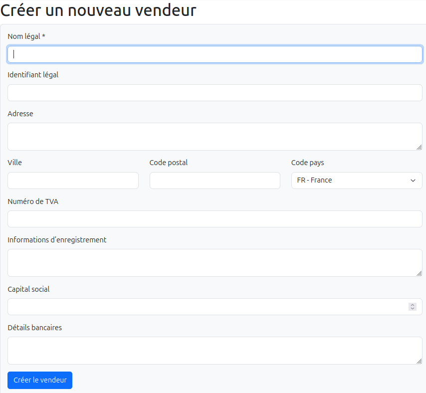

## Travail sur la barre de navigation

En parallèle, j’ai travaillé sur la mise en place d’une barre de navigation simple et discrète, avec un menu clair qui permet d’accéder facilement aux différentes fonctionnalités du projet : gestion des vendeurs, clients et factures.

Cette navigation intuitive prépare le terrain pour enrichir l’application avec de nouvelles pages et fonctionnalités, tout en gardant une expérience utilisateur fluide et homogène.

```js
    // Navbar.jsx
    export default function NavBar() {
    return (
        <nav className="navbar navbar-expand-lg navbar-light bg-light">
        <div className="container-fluid">
            <Link className="navbar-brand" to="/">eInvoicing</Link>
            <button
            className="navbar-toggler"
            type="button"
            data-bs-toggle="collapse"
            data-bs-target="#navbarNavDropdown"
            aria-controls="navbarNavDropdown"
            aria-expanded="false"
            aria-label="Toggle navigation"
            >
            <span className="navbar-toggler-icon"></span>
            </button>
            ... 
```        

```js
    // App.jsx
    import NavBar from './components/NavBar';
    import SellersList from './pages/sellers/SellersList';
    import NewSeller from './pages/sellers/NewSeller';

    function App() {
    return (
        <Router>
        <NavBar />
        <Routes>
            <Route path="/sellers" element={<SellersList />} />
            <Route path="/sellers/new" element={<NewSeller />} />
            {/* autres routes */}
        </Routes>
        </Router>
    );
    }

    export default App;
```

## Ce que ça m’a appris

- Soigner la saisie dès le frontend réduit beaucoup d’erreurs backend et améliore la qualité des données.  
- Gérer les listes normalisées (comme les pays) via des packages npm simplifie grandement le travail et évite les erreurs manuelles.  
- Les petits détails UX, comme les messages de confirmation ou l’état de soumission, rendent l’application plus professionnelle et rassurante.  
- Adapter le backend pour être tolérant sur certains champs (capital social) est essentiel pour une bonne robustesse.  
- Concevoir une navigation claire et simple est une étape fondamentale pour structurer l’application et améliorer la prise en main par l’utilisateur.


\newpage

# Jour 7 – Pause, relecture et prise de recul ☕📖

Aujourd’hui, j’ai décidé de ralentir un peu le rythme.  
Non pas pour arrêter de travailler, mais pour relire, consolider et mieux comprendre tout ce qui a été fait depuis le début de ce projet.

Depuis quelques jours, je construis pas à pas une application complète avec un découpage clair entre frontend et backend, en avançant grâce à des échanges constants avec ChatGPT.  
Et aujourd’hui, plutôt que de coder de nouvelles fonctionnalités, j’ai pris le temps de revenir sur chaque étape, chaque article, pour les enrichir :

- Ajouter quelques extraits de code bien choisis pour illustrer mes explications.
- Intégrer des images ou schémas pour rendre la lecture plus agréable.
- Clarifier certains passages pour que tout soit compréhensible, même avec un œil neuf.

## Mon organisation avec ChatGPT (version gratuite)

Travailler avec la version gratuite de ChatGPT m’impose une contrainte : les conversations se “coupent” assez vite, et il m’arrive souvent de dépasser la capacité de réponse.  
Pour éviter de perdre le contexte, j’ai adopté une méthode :

- Je conserve tous les fichiers Markdown de mes précédents jours de travail.
- À chaque nouvelle conversation, je fournis à ChatGPT l’architecture complète du projet et les textes précédents.
- Cela lui permet de retrouver le fil, de comprendre l’évolution et de continuer à produire du code ou du contenu pertinent.

Finalement, cette contrainte est devenue un atout : je documente tout, je garde une trace précise, et j’avance de façon structurée.

## ChatGPT comme “collaborateur technique”

Je commence à réaliser qu’avec de bonnes bases solides, le développement devient presque une option.  
ChatGPT écrit le code, et moi je deviens l’intégrateur et le validateur.

- Je définis l’intention, la logique métier et la structure du projet.
- ChatGPT me fournit les implémentations, que je relis, ajuste et teste.
- Si un bug survient, je peux simplement lui donner les logs du backend ou du frontend, et il me propose des corrections ou des pistes claires.

C’est une façon de travailler qui me fait avancer vite — non seulement dans le code, mais aussi dans l’écriture de ma “story” technique.

## Prendre le temps d’observer le chemin parcouru

En relisant tout, je mesure la diversité des compétences mises en jeu :

- Gestion des serveurs
- Développement frontend et backend
- Évolution et complexité des technologies web
- Gestion et structuration d’une base de données
- Connaissance et maîtrise de l’OS

C’est un projet exigeant, qui demande curiosité, rigueur et patience.  
Mais c’est aussi un projet formateur, qui me pousse à mieux comprendre les outils que j’utilise, et à réfléchir à la façon dont je construis chaque brique.

---

💡 **Conclusion du jour**  
Ce “Jour 7” n’était pas un jour de code intense, mais plutôt un moment de respiration, de consolidation et de vision d’ensemble.  
Et parfois, c’est exactement ce qu’il faut pour continuer à avancer sereinement.


\newpage

# Jour 8 – La fiche détail : plonger dans les données d’un vendeur

Aujourd’hui, j’ai attaqué une partie essentielle de l’expérience utilisateur : **la fiche détail du vendeur**. Après avoir mis en place ma liste de vendeurs et la navigation vers chaque profil, il fallait offrir une vue complète de chaque entité et préparer le terrain pour les modifications et suppressions.

## Objectif
Afficher toutes les informations d’un vendeur dans un formulaire **non éditable par défaut**, avec la possibilité d’activer la modification ou la suppression via des boutons clairs.

## Structure de la fiche
J’ai choisi de réutiliser le composant **`SellerForm`** que j’avais créé pour les créations. Avantages :
- Formulaire déjà testé et fonctionnel.
- Gestion de l’état des champs facile.
- Cohérence visuelle avec l’écran de création.

Le formulaire reçoit maintenant :
- `initialData` pour pré-remplir les champs avec les informations du vendeur.
- `disabled` pour contrôler si le formulaire est éditable ou seulement consultable.

## Récupération des données
La fiche détail récupère le vendeur via une requête API (`fetch`) sur son `id`. Tant que les données ne sont pas chargées, un simple message **“Chargement…”** est affiché.  

```javascript
const [seller, setSeller] = useState(null);

useEffect(() => {
  fetch(`http://localhost:3000/api/sellers/${id}`)
    .then(res => res.json())
    .then(data => setSeller(data))
    .catch(console.error);
}, [id]);
```

## Les boutons
À la base, je voulais simplement afficher les informations. Mais pour préparer l’évolution de la fiche :

- **Modifier** : bascule le formulaire en mode édition.
- **Supprimer** : bouton rouge, pour l’instant inactif (alert temporaire).

Les deux boutons sont alignés **à droite**, pour un rendu clair et moderne.

```jsx
<div className="mt-3 d-flex justify-content-end gap-2">
  <button className="btn btn-primary">✏️ Modifier</button>
  <button className="btn btn-danger">Supprimer</button>
</div>
```

## Ce que j’ai appris
- Réutiliser un composant formulaire est **beaucoup plus efficace** que recréer toute la structure pour la consultation.
- Le pattern `initialData + disabled` est très pratique pour gérer **création / modification / consultation** avec un seul composant.
- Même pour de simples interactions comme un “alert”, mettre les boutons en place permet de **tester le layout et l’UX** avant de développer les fonctionnalités complètes.

## Prochaines étapes
- Activer le mode édition complet pour modifier les informations.
- Implémenter la suppression réelle avec confirmation.
- Eventuellement ajouter des validations supplémentaires


\newpage

# Jour 9 – Boucler le CRUD et préparer les fondations

Aujourd’hui, j’ai finalisé le **CRUD complet des vendeurs**, ce qui représente une étape clé pour le projet. Après avoir créé, listé et affiché les détails d’un vendeur, j’ai implémenté :

1. **Suppression**  
   - Le bouton “Supprimer” est visible en rouge, à droite, avec un prompt de confirmation.  
   - Côté backend, la suppression physique (`DELETE FROM invoicing.sellers WHERE id = $1`) fonctionne.  
   - Après suppression, la redirection vers la liste des vendeurs est automatique et fluide.

2. **Modification (update)**  
   - Le bouton “Modifier” sur la fiche détail permet de passer le formulaire en mode édition.  
   - Les modifications sont validées puis envoyées au backend via `PUT`, avec mise à jour dans la base et retour visuel immédiat.  
   - Cela boucle enfin le CRUD : création, lecture, mise à jour, suppression.

3. **Validation SIRET** pour les vendeurs français  
   - Le formulaire contrôle que l’identifiant légal correspond à un SIRET valide (14 chiffres, algorithme de Luhn).  
   - Les espaces dans la saisie sont ignorés pour la validation et pour l’enregistrement en base.  
   - Les erreurs sont affichées côté frontend sans altérer la saisie de l’utilisateur.

Cette étape m’a permis de **sentir que le projet a maintenant une vraie structure solide** :  

- Le CRUD est complet, côté frontend et backend.  
- Les validations métier sont intégrées dès le départ.  
- Les fonctions utilitaires comme `isValidSiret` sont réutilisables facilement.  

Pour la suite :  

- Créer une **entité client** pour compléter le processus de facturation, aux côtés du vendeur.  
- Consolider les validations et les flux pour que chaque acteur (vendeur et client) soit correctement géré dans l’application. 🚀


\newpage

# Jour 10 – Les clients entrent en scène 🧑‍💼

Aujourd’hui, j’ai ajouté une **nouvelle entité clé** dans le projet : les **clients**.  
C’est une étape importante, car jusqu’ici tout le flux de facturation ne tournait qu’autour des vendeurs. Désormais, on peut gérer les deux acteurs principaux du processus.

---

## 🎯 Objectif  
Mettre en place **le CRUD complet pour les clients**, en s’appuyant sur l’architecture déjà existante pour les vendeurs.  
Plutôt que de tout recoder, j’ai choisi un raccourci assumé : **copier-coller le module “vendeur” et l’adapter**.  
Pas une bonne pratique universelle, mais ici la structure étant identique, c’était le moyen le plus rapide de progresser.

---

## 🛠 Côté backend  

- **Création de la table `clients`** en base PostgreSQL, calquée sur celle des vendeurs (mêmes colonnes, mêmes contraintes).  
- Duplication du dossier `backend/src/modules/sellers` en `backend/src/modules/clients` puis **remplacement méthodique** de tous les `seller` → `client` (noms de variables, fonctions, routes).  
- Mise à jour des **routes API** :  
  - `/api/clients` pour la liste et la création.  
  - `/api/clients/:id` pour lecture, mise à jour et suppression.  
- Petites corrections en chemin :
  - Suppression d’une virgule en trop dans un `UPDATE` qui faisait planter PostgreSQL.  
  - Harmonisation des paramètres `$n` pour éviter le fameux `could not determine data type of parameter $8`.  

---

## 💻 Côté frontend  

- Duplication du dossier `frontend/src/pages/sellers` en `frontend/src/pages/clients`.  
- Adaptation des composants :
  - `ClientsList` pour l’affichage de la liste.
  - `NewClient` pour la création.
  - `ClientDetail` pour la fiche individuelle.
- Mise à jour des appels API (`/api/sellers` → `/api/clients`).  
- Ajout des **routes React** dans `App.jsx` pour accéder aux écrans clients.  
- Intégration d’un lien “Clients” dans la barre de navigation.

---

## 📚 Ce que j’ai appris  

- **Copier-coller peut être efficace**… à condition d’être rigoureux dans les renommages et cohérent dans les API.  
- Les erreurs de type PostgreSQL (`syntax error near updated_at`, `$n` manquant) sont souvent liées à un simple décalage entre les placeholders et les valeurs passées.  
- Une fois le backend solide, **le frontend se met en place très vite** en réutilisant les mêmes patterns.

---

## 🚀 Prochaines étapes  

- Relier vendeur et client dans la création de facture (sélection des deux acteurs).  
- Consolider les validations (SIRET et autres champs) côté client.  
- Poursuivre l’UX pour naviguer de façon fluide entre vendeurs, clients et factures.  


\newpage

# Jour 11 – Les factures et leurs justificatifs 📄

Aujourd’hui, j’ai plongé dans une étape clé : **la gestion des factures et des justificatifs**. Jusqu’ici, j’avais les vendeurs et les clients, mais le flux de facturation n’était pas encore complet.  

---

## 🎯 Objectif

- Créer un **jeu de données réaliste pour les factures** (`invoices`) avec :  
  - Une à quatre lignes par facture (`invoice_lines`).  
  - Une assiette de TVA par facture (`invoice_taxes`).  
  - Un ou plusieurs justificatifs (`invoice_attachments`), en s’assurant qu’il y ait **exactement un justificatif principal** et éventuellement 1 à 2 supplémentaires.  
- Mettre en place un **chemin de stockage cohérent** pour les fichiers PDF (`/uploads/invoices/`) selon les meilleures pratiques.  

---

## 🛠 Côté backend

1. **Tables et relations**
   - `invoices` : contient toutes les informations principales (numéro, dates, montant, vendeur, client).  
   - `invoice_lines` : détail des produits ou services, calcul des montants HT et TTC.  
   - `invoice_taxes` : assiette de TVA par facture, majoritairement un seul taux.  
   - `invoice_attachments` : fichiers PDF avec le nouveau champ `attachment_type` (`main` ou `additional`).  

2. **Mise à jour des chemins**
   - Tous les `file_path` des justificatifs sont maintenant uniformisés vers `/uploads/invoices/`.  
   - Chaque fichier conserve son nom mais est centralisé dans ce dossier dédié.  

3. **Données cohérentes et réalistes**
   - 10 factures créées avec des montants, lignes et taxes cohérents.  
   - Chaque facture a **au moins un justificatif principal**, certaines avec un ou deux fichiers supplémentaires.  
   - Les séquences PostgreSQL ont été remises à jour pour garantir l’unicité des `id`.  

---

## 💻 Côté frontend

- Les fichiers restent accessibles via l’API Express, en respectant le nouveau chemin :  

```javascript
app.use('/files/invoices', express.static(path.join(__dirname, '../uploads/invoices')));
```

- À terme, les composants frontend pourront afficher et télécharger les justificatifs en fonction de leur type (`main` ou `additional`) sans se soucier du chemin physique exact.  

---

## 📚 Ce que j’ai appris

- **La structuration des fichiers uploadés** est essentielle : un dossier dédié et des noms cohérents simplifient beaucoup la maintenance.  
- **L’intégrité des données** (1 `main` par facture, ligne/TTC cohérentes) est beaucoup plus simple à gérer si elle est réfléchie dès la création du jeu de données.  
- **PostgreSQL sequences** : toujours remettre à jour après un insert avec `id` explicite pour éviter les conflits futurs.  

---

## 🚀 Prochaines étapes

- Visualiser **la liste des données des factures**
- Intégrer **la création de factures côté frontend**, avec sélection vendeur + client.  
- Ajouter la possibilité de **uploader les justificatifs** directement depuis l’interface.  
- Mettre en place la **gestion des états de facture**.


\newpage

# Jour 12 – Réflexion produit : trouver sa place dans la réforme de la facturation électronique 📄

Aujourd’hui, j’ai pris un peu de recul pour réfléchir au **positionnement stratégique** de mon futur produit dans le contexte de la réforme de la facturation électronique.  
L’objectif : comprendre le rôle exact qu’une **opérateur de dématérialisation (OD)** peut jouer, comment elle se différencie et à qui elle s’adresse.

---

## 🎯 Contexte

En France, la réforme impose que toutes les factures électroniques transitent soit par le **Portail Public de Facturation (PPF)**, soit par un **Plateforme de Dématérialisation Partenaire (PDP)**.  
Une **OD** peut continuer à exister et à apporter de la valeur, mais elle devra obligatoirement **travailler avec un PDP** pour transmettre et recevoir les factures dans les formats réglementaires.

---

## 📌 Rôle d’une OD

Une OD n’est pas obligée de devenir PDP, mais elle doit être capable de :

- Gérer la **création et le stockage** des factures.  
- **Convertir** les documents dans les formats réglementaires (Factur-X, UBL, CII, etc.).  
- **Connecter** ses clients à un PDP choisi (via API).  
- Offrir des fonctionnalités complémentaires : archivage légal, suivi, reporting, intégrations comptables, etc.

En clair, le PDP se charge des obligations réglementaires et de la connexion avec le PPF, tandis que l’OD se concentre sur l’expérience utilisateur et la gestion opérationnelle des factures.

---

## 🎯 Cible

Après analyse, la cible naturelle d’une OD comme la mienne pourrait être :

- **Petites entreprises**, artisans, professions libérales.  
- Structures avec **faible volume de factures**, qui n’ont pas d’ERP lourd.  
- Entreprises cherchant **simplicité et rapidité** plutôt qu’un système complexe.

---

## 🛠 Fonctionnalités minimales

Pour être viable, l’OD doit proposer au moins :

1. **Gestion complète des factures** : création, modification, envoi, suivi.  
2. **Compatibilité formats réglementaires** pour communication avec un PDP.  
3. **Connexion API** avec un PDP choisi.  
4. **Archivage** conforme aux normes légales.  

---

## 💡 Différenciation

Ma réflexion m’a amené à identifier plusieurs axes de différenciation :

- **Garantie du périmètre** : rester centré sur la facturation simple, pas de dispersion.  
- **Sobriété** : interface épurée, facile à prendre en main.  
- **Prix maîtrisé** : adapté aux petites structures.  
- **Indépendance vis-à-vis des PDP** : choix du partenaire en fonction des besoins clients.

---

## 🔗 Relation avec le PDP

Le fonctionnement est simple :  
L’OD choisit un ou plusieurs **PDP partenaires**, négocie un contrat, et s’appuie sur leurs API pour transmettre les factures.  
C’est le PDP qui assure la conformité et le lien avec le PPF, ce qui permet à l’OD de se concentrer sur **l’ergonomie et le service client**.

---

## 📚 Ce que j’ai appris

- Il existe bien un **marché pour les OD**, même après la réforme.  
- Le **PDP n’est pas un concurrent direct**, mais un partenaire stratégique.  
- La clé sera de trouver **la bonne cible** et d’offrir **simplicité + conformité**.  

---

🚀 **Prochaine étape** : définir plus précisément le parcours utilisateur et ma proposition de valeur pour cette cible.


\newpage

# Jour 13 – Liste des factures et stratégie de travail avec ChatGPT 🖥️

Aujourd’hui, j’ai franchi une étape clé dans le projet : **la mise en place de la liste des factures côté frontend**, tout en affinant ma **stratégie de travail avec ChatGPT** pour gagner en fluidité et rapidité.

---

## 🎯 Objectif

- Créer une **liste des factures** réactive, lisible et filtrable depuis l’interface.  
- Afficher uniquement les colonnes essentielles pour rester simple et clair :  
  `invoice_number`, `issue_date`, `contract_number`, `purchase_order_number`, `seller_legal_name`, `client_legal_name`, `subtotal`, `total_taxes`, `total`, `payment_terms`, `status`, `created_at`, `updated_at`.  
- Ajouter des **fonctions utilitaires** (helpers) pour formater les montants et les dates.  
- Appliquer les **principes de lisibilité UX** : texte tronqué avec tooltip, alignement des actions à droite, tableau responsive et filtrable.

---

## 🛠 Côté backend

- J’ai finalisé les modules **service, route, modèle et contrôleur** pour les factures.  
- La **route `/api/invoices`** retourne désormais toutes les factures disponibles.  
- La structure de la table a été simplifiée : suppression des colonnes inutiles (`late_fee_rate`, `recovery_fee`, `quotation_reference`) pour alléger le projet.  

✅ Résultat : le backend est complet et autonome pour fournir les données à l’interface.

---

## 💻 Côté frontend

1. **Composant `InvoicesList`**
   - Utilisation de **react-data-table-component** pour afficher les données.
   - Création de la **variable `columns`** à partir des champs essentiels de la facture.
   - Intégration des **helpers** `formatDate` et `formatCurrency` pour un rendu lisible.
   ```javascript
   // utils/formatter.js
   export const formatCurrency = (value) =>
   value?.toLocaleString('fr-FR', {
      style: 'currency',
      currency: 'EUR',
   }) ?? '';

   export const formatDate = (value) => {
   if (!value) return '';
   const date = new Date(value);
   return date.toLocaleDateString('fr-FR');
   };
   ```
   - Ajout d’un **filtre texte** pour rechercher une facture rapidement.
   - Gestion des tooltips pour les textes tronqués, tout en conservant les `...` pour un tableau compact.

2. **Améliorations UX**
   - Les **actions** (bouton modifier) sont alignées à droite de la dernière colonne.
   - Le tableau prend **plus de place à l’écran** et reste responsive.
   - Les colonnes longues sont tronquées avec tooltip pour afficher le texte complet au survol.

3. **Filtrage et cohérence**
   - J’ai appliqué le même principe de filtrage pour les **clients et vendeurs**, rendant toutes les listes interactives et homogènes.  

---

## 🧩 Nouvelle stratégie de travail avec ChatGPT

Pour optimiser notre collaboration, j’ai revu ma méthode de travail :  

1. **Contexte global du projet**  
   Je fournis toujours un résumé clair du projet, avec architecture, technologies et objectifs, pour que tu puisses comprendre immédiatement le cadre.  

2. **Découpage des fonctionnalités**  
   Plutôt que de tout laisser dans un seul fil de discussion, je crée **un fil par fonctionnalité** :  
   - CRUD vendeurs  
   - CRUD clients  
   - Factures  
   Cela permet :  
   - Une lecture fluide et rapide.  
   - Des réponses plus précises et ciblées.  
   - Une documentation implicite de l’avancement à chaque étape.

3. **Échanges rapides et efficaces**  
   - Je te fournis les extraits de code pertinents.  
   - On corrige ensemble ou on optimise à la volée.  
   - Je conserve une logique **pas à pas**, sans complexité inutile.

Cette approche rend le projet **plus clair**, les échanges **plus rapides**, et limite les erreurs dues à la confusion ou au code trop dispersé.

---

## 📚 Ce que j’ai appris

- Les **tooltips combinés aux `...`** offrent un compromis parfait entre lisibilité et accessibilité des informations.  
  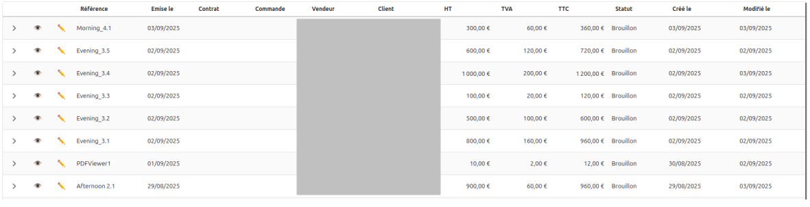
- Décomposer les fils de conversation améliore réellement la **productivité et la clarté**.  
- Préparer les helpers et appliquer les règles métier côté frontend (comme le SIRET) dès l’insertion ou la modification simplifie beaucoup la maintenance.

---

## 🚀 Prochaines étapes

- Ajouter la **création et modification des factures côté frontend**, avec sélection des vendeurs et clients.  
- Étendre le tableau avec des **actions supplémentaires** si nécessaire (suppression, détails).  
- Continuer à appliquer la **logique de découpage par fil de conversation** pour chaque nouvelle fonctionnalité.


\newpage

# Jour 14 – Création de l’entête de factures 📝

Aujourd’hui, j’ai finalisé la **création de l’entête de factures côté frontend** avec un formulaire complet et intégré au backend.  
L’objectif était de poser la structure principale avant de gérer les tables attachées (lignes, TVA, justificatifs).

---

## 🎯 Objectif

- Mettre en place un **formulaire dynamique pour l’entête** de facture incluant :  
  - `invoice_number`  
  - `issue_date`  
  - `supply_date`  
  - `seller_id` / `seller_legal_name`  
  - `client_id` / `client_legal_name`  
  - `contract_number`  
  - `purchase_order_number`  
  - `payment_terms` (liste prédéfinie avec valeur par défaut « Paiement à 30 jours date de facture »)  

- Préparer la structure pour **la saisie future des tables liées** : lignes, taxes, justificatifs.
- 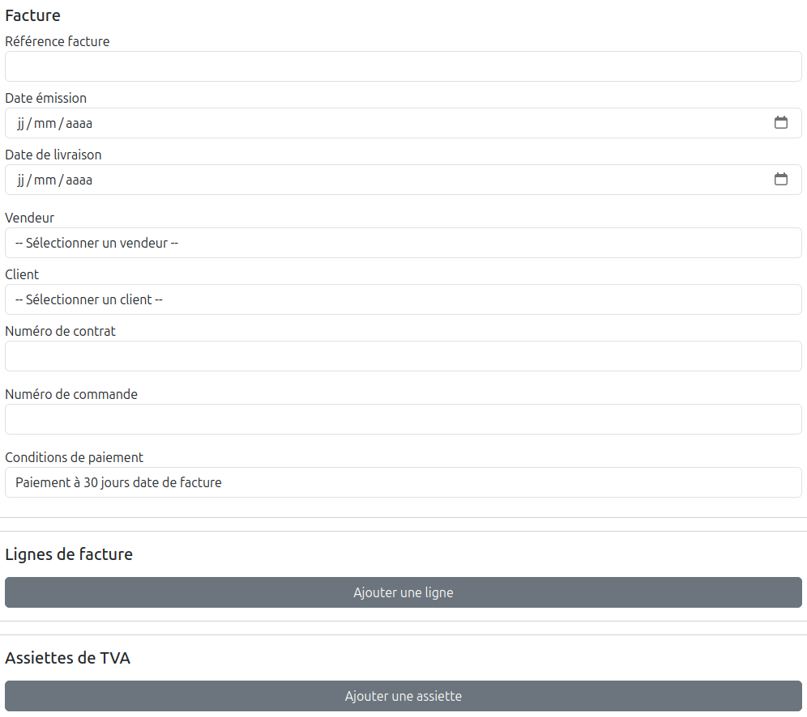 

---

## 💻 Côté frontend

1. **Composant `InvoiceHeader`**
   - Sélection des vendeurs et clients via dropdowns alimentés par l’API.  
   - Saisie des dates, contrat et commande.  
   - Conditions de paiement gérées via **liste externe** pour plus de lisibilité et maintenance.  

2. **Formulaire global (`InvoiceForm`)**
   - `invoiceData` centralise les données :  
     ```javascript
     const [invoiceData, setInvoiceData] = useState({
       header: {},
       lines: [],
       taxes: [],
       attachments: []
     });
     ```  
   - Validation uniquement de l’entête pour l’instant.  
   - Bouton de création positionné **en bas à droite**.  
   - Message de succès et redirection vers la liste des factures après création :  
     ```javascript
     setSuccessMessage("Facture créée avec succès ! 🎉");
     setTimeout(() => {
       setSuccessMessage('');
       navigate('/invoices');
     }, 2000);
     ```

3. **Optimisations UX**
   - Lisibilité améliorée grâce aux listes déroulantes et valeurs par défaut.  
   - Formulaire prêt à être étendu pour gérer les tables attachées.

---

## 🛠 Côté backend

- La route `/api/invoices` est prête à recevoir l’entête complet avec vérification des `seller_legal_name` et `client_legal_name`.  
- Séquences PostgreSQL synchronisées pour éviter les doublons d’ID.  
- Flux sécurisé via transactions pour assurer l’intégrité des données lors de l’insertion.

✅ Résultat : **entête fonctionnel et validé**, base prête pour la saisie des lignes, assiettes de TVA et justificatifs.

---

## 📚 Ce que j’ai appris

- Centraliser l’entête dans `invoiceData.header` simplifie la gestion et la transmission des données.  
- Externaliser les listes (comme les conditions de paiement) améliore la lisibilité et la maintenance du code.  
- Le message de succès avec redirection offre une UX fluide et rassurante.

---

## 🚀 Prochaines étapes

- Valider les **lignes de facture** (`invoice_lines`) avec calculs HT / TVA / TTC.  
- Intégrer les **assiettes de TVA** (`invoice_taxes`).  
- Ajouter les **justificatifs** (`invoice_attachments`) avec upload et gestion des types (`main` / `additional`).  
- Tester l’insertion complète dans le backend pour garantir l’intégrité des données.


\newpage

# Jour 15 – Lignes, TVA et réflexions autour du produit 🧾🌿

Aujourd’hui, j’ai franchi une nouvelle étape dans le projet **eInvoicing** : la **gestion des lignes de facture et des assiettes de TVA**. Côté frontend, tout est dynamique, avec calcul automatique des montants HT, TVA et TTC, et un formulaire agréable à remplir. Le backend est opérationnel, avec l’insertion des lignes, taxes et justificatifs dans les tables appropriées et la séquence PostgreSQL resynchronisée pour éviter les doublons d’ID.

---

## 🎯 Objectifs atteints

- Validation et **affichage dynamique des lignes de facture** avec calculs intégrés.  
- Gestion des **assiettes de TVA** dans la table dédiée `invoice_taxes`.  
- Alignement du **bouton “Créer la facture”** pour améliorer l’UX.  
- Flux complet de création côté backend avec transaction sécurisée pour assurer l’intégrité des données.

---

## 💻 Côté frontend

1. **InvoiceLines** : saisie intuitive des lignes avec champs calculés en lecture seule (HT, TVA, TTC).  
2. **TaxBases** : gestion des assiettes de TVA avec calcul automatique du montant de taxe.  
3. **Formulaire global (`InvoiceForm`)** : centralisation des données dans `invoiceData` pour l’entête, les lignes, taxes et justificatifs.  
4. **Optimisations UX** : alignement du bouton, lisibilité des champs et placeholders, feedback immédiat après création.  

---

## 🛠 Côté backend

- Routes `/api/invoices` prêtes à recevoir l’ensemble des données.  
- Séquences PostgreSQL synchronisées pour éviter les conflits d’ID.  
- Transactions sécurisées pour garantir que l’insertion des lignes, taxes et justificatifs est atomique.  

---

## 🌿 Pause et équilibre

Ce weekend, j’ai pris un petit break pour **profiter de mes copains d’enfance et de leurs familles**, dans un cadre magnifique autour d’un lac. Ces moments m’ont permis de **déconnecter**, de respirer et de revenir lundi avec l’esprit clair et motivé. Même dans un projet exigeant, il est essentiel de garder un équilibre entre travail et vie personnelle.

---

## 💡 Réflexions autour du produit

En avançant sur ce projet, j’ai eu un déclic : **le développement n’est qu’un composant d’un système plus vaste**.  

Créer un produit, c’est assembler plusieurs couches :  

- **La tech** : code propre, architecture solide, bonnes pratiques.  
- **Le produit** : définir l’objectif, prioriser, penser à l’expérience utilisateur.  
- **Ops** : déploiement, sécurité, monitoring.  
- **Marketing & positionnement** : faire savoir que le produit existe, convaincre, fidéliser.  
- **Partenariats** : s’intégrer dans un écosystème, trouver des relais de croissance.  

Chaque choix technique peut influencer la perception marketing, et un choix UX bien pensé peut transformer l’adoption.

---

## 🚀 Prochaines étapes

- Poursuivre la **gestion des justificatifs** (`invoice_attachments`) avec upload et typage (`main` / `additional`).  
- Tester l’insertion complète des données dans le backend pour valider la cohérence globale.  
- Commencer à **réfléchir à l’optimisation UX** pour limiter les erreurs de saisie et améliorer la fluidité du formulaire.  

✅ Résultat : **les lignes et assiettes de TVA sont opérationnelles**, le backend sécurisé, et une vision claire du produit se dessine, enrichie par des moments de déconnexion bienvenus.


\newpage

# Jour 16 – Upload des justificatifs et tests 🗂️⚡

Aujourd’hui, j’ai avancé sur la **gestion des justificatifs** dans le projet **eInvoicing** et sur la **validation complète du backend**. L’objectif était de permettre à l’utilisateur de joindre des documents à ses factures, de gérer leurs types (`main` / `additional`) et de sécuriser l’insertion dans la base.

---

## 🎯 Objectifs atteints

- Intégration du **upload de justificatifs** côté frontend et backend.  
- Gestion des types de fichiers (`main` et `additional`) avec contrainte de type.  
- Validation de la **longueur et unicité de `invoice_number`** pour sécuriser l’insertion.  
- Tests complets pour s’assurer que les lignes, taxes et justificatifs sont bien insérés ensemble.

---

## 💻 Côté frontend

1. **Composant `SupportingDocs`**
   - Permet à l’utilisateur de sélectionner un ou plusieurs fichiers.  
   - Choix du type de justificatif (`main` / `additional`) pour chaque fichier.  
   - Affichage des fichiers ajoutés avec possibilité de supprimer un élément avant validation.  

2. **Formulaire global (`InvoiceForm`)**
   - Les justificatifs sont centralisés dans `invoiceData.attachments`.  
   - Upload géré avec retour immédiat pour vérifier la taille et le type des fichiers.  
   - Préparation pour l’envoi complet de la facture au backend, incluant **entête, lignes, TVA et justificatifs**.

---

## 🛠 Côté backend

- La table `invoice_attachments` contient les champs : `file_name`, `file_path`, `attachment_type` et `uploaded_at`.  
- L’insertion des justificatifs se fait **dans la même transaction que la facture**, ce qui garantit l’intégrité des données.  
- Vérification de l’unicité de `invoice_number` et limitation à 20 caractères pour éviter les erreurs PostgreSQL (`bpchar(20)`).  
- Gestion des erreurs : rollback complet si une insertion échoue (lignes, taxes ou justificatifs).

---

## 🔍 Tests et validation

- **Tests unitaires et manuels** pour :  
  - Vérifier que l’upload fonctionne avec plusieurs fichiers.  
  - Tester la suppression d’un justificatif avant validation.  
  - Confirmer que le backend ne laisse passer aucun `invoice_number` dupliqué.  
  - Vérifier que la transaction rollback si un fichier ou une ligne échoue.  

- Résultat : **la facture et tous ses éléments associés sont insérés ou annulés ensemble**, garantissant la cohérence des données.

---

## 🌿 Réflexions autour du produit

- Le système d’upload **doit rester simple et intuitif**, car c’est souvent un point de friction pour l’utilisateur.  
- Le contrôle côté backend est essentiel : **ne jamais faire confiance au frontend** pour l’intégrité des données.  
- Les tests révèlent des cas limites : fichiers trop volumineux, noms longs, type invalide, duplication de `invoice_number`.  

---

## 🚀 Prochaines étapes

- Renforcer la **qualité des données dans le formulaire** :  
  - Champs obligatoires bien signalés  
  - Totaux calculés automatiquement et vérifiés  
  - Contrôle des dates et cohérence des valeurs  

- Continuer à améliorer l’**UX** pour limiter les erreurs lors de l’ajout de justificatifs.  
- Créer un **board Trello complet** pour suivre l’avancement du projet et planifier les prochaines fonctionnalités.  
- Préparer la **phase de tests d’intégration** pour simuler des flux complets avec factures, lignes, TVA et justificatifs.

✅ Résultat : **les justificatifs sont gérés**, le backend est robuste et les tests confirment l’intégrité des données dans toutes les situations.


\newpage

# Jour 17 – Organisation et productivité avec Trello 🗂️✨

Aujourd’hui, j’ai franchi une étape importante, non pas dans le code, mais dans **l’organisation du projet eInvoicing**.  
J’ai décidé de mettre en place un **board Trello** pour suivre les tâches, prioriser et mieux visualiser l’avancement.

## 🎯 Pourquoi Trello ?
Dans un projet en solo, on pourrait croire que tout garder en tête ou dans un simple fichier texte suffit.  
Mais la réalité, c’est que les tâches s’accumulent vite : frontend, backend, base de données, UX, documentation…  
Le risque ? Perdre du temps à chercher où j’en suis ou oublier une étape clé.

Avec Trello, je bénéficie de :
- **Une vue claire** sur ce qui est à faire, en cours et terminé.
- **Des étiquettes par domaine** (frontend, backend, db, UX, API, etc.) pour organiser les tâches.
- **Une priorisation visuelle**, ce qui m’aide à décider sur quoi me concentrer à chaque session de travail.

## 🛠️ Concrètement
J’ai structuré mon board avec plusieurs colonnes :
- **Backlog** : toutes les idées, même celles non encore validées.
- **À faire** : les prochaines étapes à court terme.
- **En cours** : les tâches sur lesquelles je travaille.
- **Terminé** : l’historique de ce que j’ai accompli.

Chaque carte reprend l’esprit de mon **journal de bord quotidien** : un titre clair, une description concise, et parfois des checklists ou des étiquettes.

## 🌿 Réflexions autour de la productivité
Je me rends compte que coder n’est qu’une partie du travail.  
Être organisé est tout aussi essentiel, car cela :
- Me libère l’esprit (je n’ai plus à tout retenir).
- M’aide à garder une **vision d’ensemble** sur le projet.
- Valorise mon effort : voir la colonne “Terminé” se remplir est très motivant. 💪

En fait, ce Trello devient presque le **miroir visuel** de mon journal : l’un raconte, l’autre organise.

## 🚀 Prochaines étapes
- Alimenter le board régulièrement pour garder une trace de toutes les idées.  
- Relier mon Trello à mon rythme de publication sur Medium, afin que chaque jour de journal corresponde aussi à une ou plusieurs cartes.  
- Utiliser les labels pour équilibrer les efforts entre frontend, backend et organisation.

✅ Résultat : j’ai désormais un outil simple mais puissant pour **structurer mon énergie** et m’assurer que le projet avance de manière cohérente et durable.


\newpage

# Jour 18 – Qualité des données et UX 📝✨

Aujourd’hui, j’ai concentré mes efforts sur la qualité des données dans le formulaire de factures et sur l’expérience utilisateur.  
L’objectif : permettre à l’utilisateur de saisir correctement ses données dès le départ, détecter les erreurs immédiatement et rendre l’interface intuitive, tout en posant des fondations solides pour le projet.

---

## 🎯 Objectifs atteints

Mise en place de contrôles côté frontend pour :

- Les champs obligatoires (`issue_date`, `fiscal_year`, `invoice_number`, justificatif principal).  
- Les valeurs numériques (`quantity`, `unit_price`, `discount`, `vat_rate`).  
- La cohérence des totaux et des assiettes de TVA.  

Autres points :

- Retour instantané à l’utilisateur si une valeur est manquante ou incohérente, avant même d’envoyer les données au backend.  
- Vérification complémentaire côté backend pour garantir l’intégrité des données, même si le frontend est contourné.  
- Les règles sont posées à plusieurs niveaux : **frontend, backend et base de données**, pour assurer robustesse et fiabilité.

---

## 💻 Côté frontend

### Validation immédiate

- L’utilisateur est alerté dès qu’un champ obligatoire n’est pas rempli.  
- Les totaux sont recalculés automatiquement et les assiettes de TVA mises à jour en temps réel.  
- Mise en avant visuelle des champs problématiques pour correction rapide.

### Simplicité et clarté

- Les justificatifs principaux et additionnels sont facilement identifiables.  
- Les messages d’erreur sont précis et expliquent clairement ce qu’il faut corriger.  
- L’expérience UX est pensée pour limiter les erreurs et assister l’utilisateur au maximum, sans le frustrer.

---

## 🛠 Côté backend

- Contrôle des données critiques (`invoice_number`, `fiscal_year`, `attachments`) pour éviter toute incohérence.  
- Les transactions regroupent tous les éléments : lignes, TVA et justificatifs. Si un problème survient, aucune donnée n’est partiellement enregistrée.  
- Les erreurs sont remontées clairement au frontend pour informer l’utilisateur immédiatement.

---

## 🔍 Résultats et apprentissages

- L’expérience utilisateur est plus fluide, car les erreurs sont captées dès la saisie.  
- La combinaison frontend + backend assure la robustesse : le frontend guide l’utilisateur, le backend garantit la sécurité.  
- Les assiettes de TVA sont automatiquement recalculées et affichées, permettant de détecter toute incohérence instantanément.  
- Poser ces fondations tôt permet de construire par-dessus quelque chose de solide et fiable, ce qui accélère la suite du développement.

---

## 🌿 Réflexions autour du produit

- Une bonne UX et des validations claires réduisent les erreurs et le stress de l’utilisateur.  
- La qualité des données commence dès la saisie, mais un contrôle backend et DB reste indispensable pour garantir l’intégrité globale.  
- Voir l’utilisateur saisir correctement ses informations et recevoir un feedback immédiat est extrêmement gratifiant.  
- Avoir plusieurs niveaux de contrôle est une pratique solide, pas une lubie : cela sécurise l’application tout en restant agréable pour l’utilisateur.

---

## 🚀 Prochaines étapes

- Étendre les validations pour couvrir d’autres champs et cas particuliers.  
- Ajouter des messages contextuels et des infobulles pour guider encore mieux l’utilisateur.  
- Préparer le prochain module pour automatiser certaines suggestions de saisie et faciliter le workflow complet.

✅ Résultat : le formulaire devient robuste, intuitif et sûr, et la saisie des factures est rapide et fiable, même pour un utilisateur novice.


\newpage

# Jour 19 – Services API et centralisation des appels 💾⚡

Aujourd’hui, j’ai consacré ma session à **centraliser tous les appels API** du projet.  
Objectif : simplifier le code frontend, éviter la duplication et préparer une base solide pour la maintenance et l’évolution des entités.

---

## 🎯 Pourquoi un service centralisé ?

Avant, chaque page ou formulaire appelait directement `fetch` avec l’URL correspondante.  
Problème :  

- Si l’URL change ou si je dois ajouter un en-tête commun (authentification, content-type…), il fallait modifier chaque page.  
- La logique de récupération et de traitement des données était dispersée.  
- La réutilisation était limitée : créer un nouveau composant nécessitait souvent de réécrire les mêmes appels.

Avec un **service dédié par entité** (`sellers.js`, `clients.js`, `invoices.js`) :

- Tous les appels API sont regroupés en un seul endroit.  
- Les pages et composants consomment ces services sans se soucier des détails de l’URL ou des méthodes HTTP.  
- Il devient facile de gérer les erreurs, la mise en cache, ou d’ajouter un middleware plus tard.

---

## 💻 Côté frontend

### Adaptation des listes et formulaires

- `SellersList` et `NewSeller` utilisent désormais `sellersService` pour **fetcher ou créer un vendeur**.  
- `ClientsList` et `NewClient` utilisent `clientsService` de la même façon.  
- `InvoicesList` et `NewInvoice` passent par `invoicesService`.  

Les pages sont **plus légères et claires** : elles se concentrent sur l’UI, les formulaires et la logique d’état, sans gérer les détails du réseau.

### Breadcrumb et SEO

- Chaque page garde son **breadcrumb dynamique**, aligné à gauche pour les fiches.  
- Les titres H1 sont invisibles (`visually-hidden`) pour **SEO et accessibilité**, sans encombrer l’interface.  
- Les pages listes n’affichent plus un H2 redondant : le breadcrumb suffit à situer l’utilisateur.

---

## 🛠 Côté architecture

- `services/` contient maintenant un fichier par entité : chaque service exporte des fonctions `getAll`, `getById`, `create`, `update`, `delete`.  
- `constants/` permet de **centraliser les URLs** de l’API.  
- `AppRoutes.jsx` continue de gérer les routes, mais les composants sont **découplés du backend**.  
- La structure est plus modulable : ajouter une nouvelle entité demande seulement de créer son service et ses pages, sans toucher aux autres composants.

---

## 🔍 Résultats et apprentissages

- Le code est **plus propre et maintenable**.  
- Les erreurs et success messages restent gérés côté page, mais les appels réseau sont uniformisés.  
- Centraliser les services permet d’anticiper des améliorations comme **authentification, logging, retries ou tests unitaires**.  
- L’expérience de développement devient **plus rapide et cohérente**.

---

## 🌿 Réflexions autour du produit

- Même pour un projet solo, **structurer les appels API** est un vrai gain de temps.  
- Cette approche favorise **la réutilisation**, la cohérence et la préparation à de futures évolutions.  
- L’utilisateur ne voit rien de tout ça, mais moi je gagne en sérénité et en rapidité de développement.  
- Une petite étape côté architecture qui simplifie **toutes les prochaines pages et formulaires**.

---

## 🚀 Prochaines étapes

- Travailler sur la **qualité du code** et l’optimisation des services.  
- Adapter la **gestion des clients** pour distinguer les **entreprises des particuliers**, avec éventuellement des champs et validations spécifiques.  
- Ajouter des tests unitaires pour les services afin de garantir que les API répondent comme attendu.  
- Préparer la même approche si de nouvelles entités apparaissent : quelques lignes suffisent pour connecter la page au service.  

✅ Résultat : le projet est désormais **plus modulaire, maintenable et prêt à grandir**, tout en conservant


\newpage

# Jour 20 – Liste des vendeurs et refactor UX 🗂️✨

Aujourd’hui, j’ai travaillé sur la **liste des vendeurs** et le **refactoring du formulaire** pour rendre le projet plus **modulaire, clair et conforme à la réglementation**.

---

## Ce qui a été fait

### Table des vendeurs

- **Tableau complet** avec toutes les informations principales : identifiant légal, nom, adresse, contact, audit de création et mise à jour.  
- **Bouton d’édition toujours visible**, sans scroll horizontal, pour améliorer l’UX.  
- **Panneau extensible** pour les informations d’audit (création et mise à jour).  
- **Filtrage en temps réel** pour rechercher un vendeur rapidement.  
- Composants et services centralisés pour une **architecture modulable et réutilisable**.  

### Refactor du formulaire

- Le **SellerForm** a été **restructuré** pour utiliser les **nouveaux composants réutilisables** (inputs, selects, boutons, gestion d’erreur).  
- Objectif : garantir **cohérence UX** et **simplification du code**, tout en facilitant la maintenance et l’ajout futur de champs ou entités.  
- Les validations et contrôles sont intégrés **dans ces composants**, ce qui centralise la logique et limite les répétitions.  

### Base de données

- Les colonnes principales (`legal_name`, `legal_identifier`, `address`, `city`, `postal_code`, `country_code`, `contact_email`, `phone_number`, `created_at`, `updated_at`) sont confirmées pour **garantir intégrité et cohérence**.  
- Préparation à des **relations futures** avec d’autres entités (clients, factures, etc.) pour une évolution fluide.  

---

## Pourquoi c’est important

- Les utilisateurs bénéficient d’un **tableau clair et fonctionnel**, avec un accès rapide aux actions.  
- Les composants réutilisables dans le formulaire permettent **un développement plus rapide et uniforme** pour toutes les entités.  
- La base de données structurée assure **robustesse et scalabilité**.  
- On prépare le projet à être **conforme à la réglementation**, tout en restant UX-friendly.  

---

## Prochaines étapes

- Réflexion et **mise à jour de l’entité client** en gardant la cohérence UX et fonctionnelle.  
- Adapter progressivement l’interface pour le **mobile et les grands volumes de données**.  
- Consolider la **structure DB** pour anticiper de nouvelles relations et extensions.  
- Étendre l’usage des **composants réutilisables** sur les autres formulaires et listes.  

✅ Résultat : un tableau et un formulaire **clairs, modulaires et évolutifs**, une DB **robuste**, et une base solide pour toutes les prochaines fonctionnalités.


\newpage

# Jour 21 – Optimisation et UX des listes 🗂️✨

Aujourd’hui, j’ai consacré ma session à **améliorer la liste des vendeurs** et à renforcer les fondations côté UX et code.  
Objectif : rendre la liste **plus lisible, maintenable et réutilisable**, tout en anticipant les besoins futurs.

---

## 🎯 Travaux réalisés

### Affichage et ergonomie
- Passage du layout en `container-fluid` pour que la liste occupe toute la largeur de l’écran.
- Table responsive avec **scroll vertical fixe** (`fixedHeaderScrollHeight`) pour un confort d’utilisation sur desktop.
- Colonnes avec largeur définie et **cellules ellipsées** (`EllipsisCell`) : texte tronqué avec tooltip pour ne rien perdre de l’information.
- Expansion des lignes pour afficher uniquement les **informations d’audit** (date de création et mise à jour).

### Refactor et modularité
- Extraction des colonnes dans un hook `useSellerColumns` pour **centraliser la logique des colonnes**.
- Création du composant générique `EllipsisCell` dans `components/common`, prêt à être réutilisé dans d’autres listes.
- Refacto du `SellerForm` pour utiliser des **composants plus modulaires**, harmoniser l’UI et faciliter la maintenance.
- Les services API restent centralisés (`sellersService`), les pages se concentrent sur l’UI et la logique d’état.

### Filtrage et performance
- Recherche dynamique côté front pour filtrer rapidement les résultats.
- Gestion propre des données tronquées ou longues sans casser l’affichage.
- Optimisation de l’affichage pour **desktop / laptop**, avec réflexion future pour mobile.

---

## 🛠 Côté architecture

- La liste est désormais **modulaire** : colonnes, cellules, formulaires et services séparés.
- Les composants génériques (`EllipsisCell`) et hooks (`useSellerColumns`) facilitent la **réutilisation et la cohérence** à travers le projet.
- La structure permet d’**ajouter de nouvelles entités ou fonctionnalités** sans modifier le cœur du composant.

---

## 🔍 Résultats et apprentissages

- Expérience utilisateur améliorée : informations clés visibles, textes tronqués accessibles via tooltip.
- Code plus maintenable et modulable : les colonnes et cellules peuvent être réutilisées ailleurs.
- Mise en place de bonnes pratiques : séparation UI / logique, composants réutilisables, services centralisés.

---

## 🌿 Réflexions autour du produit

- Même si certaines informations (comme les dates d’audit) ne sont pas essentielles pour l’utilisateur final, elles sont **accessibles en détail** via l’expansion.
- Les fondations posées permettent d’anticiper **la croissance du projet**, l’ajout d’autres listes ou entités, et des évolutions UX plus poussées.
- L’UX et l’architecture sont alignées : la lisibilité et la cohérence sont maximisées, tout en conservant la flexibilité pour les prochaines étapes.

---

## 🚀 Prochaines étapes

- Réfléchir à l’**adaptation mobile** pour que les listes restent lisibles sur smartphone.
- Étudier des **filtres avancés et tri multi-critères**.
- Continuer le refacto et la création de composants réutilisables pour les prochaines entités.
- Poursuivre la **réflexion sur l’entité client**, pour rester cohérent côté UX et fonctionnalités.

✅ Résultat : la liste des vendeurs est désormais **plus lisible, modulable et prête à évoluer**, tout en posant une base solide pour les prochaines étapes du projet.


\newpage

# Jour 22 – Refactor complet des listes et harmonisation 🗂️✨

Aujourd’hui, j’ai travaillé sur la **liste des clients** et poursuivi le **refactoring des listes de toutes les entités** pour garantir **cohérence, modularité et lisibilité** à travers le projet.  
L’objectif était de **mettre à jour le front, le backend et la DB** pour que tout soit aligné et prêt à évoluer.

---

## 🎯 Travaux réalisés

### Frontend : listes et UX

- Passage de la **liste client en version refactorée** (inspirée de la liste des vendeurs) :
  - Colonnes centralisées dans un hook `useClientColumns`.
  - Cellules ellipsées (`EllipsisCell`) pour gérer le texte long sans casser le layout.
  - Table responsive avec **scroll fixe**, pagination et filtrage dynamique.
  - Expansion des lignes pour afficher **les informations d’audit** (date de création et mise à jour) avec le composant `AuditPanel`.

- **Composants harmonisés** :
  - `AuditPanel` remplace les versions spécifiques à vendeur ou client pour **afficher les dates en petit format, sobre et lisible**.
  - `datatableStyles` centralisé pour garantir **cohérence visuelle** entre toutes les listes.
  - Hook `useClients` pour récupérer les clients via `clientsService` de manière **centralisée et testable**.

- **Filtrage et performance** :
  - Recherche côté frontend pour filtrer en temps réel.
  - Gestion sécurisée des dates pour éviter `Invalid Date`.
  - Traitement des valeurs manquantes (`undefined` ou `null`) pour maintenir la stabilité de la table.

---

### Backend : API et services

- **Mise à jour du service client** :
  - `clientsService` centralise tous les appels API : `getAll`, `getById`, `create`, `update`, `delete`.
  - La page `ClientsList` est découpée et **ne s’occupe que de l’UI et de la logique de filtrage**.

- **Contrôles et validations** :
  - Validation des champs côté backend pour garantir cohérence avec la base.
  - Ajout de contrôles pour `legal_identifier`, `legal_name`, `address`, etc., afin d’éviter les données invalides ou incohérentes.

---

### Base de données : cohérence et structure

- Vérification des colonnes principales dans la table `clients` :
  - `legal_name`, `legal_identifier`, `address`, `city`, `postal_code`, `country_code`, `contact_email`, `phone_number`, `created_at`, `updated_at`.
- Préparation pour les **relations futures** avec les factures et autres entités.
- Alignement des types et contraintes pour que le frontend, le backend et la DB soient **parfaitement cohérents**.

---

## 🛠 Côté architecture

- **Hooks et composants** :
  - `useClients` et `useClientColumns` centralisent la logique.
  - `EllipsisCell` et `AuditPanel` sont réutilisables et harmonisés.
- **Tables modulaires** :
  - Frontend découplé du backend : les pages consomment uniquement les services.
  - Expansion pour audit et filtrage dynamique uniformisés pour toutes les entités.

---

## 🔍 Résultats et apprentissages

- UX plus claire : informations essentielles visibles, détails accessibles via expansion.
- Code maintenable et réutilisable : hooks et composants partagés entre clients et vendeurs.
- Backend cohérent avec la DB : validations centralisées, API uniformisée.
- Base de données prête pour évolutions futures et nouvelles entités.

---

## 🌿 Réflexions autour du produit

- Harmoniser front, backend et DB crée une **fondation solide pour le projet**.
- Même les détails mineurs (audit, styles) sont importants pour garantir **cohérence et qualité**.
- Le projet est maintenant modulable, testable et prêt à **accueillir de nouvelles fonctionnalités** rapidement.

---

## 🚀 Prochaines étapes

- Étendre l’approche aux autres entités et listes.
- Réfléchir à l’adaptation mobile pour **tables et formulaires**.
- Ajouter des filtres avancés et tris multi-critères.
- Continuer à **centraliser et réutiliser composants et hooks** pour maintenir la cohérence.

✅ Résultat : un front, un backend et une DB **alignés et modulables**, des listes clients et vendeurs harmonisées, et une base solide pour toutes les évolutions à venir.


\newpage

# Jour 23 – Amélioration de la validation du formulaire 📝✨

Aujourd’hui, j’ai plongé dans les détails du **formulaire de saisie pour clients et vendeurs**, et je me suis attaqué à un problème récurrent : la **validation des SIRET et des champs contact**.  

## Le constat
Les formulaires fonctionnaient globalement, mais quelques subtilités bloquaient l’expérience :  

- Les utilisateurs pouvaient saisir des **numéros de téléphone invalides** côté client sans retour immédiat.  
- Les SIRET n’étaient pas toujours conformes : parfois avec des espaces, parfois incomplets.  
- La gestion des données initiales provoquait des rerenders multiples et des warnings React (`useEffect has a missing dependency`).  

## Ce que j’ai fait
1. **Uniformisation des champs**  
   - Les champs `email` et `phone` ont été reliés correctement au `validator`.  
   - Les noms des champs côté formulaire et côté validation ont été harmonisés pour éviter les incohérences (`phone` au lieu de `phone_number` par exemple).  

2. **Normalisation automatique du SIRET**  
   - Suppression de tous les espaces ou caractères non numériques avant validation.  
   - Vérification stricte côté client : un SIRET valide doit contenir **14 chiffres consécutifs** pour passer la validation.  

3. **Logs détaillés pour chaque étape**  
   - Chaque changement de champ est maintenant tracé avec `console.log`, ce qui permet de voir en temps réel les valeurs saisies et les erreurs détectées.  
   - Le submit affiche clairement si le formulaire est prêt ou si des erreurs persistent.  

4. **Amélioration du `useEffect`**  
   - Normalisation des `initialData` pour éviter les warnings React et rerenders inutiles.  

## Résultat
- Le formulaire n’accepte plus de SIRET ou de téléphone incorrects.  
- Les erreurs sont affichées immédiatement et de façon claire dans chaque section.  
- La logique d’ouverture automatique des sections avec erreurs rend l’expérience plus intuitive.  

🎯 **Takeaway du jour** : Les détails comptent ! Harmoniser les noms de champs, normaliser les données et logger chaque étape transforme un formulaire fragile en un outil fiable et agréable pour l’utilisateur.


\newpage

# Jour 24 – Finalisation du formulaire client et refacto 🛠️✨

Aujourd’hui, j’ai poursuivi le chantier sur le formulaire client en ciblant deux objectifs : **sécuriser la validation des SIRET** et **améliorer la robustesse générale du formulaire**.

---

## 🔍 Le constat
Malgré les progrès précédents, plusieurs problèmes subsistaient :

- Les **SIRET existants** déclenchaient des erreurs même pour l’utilisateur courant (l’ID du client n’était pas pris en compte).  
- Les erreurs liées aux **SIRET incorrects** n’étaient pas toujours affichées côté formulaire.  
- La **synchronisation** entre les champs (`siret`, `legal_identifier`) et la validation côté client/API était fragile, provoquant parfois des messages incohérents.  
- Les utilisateurs **ne voyaient pas immédiatement** pourquoi l’enregistrement échouait, ce qui nuisait à l’expérience.  

---

## 🛠️ Ce que j’ai fait

### ✅ Validation SIRET intelligente
- Ajout d’une **vérification locale stricte** : suppression de tous les caractères non numériques et contrôle de la longueur (14 chiffres pour les entreprises françaises).  
- Harmonisation avec la **validation côté API** :  
  - si le SIRET est déjà utilisé par un autre client → message d’erreur immédiat.  
  - le client courant peut réutiliser son propre SIRET sans blocage.  

### ✅ Amélioration des messages d’erreur
- Les erreurs sont maintenant affichées directement dans `LegalFields` avec `invalid-feedback`.  
- Chaque section affiche un indicateur ⚠️ si elle contient des erreurs, et s’ouvre automatiquement lors du submit.  

### ✅ Refacto de l’état et des `useEffect`
- `initialData` est correctement normalisé pour éviter les **rerenders multiples** et les warnings React.  
- Gestion **centralisée des erreurs** dans `handleChange` et `handleSubmit` → logique plus claire et prévisible.  

### ✅ Synchronisation et automatisation
- Si l’entreprise est française et a un SIRET, le champ `legal_identifier` est **automatiquement rempli**.  
- Les modifications de pays ou de type de client mettent à jour les champs connexes et déclenchent la **validation en temps réel**.  

### ✅ Logs et traçabilité
- Chaque changement de champ, chaque vérification de SIRET et chaque erreur sont **loggés** → debug et suivi facilités.  

---

## 🎯 Résultat
- Le formulaire **refuse désormais les SIRET invalides** et affiche les erreurs immédiatement.  
- L’utilisateur comprend instantanément **où corriger les informations** grâce aux messages d’erreur et à l’ouverture automatique des sections concernées.  
- La **réutilisation du SIRET** pour l’enregistrement courant fonctionne parfaitement.  
- Le formulaire est **plus robuste** et le code **plus maintenable** grâce au refacto et à l’harmonisation des champs.  

---

## ✨ Takeaway du jour
> La validation complexe devient fluide quand on **centralise les règles**, qu’on **synchronise les champs dépendants** et qu’on **affiche clairement chaque erreur**.  
> Une petite refonte côté code peut transformer une expérience frustrante en un formulaire fiable et agréable.


\newpage

# Jour 25 – Validation complète des vendeurs et renforcement du formulaire 🏗️✨

Aujourd’hui, j’ai concentré mes efforts sur le **formulaire des vendeurs**, en particulier pour **assurer une validation stricte et complète** tout en améliorant l’expérience utilisateur.

---

## 🔍 Le constat

Avant les modifications, plusieurs points bloquaient :

- L’**email du vendeur** n’était pas correctement validé côté formulaire, ce qui provoquait des erreurs côté backend (`contact_email` non renseigné).  
- Les champs **adresse, code postal et ville** n’étaient pas obligatoires, ce qui pouvait générer des enregistrements incomplets.  
- La validation du **SIRET et du numéro de TVA** fonctionnait, mais était parfois incohérente selon le pays sélectionné.  
- Les erreurs côté front ne reflétaient pas toujours celles remontées par la base de données, provoquant des frustrations.

---

## 🛠️ Ce que j’ai fait

### ✅ Harmonisation des champs et validations

- Les champs **contact_email, address, postal_code et city** sont désormais obligatoires pour tous les vendeurs.  
- Le SIRET pour les entreprises françaises est **strictement contrôlé** :  
  - 14 chiffres exactement,  
  - validité vérifiée par la fonction `isValidSiret`.  
- Pour les entreprises hors France, le **numéro de TVA intracommunautaire** est obligatoire.  
- La validation côté frontend reflète exactement les contraintes de la DB pour éviter les erreurs `not-null constraint`.  

### ✅ Refacto du validator `validateSeller`

- Centralisation des règles dans `utils/validators/seller.js` :  
  - `contact_email` obligatoire,  
  - champs d’adresse obligatoires,  
  - SIRET/TVA correctement validés selon le pays.  
- Utilisation paramétrable de `validateContact` pour ne pas impacter la validation client.

### ✅ Amélioration de l’expérience utilisateur

- Les **sections du formulaire** s’ouvrent automatiquement si elles contiennent des erreurs.  
- Les messages d’erreur sont précis et associés au bon champ (`contact_email` au lieu de `email` pour le vendeur).  
- Les logs détaillés (`console.log`) permettent de suivre **tous les changements et erreurs en temps réel**.  

### ✅ Préparation pour les évolutions futures

- Ajout de la possibilité d’**auto-complétion pour code postal et ville** (planifiée pour plus tard).  
- Champ `legal_identifier` clairement identifié comme SIRET pour les entreprises françaises.  
- La structure du formulaire et des validators est maintenant **extensible et maintenable**, prête pour de nouvelles validations ou types d’entités.  

---

## 🎯 Résultat

- Les vendeurs ne peuvent plus être enregistrés sans **email, adresse, code postal et ville valides**.  
- La validation du SIRET et de la TVA est **fiable et cohérente** avec la DB.  
- Le formulaire est **robuste**, le code **maintenable**, et les messages d’erreur sont **clairs et immédiats** pour l’utilisateur.  

---

## ✨ Takeaway du jour

> La clé d’un formulaire robuste réside dans **l’harmonisation des champs et des validations**.  
> Une validation cohérente côté frontend et backend permet de réduire drastiquement les erreurs et améliore l’expérience utilisateur, tout en préparant le code pour des évolutions futures.


\newpage

# Jour 26 – Refacto SellerForm et validations bancaires 🛠️✨

Aujourd’hui, j’ai passé du temps à améliorer la qualité du code pour les sellers, et c’était assez magique ! 😄

---

## Ce qui a été fait

1. **Refacto `SellerForm` et `useSellerForm`**
   - Suppression du champ `bank_details`.
   - Ajout de champs `iban` et `bic`.
   - Mise à jour de `FinanceFields` pour refléter ces changements.
   - Le formulaire ouvre automatiquement les sections contenant des erreurs.
   - Gestion des messages d’erreur améliorée, plus claire pour l’utilisateur.

2. **Validator Seller**
   - Ajout de la validation de l’IBAN et du BIC grâce à la librairie `iban`.
   - Contrôle automatique de la longueur, du format et des clés de contrôle.
   - Simplification de la validation des SIRET / TVA.

3. **Back-end**
   - Modifications dans le modèle pour supprimer `bank_details` et créer les champs `iban` et `bic`.
   - Les controllers et services n’ont quasiment pas été touchés, car ils étaient déjà bien découplés.

---

## Impressions

Je comprends de mieux en mieux le code et j’ai l’impression de pouvoir aller beaucoup plus vite maintenant.  
Hier, j’avais vraiment galéré avec certaines validations et la complexité du formulaire, mais aujourd’hui c’est assez magique : prendre le temps de comprendre et refactorer me permet d’avancer plus vite à terme !  

Le plus cool : la validation IBAN/BIC, qui aurait pris des jours à écrire en PLSQL dans mon ancienne boîte, est maintenant gérée en quelques minutes avec une simple librairie. 💪  

---

## Ce que je retiens

- Prendre le temps de refactorer et de comprendre le code **accélère la progression** sur le long terme.
- Les librairies existantes peuvent transformer des tâches laborieuses en quelques lignes de code.
- La qualité et la robustesse du formulaire sont désormais beaucoup meilleures pour l’utilisateur.


\newpage

# Jour 25 – Validation complète des vendeurs et renforcement du formulaire 🏗️✨

Aujourd’hui, j’ai concentré mes efforts sur le **formulaire des vendeurs**, en particulier pour **assurer une validation stricte et complète** tout en améliorant l’expérience utilisateur.

---

## 🔍 Le constat

Avant les modifications, plusieurs points bloquaient :

- L’**email du vendeur** n’était pas correctement validé côté formulaire, ce qui provoquait des erreurs côté backend (`contact_email` non renseigné).  
- Les champs **adresse, code postal et ville** n’étaient pas obligatoires, ce qui pouvait générer des enregistrements incomplets.  
- La validation du **SIRET et du numéro de TVA** fonctionnait, mais était parfois incohérente selon le pays sélectionné.  
- Les erreurs côté front ne reflétaient pas toujours celles remontées par la base de données, provoquant des frustrations.

---

## 🛠️ Ce que j’ai fait

### ✅ Harmonisation des champs et validations

- Les champs **contact_email, address, postal_code et city** sont désormais obligatoires pour tous les vendeurs.  
- Le SIRET pour les entreprises françaises est **strictement contrôlé** :  
  - 14 chiffres exactement,  
  - validité vérifiée par la fonction `isValidSiret`.  
- Pour les entreprises hors France, le **numéro de TVA intracommunautaire** est obligatoire.  
- La validation côté frontend reflète exactement les contraintes de la DB pour éviter les erreurs `not-null constraint`.  

### ✅ Refacto du validator `validateSeller`

- Centralisation des règles dans `utils/validators/seller.js` :  
  - `contact_email` obligatoire,  
  - champs d’adresse obligatoires,  
  - SIRET/TVA correctement validés selon le pays.  
- Utilisation paramétrable de `validateContact` pour ne pas impacter la validation client.

### ✅ Amélioration de l’expérience utilisateur

- Les **sections du formulaire** s’ouvrent automatiquement si elles contiennent des erreurs.  
- Les messages d’erreur sont précis et associés au bon champ (`contact_email` au lieu de `email` pour le vendeur).  
- Les logs détaillés (`console.log`) permettent de suivre **tous les changements et erreurs en temps réel**.  

### ✅ Préparation pour les évolutions futures

- Ajout de la possibilité d’**auto-complétion pour code postal et ville** (planifiée pour plus tard).  
- Champ `legal_identifier` clairement identifié comme SIRET pour les entreprises françaises.  
- La structure du formulaire et des validators est maintenant **extensible et maintenable**, prête pour de nouvelles validations ou types d’entités.  

---

## 🎯 Résultat

- Les vendeurs ne peuvent plus être enregistrés sans **email, adresse, code postal et ville valides**.  
- La validation du SIRET et de la TVA est **fiable et cohérente** avec la DB.  
- Le formulaire est **robuste**, le code **maintenable**, et les messages d’erreur sont **clairs et immédiats** pour l’utilisateur.  

---

## ✨ Takeaway du jour

> La clé d’un formulaire robuste réside dans **l’harmonisation des champs et des validations**.  
> Une validation cohérente côté frontend et backend permet de réduire drastiquement les erreurs et améliore l’expérience utilisateur, tout en préparant le code pour des évolutions futures.


\newpage

# Jour 27 – Validation complète des factures et harmonisation des listes 📝✨

Ce matin, j’ai concentré mes efforts sur le **formulaire de création de facture** et sur la **liste des factures**, avec pour objectif :  
- rendre la validation **fiable et visible pour l’utilisateur**,  
- harmoniser l’affichage des listes avec les modules clients et vendeurs,  
- corriger les petits bugs de React pour un rendu propre et cohérent.

---

## 🔍 Le constat

Avant les changements :

- Les champs obligatoires du header (`invoice_number`, `issue_date`, `fiscal_year`, `seller_id`, `client_id`) **n’étaient pas affichés en rouge** après soumission si l’utilisateur les laissait vides.  
- L’utilisateur pouvait cliquer sur “Créer la facture” et rien ne se passait, ce qui était frustrant.  
- La validation existante fonctionnait à la modification des champs, mais pas correctement à la soumission globale.  
- Les messages d’erreur côté front n’étaient pas synchronisés avec la logique de validation (`validateInvoiceField`).  
- La liste des factures utilisait des colonnes différentes de celles des clients/vendeurs et comportait un warning React (`right={true}`) pour les montants.  
- L’`AuditPanel` disparaissait si certaines colonnes étaient supprimées.

---

## 🛠️ Ce qui a été fait

### ✅ Validation des factures

- Ajout d’une **fonction `validateAll`** dans `InvoiceForm` qui :
  - Parcourt tous les champs obligatoires du header.  
  - Appelle `validateInvoiceField` pour chacun d’eux.  
  - Met à jour le state `errors` pour que les erreurs apparaissent en rouge dans `InvoiceHeader`.  

- Modification de `handleSubmit` pour :
  - Afficher un **alert global** si certains champs obligatoires sont manquants.  
  - Remonter automatiquement en haut du formulaire avec `window.scrollTo({ top: 0, behavior: "smooth" })`.  

- Lorsqu’un champ du header est modifié (`handleChange`), on **revalide automatiquement ce champ** et on met à jour `errors` en temps réel.  

- Les erreurs rouges sont désormais **cohérentes avec le backend**, avec des messages clairs :  
  - “Ce champ est obligatoire”  
  - “L’exercice fiscal doit être compris entre X et Y”  

---

### ✅ Harmonisation de la liste des factures

- Création du hook **`useInvoiceColumns.jsx`** inspiré des colonnes clients/vendeurs :  
  - Alignement des textes longs avec `EllipsisCell`.  
  - Montants (`HT`, `TVA`, `TTC`) alignés à droite via un composant `RightCell`.  
  - Bouton d’édition ✏️ et audit panel conservé.  
  - Colonnes **Client** et **Vendeur élargies** pour plus de lisibilité.  

- Remplacement de la déclaration directe des colonnes dans `InvoicesList.jsx` par l’appel à ce hook, pour **cohérence et réutilisabilité**.  

- Fix du warning React : suppression de `right={true}` et utilisation de style `textAlign: 'right'`.  

- L’`AuditPanel` est maintenant **toujours actif** grâce à une colonne invisible, même si certaines colonnes sont supprimées.

---

## 🎯 Résultat

- Validation des champs obligatoires du header **fiable et visible**, tant à la soumission qu’à la modification.  
- Liste des factures **harmonisée** avec les listes clients/vendeurs, plus lisible et maintenable.  
- Plus de warning React et alignement des montants correct.  
- L’utilisateur bénéficie d’une **expérience cohérente et fluide**, avec toutes les informations accessibles et un audit panel toujours disponible.

---

## ✨ Takeaway du jour

> Une validation **claire et immédiate** combinée à une **interface harmonisée** rend l’expérience utilisateur plus fluide et fiable.  
> Le code devient **réutilisable et maintenable**, et les listes factures s’intègrent naturellement dans l’écosystème clients/vendeurs.


\newpage

# Jour 29 – Composants de facture stabilisés 💡📄

Aujourd’hui, j’ai continué à travailler sur la partie **“Facture”** de l’application.  
L’objectif était d’avoir des composants **fonctionnels, cohérents et testables** sans se perdre dans des hooks trop complexes.

---

## ✅ Ce qu’on a fait

- **InvoiceHeader** : champs éditables et validation basique opérationnels.  
- **InvoiceLines** : affichage et saisie des lignes de facture corrigés, avec gestion des montants.  
- **TaxBases** : calcul automatique des assiettes de TVA, avec ajout/suppression dynamique.  
- **Abandon (temporaire)** du hook custom trop instable → retour à une structure simple, claire et robuste avec props et state.  
- Les messages d’erreur s’affichent désormais **au bon moment** (validation au blur + soumission).  

---

## 💪 Le résultat

On a maintenant une facture qui respire :  

- Les inputs sont utilisables et cohérents.  
- Les montants et taxes se recalculent correctement.  
- Le code est plus lisible et facile à maintenir.  

---

## 🔜 Prochaines étapes

- Améliorer l’UX (meilleure gestion des erreurs et de la validation).  
- Revoir l’idée d’un **hook global** uniquement quand les composants seront totalement stabilisés.  
- Travailler la **cohérence visuelle** de l’ensemble (layout & ergonomie).  


\newpage

# Jour 30 – Validation et robustesse des erreurs 🛡️✨

Aujourd’hui, j’ai poursuivi le chantier sur la partie **“Facture”**, mais cette fois en me concentrant sur **la validation et la robustesse des erreurs**, pour que l’utilisateur ne se retrouve jamais avec un message technique confus.

---

## ✅ Ce qu’on a fait

- **Validation des lignes de facture** :  
  - Chaque champ obligatoire est maintenant vérifié **avant le submit**.  
  - Les montants HT, TVA et TTC se recalculent automatiquement à chaque modification.  
  - Les erreurs sont affichées **inline** et bloquent la création si nécessaire.  

- **Exercice fiscal synchronisé avec la date d’émission** :  
  - Si l’utilisateur change la date d’émission, l’exercice fiscal se met à jour automatiquement.  
  - Correction des cas où l’ancien exercice restait figé malgré la modification de la date.  

- **InvoiceHeader et InvoiceLines stabilisés** :  
  - Les hooks et states sont simples, clairs et robustes.  
  - Les erreurs de champs s’affichent au bon moment (blur + submit) pour une UX cohérente.  

- **ErrorHandler backend réfléchi** :  
  - Les contraintes critiques de la DB sont maintenant mappées pour éviter que l’utilisateur voie des messages bruts.  
  - Les contraintes sur les clés étrangères ne sont pas remontées côté front car elles sont déjà gérées par la logique métier.  

---

## 💪 Le résultat

- Une facture qui se **remplit sans surprise**.  
- Les erreurs sont **prévisibles et user-friendly**.  
- Les montants, taxes et exercice fiscal sont **toujours cohérents**.  
- Le code reste **lisible, maintenable et prêt pour les prochaines améliorations**.  

---

## 📌 Prochaines étapes

- Créer un **bloc Client** au niveau du formulaire de création de facture permettant de stocker les données clients :  
  - **Workflow** :  
    - Rechercher le client dans la table `client`, compléter les informations si nécessaire et mise à jour des données client dans la table `client`.  
    - Si le client n’existe pas : saisie manuelle des informations et création du client dans la table `client`.  
  - **Règles de gestion** :  
    - Le client est un particulier → Nom, prénom et adresse sont obligatoires.  
    - Le client est une entreprise domiciliée en France → SIRET et adresse sont obligatoires.  
    - Le client est une entreprise non domiciliée en France → TVA intracommunautaire et adresse sont obligatoires.


\newpage

# Jour 31 – Architecture du formulaire de facture 🏗️🧩

Aujourd’hui, j’ai pris un peu de recul pour me concentrer sur **l’architecture globale du formulaire de facture**.  
Ce chantier est devenu un vrai **squelette applicatif** : il assemble plusieurs briques (lignes, taxes, justificatifs, client) qui doivent dialoguer sans se marcher dessus.

---

## ✅ Ce qu’on a fait

- **Structure du formulaire clarifiée** :  
  - Séparation claire entre les sections : **Header, Client, Lignes, TVA, Justificatifs**.  
  - Chaque bloc reste autonome, mais tous partagent un même état centralisé pour assurer la cohérence.  

- **Gestion des interactions** :  
  - Lorsqu’un champ change (date, lignes, TVA, etc.), les données remontent correctement vers le parent (`InvoiceForm`).  
  - Mise en place de validations ciblées sur certains champs stratégiques (numéro de facture, exercice fiscal, email client).  

- **Bloc Client en réflexion** :  
  - Intégration progressive d’un composant dédié pour la saisie/recherche client.  
  - Règles de gestion différenciées selon le type de client (particulier / entreprise France / entreprise étranger).  

- **Complexité assumée** :  
  - Le formulaire n’est plus un simple “formulaire CRUD” : il orchestre **plusieurs tables liées** (facture, client, lignes, TVA, justificatifs).  
  - Ce choix complexifie un peu la logique, mais garantit une vraie solidité pour l’avenir.  

---

## 💪 Le résultat

- Une **ossature claire** du formulaire de facture, sur laquelle on peut bâtir proprement les prochaines étapes.  
- Des blocs modulaires, faciles à faire évoluer (ajout d’un champ, validation spécifique, nouvelle règle métier).  
- Un code plus lisible qui évite l’“usine à gaz” malgré la richesse fonctionnelle.  

---

## 📌 Prochaines étapes

- Finaliser le **bloc Client** (saisie, validation, mise à jour automatique dans la base).  
- Ajouter un design plus ergonomique pour séparer visuellement chaque section.  
- Gérer le bouton **Enregistrer** pour orchestrer : création de facture + mise à jour client.  
- Continuer à renforcer la **robustesse des validations** sans perdre en fluidité de saisie.  

---

👉 On sent que le formulaire devient une pièce centrale de l’application : complexe, mais bien cadrée.


\newpage

# Jour 32 – Formulaire de facture terminé 🎉🧾

Après pas mal de révisions et d’allers-retours, le **formulaire de création de facture est enfin terminé** !  
Chaque bloc a trouvé sa place et le tout fonctionne de manière fluide et cohérente.  

---

## ✅ Ce qu’on a fait

- **Architecture complète et claire** :  
  - Header (numéro, date, exercice fiscal).  
  - Bloc Client avec règles de gestion selon le type (particulier / entreprise FR / entreprise étranger).  
  - Lignes de facture + calculs HT, TVA, TTC.  
  - Section TVA avec calcul automatique des assiettes.  
  - Gestion des justificatifs intégrée.  

- **Validation au point** :  
  - Tous les champs obligatoires sont vérifiés.  
  - Les erreurs s’affichent au bon moment (blur + submit).  
  - Messages clairs pour guider l’utilisateur sans bloquer inutilement.  

- **Expérience utilisateur fluide** :  
  - Séparation visuelle nette des sections.  
  - Composants cohérents (`InputField`, `SelectField`).  
  - Plus de friction inutile → un vrai workflow complet.  
  
---

## 💪 Le résultat

- Un formulaire **complet, robuste et agréable à utiliser**.  
- Les données sont cohérentes et prêtes pour l’API.  
- Le code est organisé et suffisamment modulaire pour évoluer facilement.  
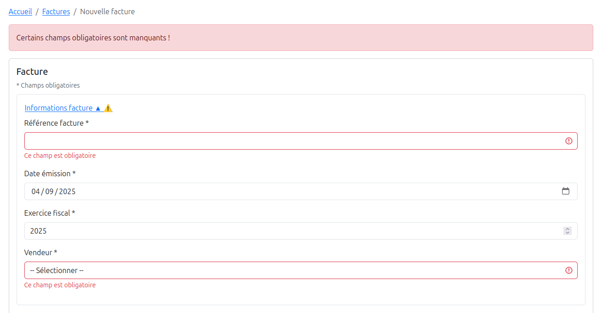

---

## 📌 Prochaines étapes

- Connecter le formulaire au backend pour persister factures et clients.  
- Gérer la distinction **création vs mise à jour** du client.  
- Ajouter des petits détails d’ergonomie (messages de confirmation, visuels).  
- Avancer ensuite sur les triggers/fonctions DB pour fiabiliser encore plus la logique.  

---

👉 Ça y est : **la base est posée** ! Le formulaire de facture est prêt à passer à la vitesse supérieure 🚀


\newpage

# Jour 33 – Consultation et mise à jour de facture 🧾🔄

Aujourd’hui, grosse avancée côté **workflow de la facture** : on ne crée plus seulement, on peut maintenant **consulter et mettre à jour** les factures existantes.  
Le formulaire devient un vrai outil complet, prêt à gérer le cycle de vie de la facture.

---

## ✅ Ce qu’on a fait

- **Chargement et affichage d’une facture existante** :  
  - Récupération complète des données (header, client, lignes, taxes, justificatifs).  
  - Mapping propre des clients selon leur type (particulier / entreprise FR / UE).  
  - Les champs s’affichent correctement et reflètent l’état actuel de la facture.  

- **Gestion du formulaire de mise à jour** :  
  - Les modifications sur chaque champ sont capturées et remontent proprement via `onChange`.  
  - Validation en temps réel et à la sortie du champ (`blur`) pour éviter les erreurs.  
  - Les justificatifs peuvent être consultés et leur liste actuelle est visible.  

- **Robustesse du formulaire** :  
  - Les données sont synchronisées avec l’état global de `InvoiceForm`.  
  - Les erreurs et validations restent cohérentes même en mode édition.  
  - Les composants sont réutilisables pour création et mise à jour sans duplication de logique.  

- **Préparation aux prochaines actions** :  
  - Consultation réussie → on peut maintenant envisager **modifier ou supprimer** la facture.  
  - L’architecture est prête pour gérer un bouton “Enregistrer les modifications” et la suppression.  

---

## 💪 Le résultat

- Une **interface de consultation complète** pour les factures.  
- Le formulaire est **bidirectionnel** : il peut afficher des données existantes et les modifier.  
- Les règles métier côté client sont correctement appliquées, sans perte d’information.  
- L’expérience utilisateur est fluide, pas de friction entre consultation et édition.  

---

## 📌 Prochaines étapes

- Ajouter le **mode modification** complet : bouton “Enregistrer les changements” avec mise à jour API.  
- Implémenter la **suppression de facture**, avec confirmation et rollback si nécessaire.  
- Affiner la gestion des justificatifs attachés lors de la mise à jour.  
- Ajouter éventuellement un **mode lecture seule** pour consultation simple, sans risque de modification accidentelle.  

---

👉 Objectif de la journée atteint : **le formulaire n’est plus seulement créatif, il devient consultable et modifiable** 🚀


\newpage

# Jour 34 – Validation date et optimisation workflow 🗓️🛠️

Aujourd’hui, focus sur **la robustesse et la validation des factures**, ainsi que l’exploration d’outils pour accélérer le développement.  

---

## ✅ Ce qu’on a fait

- **Validation de la date d’émission (`issue_date`)** :  
  - Création d’un validator dédié `issueDate.js`.  
  - Vérifie le format et l’oblige à être rempli, sans bloquer légalement si elle est antérieure ou postérieure à aujourd’hui.  
  - Intégration côté **`InvoiceHeader.jsx`**, avec mise à jour automatique de l’exercice fiscal (`fiscal_year`) au changement de date.  
  - Erreurs affichées en temps réel ou à la soumission, garantissant un formulaire plus robuste.  

- **Amélioration du formulaire `InvoiceForm`** :  
  - Contrôle centralisé de tous les champs obligatoires, y compris les nouveaux validators.  
  - Gestion fluide du **toucher des champs** et affichage des erreurs dynamiques.  
  - Validation renforcée pour le header, le client, les lignes et les justificatifs.  

- **Workflow backend / frontend** :  
  - Confirmation que la création et mise à jour des factures fonctionnent parfaitement.  
  - Gestion complète des lignes, taxes et attachments côté API.  
  - FormData prêt à être envoyé au backend avec tous les éléments correctement sérialisés.  

- **Intégration de Gemini Assist** :  
  - Testé et ajouté à mes outils de dev, directement dans **VS Code**.  
  - Plus intuitif et agréable que Copilot pour certains cas.  
  - Permet de gérer facilement des problèmes que je n’arrivais pas à résoudre avec GPT seul.  
  - Ajout du contexte très simple et pratique.  
  - Je reste attaché à mes échanges avec GPT, mais **combiner les deux** pour les situations difficiles est hyper utile.  

---

## 💪 Le résultat

- Un formulaire **encore plus fiable et sécurisé**, avec validation complète du header et de la date.  
- Possibilité de **modifier la date sans briser l’exercice fiscal**, avec retour utilisateur clair.  
- Backend et frontend complètement synchronisés pour les mises à jour de factures.  
- Une nouvelle corde à l’arc pour le dev : Gemini Assist intégré à VS Code, rapide et efficace pour les blocages.

---

## 📌 Prochaines étapes

- Ajouter éventuellement **des règles de validation plus fines** pour la date si nécessaire (ex: vérifications légales spécifiques par pays).  
- Étendre la logique de validation client pour couvrir tous les scénarios possibles.  
- Continuer à tester et combiner **GPT + Gemini** pour optimiser la productivité.  
- Avancer sur **mode lecture seule et suppression sécurisée** pour les factures existantes.  

---

👉 Objectif du jour atteint : **le formulaire est plus robuste, la validation du header et de la date fonctionne parfaitement, et l’outil Gemini Assist enrichit mon workflow** 🚀


\newpage

# Jour 35 – Propagation complète des données client et gestion des dumps 📬💾

Aujourd’hui, focus sur **la propagation complète des informations client dans les factures** et l’optimisation du workflow backend, ainsi que sur le travail sur le dump de la base de données.  

---

## ✅ Ce qu’on a fait

- **Propagation des emails et téléphones vers `invoice_client`** :  
  - Identification que le frontend envoie correctement `client_email` et `client_phone`.  
  - Ajustement du backend pour **insérer et mettre à jour** ces champs dans `invoice_client` lors de la création ou mise à jour d’une facture.  
  - Vérification que l’`invoice_client` reçoit maintenant toutes les données essentielles du client.  

- **Révision des fonctions d’insertion et de mise à jour client** :  
  - Consolidation des inserts et updates dans `invoice_client`.  
  - Prise en compte conditionnelle de l’insertion uniquement si des données client sont présentes.  
  - Gestion des identifiants légaux (SIRET / VAT / NAME) correctement selon le type de client.  

- **Frontend / Backend** :  
  - Confirmation que `InvoiceForm.jsx` et `InvoiceClient.jsx` envoient bien toutes les données nécessaires.  
  - FormData vérifié avec tous les champs client, y compris email et téléphone.  
  - Validation côté frontend conservée pour garantir la cohérence des données.  

- **Travail sur le dump de la base de données** :  
  - Sauvegarde complète des tables concernées (`clients`, `invoice_client`, etc.).  
  - Préparation pour restauration ou migration future.  
  - Vérification de l’intégrité des relations entre les tables après modifications du workflow.  

---

## 💪 Le résultat

- Les factures créées ou mises à jour contiennent désormais **toutes les informations du client**, y compris email et téléphone.  
- Backend et frontend sont **totalement synchronisés** pour la gestion des clients dans les factures.  
- Les dumps de la DB sont prêts et fiables pour toute restauration ou migration.  

---

## 📌 Prochaines étapes

- Ajouter la **gestion de `supply_date`** pour la table `invoice_client`.  
- Continuer à tester les scénarios de création et mise à jour avec différents types de clients.  
- Automatiser éventuellement la propagation de certains champs supplémentaires si nécessaire.  
- Vérifier et documenter le workflow complet pour que les dumps restent cohérents après chaque évolution du code.  

---

👉 Objectif du jour atteint : **les données client se propagent correctement, la table `invoice_client` est complète et les dumps de la DB sont sécurisés** 🚀


\newpage

# Jour 36 – Mise à jour des factures et gestion des justificatifs 📄🗂️

Aujourd’hui, focus sur **la mise à jour complète des factures**, la correction des assiettes de TVA, et la consolidation de la gestion des justificatifs pour garantir des noms de fichiers cohérents et uniques.  

---

## ✅ Ce qu’on a fait

- **Correction des mises à jour des lignes et des taxes** :  
  - Analyse des problèmes rencontrés lors de la mise à jour des assiettes de TVA.  
  - Implémentation d’une stratégie « supprimer puis réinsérer » pour les lignes et taxes, assurant **une cohérence totale** des montants calculés.  
  - Vérification que la mise à jour ne duplique plus les entrées existantes et que les relations avec `invoice_id` restent correctes.

- **Gestion des justificatifs (`attachments`)** :  
  - Normalisation des noms de fichiers avec format unique et simple : `invoiceId_attachmentId_nom_fichier`.  
  - Renommage automatique des fichiers sur le serveur pour éviter toute collision ou doublon.  
  - Mise en place d’une protection pour **ignorer les fichiers manquants** lors d’un nettoyage manuel, sans casser la transaction.  
  - Nettoyage automatique des fichiers temporaires restants après renommage, garantissant un répertoire d’uploads propre.  

- **Amélioration du workflow backend / frontend** :  
  - Consolidation des fonctions de création et mise à jour pour gérer **facture, client, lignes, taxes et justificatifs** dans une seule transaction.  
  - Gestion complète des données client et des relations avec les attachments.  
  - Tests de différents scénarios de mise à jour pour s’assurer que tout reste cohérent, même en cas de suppression manuelle de fichiers sur le serveur.  

- **Sécurité et robustesse** :  
  - Ajout de `try/catch` autour des opérations de fichiers pour éviter que des erreurs de type `ENOENT` interrompent la mise à jour.  
  - Garantit la continuité du processus même si certains fichiers ont été supprimés manuellement.

---

## 💪 Le résultat

- Mise à jour des factures **fiable et complète**, avec lignes, taxes et justificatifs synchronisés.  
- Les noms de fichiers des attachments sont maintenant **cohérents et uniques**, ce qui facilite la traçabilité et évite les collisions.  
- Backend sécurisé contre les erreurs liées aux fichiers manquants, et nettoyage automatique des fichiers temporaires.  
- Les assiettes de TVA sont correctement recalculées à chaque mise à jour, assurant la conformité comptable.

---

## 📌 Prochaines étapes

- Continuer à tester la mise à jour des justificatifs avec des scénarios variés (multiples fichiers, suppression manuelle, renommage).  
- Ajouter éventuellement un log ou une alerte si un fichier manque pour faciliter le debugging.  
- Vérifier la cohérence des attachments lors de la **restauration d’un dump de la DB**.  
- Poursuivre l’optimisation du workflow pour que toutes les modifications de factures soient atomiques et sécurisées.

---

👉 Objectif du jour atteint : **les factures se mettent à jour proprement, la gestion des TVA et des justificatifs est robuste, et les fichiers restent cohérents sur le serveur** 🚀


\newpage

# 🚀 Bilan après 40 heures : CRUD complet pour Client, Vendeur et Facture terminé !

Je viens de finaliser **tous les CRUD essentiels** dans mon projet eInvoicing, et c’est le moment de faire le point.

## 💡 Ce que j’ai construit et appris :

- **Backend solide** : architecture en couches (controller → service → model), transactions SQL avec BEGIN/COMMIT/ROLLBACK.
- **Frontend moderne** : React + Vite, structure par composants, gestion fine des états et validations.
- **Méthodologie et structuration** :
  - Journaux de bord détaillés, priorisation avec Trello, prise de recul sur l’architecture.
  - Décomposition du code avec des utilitaires pour valider, formater ou translater les données.
  - Refactoring progressif pour garder une base propre et maintenable.
- **Sécurité et bonnes pratiques** : mots de passe sécurisés, validation des données, réutilisation de bibliothèques éprouvées.
- **Expérience IA** : utilisation de Gemini intégré à VS Code pour débloquer certains points, avec une préférence pour GPT pour sa rapidité et le ton plus fluide.

## ✅ Le CRUD fonctionne pour toutes les entités : Client, Vendeur et Facture.
- Chaque entité est totalement manipulable depuis le frontend, avec validations et retours clairs.
- **Ce n’est pas une simple gestion CRUD** :  
  - Tous les **champs obligatoires minimaux** d’une facture sont contrôlés (en-tête, lignes, justificatifs).  
  - La **qualité des données** est garantie : validité des **SIRET**, formats corrects pour **IBAN, BIC, emails, numéros de téléphone**…  
  - Les données sont déjà **prêtes pour une exploitation réglementaire** dans le cadre de la facturation électronique.

## 🌱 Prochaines étapes et axes d’amélioration :

- Authentification pour le compte vendeur.
- Visionneuse pour consulter les attachments (PDF, images…).
- Génération **Factur-X** : PDF/A-3 + XML structuré, conforme à la réglementation.
- Communication avec un PDP pour gérer le cycle de vie des factures.
- Génération automatique du justificatif principal PDF.
- Tout le travail invisible : tests unitaires et d’intégration, logs, monitoring, pipelines CI/CD.

## 🔧 Points d’amélioration identifiés :

- Validation et gestion d’erreurs avancée (Joi/Zod).
- Optimisations frontend pour une gestion plus efficace des données (ex: React Query).
- Pipelines CI/CD pour déploiement automatique.

## 💭 Ce que je retiens :

Pour un projet lancé par un développeur junior sur React, la base est **solide**.  
J’ai énormément appris en structurant, refactorant et décomposant mon code.  
Chaque étape suivante ajoutera de la valeur **métier** réelle et me permettra de progresser encore davantage.

📂 Mon appli est en licence MIT sur GitHub pour ceux que ça intéresse, et je continue à l’améliorer !


\newpage

# Jour 38 – Visionneuse PDF et page de consultation des factures 🖥️📄

Aujourd’hui, focus sur **la consultation des factures côté frontend**, avec intégration d’une visionneuse PDF et amélioration de l’UX pour la page `InvoiceView`.

---

## ✅ Ce qu’on a fait

- **Page `InvoiceView` opérationnelle** :  
  - Récupération de la facture via `useParams` et `fetchInvoice`, avec récupération des informations client via `fetchClient`.  
  - Mapping des données client pour `InvoiceForm`.  
  - Fallback “Chargement…” pour améliorer l’expérience utilisateur.

- **Intégration de la visionneuse PDF** :  
  - Utilisation de **`react-pdf`** pour afficher les PDF sur une page test, avec scroll et navigation.  
  - Mise en place d’un layout en deux colonnes : formulaire à gauche, PDF à droite, chacune occupant 50 % de la largeur.  
  - Scroll vertical indépendant pour le formulaire et le PDF, avec hauteur `100vh`.  
  - Suppression des labels et boutons inutiles dans `InvoiceForm` lorsqu’on est en **lecture seule** (`readOnly` / `hideLabelsInView`).

- **Tests et corrections** :  
  - Vérification du rendu sur plusieurs écrans et résolutions.  
  - Test de chargement du PDF et fallback si le fichier est absent.  
  - Ajustement des flex et padding pour que formulaire et visionneuse soient parfaitement alignés et exploitent tout l’espace disponible.

- **Réutilisabilité** :  
  - `InvoiceForm` et `InvoiceLines` fonctionnent maintenant **en mode édition ou lecture seule**, avec ou sans labels.  
  - `InputField` supporte `hideLabel` et lecture seule.  
  - Boutons de suppression et d’ajout conditionnels selon le mode.

---

## 💪 Le résultat

- Page de consultation des factures **fluide et ergonomique**.  
- Formulaire côté gauche lisible, clair, avec suppression des éléments non nécessaires.  
- PDF affiché côté droit, scrollable et exploitant toute la hauteur.  
- Test de `react-pdf` réussi sur page test : la visionneuse fonctionne parfaitement.

---

## 📌 Prochaines étapes

- **Afficher les PDF réels des factures** dans la visionneuse sur `InvoiceView` en se basant sur le test réussi.  
- Ajouter navigation rapide entre factures et zoom / téléchargement dans `PdfViewer`.  
- Supporter d’autres types de justificatifs (images, Excel…).  
- Ajouter tests unitaires et d’intégration pour `InvoiceView` et `PdfViewer`.  
- Préparer la génération dynamique de **Factur-X** pour consultation complète PDF + XML.

---

👉 Objectif du jour atteint : **la page de consultation est prête pour intégrer les PDF réels et l’UX est propre et cohérente** 🚀


\newpage

# Jour 39 – Visionneuse PDF et gestion des justificatifs 🖥️📄

Aujourd’hui, focus sur la consultation des factures avec intégration des PDF réels depuis le backend et la stabilisation du composant **PdfViewer**.

## ✅ Ce qu’on a fait

- **Récupération dynamique des PDF** :  
  - Les URLs sont générées côté backend via `VITE_API_URL`.  
  - Sélection automatique du PDF principal (`attachment_type === "main"`).  
  - Support pour plusieurs pièces jointes avec onglets pour naviguer entre elles.

- **Visionneuse PDF améliorée** :  
  - Navigation page par page avec boutons de contrôle.  
  - Zoom responsive et ajustable en pourcentage.  
  - Téléchargement dans un nouvel onglet avec nom de fichier dynamique basé sur l’ID de la facture.
  
  

- **Interface et UX** :  
  - Breadcrumb au-dessus du formulaire et du PDF pour cohérence.  
  - Mise en page en deux colonnes : formulaire à gauche, PDF à droite avec scroll indépendant.  
  - Onglets pour accéder aux autres justificatifs et notes de crédit.

## 💪 Résultat

- Rendu PDF fluide et responsive, directement depuis le backend.  
- InvoiceView affiche correctement formulaire et PDF côte à côte, navigation et zoom opérationnels.  
- Justificatifs multiples accessibles via des onglets clairs.

## 📌 Prochaines étapes

- Génération **Factur-X** : PDF/A-3 + XML structuré, conforme à la réglementation.

👉 **Objectif du jour atteint** : PDF dynamique fonctionnel, navigation, zoom et téléchargement opérationnels, setup prêt pour les justificatifs multiples 🚀


\newpage

# Jour 40 – Finalisation du carousel LinkedIn 📊✨

Aujourd’hui, focus sur **la mise en forme et la finalisation du carousel eInvoicing dans Gamma** pour partager le projet et l’apprentissage web/IA.  

---

## ✅ Ce qu’on a fait

- **Finalisation des slides dans Gamma** :  
  - Slide 1 : titre accrocheur et personnel (*“Je crée eInvoicing pour apprendre, explorer et expérimenter le web et l’IA”*), mockup de l’app sur laptop/tablette, fond tech discret.  
  - Slide 2 : contexte personnel enrichi, emojis ajoutés pour rendre le storytelling plus vivant.  
  - Slides suivantes : fonctionnalités CRUD, formulaires, UX fluide, composants réutilisables, fonctionnalités back-end avancées et mention du GitHub public.  

- **Travail sur la cohérence visuelle** :  
  - Emploi d’emojis pour rendre chaque point plus lisible et engageant.  
  - Indications de design respectées : logos tech, couleurs harmonisées, mockups intégrés.  

- **Texte et phrasing LinkedIn** :  
  - Reformulation des phrases pour rester **personnel, pro et naturel**.  
  - Listes et bullets claires pour faciliter la lecture et maximiser l’impact visuel.  

---

## 💪 Résultat

- Carousel **complet et prêt à publier**, structuré pour LinkedIn.  
- Contenu vivant, professionnel et fidèle à ton expérience.  
- Slide 1 et 2 très personnelles, slides suivantes détaillent clairement les fonctionnalités et l’avancement technique.  


---

## 📌 Prochaines étapes

- Publier le carousel sur LinkedIn avec le texte d’accompagnement et le lien GitHub public.  
- Continuer à documenter les **avancées quotidiennes** avec captures d’écran ou exemples concrets.  
- Préparer la suite : authentification vendeur, génération Factur-X dynamique et communication avec PDP.  

---

👉 Objectif du jour atteint : **carousel LinkedIn finalisé, prêt à partager ton projet et ton apprentissage web/IA de manière professionnelle et personnelle 🚀**


\newpage

# Jour 41 – Premiers pas dans la construction du Factur‑X 📝💻

Aujourd’hui, focus sur **la préparation de la génération d’un fichier Factur‑X** et la mise en place de tous les outils nécessaires pour tester et valider le XML.

---

## ✅ Ce qu’on a fait

- **Création d’un script JavaScript** :  
  - Génération d’un fichier XML de test au format Factur‑X.  
  - Structure minimaliste mais conforme pour pouvoir expérimenter avec des données fictives.

- **Récupération des schémas XSD officiels** :  
  - Téléchargement depuis [fnfe-mpe.org](https://fnfe-mpe.org).  
  - Focus sur le profil **BASIC** pour simplifier les tests initiaux.

- **Installation et utilisation de `xmllint`** :  
  - Contrôles de validation en ligne de commande.  
  - Commande utilisée :  
    ```bash
    xmllint --noout --schema Factur-X_1.07.3_BASIC.xsd facturx.xml
    ```
  - Permet de vérifier que le XML généré est conforme au schéma officiel.

- **Tests de validation** :  
  - Plusieurs itérations pour corriger la structure et aligner le XML sur le XSD.  
  - Ajustement des éléments obligatoires et de l’ordre attendu par le schéma.

---

## 💪 Résultat

- Script **fonctionnel pour générer un Factur‑X de test**.  
- XML conforme au profil BASIC, validé avec `xmllint`.  
- Base solide pour ensuite intégrer des données réelles depuis ton application.

---

## 📌 Prochaines étapes

- Commencer à **injecter les données dynamiques** dans le script JS pour produire le Factur‑X réel.  
- Préparer l’export **PDF + XML** pour tests de bout en bout.  
- Planifier la **validation automatisée** côté backend à chaque génération de facture.

---

👉 Objectif du jour atteint : **premier Factur‑X minimal généré et validé, prêt à servir de modèle pour les prochaines factures 🚀**


\newpage

# Jour 42 – Génération d’un Factur‑X à partir des données réelles 📝💻

Aujourd’hui, focus sur **la génération d’un XML Factur‑X à partir des données de la facture réelle** et la validation avancée avec les outils officiels.

---

## ✅ Ce qu’on a fait

- **Adaptation du script de génération** :  
  - Injection des données réelles du front dans le XML (vendeur, client, lignes, taxes, totaux).  
  - Ajout du bloc **`InvoiceReferencedDocument`** pour les factures précédentes.  
  - Mise en conformité avec le schéma XSD officiel pour éviter les erreurs **BR‑CO‑25** et **BR‑S‑02**.

- **Gestion des champs obligatoires** :  
  - Vérification que le **numéro de TVA du vendeur** est toujours présent pour les lignes à TVA standard.  
  - Bloc **`SpecifiedTradePaymentTerms`** ajouté pour respecter la règle sur la date d’échéance.

- **Validation du XML** :  
  - Première passe avec `xmllint` pour vérifier la conformité avec le XSD **Factur-X_1.07.3_BASIC**.  
    ```bash
    xmllint --noout --schema xsd/Factur-X_1.07.3_BASIC.xsd 168.xml
    ```
  - Validation finale sur le **service officiel FNFE‑MPE** pour s’assurer que toutes les règles Schematron sont respectées :  
    [https://services.fnfe-mpe.org/account/home](https://services.fnfe-mpe.org/account/home)

- **Corrections itératives** :  
  - Ajustement des noms d’éléments et de l’ordre pour correspondre exactement aux attentes du schéma.  
  - Gestion des erreurs liées aux dates, aux références de factures et aux identifiants fiscaux.

---

## 💪 Résultat

- **XML Factur‑X généré à partir de vraies données**, conforme au profil BASIC.  
- Validé à la fois **en local** (`xmllint`) et **en ligne** (FNFE‑MPE).  
- Base solide pour la **prochaine étape** : combiner le XML avec le PDF pour obtenir un **PDF/A‑3 au format Factur‑X**.

---

## 📌 Prochaines étapes

- Intégrer le **PDF correspondant à la facture** pour générer un PDF/A‑3 complet.  
- Automatiser la **génération et la validation côté backend** pour chaque facture émise.  
- Préparer la **saisie obligatoire du numéro de TVA vendeur** dans la fiche pour éviter tout rejet de Factur‑X.

---

👉 Objectif du jour atteint : **un Factur‑X réel généré et validé, prêt pour être intégré au PDF/A‑3 🚀**


\newpage

# Jour 43 – Intégration PDF et préparation PDF/A‑3 📝💻

Aujourd’hui, focus sur **l’intégration du XML Factur‑X dans le PDF de la facture et les préparatifs pour la conformité PDF/A‑3**.

---

## ✅ Ce qu’on a fait

- **Création d’un générateur PDF “safe”** :  
  - Script `pdf-generator.js` capable de charger un PDF existant.  
  - Attachement automatique du **XML Factur‑X**.  
  - Gestion des **fichiers supplémentaires** attachés à la facture (optionnel).  

- **Gestion des métadonnées PDF** :  
  - Titre et sujet définis via `pdfDoc.setTitle()` et `pdfDoc.setSubject()`.  
  - Préparation pour ajouter **XMP et OutputIntent** plus tard pour la conformité PDF/A‑3.

- **Tests avec pdf-lib** :  
  - Validation que les fichiers étaient bien attachés.  
  - Détection des erreurs initiales liées à des méthodes inexistantes (`embedXMPMetadata`) ou à des objets non conformes (`sizeInBytes`).  
  - Réflexion sur les limitations de pdf-lib pour atteindre le PDF/A‑3 complet.

- **Plan pour la conformité PDF/A‑3** :  
  - Ghostscript identifié comme **outil le plus simple et robuste** pour convertir un PDF standard + attachments en PDF/A‑3.  
  - Clarification : Ghostscript reste **installé côté système**, pas besoin de le copier dans `backend`.  
  - Objectif : automatiser la génération PDF/A‑3 à partir du PDF existant et du XML Factur‑X.

---

## 💪 Résultat

- **PDF de la facture prêt** à recevoir le XML Factur‑X et les éventuels autres attachments.  
- **Script backend opérationnel** pour créer un PDF “préparé” à la conversion PDF/A‑3.  
- Vue claire sur les **prochaines étapes pour la conformité totale PDF/A‑3**.
  
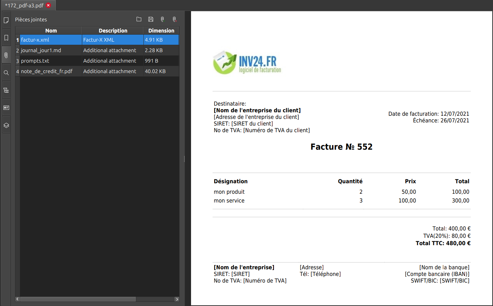

---

## 📌 Prochaines étapes

- Ajouter **OutputIntent et XMP** via Ghostscript pour obtenir un PDF/A‑3 conforme.  
- Tester la **conversion complète avec Ghostscript** sur une facture réelle.  
- Valider le PDF/A‑3 généré avec des outils officiels pour corriger les derniers avertissements ou erreurs.  
- Automatiser la **chaîne PDF + Factur‑X + conversion PDF/A‑3** côté backend pour chaque facture.

---

👉 Objectif du jour atteint : **PDF prêt pour PDF/A‑3, XML attaché, structure backend opérationnelle 🚀**


\newpage

# Jour 44 – Mise en place des métadonnées XMP pour PDF/A‑3 📝💻

Aujourd’hui, focus sur **l’amélioration des métadonnées XMP dans le PDF afin de tendre vers une meilleure conformité PDF/A‑3** et corriger les erreurs détectées lors des validations.

---

## ✅ Ce qu’on a fait

- **Analyse des erreurs XMP** :  
  - Identification des **tags obligatoires manquants** :  
    - `DocumentType`  
    - `DocumentFileName`  
    - `Version`  
    - `ConformanceLevel`  
  - Ces champs sont requis par le standard PDF/A‑3 et doivent être présents dans le XMP pour chaque document Factur‑X.

- **Préparation du script d’injection XMP** :  
  - Fonction `generateFilledXmp()` adaptée pour générer les tags manquants.  
  - Chaque PDF peut désormais recevoir un **XMP complet**, incluant :  
    - `fx:DocumentType` = type du document (ex : facture)  
    - `fx:DocumentFileName` = nom du fichier PDF  
    - `fx:Version` = version Factur‑X (ex : 1.0)  
    - `fx:ConformanceLevel` = niveau de conformité (ex : BASIC, EXTENDED)  

- **Integration backend** :  
  - Le PDF “préparé” est chargé, les attachments sont ajoutés, puis le XMP enrichi est injecté via `injectXmpIntoPdf()`.  
  - Gestion des fichiers temporaires pour éviter les résidus et permettre une injection propre et répétable.

- **Observation des limitations actuelles** :  
  - Les erreurs de type “DeviceGray / DeviceRGB” ou “AFRelationship manquant” restent, car pdf-lib ne gère pas encore toutes les contraintes PDF/A‑3.  
  - Ghostscript ou un outil spécialisé sera nécessaire pour finaliser la conformité totale.

---

## 💪 Résultat

- **XMP enrichi** dans le PDF avec les tags obligatoires pour PDF/A‑3.  
- Les fichiers XML et autres attachments restent attachés correctement.  
- PDF prêt pour un **post-traitement PDF/A‑3** et vérification ISO sans erreurs XMP critiques.

---

## 📌 Prochaines étapes

- Ajouter **OutputIntent et profils ICC corrects** pour résoudre les erreurs liées aux couleurs.  
- Corriger les **AFRelationship** et les dictionnaires des fichiers attachés pour PDF/A‑3 complet.  
- Tester le flux complet PDF + XMP + attachments + conversion PDF/A‑3 sur un exemple réel.  
- Automatiser la génération PDF/A‑3 finale côté backend pour chaque facture.

---

👉 Objectif du jour atteint : **XMP complet et tags obligatoires ajoutés 🚀, base solide pour la conformité PDF/A‑3**


\newpage

# Jour 45 – Génération et téléchargement de factures PDF depuis la liste 💌📄

Aujourd’hui, on a plongé dans **la création de PDF à partir des données de facture**, et surtout dans la manière de les **rendre disponibles à l’utilisateur directement depuis la liste de factures**. Spoiler : c’était un peu galère, mais on a trouvé le bon flux ! 😅

---

## ✅ Ce qu’on a fait

- **Création de la facture PDF côté backend** :  
  - On a écrit une fonction `generateInvoicePdf(invoice)` qui prend les données d’une facture et génère un PDF avec `pdf-lib`.  
  - Pour l’instant, le PDF contient le **numéro de facture** et le **nom du client**, mais on peut facilement compléter avec :  
    - Adresse client et vendeur  
    - Lignes de produits/services  
    - Montants HT, TVA et TTC  
    - Numéro de commande ou contrat  
  - Le PDF est sauvegardé dans `src/uploads/pdf` avec un nom standard `invoiceId_invoice.pdf`.

- **Exposition via API** :  
  - Une route GET `/api/invoices/:id/generate-pdf` qui :  
    1. Récupère la facture depuis la base.  
    2. Génère le PDF sur le serveur.  
    3. Retourne un JSON avec l’URL publique du PDF (`/uploads/pdf/175_invoice.pdf`).  

- **Téléchargement côté frontend** :  
  - Dans la liste des factures, on a ajouté un bouton 📄 à côté du stylo ✏️ et de l’œil 👁️.  
  - Quand l’utilisateur clique dessus :  
    1. Appel API pour générer le PDF.  
    2. Récupération du fichier en tant que blob via `fetch`.  
    3. Création d’un lien temporaire et déclenchement automatique du téléchargement.  

- **Gestion des subtilités techniques** :  
  - Attention aux **chemins relatifs** : Vite (port 5173) et le backend (port 3000) ne sont pas la même origine.  
  - Il fallait servir le dossier `/uploads` via Express pour que le PDF soit accessible depuis le navigateur.  
  - L’usage de `URL.createObjectURL(blob)` permet de télécharger le fichier côté client sans problème de permission.  

---

## 💪 Résultat

- Bouton 📄 **fonctionnel dans la liste de factures** : génération + téléchargement instantané.  
- Les fichiers PDF sont **ouverts correctement** et contiennent déjà quelques données clés.  
- Backend propre : chaque PDF généré est stocké sur le serveur avec un chemin public.  

---

## 📌 Prochaines étapes

- **Compléter le contenu du PDF** pour inclure toutes les informations obligatoires d’une facture :  
  - Coordonnées complètes client / vendeur  
  - Détail des lignes, taxes et totaux  
  - Références commande / contrat  
  - Mentions légales ou notes éventuelles  
- Ajouter éventuellement un **post-traitement PDF/A‑3** pour garantir la conformité Factur-X comme on a fait hier.  
- Améliorer le **UX** : loader pendant la génération, message d’erreur friendly si le PDF ne peut pas être créé.  

---

👉 Objectif du jour atteint : **un bouton PDF qui fonctionne vraiment 🚀, génération côté serveur et téléchargement côté client prêt à l’usage**


\newpage

# Jour 46 – Mise en forme avancée des factures PDF ✨📄

Aujourd’hui, on a travaillé sur **l’amélioration du rendu et de la lisibilité des PDF de factures** générés côté backend. Objectif : que la facture soit claire, complète et professionnelle dès sa génération.  

---

## ✅ Ce qu’on a fait

- **Tableau des lignes détaillé** :  
  - Ajout de colonnes **Qté, Prix unitaire, Taux TVA, HT, TVA et TTC**.  
  - Les montants sont maintenant affichés avec le **symbole €**.  
  - Les en-têtes sont restés dans le cadre et le tableau est compact pour une meilleure lisibilité.

- **Affichage des informations vendeur et client** :  
  - Les **noms légaux** (`legal_name`) sont en **gras**.  
  - Le **SIRET** et le **numéro de TVA** apparaissent uniquement si disponibles et valides (14 chiffres pour le SIRET).  
  - Positionnement soigné : le bloc vendeur est aligné **à la hauteur du haut du logo**, côté droit.

- **Logo dans le PDF** :  
  - Placement **en haut à gauche**, taille **2.5× la taille initiale**.  
  - La présence du logo ajuste maintenant correctement la position des blocs vendeur et client.  

- **Totaux** :  
  - Boîte compacte pour **Sous-total, Total TVA, Total TTC** avec montants centrés et € affiché.  
  - Alignement soigné à droite, visuellement clair et élégant.

- **Code propre et robuste** :  
  - Gestion des fichiers avec `fs` et `path`.  
  - Vérification que le logo existe avant de l’afficher.  
  - Calcul du ratio pour ne pas dépasser la taille maximale définie pour le logo.

---

## 💪 Résultat

- Facture PDF **esthétiquement plus professionnelle**.  
- Les informations clés sont visibles immédiatement : nom du vendeur, client, SIRET, TVA, lignes, montants et totaux.  
- Backend robuste : le PDF est sauvegardé avec un nom standard et prêt pour téléchargement.

---

## 📌 Prochaines étapes

- **Compléter le formulaire vendeur** pour ajouter toutes les informations nécessaires à la facture (adresse complète, email, téléphone, mentions légales supplémentaires).  
- **Mettre à jour la génération PDF** pour inclure ces nouvelles informations automatiquement.  
- Eventuellement : ajuster le style du tableau ou ajouter des notes supplémentaires si besoin.  

---

👉 Objectif du jour atteint : **PDF de facture généré avec logo XXL, tableau détaillé et totaux clairs, prêt à l’usage côté utilisateur** 🚀


\newpage

# Jour 47 – Gestion dynamique du vendeur et génération PDF de factures 🚀📄

Ce matin, on a travaillé sur **l’amélioration de la logique côté frontend et backend pour que les factures générées soient complètes, lisibles et directement exploitables**.  

---

## ✅ Ce qu’on a fait

### 1. Sélection et chargement du vendeur par défaut
- Utilisation d’un **`useEffect`** pour **charger automatiquement le vendeur par défaut** depuis la liste récupérée via API.  
- Stockage des informations du vendeur dans **`invoiceData`**, avec mise à jour du `header` :  
  - `payment_terms`  
  - `payment_method`  
  - `seller_id`  
- Le bloc `seller` contient toutes les informations légales : **nom, adresse, SIRET, TVA, email, téléphone, etc.**  
- Ajout de **logs de vérification** pour confirmer que le vendeur sélectionné est bien celui attendu.  

### 2. Gestion des méthodes et conditions de paiement
- Remplacement des valeurs brutes (`bank_transfer`, `upon_receipt`, etc.) par **leurs libellés lisibles en français** grâce à une correspondance avec des options constantes.  
- Affichage dynamique dans le PDF avec **traduction côté backend** pour que la facture finale soit compréhensible par le client.  

### 3. Génération PDF améliorée
- Création d’un **PDF via `pdf-lib`**, avec :  
  - **Logo XXL** en haut à gauche (taille multipliée par 2.5).  
  - **Bloc vendeur aligné avec le haut du logo**, côté droit.  
  - **Bloc client** sous le logo, avec nom en gras et SIRET/TVA si disponibles.  
- Tableau détaillé des lignes :  
  - Colonnes : **Description, Qté, PU, Taux TVA, HT, TVA, TTC**.  
  - Les montants incluent le **symbole €**.  
  - Style compact et bordures visibles pour une lisibilité optimale.  
- Totaux regroupés dans un **cadre à droite**, incluant :  
  - Sous-total  
  - Total TVA  
  - Total TTC  
- Ajout des informations de paiement sous le tableau :  
  - Moyen de paiement traduit (`Virement bancaire`, `Chèque`, etc.)  
  - Conditions de paiement traduites (`À réception de la marchandise`, etc.)  
- Mentions additionnelles (CGV et formule de politesse) :  
  - Texte **wrappé** pour éviter de sortir de la page.  
  - Gestion automatique de **saut de page** si le texte dépasse la fin de la page.  
- Format des dates en **français** (`jj/mm/aaaa`) pour `issue_date` et `supply_date`.

### 4. Code robuste et maintenable
- Fonction **`wrapText`** pour découper les lignes trop longues.  
- Vérification de l’existence du logo avant de l’afficher, avec **fallback visuel**.  
- PDF sauvegardé dans un **dossier uploads standard** (`uploads/pdf`) avec un nom clair basé sur l’ID de la facture.  

---

## 💪 Résultat
- Facture PDF **complète et professionnelle**, prête à être envoyée au client.  
- Backend et frontend parfaitement synchronisés :  
  - Le vendeur par défaut est automatiquement sélectionné.  
  - Les informations de paiement et mentions sont affichées correctement.  
  - Les dates sont au format français et lisibles.  
- Gestion intelligente des textes longs et des sauts de page pour les mentions additionnelles.  
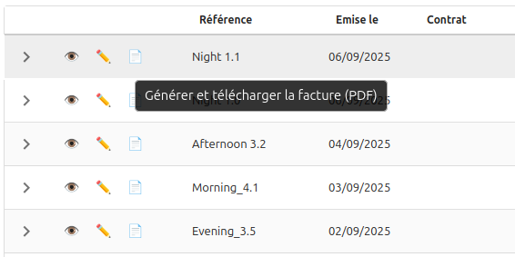
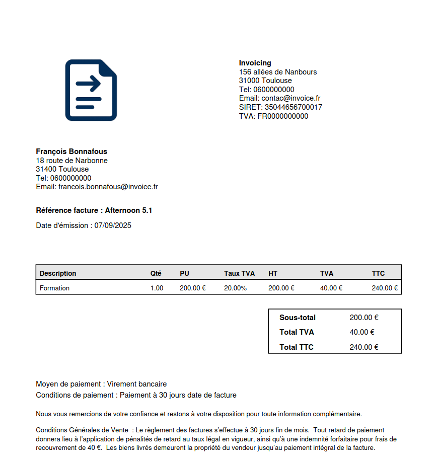

---

## 📌 Prochaines étapes
- **Valider le PDF/A3** en conformité avec la norme ISO.  
- **Gestion des API sortantes** pour l’envoi de factures.  
- **Gestion des API entrantes** pour le cycle de vie complet des factures.  
- Éventuellement améliorer le style du tableau ou intégrer des logos supplémentaires côté client.  

---

👉 Objectif de la session atteint : **PDF de facture généré automatiquement, clair, complet et conforme, avec vendeur, client, totaux, mentions et paiements correctement affichés** ✨📄


\newpage

# 📝 Jour 48– Bilan de la semaine : mon aventure Factur‑X et PDF/A‑3 🚀📄

Quand j’ai commencé la semaine, mon objectif était simple : **avancer sur Factur‑X et PDF/A‑3**. Mais je ne savais pas vraiment jusqu’où j’irais. Ces sujets sont importants, **réglementaires et garantissent la conformité**, et travailler avec des PDF… ça reste toujours un peu délicat.  

---

## Jour 41‑42 – Premiers Factur‑X

- J’ai commencé par générer des **XML de test**, minimalistes mais conformes, histoire de mettre un pied dans l’univers Factur‑X.  
- Puis, j’ai injecté **les vraies données de facture** : vendeur, client, lignes, taxes, totaux, références aux factures précédentes.  
- Validation réussie **en local avec xmllint** et sur le **service FNFE-MPE**, ce qui m’a vraiment rassuré : les données sont conformes, on tient le bon bout !  

💡 Sentiment : **super content d’avoir réussi à générer un Factur‑X valide**, c’est un vrai gage de qualité côté métier.

---

## Jour 43‑44 – Exploration PDF/A‑3

- Création de PDF pouvant recevoir **Factur‑X et pièces complémentaires**.  
- Injection des **métadonnées XMP** pour tendre vers la conformité PDF/A‑3.  
- Ghostscript identifié comme solution pour la conversion finale.  

😅 Réalité : la partie ISO est technique et un peu contraignante. Les métadonnées PDF sont un vrai casse-tête, et le validateur FNFE était down quelques jours. Je me suis donc mis en **stand-by sur cette partie**, car le coût temps / valeur n’est pas très avantageux pour le métier.  

💡 Apprentissage : manipuler les PDF, attacher des fichiers et préparer les métadonnées m’a beaucoup appris sur la structure interne des PDF, même si ce n’est pas très fun côté métier.

---

## Jour 45‑47 – Génération PDF “ready to use”

- Création d’un **bouton PDF** dans la liste des factures : un clic et le PDF se génère et se télécharge instantanément.  
- PDF complet avec :  
  - Logo XXL  
  - Bloc vendeur/client aligné et clair  
  - Tableau détaillé des lignes, totaux, symbole €  
  - Méthodes et conditions de paiement traduites  
  - Mentions légales et formule de politesse, texte wrap automatique et gestion des sauts de page  

🚀 Résultat : l’émetteur **n’a plus besoin d’un justificatif papier**, tout est généré depuis l’application, avec toutes les informations réglementaires.  

💡 Sentiment : j’ai trouvé ce sujet **très motivant**. ChatGPT a été un allié incroyable : en un prompt, il génère le squelette, et en quelques ajustements, on obtient un PDF avec un rendu super sympa. La vitesse à laquelle on avance est impressionnante.  

---

## Les petites anecdotes IA

- J’ai un peu oublié **Gemini** cette semaine. Les IA intégrées à VSCode sont souvent lentes et froides.  
- GPT reste **toujours réactif et motivant**, même si parfois il répond un peu vite ou approximativement. L’ambiance est différente, c’est plus agréable de coder avec lui.  

---

## Ce que ça veut dire côté métier

- Les factures sont désormais **complètes, lisibles et conformes**, prêtes à être envoyées.  
- Les équipes peuvent **générer et envoyer les PDF en un clic**, sans manipulation externe.  
- On prépare la voie pour la **dématérialisation complète**, Factur‑X + PDF/A‑3 automatisés, avec cycle de vie géré via API.

---

## 🔮 La suite

- Finaliser la **conformité PDF/A‑3 ISO** dès que le validateur FNFE est disponible.  
- Compléter les informations vendeur pour la **conformité Factur‑X à 100 %**.  
- Déployer les **API pour envoi et réception** des factures.  
- Optimiser l’UX : loader, messages friendly, téléchargement rapide.

---

👉 Bilan de la semaine : je suis parti d’un **objectif incertain** et je termine avec des **Factur‑X validés et des PDF professionnels générés automatiquement**, tout en ayant appris énormément sur la manipulation de PDF, la conformité réglementaire et l’efficacité de ChatGPT comme allié technique. Une vraie semaine **productive, motivante et fun** ! ✨📄


\newpage

# Jour 49 – Génération de justificatif de facture PDF à la création 🚀📄

Aujourd'hui, j'ai travaillé sur **l'optimisation de la création de facture** afin que le **justificatif de facture PDF** puisse être généré **immédiatement lors de la création**, sans avoir besoin d'un justificatif préalable.

---

## ✅ Ce qu’on a fait

### 1. Génération instantanée du justificatif de facture PDF

* Mise en place d'une logique backend pour **calculer automatiquement les montants, totaux et taxes** dès que les lignes sont saisies.
* Le **justificatif de facture PDF** inclut :

  * Bloc vendeur : nom, adresse, SIRET, TVA, email, téléphone
  * Bloc client : nom, adresse, SIRET/TVA si disponibles
  * Tableau des lignes : Description, Qté, PU, Taux TVA, HT, TVA, TTC
  * Totaux récapitulés : Sous-total, Total TVA, Total TTC
  * Informations de paiement : libellés lisibles pour moyen et conditions de paiement
  * Mentions additionnelles : CGV et formule de politesse, texte wrappé avec gestion des sauts de page

### 2. Création indépendante du justificatif

* Il est désormais possible de **créer une facture sans justificatif PDF préalable**.
* Le justificatif est **produit automatiquement en même temps que la facture**, simplifiant le workflow.
  


### 3. Synchronisation frontend/backend

* Les données saisies côté frontend sont **immédiatement reflétées dans le PDF**.
* Les montants, totaux et informations légales sont **calculés et affichés automatiquement**.

### 4. Avantages métier

* Simplification du processus de création et d'envoi de factures.
* Gain de temps et réduction des erreurs liées à la manipulation manuelle des justificatifs.
* Les équipes peuvent générer un **justificatif de facture PDF complet et conforme** en un seul clic.

---

## 📌 Prochaines étapes

* Finaliser la **conformité PDF/A‑3 ISO** dès que le validateur FNFE est disponible.  
* **Authentification et gestion des utilisateurs** : Mettre en place un système de comptes pour sécuriser l'accès aux données par vendeur.
* Déployer les **API pour envoi et réception** des factures.  
* Optimiser l’UX : loader, messages friendly, téléchargement rapide.

---

👉 Bilan de la journée : mise en place réussie de la **génération automatique du justificatif de facture PDF**, rendant le processus de création **autonome, rapide et conforme**. ✨📄


\newpage

# Jour 50 – Anonymisation des données et documentation revue 🔒📝

Aujourd’hui, j’ai pris le temps de travailler sur un point essentiel mais parfois négligé : **la gestion et l’anonymisation des données** dans mon projet eInvoicing.  

---

## ✅ Ce qu’on a fait

### 1. Anonymisation de la base de données
* Revue complète de la **DB vendeur et client** pour remplacer toutes les références réelles par des données **fictives mais réalistes**.  
* Création d’un **jeu de données standardisé** (vendeur et clients anonymisés) que je pourrai réutiliser dans les tests et les copies d’écran.  
* Objectif : garantir qu’aucune information sensible ou traçable n’apparaisse dans les dépôts GitHub ou dans mes présentations.

### 2. Nettoyage et mise à jour de la documentation
* Vérification des **captures d’écran déjà présentes** dans la documentation `.story`.  
* Suppression/remplacement des images où apparaissaient encore des données réelles.  
* Nouvelle série de screenshots propres et anonymisés, pour un rendu toujours **réaliste mais sécurisé**.

### 3. Importance métier et technique
* L’anonymisation est un **enjeu important** dans le cadre de la conformité réglementaire.  
* Elle garantit :  
  * le **respect des données personnelles et professionnelles**,  
  * la **sécurité des dépôts publics** comme GitHub.  

---

👉 Bilan de la journée : une étape importante franchie avec la **mise en conformité documentaire** et l’**anonymisation des données**. Cela renforce la crédibilité du projet et pose des bases solides pour la suite. 🚀🔒  


\newpage

# Jour 51 – Validation améliorée des champs email, SIRET, code postal et téléphone 🛠️✅

Aujourd'hui, j'ai travaillé sur l'amélioration de la validation des informations critiques pour les clients et vendeurs, notamment email, SIRET, code postal et téléphone, afin d'assurer une meilleure qualité des données avant l'enregistrement.

---

## ✅ Ce qu’on a fait

### 1. Vérification SIRET côté frontend et backend

- Mise en place d'une logique **asynchrone côté frontend** pour vérifier que le SIRET n’est pas déjà utilisé par un autre client, tout en permettant de modifier le SIRET du client courant sans bloquer l’enregistrement.
- Le **backend** accepte désormais un paramètre `clientId` pour exclure le client en cours lors du contrôle d’un SIRET existant.
- **Résultat** : plus d’erreurs bloquantes injustifiées, et un message clair si le SIRET est déjà utilisé par un autre client.

### 2. Validation des emails

- Les champs email sont maintenant vérifiés pour leur format, et un **message d’erreur immédiat** est affiché si l’email n’est pas valide.
- Le champ email vendeur (`contact_email`) est obligatoire, tandis que le client peut avoir un email facultatif.

### 3. Contrôle des codes postaux

- Les codes postaux sont validés selon le format local, avec un message d’erreur si le code n’est pas correct.
- Cela réduit les erreurs d’adresse et assure une meilleure conformité pour les envois et documents légaux.

### 4. Téléphone optionnel mais validé

- Le numéro de téléphone n’est plus obligatoire, mais s’il est renseigné, il est vérifié pour être dans un **format correct**.
- **Résultat** : on garde la flexibilité pour l’utilisateur tout en évitant les saisies incorrectes.

### 5. Composants spécialisés pour chaque champ

- Chaque type de champ (email, téléphone, SIRET, code postal) est maintenant encapsulé dans un **composant React dédié**.

**Avantages :**

- **Réutilisabilité** : un composant peut être utilisé dans différents formulaires (client, vendeur, facture).  
- **Cohérence UX** : chaque champ a le même comportement, styles et messages d’erreurs.  
- **Maintenance simplifiée** : la logique de validation et l’affichage des erreurs sont centralisés.  
- **Testabilité** : chaque composant peut être testé indépendamment, réduisant les risques de régression.

### 6. Synchronisation des messages d’erreurs

- Les erreurs de validation apparaissent en **live au moment de la saisie ou à la tabulation**, avec un feedback clair et immédiat pour l’utilisateur.
- Le message d’erreur pour le SIRET reste visible tant que la situation n’est pas corrigée, même après tabulation ou validation du formulaire.

---

## 📌 Avantages métier

- **Qualité des données renforcée** : les informations légales et de contact sont maintenant cohérentes et conformes.  
- **Réduction des erreurs bloquantes** : le SIRET du client courant peut être modifié sans déclencher d’erreur inutile.  
- **Expérience utilisateur améliorée** : messages d’erreurs clairs et instantanés pour guider l’utilisateur.  
- **Code plus robuste et maintenable** : composants spécialisés facilitent la réutilisation et les tests.  
- **Flexibilité conservée** : le téléphone reste facultatif tout en étant validé si rempli, permettant un équilibre entre contrôle et confort utilisateur.

---

## 📌 Prochaines étapes

- Mettre en place l’**authentification des utilisateurs** avec **Auth0**, afin de sécuriser l’accès aux données clients et vendeurs.  
- Définir les **rôles et permissions** (administrateur, vendeur, client) pour contrôler l’accès aux différentes fonctionnalités.  
- Intégrer l’authentification dans tous les formulaires et API existants pour garantir que seules les personnes autorisées peuvent créer ou modifier des données.  
- Préparer la **gestion des sessions et tokens** côté frontend pour une expérience utilisateur fluide.  
- Documenter et tester le flux d’authentification pour s’assurer que la sécurité et l’expérience utilisateur sont optimales.


---

👉 **Bilan de la journée** : amélioration réussie de la validation des champs critiques et mise en place de composants spécialisés, garantissant **données fiables, messages clairs et code maintenable**. ✨📝


\newpage

# Jour 52 – Mise en place de l’authentification avec Auth0 🔐🚀

Aujourd'hui, j'ai travaillé sur l'intégration de l'**authentification des utilisateurs** dans eInvoicing afin de sécuriser l'accès à l'application et préparer le lien entre un utilisateur connecté et un vendeur.

---

## ✅ Ce qu’on a fait

### 1. Choix de la solution Auth0

* Après analyse, Auth0 a été retenu pour sa **simplicité**, sa **fiabilité** et sa capacité à gérer un futur passage à des milliers d’utilisateurs sans maintenance lourde.
* Décision motivée par le fait que le projet est un **MVP / vitrine**, donc l’objectif était d’aller vite tout en garantissant un service fiable.

### 2. Création du compte et configuration de l’application

* Création d’un **tenant Auth0** et d’une application de type **Single Page App (SPA)** pour correspondre à notre frontend React.
* Configuration du **client ID** et du **domain**, ainsi que des **URLs autorisées pour login/logout** (`http://localhost:5173` et `/login`) pour un développement local fluide.
* Test initial pour vérifier la **connexion au dashboard Auth0**.

### 3. Installation du SDK React Auth0

* Ajout du package `@auth0/auth0-react` dans le frontend.
* Création du **AuthProvider** pour encapsuler l’application et fournir les hooks Auth0 à tous les composants.
* Mise en place du **.env** pour sécuriser le `VITE_AUTH0_DOMAIN` et `VITE_AUTH0_CLIENT_ID`.
  


### 4. Protection globale de l’application

* Mise en place de la **route privée** : toutes les pages sont accessibles uniquement si l’utilisateur est connecté.
* Les utilisateurs non connectés sont **redirigés automatiquement vers la page de login**.
* Ajustement de `main.jsx` et `App.jsx` pour éviter le conflit `<Router>` et assurer une navigation fluide avec Auth0.

### 5. Création de la page Login

* Développement d’une **LoginPage stylée**, centrée, avec un **design moderne** et responsive grâce à Bootstrap.
* Ajout d’un **LoginButton** intégré au SDK Auth0.
* Application d’un **fond sombre avec carte blanche** pour un contraste élégant et une expérience utilisateur agréable.


### 6. Mise à jour de la NavBar

* Ajout des boutons **Login / Logout** dans la NavBar existante, respectant le style et la hiérarchie des menus.
* Affichage du **nom ou email de l’utilisateur connecté** pour un feedback immédiat.
* Gestion du **Logout avec redirection vers la page Login**, assurant un flux propre et intuitif.
  


### 7. Test complet du flux Auth0

* Vérification que le login redirige vers l’app protégée et que le logout renvoie correctement à `/login`.
* Test de la navigation sur les pages vendeurs, clients et factures pour garantir que l’accès est conditionné à l’authentification.

---

## 📌 Avantages métier

* **Sécurité renforcée** : seules les personnes autorisées peuvent accéder aux données sensibles.
* **Expérience utilisateur fluide** : login/logout simple, interface claire et responsive.
* **Flexibilité future** : Auth0 gère les rôles, permissions et multi-utilisateurs sans réécriture.
* **Maintenance simplifiée** : solution externalisée et fiable, pas besoin de gérer les mots de passe et le stockage sécurisé.
* **Base pour le lien utilisateur → vendeur** : chaque utilisateur connecté pourra être associé à un enregistrement vendeur pour personnaliser l’accès aux données.

---

## 📌 Prochaines étapes

* Associer l’utilisateur Auth0 à un **enregistrement vendeur** dans la base de données.
* Créer un **champ `auth0_id` dans la table `sellers`** pour faire le lien direct.
* Adapter les composants et services pour filtrer les données selon le vendeur connecté.
* Ajouter la gestion des **rôles et permissions** (ex: admin vs vendeur).
* Tester le flux complet : login, redirection, accès aux données liées au vendeur.

---

👉 **Bilan de la journée** : l’authentification est désormais fonctionnelle et intégrée, avec un design moderne et un flux sécurisé. La base est posée pour lier un utilisateur connecté à un vendeur et préparer la gestion multi-utilisateurs. 🔐✨


\newpage

# Jour 53 – Mise en place de la communication Front ↔ Back avec Auth0 🔗🛡️

Aujourd'hui, j'ai travaillé sur la **connexion sécurisée entre le frontend React et le backend Node.js** grâce à Auth0, afin que seules les requêtes authentifiées puissent accéder aux données sensibles des clients et factures.

---

## ✅ Ce qu’on a fait

### 1. Analyse du flux d’authentification

* Identification du besoin : **le frontend doit pouvoir appeler le backend avec un token valide**, et le backend doit vérifier ce token pour sécuriser les endpoints.
* Compréhension des enjeux :
  - éviter les accès non autorisés (erreurs 403),
  - lier chaque utilisateur Auth0 à son vendeur pour filtrer les données,
  - préparer la gestion future des rôles et permissions fines.

### 2. Configuration côté Auth0

* Création de l’**API eInvoicing** dans Auth0 avec un **audience** dédié (`https://api.einvoicing.local`).
* Attribution des permissions à l’application SPA dans l’onglet **API Permissions**, pour que le frontend puisse demander un token.

### 3. Mise à jour du frontend

* Adaptation de `useAuth.js` : récupération d’un **access token via `getAccessTokenSilently()`** avec l’audience de l’API.
* Transmission de ce token dans le **header Authorization : Bearer** pour toutes les requêtes vers le backend.

### 4. Mise à jour du backend

* Installation et configuration de **express-jwt + jwks-rsa** pour vérifier les JWT reçus.
* Ajout d’un middleware `checkJwt` sur toutes les routes sensibles (`/api/clients`, `/api/invoices`) pour **refuser les requêtes non authentifiées** (403).
* Création du middleware `attachSeller` : récupération du vendeur correspondant à l’utilisateur connecté (`req.user.sub`) pour filtrer les données.
* Vérification que chaque endpoint ne renvoie que les données du vendeur authentifié.

### 5. Tests et debugging

* Vérification que le token JWT contient bien :
  - `aud` correspondant à l’API (`https://api.einvoicing.local`),
  - `sub` de l’utilisateur,
* Tests d’appel depuis le frontend : le backend renvoie maintenant les clients associés au vendeur connecté.
* Debugging intensif pour résoudre :
  - `req.user` non défini (problème de middleware),
  - incohérences de noms dans le service clients (`listClients` vs `getClientsBySeller`),
  - logs manquants dans `getSellerByAuth0Id`.

---

## 📌 Pourquoi c’est important

* **Sécurité renforcée** : plus de risque d’accès aux données d’un autre vendeur.
* **Filtrage automatique des données** : chaque utilisateur ne voit que ses clients et factures.
* **Base solide pour la suite** : rôles, permissions fines, audit et contrôle.
* **Expérience utilisateur transparente** : login, token, et appels API sécurisés fonctionnent sans intervention manuelle.

---

## 📌 Prochaines étapes

* Mettre en place le **filtrage des factures** pour que chaque utilisateur ne voit que celles associées à son vendeur connecté.
* Développer la **page d'accueil** dynamique, adaptée selon que l'utilisateur corresponde à un **vendeur existant** ou à un **nouveau vendeur**, avec un aperçu clair de ses données.
* Implémenter le **processus d’inscription d’un nouveau vendeur**, permettant de créer son profil et de l’associer automatiquement à l’utilisateur Auth0 connecté.

---

👉 **Bilan de la journée** : la communication sécurisée entre le frontend et le backend est enfin fonctionnelle ! Chaque utilisateur Auth0 est correctement lié à un vendeur et peut accéder uniquement à ses données. 💪✨


\newpage

# Jour 54 – Refactorisation des services et centralisation du token Auth0 🔄🛡️

Aujourd'hui, j'ai travaillé sur la **refactorisation des services clients** et la **centralisation de la gestion des tokens Auth0**, afin de simplifier les appels API et sécuriser toutes les requêtes depuis le frontend.

---

## ✅ Ce qu’on a fait

### 1. Centralisation du token avec `useAuth`

* Création et utilisation d’un **hook `useAuth`** pour récupérer le JWT via `getAccessTokenSilently()`.
* Suppression du passage manuel du token dans chaque composant ou fonction.
* Gestion des erreurs centralisée pour éviter les crashs.

---

### 2. Refactorisation du service clients

* Tous les appels API (`fetchClients`, `fetchClient`, `createClient`, `updateClient`, `deleteClient`, `checkSiret`) passent désormais par une **fonction `request` centralisée** qui injecte automatiquement le token dans le header.
* Les composants n'ont plus besoin de gérer le token ou les headers eux-mêmes.
* Service compatible avec `useClientService`, prêt à être utilisé dans les hooks et composants.

---

### 3. Mise à jour des composants clients

* **ClientDetail**, **NewClient**, et les formulaires utilisent désormais directement le service avec token intégré.
* Gestion des `useEffect` avec un flag `isMounted` pour **éviter les boucles infinies et les mises à jour après démontage**.
* Suppression des appels explicites à `getToken` dans les composants, tout est pris en charge par le service.

---

### 4. Refactorisation des formulaires clients

* Fonctions de **création, mise à jour et suppression** des clients simplifiées : plus besoin de passer le token manuellement.
* Messages de succès et redirections automatiques après création ou mise à jour.
* Validation et propagation des données clients centralisées dans le formulaire.

---

### 5. Résultats et bénéfices

* **Code plus propre et maintenable** : token géré dans le service, composants allégés.
* **Sécurité renforcée** : toutes les requêtes incluent automatiquement le JWT.
* **Stabilité** : disparition des warnings et boucles infinies liées aux `useEffect`.
* **Expérience utilisateur améliorée** : messages clairs et redirection automatique après opérations CRUD.

---

## 📌 Prochaines étapes

* Appliquer le **même pattern aux services et composants de factures** (`useInvoiceService`).
* Ajouter le **filtrage des factures** pour que chaque utilisateur ne voie que celles associées à son vendeur connecté.
* Poursuivre la refactorisation des formulaires de création et édition des factures pour simplifier l’utilisation du token et des appels API.

---

👉 **Bilan de la journée** : la gestion des clients est désormais centralisée et sécurisée, avec un service unique qui gère le token Auth0 automatiquement. Les composants sont plus légers et le code plus maintenable. 💪✨


\newpage

# Jour 55 – Bilan Authentification et services sécurisés 🔐✨

Aujourd’hui, j’ai pris un peu de recul pour faire le **bilan de tout le travail sur l’authentification et la sécurisation des services clients et factures**. Spoiler : ça fait du bien de voir l’évolution ! 😎

---

## ✅ Ce qui a été accompli

### 1️⃣ Sécurisation front ↔ back
* Toutes les requêtes du frontend vers le backend passent maintenant via un **JWT**.
* Le backend vérifie ce token avant de renvoyer des données sensibles.
* Résultat : impossible pour un utilisateur de récupérer les données d’un autre vendeur.  

### 2️⃣ Gestion automatisée du token
* Les services (`useClientService`) s’occupent **automatiquement** de récupérer et d’injecter le token.
* Le frontend n’a plus à se soucier des headers ou de la validité du token.
* Moins d’erreurs, plus de lisibilité, et un code beaucoup plus propre.

### 3️⃣ Isolation des données
* Chaque utilisateur Auth0 est lié à **son vendeur**.
* Les clients et factures renvoyés sont automatiquement filtrés pour ce vendeur.
* Préparation pour des rôles plus fins et du filtrage avancé à l’avenir.

### 4️⃣ Services modulaires et maintenables
* Tous les services clients sont encapsulés, centralisés et prêts à être réutilisés.
* Plus besoin de répéter la logique d’appel API, de token ou de validation partout dans le code.
* Hooks et services clairs → code robuste et facile à maintenir.

### 5️⃣ Préparation à la production
* Login / mot de passe via Auth0 fonctionnel.
* Frontend et backend sécurisés et synchronisés.
* Données isolées par utilisateur → on peut vraiment envisager un déploiement en prod.

---

## 🌟 Ce que ça change concrètement pour moi

* **Tranquillité d’esprit** : je sais que mes clients et factures sont protégés.
* **Code plus lisible et sûr** : je passe moins de temps à me demander si je gère bien le token.
* **Progression visible** : l’app n’est plus juste un MVP ; elle devient quelque chose de réel, qui pourrait tourner en prod.
* **Motivation boostée** : voir l’app fonctionner de façon sécurisée, ça fait plaisir et ça donne envie d’attaquer la suite.

---

## 📌 Prochaines étapes

* Répliquer la **gestion sécurisée pour les factures**, avec filtrage par vendeur.
* Finaliser la **page d’accueil dynamique** selon que l’utilisateur est un vendeur existant ou un nouveau vendeur.
* Continuer à **améliorer l’expérience utilisateur** : feedbacks clairs, messages de succès, transitions douces.
* Préparer l’app pour **ajouter des rôles et permissions fines** à l’avenir.

---

💡 **Bilan humain**  
Même si c’est long et parfois complexe, ça donne vraiment un sentiment de progression : chaque effort de sécurisation rend l’app plus concrète, plus fiable, et plus prête pour le monde réel.  

C’est exactement ce que j’aime dans le dev : transformer un petit projet en quelque chose de **robuste, sécurisé et utilisable** par de vrais utilisateurs. 🚀


\newpage

# Jour 56 – Intégration du profil vendeur et récupération sécurisée des données 🧩🔑

Aujourd'hui, j'ai travaillé sur **l’intégration du profil vendeur** côté frontend et backend, ainsi que sur la **récupération sécurisée des données du vendeur connecté** via Auth0. L’objectif était de finaliser le parcours utilisateur pour qu’un utilisateur puisse voir son profil vendeur dès sa connexion.  

---

## ✅ Ce qu’on a fait

### 1. Backend – Route `/me` et middleware `attachSeller`

* Création de la route **`GET /api/sellers/me`** pour retourner le vendeur lié à l’utilisateur connecté.
* Utilisation du **middleware `attachSeller`** qui récupère le vendeur depuis la base de données via l’`auth0_id` présent dans `req.user`.
* Ajout de logs détaillés pour vérifier que `req.user` et `req.seller` sont bien définis.
* Correction des problèmes liés à l’undefined : maintenant, si l’utilisateur est connecté, le middleware attache correctement l’objet vendeur à la requête.

---

### 2. Frontend – Composant `ProfilePage`

* Création de **`ProfilePage`** qui récupère le vendeur connecté via `useSellerService().fetchMySeller()`.
* Ajout de logs détaillés pour suivre l’état du composant (`loading`, `error`, `sellerId`) et le flux des données.
* Gestion du flag `isMounted` pour éviter les **mises à jour après démontage** et les boucles infinies.
* Rendu conditionnel :
  - `Chargement…` si `loading` est vrai.
  - Message d’erreur si `error` est présent.
  - `Aucun profil trouvé` si aucun vendeur n’est attaché.
  - Affichage de **`SellerDetail`** une fois le vendeur récupéré.

---

### 3. Correction du passage de l’ID à `SellerDetail`

* Harmonisation des props : le composant **attend désormais `sellerId`**, correspondant au `seller.id` récupéré depuis le service.
* Gestion du fallback avec `useParams` pour permettre un affichage aussi via URL `/sellers/:id`.
* Tous les logs confirment que le `sellerId` est bien passé et utilisé dans le rendu.

---

### 4. Tests et vérifications

* Vérification des appels API : **`fetchMySeller`** retourne maintenant le bon vendeur avec HTTP 200.
* Tests React : le composant `ProfilePage` passe correctement l’ID à `SellerDetail` et le rendu se fait sans erreur.
* Logs frontend et backend alignés, permettant de tracer **le flux complet de l’authentification et des données**.

---

### 5. Résultats et bénéfices

* Le parcours utilisateur est **cohérent** : un utilisateur connecté voit directement son profil vendeur.
* **Sécurité renforcée** : les requêtes utilisent le JWT Auth0 et l’objet `req.user` est validé avant toute récupération.
* **Code maintenable et lisible** : le service `useSellerService` centralise les appels et le token, les composants restent légers.
* **Debug simplifié** : les logs détaillés permettent de suivre chaque étape de la récupération et du rendu.

---

## 📌 Prochaines étapes

* Implémenter **l’inscription d’un nouveau client** et intégrer son parcours utilisateur complet.
* Appliquer le **pattern centralisé avec token Auth0** pour toutes les opérations client et facture.
* Ajouter éventuellement des **tests end-to-end** pour vérifier que le parcours du vendeur et de ses clients est complet.

---

👉 **Bilan de la journée** : le profil vendeur est pleinement fonctionnel et sécurisé, le frontend récupère correctement les données via le service centralisé, et le composant `ProfilePage` rend l’information de manière fiable. Le terrain est prêt pour gérer l’inscription et le parcours des nouveaux clients. 💪✨


\newpage

# Jour 57 – Finalisation de l’inscription vendeur et parcours utilisateur avec Auth0 🔐🛤️

Aujourd’hui, j’ai terminé toute la **partie authentification et parcours utilisateur** pour les vendeurs. Après avoir géré la connexion, la sécurisation des pages via token Auth0 et la récupération des données liées au vendeur, j’ai pu finaliser l’inscription et le flux complet pour un nouvel utilisateur.

---

## ✅ Ce qu’on a fait

### 1. Authentification et sécurisation

* Intégration complète d’**Auth0** pour gérer :
  - la connexion,
  - la récupération des tokens JWT côté frontend,
  - et la sécurisation des routes backend.
* Création du middleware **`checkJwt`** pour valider le token sur le backend et **`attachSeller`** pour attacher le vendeur correspondant à l’utilisateur connecté.
* Vérification des routes sensibles (`/me`, `/api/sellers/:id`) pour s’assurer que seul l’utilisateur authentifié peut accéder à ses données.

---

### 2. Inscription et parcours utilisateur

* Mise en place du **formulaire d’inscription vendeur** (`SellerForm`) avec :
  - validation frontend,
  - vérification backend des doublons pour l’identifiant légal (SIRET),
  - gestion asynchrone uniquement sur le submit pour éviter les appels permanents.
* Gestion des erreurs :
  - affichage d’un message clair si l’identifiant est déjà utilisé,
  - scroll automatique en haut pour que l’utilisateur voit les erreurs.
* Une fois l’inscription réussie :
  - le token est utilisé pour sécuriser toutes les requêtes futures,
  - l’utilisateur est redirigé vers la **page d’accueil** et non vers la liste des vendeurs pour ne pas casser le parcours UX.

---

### 3. Frontend – Composants et services

* **`useSellerService`** centralise tous les appels API vers le backend avec le token Auth0.
* **`ProfilePage`** et **`SellerDetail`** permettent de récupérer et d’afficher le profil du vendeur connecté.
* Gestion du cycle frontend :
  - `loading`, `error` et rendu conditionnel pour une expérience fluide,
  - logs détaillés pour suivre l’état du composant et les réponses backend.
* Tous les composants sont maintenant cohérents avec le **parcours utilisateur** : connexion → inscription → profil vendeur → accès sécurisé aux données.
  


---

### 4. Tests et vérifications

* Vérification complète que l’**inscription bloque bien en cas de doublon** et que le message est affiché correctement.
* Test des routes sécurisées et du flux JWT : aucun accès non autorisé possible.
* Vérification du comportement frontend après soumission : **redirection correcte vers l’accueil**, pas de navigation indésirable.

---

### 5. Résultats et bénéfices

* Parcours utilisateur **complet et sécurisé** pour les nouveaux vendeurs.
* Code frontend/backend **maintenable**, centralisation des appels API et gestion des tokens.
* Logs détaillés côté frontend et backend pour un suivi précis.
* Base solide pour gérer ensuite les fonctionnalités liées aux factures et à l’interopérabilité.

---

## 📌 Prochaines étapes – Évolution fonctionnelle

* **Gestion du cycle de vie des factures** : pour suivre le statut réglementaire de chaque document.
* **Préparation des flux permettant les échanges avec les plateformes de dématérialisation partenaires (PDP)** pour l’envoi des factures et réception des cycles de vie.
* Préparer les échanges et intégrations en s’appuyant sur le **swagger officiel** pour garantir l’interopérabilité maximale et respecter les contraintes réglementaires.

---

👉 **Bilan de la journée** : la partie authentification et inscription est entièrement fonctionnelle et sécurisée. L’utilisateur a maintenant un parcours clair et cohérent, du login à l’accès à son profil. Le terrain est prêt pour la prochaine phase : gérer le cycle de vie des factures et l’interopérabilité avec les PDP. 💪✨


\newpage

# Jour 58 – Sécurisation des routes et simplification de la création de factures 🛡️🧾

Aujourd’hui, j’ai travaillé sur **la sécurisation des URL et la simplification de la création de factures** en prenant en compte le vendeur connecté. L’objectif était de rendre le parcours plus sécurisé, cohérent et moins sujet aux erreurs côté frontend et backend.  

---

## ✅ Ce qu’on a fait

### 1. Sécurisation des routes backend

* Vérification que toutes les routes sensibles liées aux factures et au vendeur sont **accessibles uniquement par le vendeur connecté**.
* Le middleware **`attachSeller`** est maintenant utilisé systématiquement pour attacher le vendeur à la requête, garantissant que chaque action sur une facture correspond au vendeur authentifié.
* Suppression des anciennes pages ou routes inutiles : plus de possibilité de lister tous les vendeurs ou de créer un vendeur manuellement depuis le frontend.  
* Tous les appels backend **vérifient le token Auth0** pour garantir que l’utilisateur est bien authentifié et que ses droits sont corrects.

---

### 2. Simplification de la création et mise à jour des factures

* Le formulaire frontend **n’affiche plus le champ vendeur** mais continue de gérer le `seller_id` pour que la facture reste correctement liée au vendeur connecté.
* Le backend reçoit le `seller_id` directement depuis le vendeur authentifié et l’injecte dans l’objet facture avant création ou mise à jour.
* Les routes `createInvoice` et `updateInvoice` ont été ajustées :
  - Parsing sécurisé de tous les champs JSON (`invoice`, `client`, `lines`, `taxes`, `attachments`) pour éviter les erreurs côté serveur.
  - Gestion centralisée des justificatifs et fichiers attachés.
  - Vérification que chaque facture a bien un justificatif principal.
* Génération du PDF :
  - La fonction `generateInvoicePdfBuffer` récupère maintenant le vendeur complet depuis le backend grâce à `seller_id`.
  - Le PDF contient toutes les informations nécessaires sans dépendre d’un champ affiché sur le formulaire.

---

### 3. Frontend – Formulaire de facture

* **`InvoiceHeader`** ne montre plus le champ vendeur, mais continue de gérer le `seller_id` en arrière-plan.
* L’identifiant du vendeur est injecté automatiquement dès que la page se charge, garantissant que toutes les nouvelles factures sont correctement liées.
* Les autres champs du formulaire restent inchangés : informations facture, informations contractuelles, moyens et conditions de paiement, date de livraison, etc.
* Suppression des warnings TypeScript et des états inutilisés (`sellers` n’est plus stocké ni lu).

---

### 4. Tests et vérifications

* Vérification que la création et la mise à jour d’une facture fonctionnent correctement avec le vendeur connecté.
* Tests de sécurisation :
  - Impossible d’accéder ou de modifier une facture d’un autre vendeur.
  - Le PDF contient correctement les informations du vendeur.
* Vérification du comportement frontend : champ vendeur retiré du formulaire, mais `seller_id` correctement transmis au backend.

---

### 5. Résultats et bénéfices

* Parcours utilisateur plus **clair et sécurisé**.
* Backend robuste : aucune donnée sensible n’est exposée et les factures sont toujours liées au vendeur authentifié.
* PDF généré avec toutes les informations nécessaires, sans dépendre du formulaire pour le vendeur.
* Base solide pour la prochaine phase : **gestion du cycle de vie des factures** et intégration avec les PDP.

---

## 📌 Prochaines étapes – Évolution fonctionnelle

* **Gestion du cycle de vie des factures** : pour suivre le statut réglementaire de chaque document.  
* **Préparation des flux permettant les échanges avec les plateformes de dématérialisation partenaires (PDP)** pour l’envoi des factures et réception des cycles de vie.  
* Préparer les échanges et intégrations en s’appuyant sur le **swagger officiel** pour garantir l’interopérabilité maximale et respecter les contraintes réglementaires.

---

👉 **Bilan de la journée** : le formulaire de création de factures est désormais **simplifié et sécurisé**, le backend est robuste, et le PDF contient toutes les informations nécessaires, tout en continuant de gérer le vendeur connecté. La prochaine étape est désormais prête : gérer le cycle de vie des factures et préparer les échanges avec les PDP. 💪✨


\newpage

# Jour 59 – Mise en place des tests PDP et préparation des flux API 🖥️🛠️

Aujourd’hui, j’ai travaillé sur **la mise en place des tests pour les échanges avec les PDP** et la préparation d’un environnement de test simulé. L’objectif était de créer un flux complet permettant d’envoyer et de visualiser les factures, tout en gardant le backend robuste et le frontend informatif.  

---

## ✅ Ce qu’on a fait

### 1. Création du serveur Mock PDP

* Mise en place d’un **server Express** simulant le PDP (`mock-pdp/server.js`) pour tester l’envoi de factures.  
* Gestion des fichiers uploadés via `express-fileupload` : le serveur reçoit les fichiers et renvoie un message de confirmation.  
* Log systématique des fichiers reçus pour vérifier que les factures sont bien transmises.  
* Possibilité d’ajouter facilement des statuts ou traitements simulés pour les cycles de vie des factures.
 


---

### 2. Gestion des requêtes API côté backend

* Ajustement de la fonction `sendInvoice` :  
  - Support du multipart/form-data pour l’envoi des fichiers Factur-X.  
  - Préparation et log des fichiers avant envoi, avec vérification de la taille et du nom.  
  - Création d’un **fichier debug JSON** contenant la requête encodée en Base64 pour vérifier la transmission.  
* Ajout d’un **intercepteur Axios** pour logger les détails de chaque requête sortante : URL, méthode, headers et info sur le fichier envoyé.  
* Gestion des erreurs HTTP et vérification du bon retour du Mock PDP.

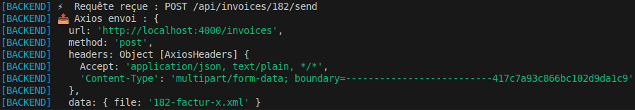


---

### 3. Affichage et suivi côté frontend

* Log côté backend pour confirmer la bonne réception des fichiers et leur taille.  
* Préparation à l’affichage dans le frontend : possibilité d’indiquer à l’utilisateur que la facture a bien été transmise au PDP simulé.  
* L’objectif futur : intégrer ces retours dans l’interface pour visualiser le statut (`draft`, `sent`, `received`) de chaque facture.


---

### 4. Tests fonctionnels et vérifications

* Test de l’envoi de plusieurs factures au serveur mock : vérification que les fichiers sont bien reçus.  
* Vérification que le Base64 est correct dans le fichier debug JSON.  
* Simulation des erreurs PDP pour tester la robustesse du backend (fichier manquant, mauvais format, etc.).

---

## 📌 Prochaines étapes – Évolution fonctionnelle

* **Connecteur générique pour PDP** : créer un adaptateur permettant de connecter facilement plusieurs PDP sans réécrire le flux d’envoi.  
* **Gestion complète du cycle de vie des factures** : récupérer les statuts depuis le PDP simulé, stocker les informations et les afficher côté frontend.  
* **Tests automatisés** : intégrer les scénarios d’envoi, réception et erreurs pour sécuriser le backend.  
* **Interface utilisateur enrichie** : afficher les statuts de chaque facture et proposer des actions en fonction du statut (réenvoi, annulation, etc.).  

---

👉 **Bilan de la journée** : le serveur mock PDP est opérationnel, la fonction d’envoi de factures est stable et logge correctement toutes les informations nécessaires. Le terrain est prêt pour **la création du connecteur générique**, la gestion des statuts et l’intégration front/backend. 🚀💡


\newpage

# Jour 60 – Intégration du polling PDP et préparation du statut en temps réel 📡🖥️

Aujourd’hui, j’ai travaillé sur **la mise à jour des statuts techniques et métiers des factures côté frontend**, en lien avec les flux PDP simulés et le backend. L’objectif était de préparer le terrain pour un affichage en temps réel et rendre l’interface plus interactive et fiable.  

---

## ✅ Ce qu’on a fait

### 1. Analyse et mise à jour du composant `TechnicalStatusCell`

* Refonte du composant pour gérer **le polling automatique des statuts techniques** (`PENDING → RECEIVED → VALIDATED/REJECTED`).  
* Implémentation d’un **useEffect + useCallback** pour lancer un interval de polling toutes les 2 secondes, avec arrêt automatique dès que le statut final est atteint.  
* Gestion de l’état local `status` pour afficher le badge coloré correspondant :  
  - vert → `RECEIVED`  
  - bleu → `VALIDATED`  
  - rouge → `REJECTED`  
  - gris → `PENDING`  
* Correction des warnings ESLint : ajout de `row.submissionId` dans les dépendances du hook pour garantir un comportement stable.


---

### 2. Préparation de la mise à jour temps réel côté tableau

* Création d’un **callback `handleTechnicalStatusChange`** dans `InvoicesList` pour mettre à jour le statut technique d’une facture dans le state `invoices`.  
* Transmission de ce callback aux colonnes via `useInvoiceColumns` pour que chaque cellule `TechnicalStatusCell` puisse remonter les changements.  
* Corrigé les problèmes d’ESLint et d’identifiants dupliqués (`invoiceService`).

---

### 3. Gestion des statuts métiers

* Distinction claire entre **statuts techniques** (PDP) et **statuts métiers** (workflow interne, état `draft` / `issued` / `paid`, etc.).  
* Les boutons “Envoyer / Statut” côté tableau sont maintenant uniquement liés aux **statuts métiers**, pour éviter toute confusion avec le polling PDP.  
* Préparation pour que la récupération des statuts métiers puisse se faire via un clic ou un futur polling dédié.

---

### 4. Backend et Mock PDP

* Les tests du **serveur Mock PDP** ont confirmé que les fichiers Factur-X sont correctement reçus et loggés.  
* La fonction `sendInvoice` du backend supporte maintenant `multipart/form-data` et logge chaque requête avec un debug JSON.  
* Les statuts retournés par le PDP simulé (`received`, `validated`) sont bien exploités côté frontend pour le badge technique.

---

### 5. Tests et vérifications

* Vérification que le polling fonctionne : le badge passe automatiquement de `PENDING → RECEIVED → VALIDATED`.  
* Vérification que l’UI n’a pas besoin de `F5` pour le statut technique (mais reste à finaliser le refresh temps réel côté statuts métiers).  
* Correction des erreurs de hook et dépendances pour garantir un rendu stable et éviter les erreurs React.


---

## 📌 Prochaines étapes

* **Finaliser la mise à jour en temps réel côté frontend** :  
  - polling ou WebSocket pour les statuts métiers afin que la liste se mette à jour automatiquement.  
  - intégration complète du callback `onTechnicalStatusChange` et du refresh dans `InvoicesList`.  
* **Interface utilisateur enrichie** : afficher les actions disponibles selon le statut métier et technique.  
* **Tests automatisés** : créer des scénarios pour vérifier que les statuts techniques et métiers se synchronisent correctement avec le backend.  
* **Connecteur générique PDP** : rendre le flux extensible pour plusieurs PDP sans toucher au reste du code.

---

👉 **Bilan intermédiaire** : le polling technique est opérationnel, la distinction métiers / techniques est clarifiée, et le backend Mock PDP fonctionne parfaitement. Il reste à finaliser **le refresh en temps réel pour les statuts métiers** et consolider l’intégration front/backend. 🚀  


\newpage

# Jour 61 – Polling des statuts métiers et fiabilisation en temps réel 📡💼

Aujourd’hui, j’ai travaillé sur **la réception et l’affichage en temps réel des statuts métiers des factures**. L’objectif était de compléter le polling PDP technique déjà en place et de rendre la liste des factures **totalement interactive**, sans erreur ni logs répétitifs.  

---

## ✅ Ce qu’on a fait

### 1. Refonte du composant `BusinessStatusCell`

* Ajout d’un **polling interne pour les statuts métiers** (`Émise → Reçue → Approuvée / Refusée`) avec `setInterval` toutes les 2 secondes.  
* Gestion du **timeout automatique** pour arrêter le polling après 20 secondes si aucun statut final n’est atteint.  
* Ignorer les cas où le `lifecycle` est vide pour éviter l’erreur `Aucun statut métier trouvé` au démarrage.  
* Affichage du badge coloré basé sur le code métier :  
  - vert → approuvé / émis  
  - bleu → paiement transmis  
  - rouge → refusé  
  - gris → en attente  
* Passage d’un callback `onBusinessStatusChange` pour **mettre à jour le state parent** et synchroniser la liste des factures avec les derniers statuts métiers.

---

### 2. Fiabilisation du polling

* Le polling **ne démarre que si la facture a un `submission_id`** et si le statut métier n’est pas déjà final.  
* Nettoyage du timer et arrêt automatique dès qu’un statut final est reçu ou que le `maxPollingTime` est atteint.  
* Les erreurs temporaires ou le fait qu’aucun statut n’existe encore sont maintenant **loggées sans casser le composant**.

---

### 3. Intégration avec le backend et le Mock PDP

* Vérification que la route `GET /invoices/:submissionId/lifecycle` du Mock PDP fonctionne et retourne bien le `lifecycle` complet.  
* Adaptation du frontend pour **gérer les cas où le lifecycle n’est pas encore rempli** au moment du premier rendu.  
* Le flux de récupération des statuts métiers est maintenant **indépendant du statut technique**, mais reste coordonné via `submission_id`.

---

### 4. Tests et observations

* Les badges métiers se mettent à jour **automatiquement toutes les 2 secondes** jusqu’au statut final.  
* Le timeout de 20 secondes empêche les logs répétés d’erreurs côté console et évite le polling infini.  
* Le composant est stable même si la facture n’a pas encore de statut métier ou si le lifecycle est vide au démarrage.  
* Vérification que le callback parent met correctement à jour le state `invoices` dans la liste.

---

## 📌 Prochaines étapes

* **Améliorer l’UI pour les statuts métiers** :  
  - Ajouter une animation ou un indicateur “en cours” pendant le polling.  
  - Afficher un message clair si le statut n’est pas encore disponible.  
* **Consolidation backend** : s’assurer que le PDP simulé retourne toujours un `lifecycle` initial même pour les nouvelles factures.  
* **Préparer la synchronisation temps réel complète** : envisager un passage à WebSocket pour les statuts métiers afin de supprimer le polling si nécessaire.  
* **Tests automatisés** : vérifier la synchronisation front/back et les comportements de timeout pour différents scénarios.

---

👉 **Bilan intermédiaire** : le polling des statuts métiers est maintenant opérationnel, fiable et sans logs d’erreur intempestifs. Le composant `BusinessStatusCell` gère correctement les statuts en temps réel et met à jour le parent, ce qui prépare le terrain pour un affichage totalement interactif et cohérent. 🚀  


\newpage

# Jour 62 – Bilan humain : de l’authentification au PDP 🚀🔐📡  

Franchement, ce sprint a été un sacré mélange d’émotions : fierté, fatigue, excitation, parfois même l’envie de tout lâcher. Je ne savais pas trop où je mettais les pieds en attaquant ces sujets… et je ne pensais pas que ça me demanderait autant d’énergie.  

👉 Côté **authentification**, je m’attendais à quelque chose de “plug & play”. En réalité, c’était un vrai chantier : comprendre Auth0, sécuriser la relation front ↔ back avec les tokens JWT, verrouiller toutes les routes sensibles… À chaque étape, une nouvelle erreur, un nouvel ID ou mot de passe mal configuré. Clairement, le **plus gros mur du projet**. Il y a eu un moment où j’ai vraiment cru que j’allais abandonner tellement c’était éprouvant. Et puis un jour, le déclic : ça marche. Là, énorme soulagement.  

👉 Côté **PDP**, je ne pensais jamais coder un serveur qui simule le fonctionnement d’un PDP 🤯. Pourtant, c’est ce que j’ai fait avec le mock. Et honnêtement… je trouve ça trop cool. Ça m’a permis de tester les flux, de voir mes factures circuler et d’avoir un aperçu concret du futur système.  

🎯 Pour l’utilisateur final, mon obsession reste la même : **la simplicité**. Tout le reste — sécurité, transparence des statuts, communication avec le PDP — doit être invisible. Juste une solution claire et fluide.  

💡 Aujourd’hui, je me sens confiant. Il reste quelques cas d’utilisation à boucler, un peu de refacto pour garder le code propre, puis place à l’industrialisation et aux tests en profondeur pour s’assurer que tout est robuste. J’ai hâte de partager le projet, de le confronter au réel et de le faire grandir.  

---

👉 En résumé : je suis passé par la galère, le déclic, puis la fierté. Et surtout, j’ai appris à avancer même quand je n’avais aucune idée de ce qui m’attendait.  


\newpage

# Jour 63 – Petit update du dimanche soir 📝✨

Aujourd’hui, pas grand-chose de concret côté dev, juste un **update rapide** pour garder le fil :  

---

## ✅ Points notables

- Les **boutons PDF/A-3** et PDF standard sont maintenant alignés, propres et cliquables directement depuis la liste des factures.  
- L’UI des actions de facture est **uniforme et sans cadres**, prête pour tous les tests.  


---

## 📌 Prochaines étapes pour clôturer le périmètre métier

- [ ] **Émission du cycle de vie d’encaissement** pour les factures  
  - Mettre à jour le **mock PDP** pour gérer le statut de paiement (`paid`) dans le lifecycle métier.  

- [ ] **Mise en conformité ISO du PDF/A-3**  
  - Finaliser tous les points techniques restants (métadonnées XMP, profils de couleur, `AFRelationship`) pour obtenir la **validation PDF/A-3 complète**.  

- [ ] **Règles de gestion métier** à appliquer :  
  - **Ne plus permettre de modifications** dès que la facture a été **transmise et réceptionnée côté PDP**.  
  - **Autoriser uniquement l’ajout de justificatifs** si la facture est en **suspension**.  

- [ ] [Optionnel] Gérer la recherche pour les tags traduits en français.  

---

💡 **Bilan rapide** : un dimanche tranquille, mais l’interface facture est maintenant **prête et propre**, et le reste des développements métiers peut être finalisé cette semaine. 🚀


\newpage

# Jour 64 – Sécurisation des factures transmises et mode suspension réglementaire 📎🛡️

Aujourd’hui, la session a été consacrée à **la protection réglementaire des factures déjà transmises** et à l’implémentation d’un **mode suspension**, permettant un ajout limité de justificatifs.

---

## ✅ Ce qu’on a fait

### 1. Protection des factures transmises

* **Règle métier essentielle** : une fois qu’une facture est transmise au PDP, son contenu **ne peut plus être modifié** pour garantir la **conservation des données initialement transmises**, conformément aux obligations réglementaires.  

* Backend : la route `updateInvoice` bloque toute modification si `technical_status` est final (`validated`, `received`, etc.), avec un retour **403** si tentative de modification.  
* Frontend : les boutons **Modifier / Supprimer** sont désactivés pour ces factures, assurant que l’utilisateur ne puisse pas altérer les données transmises.

---

### 2. Mode suspension pour compléter la facture

* Mise en place d’un **mode `canEditAdditional`** déclenché si `business_status = "208"`.  

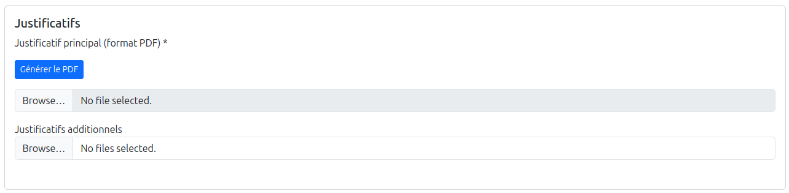

* Objectif : permettre uniquement l’**ajout de justificatifs additionnels**, sans toucher au justificatif principal ni aux lignes de facture existantes.  
* UI :  
  - Les boutons **Enregistrer / Annuler** remplacent **Modifier / Supprimer** dans ce mode.  
  - Les champs du justificatif principal restent **verrouillés**.  
  - La suppression de fichiers existants est **interdite**, même pour les justificatifs additionnels.

* Ce mode respecte la **conformité métier** : le vendeur peut compléter sa facture avec des documents complémentaires tout en préservant l’intégrité des données déjà transmises au PDP.

---

### 3. Synchronisation frontend/backend

* Validation backend stricte pour interdire toute modification non autorisée.  
* Ajout de justificatifs additionnels en suspension : vérification côté frontend et backend, stockage sécurisé des fichiers.  
* Console logs pour suivi détaillé des opérations et facilitation du debug.

---

### 4. Tests et vérifications

* Vérification que :  
  - Factures transmises sont **impossibles à modifier** en dehors du mode suspension.  
  - En mode suspension, le vendeur peut **ajouter uniquement des justificatifs additionnels**.  
  - Boutons UI s’affichent correctement selon le mode et l’état `isEditing`.  

---

## 📌 Prochaines étapes

- Finaliser la **suspension**, avec l’envoi de la facture complétée des justificatifs additionnels.  
- [ ] **Émission du cycle de vie d’encaissement** pour les factures  
  - Mettre à jour le **mock PDP** pour gérer le statut de paiement (`paid`) dans le lifecycle métier.  
- [ ] **Mise en conformité ISO du PDF/A-3**  
  - Finaliser tous les points techniques restants (métadonnées XMP, profils de couleur, `AFRelationship`) pour obtenir la **validation PDF/A-3 complète**.  
- [ ] [Optionnel] Gérer la recherche pour les tags traduits en français.  

---

💡 **Bilan de la session** :  
La logique métier est désormais respectée : les factures transmises sont protégées, et le mode suspension permet un ajout contrôlé de justificatifs. Le workflow est conforme aux exigences réglementaires de conservation des données transmises au PDP, tout en offrant un **espace sûr pour compléter les factures**. 🚀


\newpage

# Jour 65 – Statut d’encaissement et bouton 💰

Aujourd’hui, l’objectif principal était de **boucler le traitement des factures** en intégrant correctement le **statut d’encaissement**, obligatoire pour finaliser le cycle métier et **notifier le client que le paiement a été encaissé**.

Nous avons ajouté un **bouton 💰 “Encaisser”** directement dans le tableau :

* Activé uniquement lorsque le paiement a été transmis (`211`).
* Désactivé automatiquement dès que la facture est encaissée (`212`).
* Permet de simuler la réception effective du paiement et de notifier le client en temps réel.

### Détails techniques

* **Frontend** :

  * `handleBusinessStatusChange` et `handleTechnicalStatusChange` mettent à jour le state `invoices`.
  * `setVersion` force le re-render du DataTable pour que les boutons se mettent à jour instantanément.
  * Le bouton 💰 appelle `cashInvoice`, puis récupère le **dernier statut du cycle métier** pour actualiser le tableau.

    

* **Backend** :

  * Route `cashInvoice` renvoyant le statut final de la facture après encaissement.
  * Les statuts finaux (`210`, `212`) bloquent les actions suivantes pour assurer la cohérence réglementaire.
  
  

* **Mock PDP** :

  * Simule la progression complète du cycle métier : « Reçue par la plateforme », « Mise à disposition », puis encaissement.
  * Les logs permettent de suivre la mise à jour et le comportement du bouton en temps réel.

* **Rafraîchissement du cycle métier** :

  * Le bouton 🔄 « Rafraîchir le cycle métier » reste disponible tant que la facture n’est pas dans un statut final.
  * Synchronisation instantanée avec le backend / mock.

---

### 📌 Prochaines étapes

* **Statut encaissement** : valider le comportement et la synchronisation des boutons lors de l’évolution du cycle de vie.
* **Suspension / complément** : finaliser la suspension, avec l’envoi de la facture complétée des justificatifs.


\newpage

# Jour 66 – Mock PDP : cycles pondérés, suspension et encaissement ⚖️💰

Aujourd’hui, j’ai travaillé à rendre le mock PDP encore plus réaliste et robuste. Après les premiers tests sur l’encaissement et le bouton 💰, j’ai ajouté deux améliorations majeures :

## Pondération des cycles de vie

Chaque statut métier (mise à disposition, prise en charge, approuvée, litige, suspension, refus, paiement transmis) dispose désormais d’une probabilité d’occurrence.
```js
  const possibleStatuses = [
    { code: 203, label: 'Mise à disposition', probability: 1.0 },
    { code: 204, label: 'Prise en charge', probability: 0.6 },
    { code: 205, label: 'Approuvée', probability: 0.6 },
    { code: 206, label: 'Approuvée partiellement', probability: 0.2 },
    { code: 207, label: 'En litige', probability: 0.2 },
    { code: 208, label: 'Suspendue', probability: 0.2 },
    { code: 210, label: 'Refusée', probability: 0.1 },
    { code: 211, label: 'Paiement transmis', probability: 1.0 },
  ];
```

Cela permet de simuler des flux plus proches de la réalité, avec des parcours non linéaires et des probabilités différentes pour chaque événement.

## Gestion de la suspension

Les factures suspendues (statut 208) attendent désormais un complément avant de continuer le cycle.

La progression automatique est bloquée jusqu’à ce que la suspension soit levée, ce qui reflète la réalité où certains documents ou informations sont obligatoires pour continuer.

---

Grâce à ces améliorations, j’ai pu retester tous mes parcours critiques :

- Création facture → envoi au PDP → rejet PDP  
- Création facture → envoi au PDP → intégration PDP → statuts successifs → rejet client → fin du cycle de vie  
- Création facture → envoi au PDP → intégration PDP → statuts successifs → suspension → attente complément  
- Création facture → envoi au PDP → intégration PDP → statuts successifs → paiement transmis → envoi flux d’encaissement

Le mock permet désormais :

- De suivre tous les scénarios possibles, du rejet technique à l’encaissement final  
- De valider mes règles métier, y compris suspension, rejet et encaissement  
- De vérifier que l’interface réagit correctement à chaque évolution de cycle (rafraîchissement, boutons désactivés/activés, notifications)

Même minimaliste, ce mock est devenu un outil stratégique : il fournit un terrain de test réaliste, force à anticiper tous les cas particuliers et assure que le MVP repose sur des fondations solides.

---

## 📌 Prochaines étapes

Pour continuer à améliorer le mock et le parcours factures :

- Gérer le retour de l’envoi d’un statut, notamment l’encaissement, côté front et backend  
- Traiter les erreurs techniques des requêtes côté PDP (ex. erreur 500) et simuler ces scénarios  
- Ajouter les commentaires clients pour les statuts particuliers : refus, approbation partielle ou litige  
- Afficher des messages d’erreurs techniques côté frontend : bulles d’aide ou alertes lors d’un rejet technique ou d’un refus de facture  

Ces améliorations permettront de tester tous les cas extrêmes et d’anticiper les interactions front/back avant la mise en production.


\newpage

# Jour 67 – Mock PDP : commentaires clients et feedback frontend 📝💬

Aujourd’hui, j’ai continué à enrichir le mock PDP et le parcours factures en ajoutant la gestion des **commentaires clients** et des **messages d’erreurs côté frontend**. L’objectif est de rendre le mock encore plus proche de la réalité et de faciliter la prise de décision pour chaque statut métier.

## Commentaires clients pour statuts particuliers

Pour certains statuts sensibles – refus, approbation partielle, litige – j’ai intégré la récupération et l’affichage des **commentaires clients** depuis la DB.  

Cela permet de :

- Comprendre rapidement la raison d’un refus ou d’un litige  
- Afficher des informations précises dans les bulles d’aide (tooltips) côté frontend  
- Vérifier que chaque statut métier critique est correctement commenté et suivi  

## Feedback et messages d’erreurs côté frontend

J’ai ajouté des **messages d’erreurs métier** directement sur l’interface :
- Bulles d’aide pour chaque statut particulier (refus, approbation partielle, suspension, litige)  
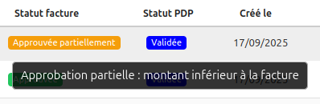
- Gestion de la suspension côté interface : le cycle est bloqué et le message informe l’utilisateur de l’action requise  
- Messages dynamiques pour les cas de statut technique (ex. rejection ou erreur 500 côté PDP)  

Ces ajouts permettent de tester l’expérience utilisateur dans des scénarios réalistes, sans avoir à simuler manuellement chaque erreur.

---

Grâce à ces améliorations, le mock PDP devient un outil encore plus puissant :  

- Les statuts critiques sont enrichis de commentaires clients exacts  
- L’interface réagit correctement à chaque évolution du cycle métier  
- Le parcours facture peut maintenant être suivi intégralement, de la création à l’encaissement, en passant par tous les cas particuliers  

## 📌 Prochaines étapes

Pour continuer à améliorer le mock et le parcours factures :

- Gérer le retour de l’envoi d’un statut, notamment l’encaissement, côté front et backend  
- Traiter les erreurs techniques des requêtes côté PDP (ex. erreur 500) et simuler ces scénarios  
- Afficher des messages d’erreurs techniques côté frontend : bulles d’aide ou alertes lors d’un rejet technique  


\newpage

# Jour 68 – Mock PDP : gestion des erreurs 400/500 et robustesse front/back ⚡🛠️

Aujourd’hui, j’ai travaillé sur la **robustesse du mock PDP** et la **gestion des erreurs côté front et backend**. L’objectif est de s’assurer que les incidents liés à la plateforme de facturation (mock ou réelle) n’interrompent pas le flux de travail et fournissent un retour clair à l’utilisateur.

## Gestion des erreurs 400 et 500

Le backend capte désormais correctement :

- Les erreurs client (400, 404) : soumission non trouvée, requête invalide  
- Les erreurs serveur (500, 503, etc.) : PDP indisponible, crash simulé  

Toutes les erreurs sont loggées côté backend pour faciliter le dépannage, et un **message standard est envoyé au frontend** pour informer l’utilisateur qu’il doit réessayer plus tard.

## Comportement côté frontend

Le frontend ne se base plus sur un statut optimiste immédiat pour l’encaissement :  

- Si le PDP/mocking PDP renvoie une erreur, le **statut ne change pas**  
- L’utilisateur reçoit un **message d’alerte clair et uniforme**  
- Les logs détaillés restent côté backend, pour ne pas surcharger l’expérience utilisateur  

## Résultat

Grâce à ces modifications, le mock PDP est désormais plus **réaliste et résilient** :  

- Les flux critiques (création, envoi au PDP, statuts successifs, encaissement) peuvent être testés même si la plateforme est indisponible  
- L’interface frontend ne plante plus et l’utilisateur est correctement informé  
- Les logs backend permettent un suivi précis et rapide en cas de problème  

---

## 📌 Prochaines étapes

- Finaliser le périmètre métier avec la gestion des compléments de facture
- Améliorer la qualité du code suite à tous les changements

Avec ces améliorations, le mock PDP est désormais un outil robuste pour **tester tous les cas extrêmes** et anticiper les interactions front/back avant la mise en production.


\newpage

# Jour 69 – Mock PDP : gestion des suspensions et compléments 📝⚡

Aujourd’hui, j’ai travaillé sur la **gestion des factures suspendues et de leur complément** avec le mock PDP. L’objectif est de reproduire le scénario métier où un client peut suspendre une facture, et où l’application permet ensuite de la compléter et de la réémettre.

## Gestion des suspensions et compléments

- Si le client suspend la facture, l’interface propose de réémettre la facture   
- L’utilisateur peut ajouter les justificatifs manquants et **réémettre la facture**  
- Une fois que le PDP confirme la réception de la facture complétée :  
  - Le **statut métier passe à “complété”**  
  - Le **cycle de vie de la facture reprend normalement**, jusqu’à l’encaissement  


- Tous les événements sont **loggés côté backend** pour garder une trace précise de chaque étape  
- Côté frontend, l’utilisateur reçoit un **retour clair et immédiat** sur le statut de la facture complétée

## Résultat

Grâce à cette amélioration :  

- Le mock PDP supporte désormais le **flux de suspension et de complément**  
- Les tests fonctionnels peuvent couvrir **tous les cas où une facture est suspendue** et complétée  
- L’interface reste **cohérente et réactive**, même en cas de suspensions multiples

---

## 📌 Prochaines étapes

- Industrialisation du projet :  
  - Refactoring du code existant  
  - Automatisation des tests pour couvrir tous les cas métier


\newpage

# Jour 70 – Bouclage du périmètre produit et derniers correctifs 🐞✨

Aujourd’hui, j’ai travaillé sur les **derniers bugs visibles et la consolidation du périmètre produit**. L’objectif était de s’assurer que toutes les fonctionnalités principales sont **stables, cohérentes et opérationnelles** avant de passer à l’étape suivante.

## Derniers correctifs et vérifications

- Correction du **comportement des boutons “Envoyer” et “Encaissement”**, pour qu’ils reflètent toujours l’état réel de la DB  
- Vérification que les **statuts métier et techniques** sont correctement mis à jour et affichés après chaque action  
- Nettoyage de petites incohérences dans l’interface pour que le produit soit **fluide et réactif**  
- Tests manuels pour confirmer que **tous les flux principaux fonctionnent sans blocage**, y compris les scénarios de réémission et d’encaissement

## Résultat

Grâce à ces correctifs :

- Le **périmètre fonctionnel du produit est maintenant bouclé**  
- L’interface est **cohérente avec l’état réel des factures**  
- Les utilisateurs peuvent naviguer et utiliser l’application sans rencontrer de bugs visibles  

---

## 📌 Prochaines étapes

- Commencer à **automatiser des tests**, pour sécuriser tous les cas métier et réduire les vérifications manuelles  
- Préparer le terrain pour **industrialiser le projet** et faciliter les futurs développements  

Le produit est désormais prêt pour la phase d’industrialisation et de tests automatisés ! 🚀


\newpage

# Jour 71 – Tour complet des fonctionnalités et validation du périmètre ✅🔍

Aujourd’hui, j’ai réalisé un **grand tour de l’application** afin de tester l’ensemble des fonctionnalités développées. L’idée était de m’assurer que chaque module (vendeurs, clients, factures) fonctionne **de bout en bout**, avec toutes les validations et règles métiers déjà en place.  

## Vérifications effectuées

- **Contrôles génériques** : SIRET valide, formats de téléphone et code postal, champs obligatoires selon le contexte (particulier / entreprise).  
- **Gestion des clients** : création, édition, suppression et affichage, avec pré-remplissage fluide et cohérence entre la fiche client et l’usage dans les factures.  
- **Profil vendeur** : consultation et modification sécurisée.  
- **Factures** : cycle complet de création, modification et visualisation (entête, lignes, TVA, justificatifs), avec génération des PDF et du flux Factur-X.  
- **Parcours PDP** : vérification des statuts (rejet, intégration, suspension, encaissement), contrôle fin des boutons en fonction de l’état métier réel.  
- **Authentification** : connexion, inscription et sécurisation des routes pour garantir que chaque vendeur ne voit que ses données.  

## Résultat

- Toutes les **fonctionnalités métiers attendues sont couvertes et testées**.  
- L’application est **utilisable de bout en bout**, sans rupture dans le parcours.  
- Les validations et règles métier sont en place, garantissant la **cohérence et la fiabilité des données**.  

---

## 📌 Prochaines étapes

- **Industrialisation** :
  - Mise en place de tests unitaires et d'intégration (`Vitest`).  
  - Logging et monitoring des API.  
  - Préparation au déploiement (CI/CD).  
- **Finalisation de la conformité PDF/A-3** : Résoudre les derniers points techniques (ex: profils de couleur, `AFRelationship`) pour obtenir une validation ISO 19005-3 complète.  

Le produit a désormais atteint son **périmètre fonctionnel complet** et peut entrer en phase de consolidation et d’industrialisation 🚀  


\newpage

# Jour 72 – Un véritable Dashboard vendeur 🚀📊  

Aujourd’hui, j’ai développé la nouvelle **page d’accueil** qui se transforme en un **Dashboard opérationnel et analytique** pour le vendeur.  
L’idée est que dès sa connexion, il dispose d’une **vue globale** de son activité factures et clients, avec des **indicateurs clairs et actionnables**.  

## Éléments mis en place  

- **Accès guidé** : si le vendeur n’a pas encore créé sa fiche, un écran dédié l’invite directement à la compléter avant de pouvoir aller plus loin.  
- **Top 5 clients** : calcul dynamique des clients qui génèrent le plus de chiffre d’affaires, avec affichage du montant total facturé.  
- **Montant facturé par mois** : histogramme interactif pour visualiser l’évolution du CA dans le temps.  
- **Statuts de factures** : tableau récapitulatif du nombre de factures par statut métier (draft, issued, late, etc.).  
- **Graphique des statuts** : visualisation claire via un bar chart coloré (codes couleurs cohérents avec les statuts métiers).  
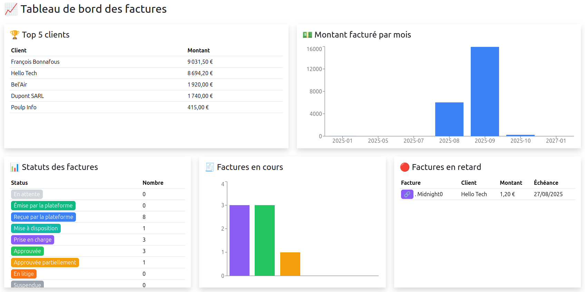

## Résultat  

- Le vendeur bénéficie maintenant d’un **cockpit complet** qui lui permet de :  
  - voir l’évolution de son activité mois par mois,  
  - identifier ses clients principaux,  
  - suivre le volume et la répartition des factures selon leur statut.  
- Le Dashboard apporte une **meilleure lisibilité** et facilite la **prise de décision rapide** (suivi des échéances, relances à prévoir, factures en attente).  

---

## 📌 Prochaines étapes

- **Industrialisation** :
  - Mise en place de tests unitaires et d'intégration (`Vitest`).  
  - Logging et monitoring des API.  
  - Préparation au déploiement (CI/CD).  
- **Finalisation de la conformité PDF/A-3** : Résoudre les derniers points techniques (ex: profils de couleur, `AFRelationship`) pour obtenir une validation ISO 19005-3 complète.  


\newpage

# Jour 73 – Premiers pas vers une stratégie de tests 🧪🚀

Aujourd’hui, j’ai commencé à réfléchir sérieusement à la mise en place d’une stratégie de tests pour **eInvoicing**.  
L’objectif n’est plus de vérifier un bug ponctuel, mais de préparer le projet à être robuste et maintenable sur le long terme.

## Pourquoi les tests maintenant ⚙️

Le backend commence à avoir plusieurs modules (factures, clients, PDF, statuts).  
Chaque fonctionnalité génère des données critiques pour les utilisateurs.  
Pour éviter les régressions et sécuriser les évolutions futures, il faut vérifier automatiquement que tout continue de fonctionner à chaque modification.

## Principes de la stratégie que je mets en place 📝

**Tests unitaires 🧩**  
Vérifier la logique métier des controllers et services indépendamment des routes ou de la DB.  
Exemple : calcul du montant total facturé, génération de statuts ou transformation de données.  
✅ On a déjà commencé à initier les tests unitaires côté backend, notamment pour la validation de **SIRET** et certaines **routes invoices**.


**Tests d’intégration 🔗**  
Vérifier que les routes REST fonctionnent correctement et retournent les bonnes réponses JSON.  
Assurer que les middlewares, même si mockés temporairement, s’intègrent correctement avec les routes.  
Pour ces tests, on peut utiliser des outils comme **Vitest** ou **Jest**, qui permettent de lancer facilement des tests unitaires et d’intégration et de s’assurer que tout le backend répond comme prévu.

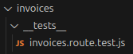

**Tests end-to-end (E2E) 🏁**  
Simuler le parcours complet d’un utilisateur (connexion, création de facture, génération PDF).  
Prévoir ces tests pour les étapes critiques avant le déploiement.

**Tests automatiques en CI/CD 🤖**  
Chaque push déclenche les tests pour s’assurer qu’aucune modification ne casse l’existant.  
Les tests deviennent un outil de confiance pour continuer à faire évoluer le produit rapidement.


## Avantages attendus 🌟

- Détection rapide des bugs avant qu’ils n’affectent les utilisateurs.  
- Documentation vivante du comportement attendu des modules.  
- Facilitation de la maintenance et de l’évolution : on peut refactorer ou ajouter des fonctionnalités sans peur de casser le core du projet.  
- Meilleure visibilité sur la couverture fonctionnelle : on sait quelles parties sont testées et quelles parties restent à sécuriser.

## 📌 Prochaines étapes

- Prioriser les routes et services les plus critiques pour commencer les tests.  
- Définir un pattern standard pour les tests unitaires et d’intégration afin que le code reste lisible et maintenable.  
- Intégrer progressivement **Vitest + Supertest** pour couvrir l’ensemble des modules backend, avec éventuellement **Jest** comme alternative ou complément selon les besoins.  
- À moyen terme, ajouter des tests E2E sur des scénarios clés, notamment la génération et l’envoi des factures.  


\newpage

# Jour 74 – Premiers tests front et bases pour la CI 🧪💻

Aujourd’hui, j’ai commencé à poser les premières briques de tests côté frontend tout en consolidant le backend pour **eInvoicing**.  

## Le tout premier test frontend : le validator SIRET ⚙️

Avant même de toucher aux composants React, j’ai testé **le validator de SIRET côté frontend** :  

- Vérifie que la logique de validation fonctionne correctement pour différents numéros.  
- Constitue un **test unitaire simple et isolé**, idéal pour se familiariser avec Vitest côté frontend.  
- Sert de **première brique fiable** pour la stratégie de tests front : on sait qu’une donnée critique est correctement validée avant de l’afficher ou de l’envoyer au backend.  

✅ Ce test est minimal mais stratégique : il sécurise les bases et montre comment écrire des tests unitaires frontend efficaces.

## Premiers tests de composants React ⚡

Ensuite, j’ai commencé à tester des composants plus complexes comme `ClientsList` :  

- **Affichage conditionnel** : loader, table de clients, message d’erreur.  
- **Interaction simple** : filtrage via l’input de recherche.  
- **Mocks** pour les hooks et composants tiers (`useClients`, `DataTable`, `Breadcrumb`) afin d’isoler le composant testé.

Ces tests permettent de vérifier rapidement le comportement attendu sans lancer toute l’application.

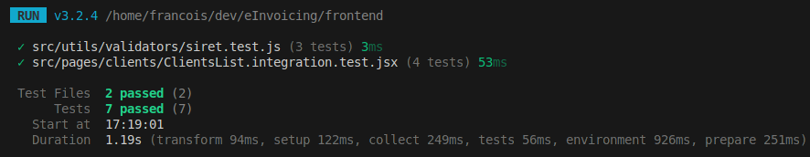

## Pourquoi penser à une CI maintenant 🤖

Avec des tests unitaires backend et frontend :  

- On peut déclencher automatiquement les tests à chaque push.  
- La CI devient un **outil de confiance** pour continuer à faire évoluer le projet sans craindre de casser des fonctionnalités existantes.  
- À terme, on pourra ajouter des tests E2E pour sécuriser les parcours utilisateurs critiques.

## 📌 Prochaines étapes

- Étendre les tests unitaires frontend à d’autres règles critiques et composants importants.  
- Ajouter un **pipeline CI simple** qui lance les tests backend et frontend.  
- Prioriser les composants critiques pour garantir leur stabilité.  
- Intégrer progressivement des tests E2E pour compléter la couverture.


\newpage

# Jour 75 – Ma méthodologie *Agile Solo* 🚀👨‍💻  

Aujourd’hui, je mets un mot sur ce que je pratique depuis le début de cette aventure :  
j’ai inventé, sans le savoir, une véritable **méthodologie agile en solo**.  

Pas de stand-up meeting, pas de backlog Jira, pas de sprint planning… mais un process simple, efficace et humain qui me guide session après session.  

---

## 🔑 Les piliers de mon Agile Solo  

- **📓 Journal de bord vivant**  
  Chaque session commence par un rappel : *où j’en suis, ce qu’on va faire, ce qu’on vise*.  
  → C’est mon *daily* personnel, une mise en contexte rapide et motivante.  

- **🎯 Objectifs clairs, mais flexibles**  
  Je définis un but atteignable pour la session (ex: finir un CRUD, intégrer une lib).  
  → Comme dans un sprint, je vise l’incrément concret, mais je garde le droit d’ajuster.  

- **🌀 Boucle itérative**  
  1. J’écris  
  2. Je code  
  3. Je documente  
  Et le cycle repart.  
  → Ça crée un rythme naturel, qui évite la dispersion et valorise chaque pas.  

- **🔍 Rétrospective intégrée**  
  En fin de session, je note mes apprentissages, blocages, décisions clés.  
  → C’est mon miroir : ça me permet d’améliorer ma façon de travailler.  

- **📈 Progression narrative**  
  Mon journal n’est pas qu’une doc technique : c’est une **histoire**.  
  Je construis mon produit comme on raconte une série, épisode après épisode.  

---

## ✨ Pourquoi ça marche  

- Je ne perds jamais le fil (trace écrite).  
- Je garde une motivation constante (chaque jour est un épisode).  
- Je valorise mon travail (storytelling + documentation).  
- J’ai créé un outil à la fois pour **moi aujourd’hui** et pour **moi demain**.  

---

## 🚀 Et demain ?  

Ce framework léger me sert au quotidien.  
Mais je réalise aussi qu’il pourrait inspirer d’autres développeurs indés ou freelances qui veulent avancer sans se noyer dans les outils de gestion de projet.  

Mon **Agile Solo** est devenu mon mode de travail naturel : simple, humain, efficace.  


\newpage

# Jour 76 – Dashboard vendeur opérationnel 🚀📊

Aujourd’hui, j’ai finalisé le **Dashboard vendeur** pour eInvoicing, en centralisant toutes les informations essentielles pour permettre au vendeur de suivre rapidement l’état de ses factures.  

## Parcours utilisateur 🧾

- Le dashboard vérifie d’abord si l’utilisateur dispose d’une fiche vendeur.  
  - Si ce n’est pas le cas, l’utilisateur est redirigé vers la création de sa fiche.  
  - Sinon, toutes les factures associées au vendeur sont récupérées via `fetchInvoicesBySeller`.  
- L’objectif est de présenter uniquement les données pertinentes et de garantir une expérience utilisateur fluide.

## Statuts et graphiques 📊

- Les **statuts des factures** sont affichés dans un tableau avec **codes couleurs** pour identifier rapidement les factures en cours, suspendues ou en litige.  
- Un **graphique en barres** présente uniquement les statuts actifs (204 à 210).  
- Chaque statut ou facture est **cliquable**, permettant d’accéder directement à la liste filtrée correspondante.  

## Top clients et chiffres clés 💵🏆

- Le **Top 5 clients** est calculé en fonction du montant total facturé.  
- Un **graphique mensuel** présente l’évolution des montants facturés.  
- Les factures annulées ou inactives sont exclues, pour ne refléter que les données opérationnelles.

## Factures en retard 🔴

- Les factures en retard sont identifiées selon la règle française : `issue_date + 30 jours`.  
- Les factures avec un statut `pending` ou `rejected` sont exclues.  
- Les factures concernées sont affichées avec une **bulle colorée représentant le statut** et un lien direct vers la facture correspondante.  
- Cela fournit un **signal visuel immédiat** pour prioriser les actions.

## Optimisations UX ✨

- Les **tags de statut** sont codés en couleurs distinctes pour faciliter la lecture rapide.  
- Les icônes et espacements sont ajustés pour une interface claire et cohérente.  
- La disposition en trois colonnes (statuts, graphique, factures en retard) est **responsive**, garantissant une visualisation optimale sur tous les écrans.

✅ Le Dashboard est désormais un **centre de contrôle complet**, combinant suivi analytique et navigation opérationnelle.


\newpage

# 📅 Bilan Hebdomadaire eInvoicing – Jour 64 à 76 🚀

Cette semaine, eInvoicing a franchi un vrai cap : sécurisation des factures, robustesse du mock PDP, complétude des parcours métiers, et un **Dashboard vendeur qui fait plaisir à regarder**.  

---

## 🔒 Factures sécurisées et mode suspension 🛡️

- Les factures transmises au PDP sont désormais **figées** : impossible de modifier leur contenu, conformément aux règles réglementaires.  
- Un **mode suspension** permet d’ajouter **seulement des justificatifs additionnels**, sans toucher aux lignes existantes.  
- Frontend et backend sont synchronisés : boutons, champs et messages respectent les règles métier.  

**Mon ressenti :** C’est super rassurant de voir le workflow verrouillé et de savoir que les données transmises sont à l’abri. Ça donne vraiment le sentiment que le produit est fiable et solide.  

---

## 💰 Cycle d’encaissement et bouton magique

- Le bouton “💰 Encaisser” est maintenant opérationnel : activé seulement lorsque le paiement est transmis, désactivé une fois encaissé.  
- Les statuts métiers et techniques se mettent à jour **en temps réel**, avec rafraîchissement instantané du tableau.  
- Le mock PDP simule toute la progression : du rejet initial à l’encaissement final, en passant par suspensions et litiges.  

**Mon ressenti :** J’adore voir l’interface se mettre à jour instantanément. Ces derniers ajustements clôturent quasiment le périmètre métier, et c’est un vrai soulagement après 6 semaines intenses. L’app devient confortable à utiliser, fluide et prévisible.  

---

## ⚙️ Mock PDP : réaliste et robuste 🏗️

- Initialement, je pensais boucler le PDP en 1 journée, mais j’ai vite compris qu’il fallait **aller plus loin pour un outil fiable**. Résultat : 3 jours d’amélioration et de tests.  
- Gestion des cycles pondérés, suspensions, compléments, commentaires clients, et **catching des erreurs HTTP**.  
- Simulation de tous les scénarios critiques : refus, approbation partielle, litige, paiement transmis, erreur serveur…  

**Mon ressenti :** Même si ça m’a pris plus de temps que prévu, je suis vraiment content d’avoir poussé le PDP jusqu’au bout. C’est maintenant un **outil stratégique** pour tester le front et le backend dans des conditions réalistes.  

---

## 📊 Dashboard vendeur : un vrai plaisir 💡

- Vue complète : Top clients, chiffre d’affaires par mois, statuts de factures et factures en retard.  
- Graphiques et tableaux interactifs, codes couleurs clairs, tags de statut visuellement distincts.  
- Interface responsive et navigation intuitive, avec toutes les données clés accessibles en un coup d’œil.  

**Mon ressenti :** Franchement, créer ce dashboard a été un petit plaisir. La page d’accueil était vraiment vide avant, et en voyant ce qu’un ami avait fait sur son app, ça m’a motivé à faire quelque chose de **friendly et dynamique**. Résultat : un cockpit opérationnel agréable à regarder et utile au quotidien.

---

## 🧪 Tests et industrialisation 🛠️

- Premiers tests unitaires et d’intégration côté backend : validation SIRET, routes invoices.  
- Premiers tests frontend sur composants clés (`ClientsList`, validator SIRET).  
- Mise en place des **fondations pour la CI** : pouvoir automatiser les tests à chaque push et sécuriser l’existant.  

**Mon ressenti :** Poser ces bases m’a donné confiance pour la suite : je peux maintenant industrialiser l’app et ajouter des tests facilement, sans craindre de casser quelque chose. C’est un petit pas technique mais stratégique pour l’avenir.  

---

## 🔑 Méthodologie Agile Solo 📝

- Journal quotidien, objectifs clairs pour chaque session, boucle code + doc + tests, rétrospective intégrée.  
- Progression narrative : chaque jour est un épisode du projet, avec ses challenges et ses victoires.  

**Mon ressenti :** Cette méthode me garde motivé et structuré. Après six semaines intenses, je sens que j’entre dans **la dernière ligne droite**. Chaque session me fait avancer concrètement, et ça se voit dans l’app !  

---

## ✅ Points forts de la semaine

1. Factures transmises protégées, mode suspension fonctionnel.  
2. Bouton encaissement et cycles PDP robustes, avec retour instantané sur l’interface.  
3. Mock PDP réaliste, capable de simuler tous les scénarios critiques.  
4. Dashboard vendeur complet, analytique et dynamique.  
5. Premiers tests backend et frontend posés, CI en préparation.  
6. Méthodologie Agile Solo qui continue de porter ses fruits.  

---

## 📌 Prochaines étapes

- Ajouter des tests unitaires, d’intégration et E2E.  
- Préparer le déploiement CI/CD et monitoring.  
- Finaliser la **conformité PDF/A-3** pour la validation ISO complète.  

💡 **Bilan :** le projet a maintenant atteint une **maturité fonctionnelle solide**, avec sécurité, robustesse et Dashboard opérationnel. La prochaine étape : **industrialisation et tests automatisés**, pour transformer l’app en produit stable et fiable, prêt pour l’avenir. 🚀


\newpage

# Jour 78 – Avancée sur le PDF/A-3 et XMP 📄✨

Aujourd’hui, j’ai attaqué la partie **PDF/A-3** pour nos factures **eInvoicing** et travaillé sur les **métadonnées XMP**. L’objectif était de rendre le PDF pleinement conforme aux standards ISO et Factur‑X, et de corriger plusieurs erreurs qui bloquaient la validation.

## Une plongée dans le XMP et les métadonnées 🕵️‍♂️

Le XMP, c’est ce petit fichier **embarqué dans le PDF** qui décrit la facture : date, titre, outil utilisé, référence de document, etc.  
On a revu complètement la structure pour :  

- Séparer clairement **les informations PDF/A standards** de **l’extension Factur‑X**.  
- S’assurer que **tous les caractères spéciaux** sont correctement échappés pour éviter les soucis avec les accents et symboles.  
- Respecter la norme ISO 19005-3, afin que le validateur reconnaisse bien chaque propriété et extension.  
- Déclarer correctement toutes les propriétés **Factur‑X** (`DocumentType`, `DocumentFileName`, `Version`, `ConformanceLevel`) dans le schéma RDF et dans les extensions PDF/A.

Résultat : le XMP est maintenant **propre, clair et conforme aux attentes de la norme**, prêt à être injecté dans le PDF via `pdf-lib`.

## Correction des 10 points majeurs ✅

En pratique, on a corrigé **10 points bloquants** qui empêchaient la validation PDF/A‑3 :  

1. La structure des métadonnées XMP : chaque info est maintenant dans le bon bloc, PDF/A ou Factur‑X.  
2. Les caractères spéciaux dans le titre et la description : plus de risques de blocage lié aux accents.  
3. La distinction claire entre informations standard et extension, pour que le validateur comprenne ce qui est natif PDF/A et ce qui est spécifique à Factur‑X.  
4. Les identifiants de document (`/ID` dans le trailer) : maintenant générés de manière unique et insérés si absent.  
5. Les dates de création et de modification : correctement formatées pour la norme ISO.  
6. La description de la facture : wording simple et clair, entièrement compatible XMP.  
7. Le nom du fichier XML embarqué : correctement référencé dans l’extension Factur‑X.  
8. La version et le niveau de conformité Factur‑X : définis explicitement pour éviter toute ambiguïté.  
9. La cohérence globale de la structure RDF : toutes les balises sont bien fermées et dans le bon ordre.  
10. Les références aux fichiers attachés (`/AFRelationship` et `/EF`) : ajoutées systématiquement pour chaque attachment, avec distinction entre `Source` pour le Factur‑X et `Data` pour les autres fichiers.

## Ce que ça change concrètement ✨

- Le PDF est **plus robuste et fiable** pour nos clients et pour les systèmes comptables.  
- Les validateurs ISO ne trouvent plus d’erreur dans le XMP lui-même.  
- Le trailer `/ID` est désormais présent pour tous les PDF générés.  
- Les attachments sont correctement référencés et liés au PDF.  
- Même si certaines erreurs liées au contenu PDF (OutputIntent, DeviceRGB) restent à régler, la partie **métadonnées et structure interne** est maintenant solide.  
- On peut avancer sur l’intégration dans le flux de facturation sans craindre de blocages liés au XMP ou aux attachments.

## 📌 Prochaines étapes

- Continuer à régler les points PDF/A restants : OutputIntent, DeviceRGB et vérification complète des EF/AFRelationship.  
- Tester avec plusieurs validateurs pour s’assurer de la compatibilité totale.  
- Préparer une **version stable PDF/A‑3 + Factur‑X** utilisable pour toutes les factures futures.  
- Documenter la méthode pour que le processus soit **réutilisable et maintenable**.

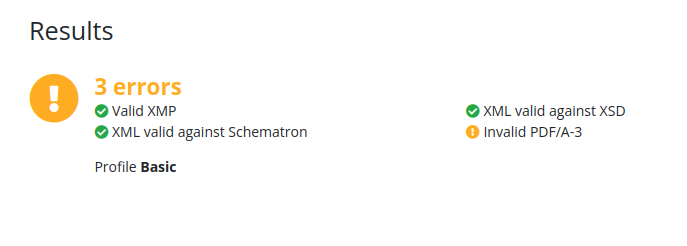


\newpage

# Jour 79 – Mise en place de la CI pour eInvoicing 🚀

Aujourd’hui, j’ai travaillé sur la **CI (Continuous Integration)** de notre projet **eInvoicing**, pour automatiser les tests et la vérification du code à chaque push ou pull request sur `main`.

## Mise en place de GitHub Actions 🛠️

Le workflow CI a été configuré pour couvrir **backend et frontend** :

* **Installation de Node.js** sur un runner Ubuntu, avec gestion de versions via `matrix.node-version`.
* **Cache des `node_modules`** pour le backend et le frontend, afin d’accélérer les builds et éviter les réinstallations inutiles.
* **Installation des dépendances** pour le backend et le frontend séparément.
* **Exécution des tests unitaires et d’intégration** pour le backend et le frontend, avec génération de rapports de couverture (`--coverage`).
* **Upload des artefacts de couverture** pour consultation et usage futur.

## Résultat de cette mise en place ✅

* La CI est désormais capable de **tester automatiquement** le backend et le frontend à chaque push ou pull request sur `main`.
* Les artefacts de couverture sont stockés et prêts à être utilisés pour un suivi de la qualité du code.
* Le workflow est structuré pour être facilement **étendu** à linting, Codecov, et d’autres vérifications automatiques à l’avenir.
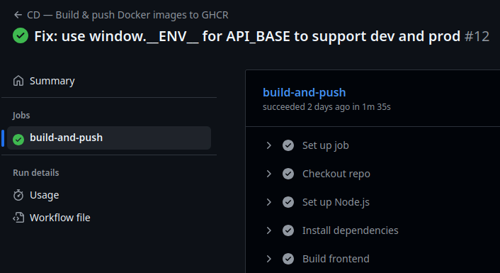

## 📌 Prochaines étapes

* **Ajouter le linting** pour imposer les bonnes pratiques sur backend et frontend.
* **Intégrer Codecov** avec un token pour suivre la couverture de code et visualiser les rapports.
* Enrichir les tests frontend pour couvrir davantage de composants critiques et d’intégrations.
* Documenter le workflow CI pour que son maintien et son évolution soient simples et clairs.


\newpage

# Jour 80 – Intégration de Codecov 📊✨

Aujourd’hui, j’ai attaqué l’intégration de **Codecov** pour notre projet **eInvoicing**, afin d’avoir un suivi clair de la couverture de tests sur toutes les branches et de mieux visualiser les zones de code à renforcer.

## Mise en place

1. **Installation et configuration**  
   J’ai ajouté Codecov dans notre pipeline CI. L’idée est simple : chaque push ou pull request déclenche les tests, puis le rapport de couverture est envoyé automatiquement à Codecov.

2. **Analyse de la couverture**  
   Grâce à Codecov, on peut désormais :
   - Visualiser la couverture globale du projet.
   - Identifier les fichiers ou fonctions peu testés.
   - Suivre l’évolution de la couverture au fil du temps.
  
   

3. **Badges et reporting**  
   J’ai ajouté un badge Codecov dans le README pour avoir un aperçu rapide de la couverture depuis GitHub. C’est motivant et très utile pour garder un œil sur la qualité du code.

   

## Retours

- La configuration a été assez simple, mais j’ai dû ajuster le chemin des rapports générés par **Vitest** pour qu’ils soient correctement interprétés par Codecov.
- La vue “diff coverage” est super pratique pour voir immédiatement si une PR réduit la couverture d’une partie critique.
- Globalement, ça donne un vrai **feedback rapide** sur les tests, ce qui va nous aider à renforcer la fiabilité de notre backend.

Prochaine étape : intégrer Codecov sur toutes les branches, et commencer à fixer les fichiers les moins couverts pour atteindre un seuil de couverture satisfaisant.


\newpage

# Jour 81 – Linter partout : backend et frontend 🧹✨

Aujourd’hui, j’ai consolidé la qualité du code sur **eInvoicing** en ajoutant le **lint côté backend**, en plus du frontend déjà en place. L’objectif était de s’assurer que chaque commit respecte les bonnes pratiques, évitant les erreurs subtiles et les variables inutilisées.

## Frontend ✅

Le lint côté frontend était déjà opérationnel. Après quelques ajustements sur les règles et suppression des avertissements inutiles, le pipeline CI détecte maintenant les problèmes de manière fiable avant même le merge.
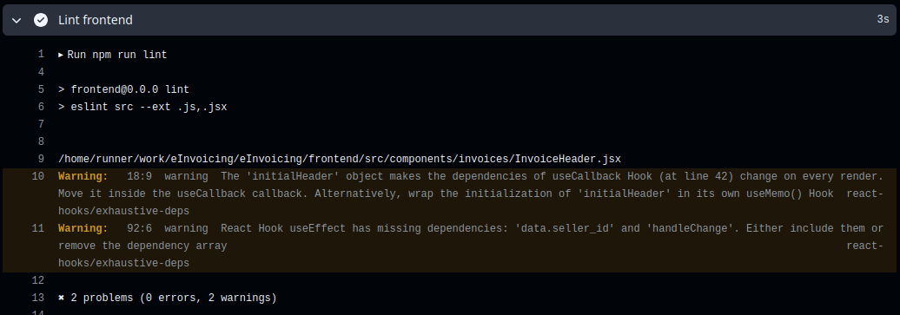


## Backend ✅

Pour le backend, j’ai ajouté un script `lint` dans le `package.json` et intégré l’exécution du lint dans le workflow GitHub Actions.  
Résultat :

* Les erreurs critiques comme les `require` ou `module` sont maintenant correctement gérées selon la configuration `ESLint`.
* Les warnings restants concernent surtout des variables déclarées mais non utilisées (`no-unused-vars`), que je vais nettoyer progressivement.
* La CI s’assure désormais que **tout commit côté backend respecte le style défini**, exactement comme pour le frontend.

## Workflow CI 🛠️

Le pipeline GitHub Actions est maintenant complet :

1. Installation et cache des dépendances backend et frontend.
2. Lint frontend et backend.
3. Exécution des tests avec couverture.
4. Upload des rapports de couverture sur Codecov.

Chaque push ou pull request sur `main` déclenche cette chaîne, garantissant une qualité constante du code sur les deux parties de l’application.

## Ressenti 🌟

Ça fait du bien de voir un **lint complet sur tout le projet**, ça clarifie les responsabilités et réduit les risques d’erreur. La mise en place côté backend a demandé un peu plus de patience, mais maintenant la CI est vraiment **cohérente et sécurisée** pour toutes les contributions.

> Prochain objectif : corriger progressivement les warnings backend pour que le lint ne laisse plus passer de petits oublis.


\newpage

# Jour 82 – Mise en place de la CD pour backend et frontend 🚀🐳

Aujourd’hui, j’ai travaillé sur la **Continuous Deployment** de **tout le projet eInvoicing**, pour pouvoir générer des images Docker prêtes pour la production, côté frontend et backend.

## Frontend ✅

* Passage à **Node 20** pour Vite + React, indispensable pour que le build fonctionne.  
* Ajout des dépendances manquantes dans le `package.json` :  
  `react-router-dom`, `react-bootstrap`, `react-select`, `react-datepicker`, `react-icons/fa`, `iban`, `@fortawesome/fontawesome-free`.  
* Création d’un **Dockerfile multistage** :  
  1. **Build stage** : installation des dépendances et génération du build Vite (`/dist`).  
  2. **Production stage** : Nginx pour servir les fichiers statiques.  
* Nettoyage du dossier Nginx et copie des fichiers `/dist`.  
* Exposition du port 80 et lancement de Nginx.  
* Résultat : image Docker finale propre, frontend opérationnel et prête à déployer.

## Backend ✅

* Préparation d’un **Dockerfile backend** :  
  - Utilisation de `node:20-alpine`.  
  - Installation des dépendances (`npm install`) et build si nécessaire.  
  - Configuration pour que l’application écoute sur le port défini.  
* Possibilité de **lancer backend et frontend ensemble via Docker Compose** pour simuler un environnement complet.  
* Objectif : générer une image prête pour déploiement et intégrable dans un pipeline CD.
  
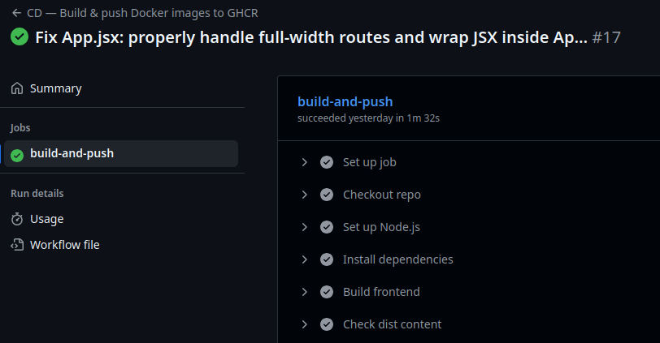

## Problèmes rencontrés ⚠️

* Erreurs Vite frontend liées à des modules manquants : résolues en ajoutant les dépendances.  
* Node version : nécessité de passer à Node 20 pour Vite.  
* Avertissements sur les chunks volumineux frontend (>500 kB) : non bloquants mais à optimiser plus tard.  

## Ressenti 🌟

La CD du projet est désormais opérationnelle : **images Docker frontend et backend prêtes**, testables localement et déployables dans n’importe quel environnement.  

Cette étape m’a permis de comprendre :

* L’importance de **tenir toutes les dépendances à jour** pour éviter les erreurs de build.  
* Comment **séparer build et production** avec Docker multistage.  
* Les bases pour **un pipeline CI/CD complet**, capable de générer et déployer automatiquement les images.

## 📌 Prochaines étapes

1. **Tester les images Docker** localement et via Docker Compose.  
2. **Intégrer ces images dans un pipeline CI/CD** pour déploiement automatisé.  
3. **Optimiser le build frontend** pour réduire la taille des chunks.  
4. **Ajouter monitoring et logs backend** dans l’image pour faciliter la supervision.


\newpage

# Jour 83 – CD frontend & backend 🎯🐳

Aujourd’hui, on a avancé sur la **Continuous Deployment (CD)** du projet **eInvoicing**, côté frontend et backend, avec Docker et GitHub Container Registry (GHCR).  

## Ce qu’on a fait **en local** ✅

### Backend
* On a construit l’image Docker du backend (`test-backend:latest`).  
* On a vérifié que **tous les fichiers essentiels sont présents**, notamment `src/config/db.js`.  
* On a testé le container local : `/health` fonctionne, les routes API sont prêtes.  
* On a géré les **conflits de ports** et les fichiers sensibles (`.env`) via `process.env`.  

### Frontend
* Build Vite + React fonctionnel en local.  
* On a créé l’image Docker du frontend avec **Nginx** pour servir les fichiers statiques.  
* Vérification locale : l’interface se lance, tout est bien compilé.  

> 💡 Astuce : toujours tester les images localement avant de les pousser, ça évite les surprises.

## Ce qu’on a fait côté **GitHub / GHCR** ✅

* Push des images frontend et backend sur GHCR :  
  * `ghcr.io/fbonnafous31/e-invoicing-backend:latest`  
  * `ghcr.io/fbonnafous31/e-invoicing-frontend:latest`  
* Création d’un **Personal Access Token** avec le scope `write:packages` pour Docker.  
* Vérification : les images GHCR correspondent aux images locales, fichiers clés présents.  
* Résolution des petits soucis classiques : login GHCR, ports déjà pris, fichiers sensibles non versionnés.  

## Ce qui fonctionne maintenant 🌟

* **Images Docker frontend et backend testées localement** ✅  
* **Images GHCR prêtes à être utilisées dans CD** ✅  
* CI/CD peut **reconstruire et pousser automatiquement** les images sans perte de fichiers.  
* Les fichiers sensibles (DB, secrets) sont gérés via **variables d’environnement**, plus de problème de `.gitignore`.  

## Prochaines étapes 📌

1. Intégrer les images dans le **pipeline CD GitHub Actions** pour déploiement automatisé.  
2. Tester le **déploiement complet** (frontend + backend).  
3. Ajouter les **secrets DB dans GitHub Actions** pour un build sécurisé.  
4. Vérifier que tous les endpoints API fonctionnent depuis GHCR.  


\newpage

# Jour 84 – Monitoring backend avec Prometheus & Grafana 📊🚀

Aujourd’hui, nous avons posé les **fondations du monitoring de notre backend Node.js** pour le projet **eInvoicing**, en s’appuyant sur **Docker, Prometheus et Grafana**.

## 🔹 Objectif du jour

* Pouvoir **suivre en temps réel les métriques du backend** : CPU, mémoire, event loop, heap, nombre de requêtes HTTP, handles actifs…
* Préparer l’infrastructure pour une **industrialisation complète** du monitoring.
* Avoir un environnement dockerisé **backend + Prometheus + Grafana** prêt à l’emploi.

---

## 🔹 Étapes réalisées

### 1️⃣ Exposition des métriques Node.js

* Création d’un **module `metrics.js`** dans `backend/src/monitoring` avec `prom-client`.
* Collecte des métriques par défaut : CPU, mémoire, event loop.
* Création d’un **histogramme pour la durée des requêtes HTTP**.
* Middleware Express ajouté avant toutes les routes pour mesurer chaque requête.
* Endpoint `/metrics` exposé pour Prometheus.

### 2️⃣ Adaptation du serveur Node.js (`server.js`)

* Intégration du **middleware Prometheus**.
* Vérification que `/health` fonctionne.
* Routes API existantes pour `/api/sellers`, `/api/clients`, `/api/invoices`.
* Fichiers statiques `/uploads` et `/pdf-a3` toujours accessibles.
* Middleware global d’erreurs conservé.

### 3️⃣ Dockerisation du monitoring

* Création d’un **dossier `backend/monitoring`** pour tout le monitoring.
* Rédaction d’un `docker-compose.yml` avec **3 services** :

  * `backend` → le serveur Node.js
  * `prometheus` → pour scrapper `/metrics`
  * `grafana` → pour visualiser les métriques
* Fichier `prometheus.yml` pour configurer le scraping du backend (`backend:3000`).

### 4️⃣ Vérification et tests

* Lancement des conteneurs :

```bash
cd ~/dev/eInvoicing/backend/monitoring
docker-compose up -d
```

* Accès aux interfaces :

  * Prometheus → [http://localhost:9090](http://localhost:9090)
  * Grafana → [http://localhost:3001](http://localhost:3001) (admin/admin)
* Configuration de Grafana :

  * Datasource `Prometheus` → URL `http://prometheus:9090`
  * Test de la connexion réussie.
* Vérification que les métriques du backend remontent correctement dans Prometheus.

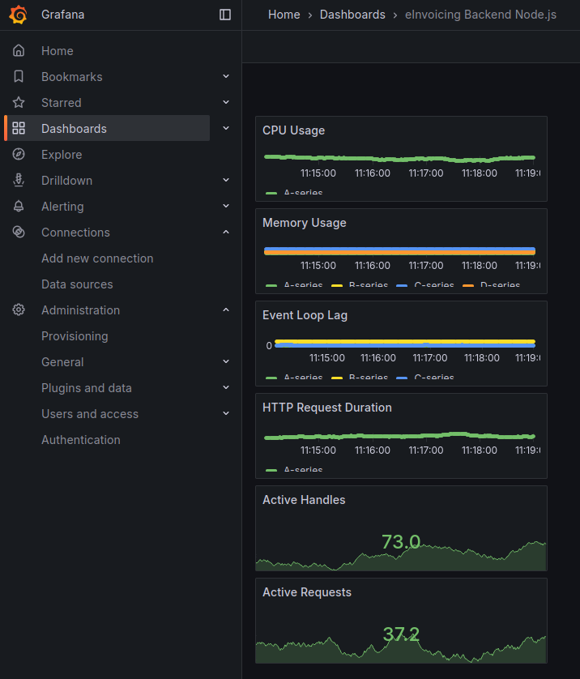

### 5️⃣ Points clés appris

* Les métriques Node.js sont cruciales pour **observer la santé et les performances** du serveur.
* Docker Compose permet de **mettre en place un environnement complet monitoring** rapidement.
* Grafana fournit une interface pour **visualiser et analyser les métriques** de manière simple.
* La bonne pratique : **isoler le monitoring dans un dossier dédié** (`backend/monitoring`).

---

## 🔹 Prochaines étapes

* Ajouter **des dashboards Grafana préconfigurés** pour CPU, mémoire, event loop et requêtes HTTP.
* Prévoir des **alertes** sur certains seuils critiques (CPU, heap, latence API).
* Étendre éventuellement le monitoring à d’autres services si nécessaire (PDP, frontend).
* Consolider l’**industrialisation** pour que le monitoring soit inclus dans les pipelines CI/CD.

---

💡 Aujourd’hui, nous avons donc posé **les bases solides pour un monitoring backend efficace et extensible**, prêt à évoluer avec le projet eInvoicing.


\newpage

# Jour 85 – Initialisation automatique de la DB et procédure de démarrage 🐳💾

Aujourd’hui, j’ai travaillé sur la mise en place d’une procédure de démarrage simple et reproductible pour eInvoicing, en particulier sur la base de données PostgreSQL.

## 🔹 Objectif du jour

- Avoir une procédure claire et rapide pour démarrer l’environnement complet : backend, frontend et DB.  
- Permettre la restauration automatique du dump SQL de la base lors de la première installation.  
- Réduire les interventions manuelles nécessaires pour tester l’application localement.  

## 🔹 Étapes réalisées

### 1️⃣ Analyse des problèmes d’automatisation

- L’utilisation de `docker-entrypoint-initdb.d` avec un dump SQL ne fonctionnait pas toujours si le volume persistait (`pgdata`).  
- Les scripts shell initiaux étaient exécutés **une seule fois** à la création du container, ce qui empêche de forcer la restauration sur un démarrage déjà existant.  
- Vérification : `SET search_path TO invoicing; \dt` dans `psql` ne pouvait pas s’exécuter directement via `docker-compose exec db` à cause de la syntaxe des commandes psql vs shell.  

### 2️⃣ Solution retenue

Créer un script **bash de démarrage manuel** pour restaurer le dump quand nécessaire :

```bash
#!/bin/bash
docker-compose up -d
docker-compose exec db bash
psql -U einvoicing -d einvoicing_local -f /docker-entrypoint-initdb.d/einvoicing.sql
```

- Ce script sert de guide rapide pour tester l’application ou repartir d’une base fraîche.  
- Stockage du script sous le nom : **start-einvoicing-guide.sh** pour référence et simplicité.  

### 3️⃣ Test complet local

- Démarrage via `docker-compose up -d` → backend et frontend **OK**.  
- Restauration manuelle du dump SQL → tables dans le schema `invoicing` bien présentes.  
- Vérification endpoints :  
  - Backend `/health` → **OK**  
  - Frontend sur `http://localhost:8080` → interface accessible  

### 4️⃣ Points clés appris

- Volumes Docker persistants empêchent la réinitialisation automatique des données : il faut gérer la restauration via script ou supprimer le volume.  
- La procédure manuelle reste simple et fiable, surtout pour le développement local.  
- **Important** : séparer le dump et le script de restauration pour pouvoir contrôler quand et comment la DB est restaurée.  

## 🔹 Prochaines étapes

- Automatiser la restauration conditionnelle du dump selon l’état du volume, pour simplifier l’installation sur une machine vierge.  
- Documenter la procédure complète de démarrage local dans le `README` du projet.  
- Intégrer éventuellement la restauration DB dans le pipeline **CD** pour tests automatisés.  

💡 Aujourd’hui, nous avons donc posé une procédure de démarrage fiable pour eInvoicing, avec base de données restaurée, backend et frontend opérationnels, prête à être utilisée par n’importe quel développeur ou pour les tests locaux.  

\newpage

# Jour 86 – Finalisation du déploiement et réflexions sur la production 🛠️🚀

Aujourd’hui, j’ai travaillé sur la **finalisation du déploiement** de eInvoicing, en consolidant toutes les étapes précédentes et en automatisant au maximum le démarrage pour un développeur ou un testeur local. Même si beaucoup de progrès ont été faits, le déploiement complet n’est pas encore terminé et plusieurs points restent à finaliser.

## 🔹 Objectif du jour

* Automatiser la restauration de la base de données pour tout démarrage sur une machine vierge.
* Assurer que **frontend et backend** utilisent correctement les variables d’environnement et les URLs dynamiques.
* Corriger les problèmes de JWT et de CORS.
* Vérifier que l’authentification via Auth0 fonctionne sans blocage.
* Comprendre les contraintes spécifiques liées à un déploiement en **production**.

## 🔹 Étapes réalisées

### 1️⃣ Automatisation de la base de données

* Création d’un **script bash `start-einvoicing.sh`** qui démarre les services et restaure automatiquement le dump SQL si la base est vide :

```bash
#!/bin/bash

# Démarre les services
docker-compose up -d

# Vérifie si la base est vide
if docker-compose exec db psql -U einvoicing -d einvoicing_local -c "\dt" | grep -q "invoicing"; then
  echo "La base est déjà initialisée, pas de restauration nécessaire."
else
  echo "Restauration du dump SQL..."
  docker-compose exec db psql -U einvoicing -d einvoicing_local -f /docker-entrypoint-initdb.d/einvoicing.sql
fi
```

* Cela permet un **démarrage reproductible**, tout en préservant les données existantes.
* La gestion des volumes Docker persistants est essentielle : elle empêche d’écraser la base inutilement et permet de contrôler quand la restauration a lieu.

### 2️⃣ Variables d’environnement et configuration dynamique

* Les variables **VITE_** doivent être adaptées selon l’environnement :

```js
const env = import.meta.env.DEV
  ? import.meta.env            // dev → .env Vite
  : window.__ENV__ || {};      // prod → config.js injecté par Nginx

const API_BASE = `${env.VITE_API_URL ?? 'http://localhost:3000'}/api/sellers`;
```

* Les **URLs backend** et endpoints dynamiques permettent de passer facilement d’un environnement à l’autre (local, test, prod).
* En production, un **fichier `config.js` injecté par Nginx** permettra de configurer rapidement les URLs et variables spécifiques à chaque client, sans toucher au code source.

### 3️⃣ Authentification et sécurité

* **Auth0** a été configuré pour le frontend : clients, redirections, scopes OpenID et profile.
* Test complet : connexion, génération et validation des JWT côté backend.
* Les routes sensibles sont maintenant correctement restreintes.

### 4️⃣ Résolution JWT et CORS

* Les **JWT mal formés** provenaient d’une mauvaise URL ou d’un client Auth0 mal configuré.
* Les problèmes **CORS** (cross-origin requests bloquées par le navigateur entre frontend et backend sur des ports différents) ont été résolus en configurant **Nginx comme reverse proxy** : toutes les requêtes passent par le même host et port.

### 5️⃣ Test partiel du déploiement local

* Démarrage via `./start-einvoicing.sh` → **frontend et backend opérationnels**.
* Tables du schema `invoicing` présentes et peuplées.
* Authentification et appels API testés → **OK**.
* Cependant, **certains aspects restent à finaliser** pour rendre le déploiement entièrement automatique et sécurisé.

### 6️⃣ Réflexion sur la production

Ce que je n’avais pas pressenti, c’est que **la production impose des contraintes spécifiques**, même si tout fonctionne en développement.

Dans un projet avec :

* Base de données à initialiser et sécuriser,
* Authentification avec JWT, mots de passe et secrets,
* Accès à des services externes (Auth0, API, etc.),
* Variables d’environnement spécifiques pour configurer URLs et endpoints,

il est indispensable d’adapter ces paramètres pour garantir :

* **Sécurité** : jamais de secrets ou mots de passe en clair.
* **Fiabilité** : services backend et frontend communiquent correctement.
* **Reproductibilité** : déploiement simple sur n’importe quelle machine ou serveur.

💡 En résumé : un projet peut tourner en local, mais **la production est un autre monde**. Adapter chaque configuration est indispensable pour transformer un prototype fonctionnel en produit réellement exploitable et sécurisé.

## 🔹 Points clés appris

* Le déploiement est souvent **plus exigeant que le développement** : DB, variables d’environnement, Auth0, JWT, CORS et reverse proxy.
* Automatiser les étapes critiques réduit drastiquement les risques d’erreur et facilite la vie des développeurs.
* Un produit n’est réellement prêt que lorsqu’il peut être **déployé facilement et de manière fiable**, quelle que soit la machine ou l’environnement.
* Malgré les progrès réalisés, **le déploiement complet n’est pas encore terminé** ; plusieurs points restent à finaliser pour atteindre une version pleinement automatisée et production-ready.

## 🔹 Prochaines étapes

* Terminer l’automatisation complète de la restauration DB et de la configuration dynamique.
* Documenter entièrement la procédure de démarrage local et production dans le `README`.
* Préparer un **playbook pour la production**, avec scripts, configuration Nginx et Auth0.
* Ajouter éventuellement des tests automatisés pour vérifier la bonne initialisation de la DB et du backend dans les pipelines CI/CD.

💡 Aujourd’hui, j’ai donc consolidé un déploiement partiellement automatisé et sécurisé, prêt pour les tests locaux, tout en gardant en tête les adaptations nécessaires pour la production finale.


\newpage

# Jour 87 – Déploiement finalisé en local et premières réussites 🎉🐳

Aujourd’hui, je continue la saga du déploiement eInvoicing et je touche enfin à un **point de stabilité réel** : tous les conteneurs tournent, la base est accessible, et l’application communique correctement entre le frontend et le backend. Même si tout n’est pas parfait, l’impression de réussite est énorme.

---

## 🔹 Objectif du jour

* Valider que le **stack complet fonctionne localement** : DB, backend, frontend et Auth0.
* Automatiser le démarrage avec le script bash existant pour que tout soit prêt en un seul passage.
* Identifier les points restant à corriger pour une expérience pleinement fonctionnelle.

---

## 🔹 Étapes réalisées

### 1️⃣ Validation complète de la DB et du backend

* Les variables d’environnement sont correctement chargées dans le backend (sans inclure les mots de passe dans ce document).
* Test de connexion depuis le container backend :

```bash
node -e "const { Pool } = require('pg'); const pool = new Pool({ user:process.env.DB_USER, password:process.env.DB_PASSWORD, host:process.env.DB_HOST, database:process.env.DB_NAME, port:process.env.DB_PORT }); pool.query('SELECT NOW()').then(r => console.log(r.rows)).catch(console.error)"
```

> ✅ Résultat : la base répond correctement, on peut interroger les tables `invoicing`.

* La route `/api/sellers/me` fonctionne parfaitement via **curl avec token Auth0** :

```bash
curl -H "Authorization: Bearer <JWT_VALID>" http://localhost:3000/api/sellers/me
```

> ✅ Retour correct du vendeur avec toutes les informations.

---

### 2️⃣ Frontend et variables runtime

* Injection runtime via `window.__ENV__` pour le frontend compilé :

```js
window.__ENV__ = {
  VITE_API_URL: 'http://localhost:3000',
  VITE_AUTH0_DOMAIN: '<AUTH0_DOMAIN>',
  VITE_AUTH0_CLIENT_ID: '<AUTH0_CLIENT_ID>',
  VITE_AUTH0_AUDIENCE: '<AUTH0_AUDIENCE>'
};
```

* Copie dans le conteneur et reload de Nginx :

```bash
docker cp frontend/public/config.js einvoicing-frontend:/usr/share/nginx/html/config.js
docker exec einvoicing-frontend nginx -s reload
```

> ✅ Le frontend compilé peut maintenant communiquer avec le backend **sans avoir besoin de recompiler**.

---

### 3️⃣ Automatisation du démarrage

Le script `start-einvoicing.sh` est désormais presque complet :

* Démarrage des conteneurs
* Copie des fichiers de configuration (`config.js`, `index.html`, `default.conf`)
* Reload de Nginx
* Vérification et restauration de la base si nécessaire

> ✅ Résultat : un développeur peut lancer **tout le stack local en une seule commande** et avoir un système fonctionnel.

```bash
#!/bin/bash
# ===================================================
# Guide de démarrage eInvoicing
# ===================================================

# Récupère les dernières images
docker-compose pull

# Stoppe et supprime les conteneurs existants
docker-compose down

# Lancer tous les conteneurs
docker-compose up -d

# Chargement du dump DB (si DB vide)
docker-compose exec db psql -U einvoicing -d einvoicing_local -c "\dt" | grep -q "invoices" || docker-compose exec db psql -U einvoicing -d einvoicing_local -f /docker-entrypoint-initdb.d/einvoicing.sql && echo "Restauration du dump SQL effectuée !"

# Copier le config.js dans le conteneur frontend afin d'injecter les variables d'environnement
docker cp frontend/config.js einvoicing-frontend:/usr/share/nginx/html/config.js

# Copier la configuration Nginx personnalisée dans le conteneur frontend.
# - Résout les problèmes CORS 
# - Gère le proxy vers /api/ pour le backend Node.js
# - Sert correctement les fichiers statiques dans /assets/ pour éviter les erreurs de type MIME
# - Permet le fallback SPA pour React (toutes les routes non existantes pointent vers index.html)
# - Gère l'accès aux fichiers uploadés via /uploads/
docker cp frontend/default.conf einvoicing-frontend:/etc/nginx/conf.d/default.conf

# Recharger Nginx pour prendre en compte le nouveau config.js
docker exec einvoicing-frontend nginx -s reload
```
---

### 4️⃣ Points positifs

* La DB est accessible et persistante grâce aux volumes Docker.
* Authentification Auth0 avec JWT fonctionne.
* Les transactions backend → DB sont opérationnelles.
* Le docker-compose est maintenant correct et stable.
* L’automatisation permet un démarrage reproductible pour tests locaux.

---

### 5️⃣ Points encore à améliorer

* Génération de PDF à revoir pour fiabilité et taille.
* UI : les listes longues ne prennent pas toujours la largeur complète.
* Logout côté frontend provoque une erreur à corriger.
* Mock-PDP non fonctionnel, à réintégrer pour tests.

---

### 6️⃣ Émotions et réflexions

Après un démarrage à **7h du matin**, voir les conteneurs tourner et le backend répondre correctement à la première requête est **immense** 😭🎉.

Même si des détails restent à corriger, les **fondations sont solides** :

* Les conteneurs communiquent.
* La DB est sécurisée et persistante.
* Les routes sécurisées fonctionnent avec JWT.
* Le frontend compilé peut être configuré dynamiquement.

C’est la **première fois que je réussis à déployer mes conteneurs et voir l’application fonctionner de bout en bout** !

---

### 7️⃣ Prochaines étapes

* Corriger les **bugs UI et PDF**.
* Fixer le **logout** pour éviter les erreurs côté frontend.
* Réintégrer et tester le **mock-PDP**.
* Documenter le **process complet** pour un autre développeur ou pour production.
* Finaliser la procédure de **déploiement local et production** avec tous les scripts et configurations Nginx/Auth0.

---

💡 En résumé :

Jour 87 marque **une grande victoire pour le déploiement local**. Tout est opérationnel, le système est sécurisé, et l’automatisation permet maintenant de lancer eInvoicing rapidement. Il reste des détails à peaufiner, mais la base est solide et fonctionnelle ! 🚀


\newpage

# Jour 88 – Progrès sur la stabilité et la fiabilité du frontend et Nginx 🚀🛠️

Aujourd’hui, l’objectif principal était de **fiabiliser l’expérience frontend**, d’assurer que les fichiers PDF et assets sont correctement servis, et de consolider la configuration Nginx pour que toutes les routes SPA fonctionnent correctement. On a aussi clarifié le flux de logout et sécurisé le stockage des fichiers uploadés.  

---

## 🔹 Objectif du jour

* Assurer que le frontend fonctionne **en production ou en dev** sans recompiler.  
* Stabiliser le routage SPA et la gestion des assets (`/assets`, `/uploads`).  
* Corriger le flux de logout Auth0 pour qu’il redirige vers la bonne URL.  
* Identifier les points restant à corriger côté métier : PDF, mock-PDP et erreurs 500.

---

## 🔹 Étapes réalisées

### 1️⃣ Variables runtime et config.js

* Injection de `window.__ENV__` via `config.js` pour que le frontend compilé lise dynamiquement l’URL du backend et Auth0.  
* Déplacement des scripts à la fin du `<body>` pour garantir que `config.js` est chargé **avant** le bundle React.  

> ✅ Le frontend peut maintenant utiliser les variables runtime dynamiquement, sans recompilation.

---

### 2️⃣ Assets, uploads et Nginx

* Correction du routage SPA avec `try_files $uri /index.html;` → plus de 404 sur `/login` et autres routes React.  
* Correction des erreurs MIME type pour les bundles JS dans `/assets/` → plus de `NS_ERROR_CORRUPTED_CONTENT`.  
* Gestion de `/uploads/` pour stocker et servir les fichiers PDF ou images uploadées.  
* Mise à jour de `docker-compose.yml` pour inclure correctement le volume des uploads.  

> ✅ L’ensemble des assets et fichiers uploadés sont accessibles et le frontend peut fonctionner pleinement.

---

### 3️⃣ PDF et UI

* Affichage des PDF dans le viewer corrigé.  
* Les listes longues sont désormais full width.  
* Les PDFs sont correctement stockés dans le conteneur et servis via Nginx.  

> ✅ L’expérience utilisateur est plus fluide et fiable.

---

### 4️⃣ Auth0 / Logout

* Analyse et correction du flux logout : Auth0 redirige maintenant vers la bonne URL (`window.__ENV__.VITE_APP_URL`).  
* Vérification de la configuration des **Allowed Logout URLs** pour dev (`5173`) et prod (`8080`).  

> ✅ Le logout fonctionne sans erreur et la redirection est cohérente.

---

### 5️⃣ Déploiement et process dev → prod

* Validation complète du script de démarrage et du déploiement.  
* Test de la SPA, des assets, des uploads et du backend après reload de Nginx.  
* Correction de la config Nginx pour que le reverse proxy `/api/` fonctionne correctement et que le SPA fallback soit opérationnel.  

> ✅ Le système est stable et prêt à être utilisé par d’autres développeurs ou en production locale.

---

### 6️⃣ Points encore à améliorer

* Génération du PDF depuis l’écran de création de facture.  
* Mock-PDP non fonctionnel, à réintégrer pour tests.  
* Erreur 500 lorsque la facture existe déjà en base (le feedback DB ne remonte pas correctement).  

---

### 7️⃣ Émotions et réflexions

Après une matinée à **corriger le routage, les assets et la config Nginx**, l’application est beaucoup plus **robuste et fiable**. Le frontend et le backend communiquent correctement, et les fichiers PDF sont maintenant servis comme attendu.  

Le sentiment d’avancer vers une **version stable et testable par des tiers** est très fort, même si quelques détails métiers restent à finaliser.

---

### 8️⃣ Prochaines étapes

* Implémenter la **génération de PDF** depuis l’écran de création de facture.  
* Réintégrer le **mock-PDP** pour permettre des tests automatisés ou manuels.  
* Corriger l’**erreur 500** pour que le feedback de la DB remonte correctement lorsque la facture existe déjà.  
* Continuer à consolider le processus **dev → prod** et les tests de bout en bout.  

---

💡 **Résumé**

Jour 88 marque **une avancée majeure côté frontend et Nginx** : SPA stable, assets et uploads servis correctement, PDF et UI fiabilisés, logout sécurisé. Les prochaines étapes concernent essentiellement la **logique métier et les tests** pour atteindre un produit pleinement opérationnel. 🎯


\newpage

# 📝 Journal de bord eInvoicing – Déploiement & apprentissage DevOps

## Contexte général
Je travaille sur **eInvoicing**, une application web pour la gestion complète des factures : création, suivi, génération PDF et Factur-X, pièces jointes, clients, vendeurs, tout y est.  
Frontend en **React + Vite**, backend en **Node.js + Express**, base de données **PostgreSQL**.  
Objectif final : industrialiser le projet pour qu’il se déploie **n’importe où en un clic**, avec pipeline CI/CD, Docker et bonne hygiène DevOps.

## Ce que j’avais prévu
Je pensais passer une journée pour tout déployer et hop… magie, tout fonctionne.  
…Spoiler : la réalité est un peu plus complexe 😅

## Les surprises du déploiement
- Les **containers Docker** et volumes DB/upload demandent une attention particulière.  
- La **configuration Auth0/JWT** change entre dev et prod.  
- Les **variables d’environnement** doivent être parfaitement alignées selon le contexte.  
- Les **fichiers PDF, XML Factur-X et uploads** peuvent poser problème selon les chemins et permissions.  
- **CORS et accès réseau** : ce qui fonctionne en dev ne passe pas forcément en prod.  
- Même certains bouts de code corrects en dev peuvent **échouer en prod**.  

## Les apprentissages clés
- Découverte de l’**univers DevOps** : penser système, réseau et sécurité, pas juste logique métier.  
- Compréhension que **“ça marche sur mon poste”** est un vrai problème, et qu’il existe un **fossé réel entre dev et production**.  
- Travailler en solo comme dev et “Ops” permet d’**industrialiser un produit**, le rendre portable, robuste et reproductible.  
- Chaque galère est une leçon sur **cohérence des environnements et robustesse d’un produit**.

## Les moments magiques
- Après des heures de galère, voir mon projet **se lancer en quelques secondes n’importe où** est un vrai moment de satisfaction.  
- Le projet devient **un produit industrialisé**, prêt à être utilisé, déployé et maintenu.  
- Je vois désormais la **différence entre développement pur et production-ready**, et ça ouvre des perspectives sur la collaboration Dev/Ops dans des équipes plus grandes.

## Conclusion
Ce déploiement a pris beaucoup plus de temps que prévu, mais ce que j’ai appris dépasse largement le simple fait de mettre l’application en ligne.  
- Vision macro du système acquise.  
- Confiance dans le fait que le produit peut tourner **partout de manière fiable**.  
- Meilleure compréhension des enjeux humains et techniques du passage en production.  

C’est un vrai tournant dans mon parcours de développeur : je ne fais plus seulement du code, je construis **un produit solide, industrialisé et prêt pour le monde réel**.

---

### Notes de tips techniques
- Toujours **tester le pipeline CI/CD dans un environnement proche de la prod** avant déploiement officiel.  
- Vérifier les **volumes Docker** pour DB et uploads afin de ne pas perdre de données.  
- Confirmer que **toutes les variables d’environnement** sont bien injectées pour dev et prod.  
- Prévoir des **logs et monitoring** pour détecter les erreurs en prod.  
- Garder un **README clair et à jour** pour faciliter le passage à une équipe ou un autre serveur.  


\newpage

# 📝 Bilan eInvoicing – Semaine PDF/A3, CI/CD, monitoring & déploiement 🚀

Cette semaine a été **intense et pleine de découvertes**, avec des hauts, des bas et des petites victoires qui font vraiment plaisir à voir.

## PDF/A‑3 : presque parfait… mais pas encore 🕵️‍♂️📄

* Je suis passé de **14 à 3 erreurs** pour la conformité ISO 19005.
* Côté positif : mon PDF/A3 est **fonctionnel, bien formé et exploitable** pour les utilisateurs.
* Côté frustrant : même si tout est utilisable, il ne répond pas encore **à 100% à la norme ISO**.
* Le vrai challenge commence maintenant : corriger ces 3 dernières erreurs coûte de plus en plus cher en temps et nécessite de **plonger dans du développement bas niveau**, tout en conservant la simplicité et l’âme du projet.

> Sentiment mitigé : j’ai un PDF opérationnel, mais je reste en quête de conformité ISO.

---

## CI/CD : des mystères éclaircis 🛠️✨

* Je pensais que la mise en place de la CI et de la CD allait être un **vrai casse-tête**, moi qui n’avais jamais manipulé ça.
* En réalité, avec l’aide de l’IA, ce n’est **pas si compliqué**.
* Bonus fun : j’ai ajouté un **badge de couverture de code** dans le README. Maintenant, je vois en un coup d’œil l’état des tests et ça motive vraiment !
* Sentiment : **découverte rassurante et satisfaisante**, je maîtrise enfin la chaîne d’intégration et de déploiement.

---

## Monitoring : poser les fondations 📊👀

* Prometheus et Grafana : je n’y connaissais **rien du tout**, mais j’ai réussi à les **mettre en place rapidement avec un guidage intelligent**.
* Objectif atteint : **les fondations sont là**, les métriques de base remontent, et tout est accessible.
* La prochaine étape : choisir les bons indicateurs pour le projet et créer des dashboards vraiment pertinents.
* Sentiment : **curiosité éveillée**, prêt à explorer davantage quand ce sera nécessaire.

---

## Automatisation du déploiement : la grande aventure 🐳💥

* J’avais naïvement pensé : « déployer = mettre le code en prod ». Haha… la réalité est beaucoup plus corsée 😅

* Ce que j’ai découvert : **déployer correctement, automatiquement et reproductiblement**, c’est un vrai chantier !

  * Restaurer un dump SQL correctement
  * Gérer les **variables d’environnement** et la configuration dynamique du frontend
  * Résoudre les **problèmes de CORS** et de reverse proxy Nginx
  * Assurer que **les volumes Docker** contiennent les fichiers persistants (DB, uploads)
  * Authentification et sécurisation JWT
  * Et même certains bouts de code fonctionnels en dev à reprendre pour que ça marche en prod

* Sentiment : énorme **travail de fond**, mais **énorme satisfaction** d’être presque arrivé au bout ! 🎉

---

## ✅ Points clés et réflexions

* **PDF/A3** : fonctionnel mais pas encore ISO parfait → patience et minutie requises.
* **CI/CD et badges** : fun et rassurant, ça donne un vrai aperçu de la qualité du projet.
* **Monitoring** : posé, prêt à évoluer, fondations solides.
* **Déploiement** : un vrai passage au monde réel du DevOps, avec tout ce que ça implique.

> Sentiment général : **fier et motivé**. La semaine a été intense, j’ai appris énormément et je vois clairement que mon projet devient un **produit industrialisé et robuste**, presque prêt à tourner en production avec un vrai processus DevOps derrière.


\newpage

# Jour 91 – Finalisation de l’environnement de production et génération de PDF 📄🚀

Aujourd’hui, l’objectif était de **finaliser l’environnement de production** pour qu’il fonctionne de manière stable comme la dev, avec un focus majeur sur la génération de PDF, la remontée des feedback d’erreurs et la préparation du mock-PDP pour les tests.

---

## 🔹 Objectifs du jour

* Implémenter la **génération de PDF** depuis l’écran de création de facture en production.
* Accéder et vérifier la conformité PDF/A3.
* Corriger les **erreurs 500** pour que le feedback de la DB remonte correctement lorsque la facture existe déjà.
* Finaliser et stabiliser le **mock-PDP** dans l’environnement prod pour tests métier.
* Consolider l’environnement **prod** pour qu’il soit cohérent avec la dev déjà fonctionnelle.

---

## 🔹 Étapes réalisées

### 1️⃣ Génération PDF depuis la création de facture

* Intégration du processus de génération PDF directement depuis l’UI en prod.
* Vérification que le PDF est correctement créé, stocké et accessible.
* Validation que le PDF/A3 répond à la norme ISO 19005 avec un nombre minimal d’erreurs.

> ✅ L’utilisateur peut maintenant générer et visualiser les PDF depuis l’écran de création de facture en production, comme en dev.

---

### 2️⃣ Gestion des erreurs 500 et feedback DB

* Correction des cas où la facture existante en base provoquait une erreur 500.
* Les feedback d’erreurs (facture déjà existante ou problème serveur) remontent correctement au frontend via JSON.
* Tests manuels pour vérifier que toutes les erreurs critiques sont correctement capturées et affichées.

> ✅ Les erreurs critiques sont désormais visibles côté frontend et peuvent être traitées, améliorant la fiabilité du flux métier.

---

### 3️⃣ Stabilisation du mock-PDP en production

* Déploiement du mock-PDP dans le conteneur prod avec `docker-compose`.
* Vérification des endpoints `/invoices`, `/invoices/:id/send` et `/invoices/:submissionId/lifecycle`.
* Logs filtrés pour ne pas afficher les JWT et éviter le bruit.
* Tests d’envoi de facture et suivi du `submissionId` pour s’assurer que le mock fonctionne comme attendu.

> ✅ Le mock-PDP est opérationnel pour les tests métier, tout en restant stable et isolé du backend réel.

---

### 4️⃣ Finalisation de l’environnement prod

* Vérification que les services frontend, backend et DB communiquent correctement.
* Consolidation des volumes, routage et configuration Nginx pour que tout fonctionne sans recompiler la dev.
* Assurance que les PDF et assets sont servis correctement et que la prod est alignée avec la dev.

> ✅ L’environnement de production est maintenant fonctionnel, stable et prêt pour des tests utilisateurs ou QA.

---

### 5️⃣ Points à améliorer

* Continuer à **stabiliser le serveur mock-PDP** pour gérer des tests intensifs en production.
* Monitorer la génération de PDF/A3 pour détecter toute non-conformité résiduelle.
* Automatiser les tests de feedback DB et PDF pour fiabiliser encore plus le flux prod.

---

### 6️⃣ Émotions et réflexions

La session a été très productive : l’environnement de production est **pratiquement au même niveau que la dev**, avec la génération PDF pleinement fonctionnelle et les erreurs critiques remontées correctement. La stabilisation du mock-PDP en prod permet d’envisager des tests métier sans risque pour la base réelle.

Le sentiment de **passer d’une prod instable à un environnement complet et fiable** est très positif.

---

### 7️⃣ Prochaines étapes

* Stabiliser le serveur **mock-PDP** en production pour tests intensifs.
* Continuer à fiabiliser le processus de bout en bout **dev → prod**.

---

💡 **Résumé**

Jour 91 marque la **finalisation majeure de l’environnement de production** : PDF générés depuis l’UI, feedback d’erreur DB remontés, mock-PDP prêt pour tests métier, prod alignée avec dev. La prochaine priorité reste la **stabilisation du mock-PDP en production**. 🎯


\newpage

# Jour 92 -- Automatisation du déploiement et intégration du mock-PDP ⚙️📦

Aujourd'hui, l'objectif était de **finaliser l'automatisation de la procédure de déploiement**, en intégrant la mise en place de l'outil de simulation (**mock-PDP**) qui permet de tester le flux métier comme si l'application dialoguait avec une PDP homologuée.

## 🔹 Objectifs du jour

-   Mettre en place le **mock-PDP en local** pour simuler les interactions avec une plateforme de centralisation de factures.
-   Automatiser la **procédure complète de déploiement** (frontend, backend, DB).
-   Rendre le déploiement reproductible via un **script unique** et basé sur `docker-compose`.
-   Aligner l'environnement local avec les besoins réels (injections de variables, configuration Nginx, restauration DB).

## 🔹 Étapes réalisées

### 1️⃣ Mise en place du mock-PDP

-   Installation et configuration du mock-PDP dans l'environnement local.
-   Tests des endpoints `/invoices`, `/send` et `/lifecycle` pour valider le dialogue avec le backend.
-   Vérification que le mock s'intègre naturellement dans le flux de facturation, comme une PDP réelle.

> ✅ Le mock-PDP permet désormais de simuler un échange complet, sans dépendre d'une plateforme externe.

### 2️⃣ Automatisation du déploiement

-   Création d'un **script de démarrage unique** (`start-einvoicing.sh`) qui enchaîne toutes les étapes nécessaires :
    -   Pull des images frontend & backend depuis GitHub.
    -   Arrêt / suppression des anciens conteneurs.
    -   Relance des services via `docker-compose up -d`.
    -   Vérification et restauration automatique du **dump SQL** si la base est vide.
    -   Injection des variables d'environnement dans le frontend (`config.js`).
    -   Mise à jour de la configuration **Nginx** (CORS, proxy API, assets, fallback React).
    -   Reload automatique de Nginx.
-   Le déploiement repose uniquement sur le **docker-compose.yml**, garantissant portabilité et cohérence entre environnements.

> ✅ Une seule commande permet désormais de déployer un environnement complet, stable et prêt à l'usage.

### 3️⃣ Procédure consolidée

``` bash
# Étapes clés de la procédure automatisée

docker-compose pull                # Récupération des dernières images
docker-compose down                # Nettoyage des anciens conteneurs
docker-compose up -d               # Redémarrage des services
# Vérification et restauration DB
# Injection config.js & conf Nginx
# Reload Nginx pour prise en compte
```

> ✅ Le déploiement est reproductible, documenté et industrialisable.

## 🔹 Points d'amélioration
-   Ajouter des **tests automatiques** post-déploiement pour vérifier le bon fonctionnement (mock-PDP, API, génération PDF).
-   Préparer un **pipeline CI/CD** qui s'appuie sur cette procédure pour un déploiement encore plus fluide.

## 🔹 Émotions et réflexions
La mise en place de ce script marque une étape clé : le déploiement, qui était jusque-là manuel et sensible aux oublis, est devenu **simple, reproductible et fiable**.
Le fait de pouvoir simuler une PDP localement apporte une sérénité énorme : on peut tester tout le cycle de facturation **sans dépendre d'un prestataire externe**.

C'est une vraie avancée vers un produit stable, robuste et industrialisé. 🚀

## 🔹 Prochaines étapes
- Mettre en place un environnement de staging afin de permettre des tests sans authentification et en respectant les règles RGPD
- Finaliser la conformité PDF/A-3** : Résoudre les derniers points techniques (pour obtenir une validation ISO 19005-3 complète).
- Communiquer sur le projet : Terminer les carousels LinkedIn et planifier leur publication


## 💡 **Résumé**

Le produit se dote d'une procédure fiable de **finalisation de l'automatisation du déploiement** avec un script unique et l'intégration du **mock-PDP**. Désormais, l'environnement peut être redéployé en un clic, tout en simulant une plateforme PDP réelle. Un jalon important vers la fiabilité et l'industrialisation. 🎯

\newpage

# Jour 93 – Mise en route de l’environnement de staging 🌱✨

Aujourd’hui, j’ai commencé à poser les bases d’un **environnement de staging**, l’idée étant d’avoir un espace de démo pour que l’on puisse tester l’application facilement, tout en gardant une approche **RGPD-friendly**.

## 🔹 Objectif du jour

* Créer une **base de données dédiée au staging**.
* Repartir de l’environnement de développement et l’adapter pour en faire un vrai espace **accessible et simple à utiliser**.
* Préparer le terrain pour que toute personne intéressée puisse naviguer dans l’app avec un cadre conforme et sécurisé.

## 🔹 Avancement

* La **DB de staging est en place** ✅
* Les premières adaptations ont commencé pour injecter automatiquement un **vendeur et ses données associées**, afin de simplifier l’expérience utilisateur.
* Le backend a été configuré pour reconnaître ce mode staging et gérer les requêtes sans exiger de login.

## 🔹 Réflexion du jour

Mettre en place ce staging, c’est un peu comme ouvrir une porte d’entrée “visiteur” dans l’app : pas besoin de badge ni de clés, mais tout en gardant une structure claire et respectueuse des données.

## 🔹 Prochaines étapes

* Finaliser la mise en place côté **frontend** pour que tout s’affiche proprement.
* Vérifier le cycle complet (vendeur → clients → factures → PDF) en mode démo.
* Partager le lien pour avoir des premiers retours “à froid”.

---

👉 Bref, aujourd’hui c’était le premier pas vers une **version démo publique** du produit, et ça fait plaisir de voir l’app se rendre plus accessible. 🚀


\newpage

# Jour 94 – Consolidation et finalisation de l’environnement de staging 🛠️🚀  

Aujourd’hui, j’ai poursuivi le travail sur l’**environnement de staging** et je peux dire qu’il est désormais **terminé et fonctionnel**.  
L’objectif était de proposer un espace de démo **RGPD-friendly**, utilisable via Auth0 mais avec un **compte unique partagé** pour l’ensemble des testeurs.  

## 🔹 Objectif du jour  

* Bloquer toutes les actions sensibles (création/mise à jour de clients et vendeurs) pour le mode staging.  
  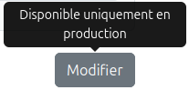
* Finaliser la génération des documents (PDF, Factur-X XML, PDF/A3).  
* Mettre en place un **mock PDP** pour simuler l’envoi des factures et la réception des statuts.  

## 🔹 Avancement  

* **RGPD et staging** ✅  
  - Suppression des accès et actions de création/mise à jour des clients et vendeurs.  
  - Blocage de la création de factures et de l’import de documents.  
  - Conservation de l’authentification via **Auth0**, mais simplifiée avec un **compte unique partagé**.  

* **Génération de documents** ✅  
  - Stabilisation complète du flux de génération PDF, Factur-X XML et PDF/A3.  
  - Tous les artefacts sont maintenant produits correctement en mode démo.  

* **Mock PDP** ✅  
  - Mise en place d’un mock PDP pour **accepter les envois de factures** (`POST /invoices`).  
  - Ajout d’un **système de simulation de statuts** : chaque facture envoyée reçoit ensuite un retour fictif (`ACCEPTED`, `REJECTED`, `PENDING`).  
  - Cela permet de tester l’intégralité du cycle **envoi → suivi → réception de statut**, sans dépendre d’un tiers externe.  

## 🔹 Réflexion du jour  

Le staging est désormais **complet, stable et autonome**.  
On peut simuler le cycle vendeur → clients → factures → PDF → envoi PDP → statuts, sans risque pour les données réelles, et avec une **authentification minimale mais contrôlée via Auth0**.  

C’est une étape importante : je commence à voir le bout du périmètre après presque **50 jours d’engagement continu** 💪.  

## 🔹 Prochaines étapes  

* **Hébergement du staging** : trouver une solution pour déployer l’environnement et le rendre accessible publiquement.  
* **Mise à disposition** : partager l’accès (via le compte unique Auth0) lorsque je publierai sur LinkedIn, afin de recueillir des premiers retours “à froid”.  
* **Communication** : finaliser les présentations et carrousels LinkedIn pour accompagner l’annonce.  
* **PDF/A-3 et conformité ISO 19005** : corriger les derniers points bloquants pour obtenir une validation complète :  
  - Valid XMP  
  - XML valid against XSD  
  - XML valid against Schematron  
  - Résoudre l’Invalid PDF/A-3  

---

👉 Bref, Jour 94 marque une étape clé : **le staging est prêt** ✅.  
À partir de maintenant, l’énergie sera portée sur **l’hébergement, le partage via Auth0 et la communication**, tout en terminant la conformité stricte du PDF/A-3. 🚀  

\newpage

# Jour 95 – Déploiement et stabilisation du backend sur Render 🌐🛠️

Aujourd’hui, la session a été entièrement dédiée à **mettre en place un environnement de staging fonctionnel sur Render**, stabiliser le backend et vérifier que toutes les fonctionnalités critiques sont opérationnelles.

## 🔹 Objectif du jour

* Déployer le **backend** sur Render et vérifier sa connectivité à la base de données.
* Tester et valider toutes les routes principales (`/clients`, `/invoices`, `/sellers/me`).
* Corriger les problèmes liés aux modules Node manquants (`prom-client`, `express-jwt`).
* Ajuster le backend pour que le staging fonctionne **sans dépendances critiques inutiles**.
* S’assurer que l’environnement **staging reste isolé et RGPD-friendly**, avec un **compte unique Auth0**.

> ⚠️ Le front n’a pas encore été déployé : ce sera **la prochaine étape prioritaire**.

## 🔹 Avancement

### 1️⃣ Gestion de Git et préparation du déploiement ✅

* Nettoyage et consolidation des branches : `staging-clean` et `main`.
* Mise à jour du `.env` pour Render, activation du SSL pour la connexion PostgreSQL.
* Validation que le dépôt Git est à jour **sans push du `.env`** pour éviter les leaks.
* Vérification de la branche principale et des commits : `Préparation pour déploiement Render`.

### 2️⃣ Déploiement du backend sur Render ✅

* Initialisation du déploiement depuis le dépôt GitHub.
* Correction du chemin de `server.js` (il est dans `backend/`).
* Configuration du build et du start command sur Render : `node backend/server.js`.
* Gestion des erreurs liées aux modules manquants :

  * `prom-client` → installé et testé
  * `express-jwt` → vérifié et résolu
* Suppression temporaire de la route `/metrics` pour éviter les erreurs en mode staging.
  
  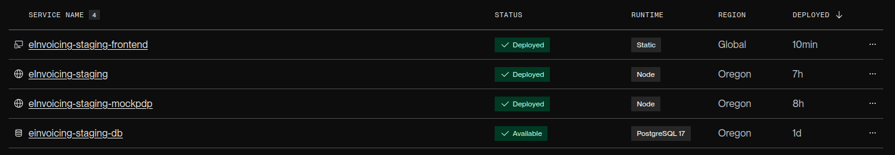

### 3️⃣ Backend et routes ✅

* Vérification que le middleware **stagingUser** fonctionne pour bypasser Auth0 en mode staging.
* Test de toutes les routes principales :

  * `/health` → OK

  * `/api/sellers/me` → OK

  * `/api/clients` → OK

  * `/api/invoices` → OK
* Les logs du backend montrent toutes les requêtes reçues et traitées correctement.
* Ajustement du serveur pour servir les PDFs et PDF/A3 statiques (`/uploads/pdf`, `/pdf-a3`).

### 4️⃣ Base de données et connexion ✅

* Vérification que le backend se connecte correctement à PostgreSQL via SSL.
* Tests des queries principales pour récupérer les clients, vendeurs et factures.
* Confirmation que les accès en staging sont **sécurisés et isolés**, aucune donnée réelle n’est exposée.

### 5️⃣ Dépendances et environnement Node ✅

* Vérification de `package.json` et `package-lock.json` : toutes les dépendances nécessaires sont présentes.
* Installation de tous les modules manquants en local (`npm install`) pour que Render puisse les utiliser.
* Stabilisation du backend sans toucher à la logique métier ni aux fonctionnalités de génération de PDF/Factur-X.

## 🔹 Réflexion du jour

Le backend de staging est maintenant **déployé, stable et fonctionnel** sur Render.

* Les erreurs liées aux modules manquants ont été résolues.
* Les routes principales sont testées et répondent correctement.
* La base de données est correctement connectée, avec SSL activé.
* L’environnement de staging est isolé et sûr, avec un **compte unique Auth0** pour les tests.

Le front n’est pas encore déployé, mais le **backend est prêt pour recevoir toutes les requêtes** du futur front de staging.

## 🔹 Prochaines étapes

1. **Déploiement du frontend** : rendre l’application complète accessible publiquement.
2. **Hébergement public et partage Auth0** : finaliser l’URL de staging et préparer l’accès pour les testeurs.
3. **Communication** : préparer les posts LinkedIn et supports pour présenter le staging.
4. **PDF/A-3 et conformité ISO 19005** : finaliser la validation des fichiers PDF/A-3.

---

👉 Jour 95 marque **la stabilisation complète du backend sur Render avec la base de données opérationnelle**, ce qui permet de tester toutes les routes et fonctionnalités en conditions réelles de staging. Le front sera la prochaine priorité pour compléter l’environnement. 🚀


\newpage

# Jour 96 – Frontend et services Auth0 / Sellers en staging 🌐🔧

Aujourd’hui, la session a été centrée sur **la mise en place du frontend en staging**, la configuration d’**Auth0**, et l’adaptation des services pour que le front et le backend communiquent correctement.

## 🔹 Objectif du jour

* Déployer le **frontend** sur Render et le connecter au backend staging.
* Vérifier la récupération des variables d’environnement Auth0 (`domain`, `clientId`, `audience`) pour dev et prod.
* Corriger les services frontend pour **utiliser correctement les tokens Auth0**.
* Stabiliser le service `Sellers` pour que `/sellers/me` fonctionne en staging.
* Préparer la base pour le futur **mock PDP**.

## 🔹 Avancement

### 1️⃣ Déploiement du frontend ✅

* Configuration du build command (`npm install && npm run build`) et du root directory (`frontend/`) sur Render.
* Vérification que l’application est **live** sur `https://einvoicing-staging-frontend.onrender.com`.
* Ajustement des variables d’environnement Auth0 dans Render : `VITE_AUTH0_DOMAIN`, `VITE_AUTH0_CLIENT_ID`, `VITE_AUTH0_AUDIENCE`.

### 2️⃣ Auth0 et variables runtime ✅

* Mise à jour des providers et hooks (`AuthProvider`, `useAuth`, `LoginPage`) pour gérer **les variables en dev et prod** via `import.meta.env` et `window.__ENV__`.
* Vérification des logs : toutes les variables Auth0 sont bien récupérées en staging.
* Correction des appels `loginWithRedirect` et `getAccessTokenSilently` pour utiliser l’audience runtime.

### 3️⃣ Services frontend – Sellers et Clients ✅

* Revue complète de `useSellerService` et `useClientService` pour **bypasser le token en staging** si nécessaire.
* Correction des URLs pour pointer vers le backend staging (`https://einvoicing-staging.onrender.com/api/...`).
* Tests sur `/sellers/me` : récupération correcte des données vendeur en mode staging.
* Gestion des erreurs 404 et logs clairs pour faciliter le debug.

### 4️⃣ Préparation du mock PDP ✅

* Discussion et planification : le mock PDP sera **exposé sur un webservice dédié** pour être accessible depuis le frontend.
* Le backend est prêt à pointer vers ce service via une URL publique, indépendamment du reste des routes.

### 5️⃣ Frontend stabilisé ✅

* Login / logout fonctionnent avec Auth0.
* Services frontend communiquent correctement avec le backend.
* Routes `/clients`, `/invoices`, `/sellers` testées depuis le frontend.
* Logs clairs pour toutes les requêtes et tokens.

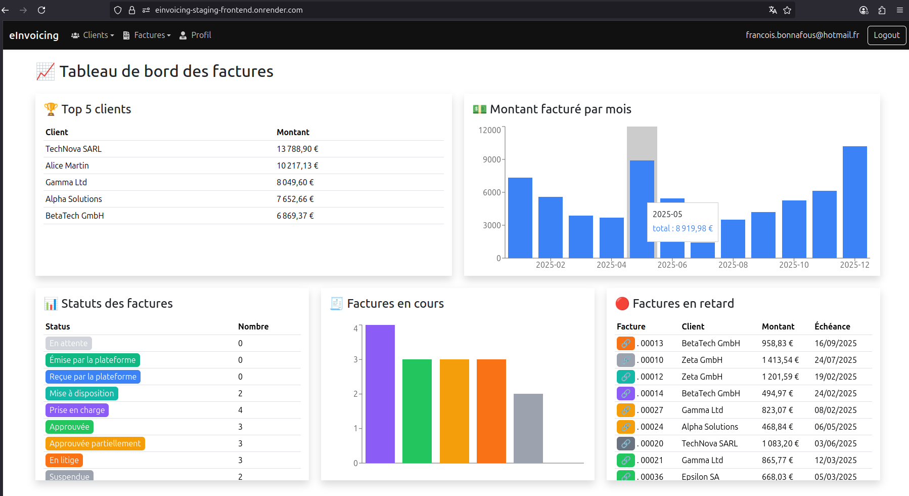

## 🔹 Réflexion du jour

* Le frontend staging est maintenant **connecté et fonctionnel** avec le backend.
* Auth0 fonctionne correctement en dev et en staging.
* Le service Sellers est stable et prêt pour le futur mock PDP.
* On a posé les bases pour gérer les PDF et Factur-X plus tard.

## 🔹 Prochaines étapes

1. **Déployer le mock PDP sur un webservice dédié** et pointer le frontend dessus.
2. **Finaliser les PDFs / PDF/A-3** et tester les exports depuis le staging.
3. **Tests finaux de bout en bout** pour l’inscription, connexion, CRUD clients/factures et génération PDF.
4. Ajuster les **instructions localhost hardcodées** dans le backend pour qu’elles fonctionnent en staging.

---

👉 Jour 96 marque **la mise en place complète du frontend en staging et la stabilisation des services Auth0 et Sellers**, préparant le terrain pour les tests de génération PDF et le mock PDP. 🚀


\newpage

# Jour 97 – Staging remote et simplification du workflow PDF / PDP 🌐📄

Aujourd’hui, la session a été centrée sur **la stabilisation de l’environnement staging en remote**, avec une volonté de **restreindre certaines fonctionnalités** pour rester en conformité avec la réglementation. Cela a conduit à des adaptations côté frontend et backend, notamment autour de l’affichage des PDF et de la génération des factures.

## 🔹 Objectif du jour

* Simplifier le workflow de facturation en staging pour éviter les risques réglementaires.
* Revoir l’affichage et la génération des **PDF et PDF/A-3** dans le frontend.
* Supprimer le mock PDP et injecter directement les statuts dans la base de données.

## 🔹 Avancement

### 1️⃣ Adaptation des boutons et interactions ✅

* Les boutons “Envoyer”, “Rafraîchir” et “Encaisser” ont été désactivés via des **icônes avec tooltip**, pour que l’utilisateur voie les actions possibles mais ne puisse pas cliquer.
* Les icônes sont affichées **naturelles**, sans styles de boutons ou grisaille.
* L’alignement et l’espacement des icônes ont été harmonisés avec les autres actions de la table.

### 2️⃣ PDF / PDF/A-3 ✅

* Vérification et correction de l’affichage dans la visionneuse PDF.
* Ajustement de la génération de PDF à la création de la facture.
* Tests sur les exports pour garantir que le téléchargement et l’ouverture fonctionnent en staging.

### 3️⃣ Abandon du mock PDP ✅

* L’idée initiale d’un mock PDP a été **abandonnée**.
* À la place, les statuts techniques et métiers des factures sont **injectés directement dans la base de données**.
* Cela simplifie la logique et évite tout appel externe potentiellement risqué ou non conforme.

### 4️⃣ Backend et DB ✅

* Les statuts des factures sont stables et reflètent correctement les valeurs injectées en DB.
* La table `invoices` est alimentée avec une répartition réaliste des `technical_status` et `business_status`.

## 🔹 Réflexion du jour

* Le staging remote est maintenant **fonctionnel et sécurisé**, avec certaines fonctionnalités restreintes.
* Les ajustements côté frontend ont permis d’avoir un affichage clair et cohérent des PDF et des actions disponibles.

## 🔹 Prochaines étapes

1. Obtenir l'ISO 19005 pour les PDF/A3
2. Communiquer sur le projet

---

👉 Jour 97 marque **la stabilisation finale du staging remote**, avec des fonctionnalités sécurisées et un workflow simplifié pour la génération et le suivi des factures. 🚀


\newpage

# 📅 Jour 98 – Bilan Complet du Projet eInvoicing 🚀✨

Aujourd'hui, pas de code, mais un moment pour regarder dans le rétroviseur. Après plus de trois mois de travail acharné, de doutes et de victoires, le projet eInvoicing a atteint une maturité incroyable. C'est l'heure du bilan complet, pour célébrer le chemin parcouru et tracer la route pour l'avenir.

---

## 🛠️ La Stack Technique : Le "Quoi" et le "Pourquoi"

Chaque technologie a été choisie avec une intention précise : la simplicité, la modernité et la robustesse.

- **Frontend** : **React (avec Vite)** pour son écosystème mature et sa performance. L'approche par composants a rendu l'UI modulaire et facile à maintenir.
- **Backend** : **Node.js avec Express.js** pour sa légèreté et sa rapidité. Parfait pour créer une API RESTful claire et efficace.
- **Base de données** : **PostgreSQL**, un choix de raison pour sa fiabilité, sa robustesse et sa gestion avancée des transactions SQL.
- **Authentification** : **Auth0**, pour externaliser la complexité de la sécurité (login, JWT) et avoir une solution "production-ready" dès le départ.
- **Génération PDF & Factur-X** : Des librairies comme `pdf-lib` et `xml-builder` ont été les piliers pour générer des documents conformes (PDF/A-3, XML Factur-X), un des cœurs métier du projet.
- **Styling** : **Bootstrap**, pour construire rapidement une interface propre et responsive sans réinventer la roue.
- **Organisation** : **Trello**, l'allié indispensable pour sortir les tâches de ma tête et visualiser la progression.

---

## ✅ Bilan Technique : Ce qui a été construit

En partant de zéro, l'application est devenue une solution de facturation fonctionnelle et sécurisée.

### 1. Une Architecture Solide et Évolutive
- **Séparation Front/Back** : Une base saine pour une maintenance et des déploiements indépendants.
- **Découpage par Domaine Métier** : Le code est organisé autour des concepts métier (`sellers`, `clients`, `invoices`), ce qui le rend incroyablement lisible et facile à étendre.
- **Pattern Backend Clair (MVC-like)** : La structure `Route → Controller → Service → Model` a permis de bien séparer les responsabilités.

### 2. Un Périmètre Fonctionnel Riche et Conforme
- **CRUD Complets** : Gestion de A à Z des Vendeurs, Clients et Factures.
- **Conformité Réglementaire** :
    - Génération de **Factur-X** et préparation pour le **PDF/A-3**.
    - Validation des données critiques (**SIRET, IBAN, BIC**).
- **Sécurité de Bout en Bout** :
    - **Authentification** via Auth0 et protection des routes.
    - **Isolation des données** : chaque utilisateur ne voit que ses propres informations.
    - **Anonymisation** des données pour la documentation et les démos.
- **Cycle de Vie des Factures** :
    - **Mock PDP** ultra-réaliste simulant tout le flux (rejet, validation, litige, paiement).
    - **Statuts en temps réel** (techniques et métiers) grâce au polling, rendant l'interface vivante.
    - **Verrouillage des factures** après envoi pour garantir l'intégrité des données.
- **Expérience Utilisateur Soignée** :
    - Un **Dashboard vendeur** qui donne une vue d'ensemble claire et utile.
    - Des formulaires avec validation instantanée.
    - Des flux logiques (création, envoi, encaissement).

### 3. Les Fondations de l'Industrialisation
- **Premiers Tests Automatisés** : Des tests unitaires et d'intégration (avec Vitest) ont été posés, côté back et front, pour sécuriser le code existant.
- **Préparation à la CI/CD** : Le projet est structuré pour être facilement intégré dans un pipeline (GitHub Actions).

---

## 🧘 Bilan Humain : L'Aventure d'un Développeur Solo

Au-delà de la technique, ce projet a été une aventure humaine intense.

### La Discipline comme Moteur
Le **journal de bord quotidien** a été la meilleure décision du projet. Il m'a forcé à formaliser mes pensées, à célébrer les petites victoires et à garder le cap. C'est la preuve que la rigueur n'est pas l'ennemi de la créativité, mais son meilleur allié.

### La Montée en Compétence
J'ai touché à tout : l'architecture, la base de données, la sécurité, le frontend, la conformité réglementaire... Chaque jour a été une occasion d'apprendre. Attaquer des sujets complexes comme Factur-X ou Auth0 en solo a été un défi, mais le sentiment de les maîtriser est incroyablement gratifiant.

### La Gestion de Projet en Solo
J'ai appris que "coder" n'est qu'une partie du travail. Prioriser (merci Trello !), documenter, prendre du recul, et savoir quand s'arrêter sur un sujet pour ne pas tomber dans le perfectionnisme sont des compétences aussi importantes que la maîtrise d'un framework.

### La Motivation
Voir une application prendre vie, passer d'une simple idée à un outil fonctionnel, sécurisé et agréable à utiliser... c'est ça, la magie du développement. Le dashboard, le polling en temps réel, le PDF qui se génère en un clic : ces moments "wow" ont été des boosts de motivation incroyables.

---

## 🏁 Conclusion : Plus qu'un Projet, une Réalisation

**eInvoicing** est passé du statut de "projet perso" à celui de **démonstration d'ingénierie logicielle**. La base est saine, le périmètre fonctionnel est pertinent et la vision est claire.

Le plus important n'est pas seulement le résultat final, mais tout le chemin parcouru. La discipline, la curiosité et la persévérance ont payé. Je suis extrêmement fier de ce qui a été accompli.

La prochaine étape ? L'industrialisation (tests E2E, CI/CD, déploiement) pour transformer ce produit en une solution prête pour le monde réel.

L'aventure est loin d'être terminée ! 🚀

---

## 📊 Fiche Récapitulative du Projet

| Catégorie                 | Technologies & Méthodes                                                                                             |
|---------------------------|---------------------------------------------------------------------------------------------------------------------|
| **Langages & Runtimes**   | JavaScript (ES6+), Node.js, SQL                                                                                     |
| **Frameworks & Librairies** | React, Vite, Express.js, Bootstrap, `pdf-lib`, `xml-builder`                                                        |
| **Base de Données**         | PostgreSQL                                                                                                          |
| **Sécurité & Auth**         | Auth0, JWT, Variables d'environnement (`.env`)                                                                      |
| **Tests**                 | Vitest (Unitaires & Intégration)                                                                                    |
| **Organisation**          | Trello, Journal de bord quotidien (`.story/`)                                                                       |
| **Concepts Clés**         | API REST, Architecture 3-tiers, Domain-Driven Design (inspiration), Transactions SQL, Polling, Anonymisation de données |
| **Fonctionnalités Phares**  | CRUD complet, Génération Factur-X & PDF, Mock PDP, Dashboard, Cycle de vie des factures, Authentification utilisateur |


\newpage

# 📅 Jour 99 – Bilan Humain et Ressenti du Développeur Solo 🌱✨

Aujourd’hui, je prends le temps de **regarder l’aventure eInvoicing sous un angle humain et introspectif**. Ce n’est pas le code ou les fonctionnalités qui m’intéressent, mais ce que ce projet m’a appris sur moi-même, mes limites, mes forces, et comment j’ai vécu chaque étape en solo, avec l’IA comme copilote.

---

## 🧭 Pourquoi ce projet ?

Après **20 ans dans un éditeur logiciel**, j’avais besoin de **faire un vrai break**, de me détacher des habitudes professionnelles. Mais rapidement, l’envie de créer, d’apprendre et de me challenger m’a rattrapé.

Un ami m’a proposé de rejoindre son projet et de contribuer à la construction de son produit. J’ai vu là l’occasion parfaite pour :

* Explorer **React et les technologies web modernes**.
* Conjuguer **connaissance métier en facturation électronique** et apprentissage technique.
* Expérimenter un projet concret avec un périmètre défini, permettant de voir **un produit complet prendre forme**.

Au fil des semaines, je me suis laissé emporter par le processus complet de création d’un produit : architecture, fonctionnalités, conformité, déploiement. Et aujourd’hui, le projet est **utilisable en production dans le périmètre que je m’étais fixé**.

---

## 🎢 Moments forts et challenges

Le parcours a été **jalonné de moments grisant et de difficultés intenses**. Certaines étapes m’ont donné un sentiment immense de satisfaction une fois surmontées, mais ont aussi été éprouvantes :

* **Sécurisation Front ↔ Back** : complexe et frustrante, j’ai souvent pensé renoncer, me demandant si j’allais y arriver.
* **Simulation PDP** : créer un environnement proche de la production sans avoir encore un PDP réel était un vrai challenge, mais stratégique pour préparer la suite.
* **Déploiement automatisé et industrialisation** : j’ai découvert des domaines totalement nouveaux pour moi, mais essentiels pour livrer rapidement un projet “pro”.

Chaque obstacle surmonté a **renforcé ma patience et ma résilience**. C’est dans l’adversité que j’ai trouvé le plus de satisfaction et de motivation.

---

## 🧰 Apprentissages techniques et IA

Même si je ne suis pas devenu expert en React ou Node, j’ai compris **comment structurer et industrialiser un projet web complet**. Travailler avec l’IA m’a permis de :

* Tester et accélérer certaines tâches complexes (ex: **génération PDF/A-3 et Factur-X**, dashboards visuels)
* Trouver des solutions plus rapidement, tout en **gardant le contrôle sur les décisions importantes**
* Affiner ma manière de formuler le contexte et de guider l’IA pour obtenir le meilleur résultat possible

Découvrir la CI/CD, les tests unitaires et d’intégration, le monitoring, le déploiement automatisé et l’industrialisation m’a ouvert une **vision complète du développement logiciel**, bien au-delà du simple codage. La combinaison de l’expérience humaine et de l’IA a été une **force surprenante**, qui m’a permis d’atteindre des résultats que je n’aurais jamais réalisés seul dans ces délais.

---

## 🧘 Apprentissage humain et soft skills

Au-delà de la technique, ce projet a été un **véritable parcours de développement personnel** :

* La discipline et l’organisation m’ont permis de rester **focus sur le périmètre défini** et d’éviter de perdre du temps sur des détails secondaires.
* Le **journal de bord** s’est révélé un outil précieux pour formaliser la réflexion, célébrer les petites victoires et suivre l’évolution du projet.
* La **résilience** a été constante : accepter de ne pas être expert dans tous les domaines, persévérer malgré les frustrations, et continuer à avancer même lorsque la progression semblait lente.

Ces étapes m’ont appris que la **rigueur n’est pas l’ennemi de la créativité**, mais son meilleur allié.

---

## 💡 Décisions marquantes

Certaines décisions ont été **capitaux pour le succès et la crédibilité du projet** :

* **Sécurisation et multi-tenancy** dès le départ : transformer un simple CRUD en une application prête pour la production.
* **Simulation PDP** : créer un environnement réaliste permettant de tester et valider des flux complexes, préparant la base pour des intégrations futures.
* **Industrialisation et tests** : poser les fondations pour un produit robuste, facile à maintenir et à faire évoluer.

Ces choix ont donné **de la solidité et de la crédibilité** au projet, mais aussi la confiance nécessaire pour continuer seul.

---

## 🤝 Développer seul avec l’IA

Développer seul ne signifiait pas être isolé. **ChatGPT a été un vrai partenaire**, pour :

* Brainstormer et valider des idées
* Générer du code et des composants rapidement
* Challenger certaines décisions et apporter un second regard

Les avantages : autonomie, vitesse et contrôle total.
Les limites : isolement et vigilance constante sur la cohérence globale.

Même seul, avec un accompagnement intelligent, il est possible de **créer un produit complet et fonctionnel**, répondant à un vrai besoin.

---

## ✨ Fierté et “wow moments”

Quelques instants m’ont procuré un réel **sentiment de réussite** :

* La création du **dashboard vendeur**, visuel et pratique, réalisé en quelques heures grâce à l’IA.
* La génération automatique des **Factur-X et PDF/A-3 valides**, conforme aux standards.
* Le **cycle de vie des factures** suivi en quasi temps réel dans l’interface, avec polling et mise à jour instantanée.

Ces moments m’ont donné une **satisfaction intense**, un vrai sentiment “wow” que je n’avais pas anticipé.

---

## 🔄 Erreurs et apprentissages

Tout n’a pas été parfait, mais chaque erreur a été une **leçon précieuse** :

* Le code pourrait être plus optimisé ou répondre à plus de bonnes pratiques, mais il est **facile à maintenir et à faire évoluer**.
* L’IA a ses limites (pertes de contexte, boucles inutiles) : apprendre à gérer ces situations a été essentiel.
* La persévérance et la discipline ont été les clefs pour surmonter les obstacles.

Au final, **le résultat est solide et cohérent**, même si le chemin pour y arriver a été semé de défis.

---

## 🌱 Vision pour l’avenir

eInvoicing m’a donné une **confiance nouvelle** : je peux **concevoir, industrialiser et déployer un projet complet**, même seul et avec des technologies nouvelles.

Pour les prochains projets :

* Continuer à explorer **industrialisation, DevOps et CI/CD**.
* Mettre l’accent sur **la valeur utilisateur**, avant tout.
* Construire des solutions robustes, fonctionnelles et évolutives, en combinant expérience humaine et IA.

L’aventure est loin d’être terminée, mais je peux maintenant regarder en arrière avec **fierté et sérénité**, tout en gardant l’enthousiasme pour ce qui vient. 🚀


\newpage

# 📅 Jour 100 – Perspectives et prochains axes pour eInvoicing 🔭✨

Aujourd’hui, je veux **regarder vers l’avenir** et formaliser les **prochains axes** que je souhaite explorer pour eInvoicing.
La première vie du projet est terminée : le produit est solide, fonctionnel et documenté. Mais le potentiel reste immense.

---

## 🎨 Communication et visibilité

Même si le produit est déjà complet, **personne ne le connaît encore**. Partager le parcours et la valeur du projet est donc essentiel :

* **Publier régulièrement les carrousels LinkedIn** : un par semaine, pour montrer les fonctionnalités clés, l’architecture et les choix techniques.
* **Raconter l’histoire derrière le produit** : le cheminement, les challenges, l’industrialisation et la conformité PDF/A-3.
* **Valoriser le dashboard et la sécurité** : montrer concrètement l’interface, les métriques des clients, et la gestion multi-tenancy pour chaque vendeur.
* **Créer de l’engagement léger** : répondre aux retours et commentaires, sans chercher à tout expliquer d’un coup.

L’objectif est de **construire progressivement une visibilité professionnelle**, tout en gardant un rythme soutenable et agréable pour moi.

---

## 🧩 Consolidation technique

Le produit fonctionne déjà, mais certaines bases peuvent être **renforcées pour le rendre plus robuste** :

* **Tests unitaires et d’intégration** : utiliser l’IA pour générer rapidement les tests unitaires et avancer sur l’intégration, afin de couvrir toutes les fonctionnalités critiques.
* **Validation PDF/A-3 et ISO 19005** : résoudre les derniers points de conformité listés par le logiciel de validation pour atteindre un standard proche de la production réelle.
* **Refactor léger** : améliorer certaines parties du code pour faciliter la maintenance et préparer des évolutions futures.

Le but n’est pas de réinventer le projet, mais de **consolider et sécuriser la base** pour les étapes suivantes.

---

## 🔌 Exploration PDP et archivage probant

Pour rendre eInvoicing vraiment différenciant et prêt pour l’usage réel :

* **Adapter un PDP réel** : étudier un ou plusieurs opérateurs, identifier comment se connecter et simuler des échanges authentiques.
* **Expérimenter l’archivage probant** : comprendre les mécanismes de signature, d’horodatage et de conservation légale pour compléter le cycle complet d’une facture électronique.
* **Documenter les pistes** : créer un petit cahier de réflexion sur les intégrations possibles, contraintes et solutions techniques.

Ces explorations me permettront de **préparer des évolutions concrètes sans me précipiter**, et de poser les fondations pour un produit encore plus solide et crédible.

---

## 🧘 Maintien de l’autonomie et plaisir de créer

Enfin, l’un des aspects essentiels pour moi est de **continuer à créer sans perdre le plaisir** :

* **Travailler en micro-projets** : avancer sur des tâches ciblées, des expérimentations techniques ou UX, sans se mettre de pression.
* **Tester de nouvelles idées** : petites fonctionnalités, amélioration du dashboard, nouvelles interactions, prototypes rapides.
* **Garder le contrôle** : chaque décision reste entre mes mains, l’IA reste un copilote pour accélérer et valider certaines étapes.

Cette approche permet de **rester actif et motivé**, tout en respectant mon rythme et en évitant l’épuisement.

---

## 🌱 Conclusion

Jour 100 marque la **fin de la première vie d’eInvoicing** : un produit fonctionnel, solide et documenté, prêt à être montré au monde.

Mais c’est surtout le **début d’une nouvelle phase** :

* faire connaître le projet,
* consolider sa robustesse,
* explorer de nouvelles intégrations,
* et continuer à créer dans le plaisir et la maîtrise.

L’avenir est ouvert, et chaque prochaine étape sera guidée par **la valeur, la rigueur et la curiosité**, à mon rythme. 🚀


\newpage

# 🧭 Jour 101 – Continuer, même quand tout semble accompli ✨

J’aurais pu m’arrêter au jour 100. Le projet était solide, documenté, et j’en avais raconté chaque étape.  
Mais l’histoire continue. Parce qu’un produit n’est jamais vraiment “terminé” — il évolue, s’affine, s’approfondit.  

Même lorsque le périmètre est couvert, il reste toujours ces petites choses à ajuster, ces envies de mieux comprendre, de peaufiner, de transmettre.

---

## 💬 Communication et partage

J’ai franchi une nouvelle étape : **communiquer sur ce que j’ai construit**.  
J’ai préparé **trois carrousels LinkedIn**, accompagnés de **trois posts narratifs** qui racontent la genèse du projet et le chemin parcouru.  
Ils évoquent les **fondations**, les **valeurs du produit** et son **industrialisation** — tout ce qui a donné du sens à cette aventure.

Publier n’est pas anodin pour moi.  
C’est à la fois grisant et intimidant : ça expose, ça ouvre à la critique, mais aussi à la rencontre.  
J’ai donc planifié ces publications pour décembre.  
Un mélange d’appréhension et d’envie, de pudeur et de fierté discrète.  
Parce qu’au fond, j’ai envie de partager cette histoire, telle qu’elle est : simple, sincère et formatrice.

---

## 🧪 Tests et fiabilité

Côté technique, j’ai repris le travail sur les **tests automatisés**.  
Au moment où j’avais posé les bases, mon badge Codecov affichait un modeste **4% de couverture**.  
Aujourd’hui, il dépasse les **30%**, dont **70% côté backend**.  

Je ne cherche pas à atteindre 100% — ce chiffre n’a pas de sens absolu — mais à garantir que les **fonctions critiques** soient bien testées.  
Et j’ai découvert que Codecov, au-delà du badge, offre une **interface très claire**, directement intégrée à GitHub, pour visualiser la qualité des tests sur l’ensemble du projet.  
Une vraie satisfaction : le projet gagne en fiabilité et en transparence.

---

## 📄 PDF/A-3 et conformité

J’ai aussi poursuivi la **mise en conformité ISO 19005** de mes PDF/A-3.  
Deux nouveaux points corrigés, une approche mieux structurée, et un résultat toujours plus proche du standard officiel.  

Mon PDF est aujourd’hui pleinement fonctionnel :  
* le document principal est affiché,  
* le fichier `factur-x.xml` est intégré et validé,  
* les pièces justificatives sont incluses en pièces jointes,  
* les contrôles XMP, XSD et Schematron passent sans erreur.

J’ai d’ailleurs changé d’outil de validation : le service de la FNFE étant souvent indisponible, je me suis tourné vers la **solution Xodo**.  
Elle est plus sobre, mais toujours accessible, et surtout fiable.

---

## 🔌 Vers un vrai PDP

Mais la prochaine grande étape, c’est **le passage à un environnement PDP réel**.  
Mon mock PDP m’a beaucoup servi pour simuler des échanges, mais pour donner une portée concrète au projet, il faut maintenant se **connecter à une plateforme homologuée**.  

J’ai choisi de commencer par **Iopole**, une solution agréée par l’administration et dotée d’une **API claire et documentée**.  
Mon objectif : écrire une **interface** et un **adapter** pour amorcer la connexion et tester des flux réels en staging.

C’est une étape ambitieuse, mais logique : ancrer le projet dans la réalité du réseau PDP.

---

## 🌱 Conclusion

Jour 101 marque **le début de la seconde vie d’eInvoicing**.  
Une phase moins centrée sur la construction brute, et plus sur la **maturation** : communiquer, consolider, et s’ouvrir à l’extérieur.  

Je continue, non pas parce que je dois, mais parce que **j’en ai envie**.  
Parce que ce projet m’a appris à aimer la progression lente, les ajustements précis, et la satisfaction d’un code qui devient plus juste, jour après jour.  

🚀 La suite s’écrira pas à pas — comme toujours.

\newpage

# Jour 102 – PDP Mock & préparation des adapters 🚀🔌

📝 Aujourd’hui, l’objectif était de **stabiliser le workflow PDP** en mock et de préparer l’architecture pour intégrer de vrais adapters. L’idée est de pouvoir **développer et tester le front et le backend** sans dépendre d’un PDP réel, tout en gardant la flexibilité pour ajouter des providers futurs comme iOpole.

📦 Le mock PDP est maintenant pleinement opérationnel :

* Création automatique de `submissionId` pour chaque facture envoyée.
* Statuts techniques aléatoires (`validated` / `rejected`) pour simuler le passage complet dans le PDP.
* Lifecycle métier complet avec codes de statut, labels et commentaires pour tester le suivi métier dans le front.
  Cela permet de **tester toutes les interactions front** et les différents cas de figure sans dépendance externe.

🛠️ Côté backend, j’ai centralisé la logique PDP dans un **service unique (`PDPService`)**, qui gère à la fois le mock et les adapters réels.

* Si `provider === 'mock'`, on simule le statut `validated` immédiatement en base et on suit le lifecycle métier.
* Si `provider` est réel (iOpole ou futur fournisseur), le service pourra **envoyer la facture, récupérer le `submissionId` et suivre le statut via l’API**.

⏱️ Le polling front a été corrigé pour **stopper correctement la boucle** dès que le statut technique est `validated` ou `rejected`. La normalisation (`toLowerCase`) a permis de résoudre le bug récurrent où le front continuait à interroger la DB même avec un statut final.

📬 Pour les futurs adapters, l’API iOpole ([iOpole Invoice API](https://api.iopole.com/v1/api/#/Invoice/post_v1_invoice)) est à l’étude. Elle permet d’envoyer les factures, récupérer les statuts et suivre le cycle complet de traitement. L’objectif est de **remplacer progressivement le mock** par un adapter réel en gardant le backend agnostique vis-à-vis du provider.

💡 La réflexion clé du jour : en séparant mock et adapter réel, on garde un **environnement de développement stable**, testable et sécurisé, tout en préparant une **extensibilité future**. Cela permet d’avancer sur le frontend et le backend sans blocage et d’avoir une base solide pour l’intégration des PDP réels.

🚀 Prochaines étapes :

1. Développer un adapter réel iOpole dans `PDPService`.
2. Automatiser la mise à jour des statuts techniques et métiers côté backend.
3. Éventuellement simplifier le backend en intégrant `PDPService` directement plutôt qu’en module séparé.
4. Tester tous les scénarios métier avec le mock avant de passer au réel.


\newpage

# Jour 103 – Du mock côté serveur à l’adapter 🛠️✨

Aujourd’hui, on a fait un vrai ménage dans la manière dont notre mock de PDP est géré.
Avant, toute la logique « métier » du mock vivait côté serveur, directement dans les routes et services. C’était pratique au début, mais ça mélangeait tout : le code métier, la simulation, la DB et l’API PDP.

🚀 **Ce qu’on a changé :**

* On a déplacé **toute la logique de simulation** dans un **adapter dédié** (`PDPAdapter`).
* L’adapter est maintenant responsable de gérer les statuts techniques et métier, de façon isolée, **sans toucher au reste du serveur**.
* Le serveur devient plus léger : il se contente d’appeler l’adapter et de persister les informations pertinentes dans la DB.

💡 **Pourquoi c’est mieux :**

* La séparation des responsabilités est **claire** : le serveur gère l’API et la persistance, l’adapter gère le mock et la simulation.
* On peut **tester l’adapter indépendamment** du reste de l’application.
* Cela ouvre la voie à remplacer facilement le mock par un vrai provider PDP, sans toucher au serveur.
* La logique métier est **plus prévisible** et moins sujette aux effets de bord.

🎯 **Prochaines étapes :**

* Ajouter des tests ciblés sur l’adapter pour s’assurer que les statuts évoluent correctement.
* Continuer à renforcer la séparation serveur / simulation pour garder un code propre et maintenable.


\newpage

# Jour 104 – Migration Mock → Adapter 📦➡️🔌

Aujourd’hui, j’ai finalisé le passage de mon **mock PDP** vers un **adapter directement connecté à la base de données**.

🚀 **Objectif atteint** : ne plus dépendre d’un serveur mock en mémoire et gérer tous les statuts de factures de manière cohérente et persistante.

### 🔹 Ce qui a changé

* **Suppression du mock** : le mock m’a servi pour tester les envois et la simulation de statuts, mais il n’était plus nécessaire.
* **Fetch & Send via Adapter** : tout se fait maintenant via l’adapter, qui lit et écrit directement dans la DB.

  * `sendInvoice` → met à jour uniquement le **statut technique**.
  * `fetchStatus` → simule ou récupère uniquement le **statut business**, sans toucher au technique ni au `submission_id`.
  * `sendStatus` → permet d’envoyer des statuts comme le 212 “Encaissement constaté”.
* **Cohérence totale** : plus de perte de `submission_id` ni de réinitialisation du statut technique. Tout est sauvegardé et cohérent entre les appels.
* **Extensible** : cette architecture permet maintenant de brancher facilement **n’importe quel PDP** via un adapter dédié, sans toucher au reste du code.

### ✨ Bénéfices

* Plus besoin de déployer un conteneur mock spécifique.
* Développement et tests simplifiés : tout est dans le même backend et connecté à la DB réelle.
* Gestion claire et fiable des statuts techniques et business.
* Architecture prête à l’échelle et aux futurs PDP.

💡 **Conclusion** : le mock était utile pour démarrer, mais l’adapter connecté à la DB est beaucoup plus robuste et professionnel. Je peux maintenant gérer la facturation électronique de façon cohérente et évolutive.


\newpage

# Jour 105 – Intégration PDP Iopole et suivi des factures 🚀📄

Aujourd’hui, on attaque une étape clé : **l’envoi des factures via Iopole et la gestion de leur statut**. Après plusieurs sessions à préparer l’infrastructure, j’ai enfin pu connecter mon application à un PDP réel, et suivre mes factures quasiment en temps réel. 🕵️‍♂️💻

## 1. Analyse de la documentation Iopole 📚

Avant tout, il a fallu **lire et comprendre la doc de l’API Iopole** :

* Endpoint OAuth2 : `https://auth.ppd.iopole.fr/realms/iopole/protocol/openid-connect/token`
* Flow : `client_credentials`
* Scopes requis : `oauth2ClientCredentials`
* Endpoint envoi facture : `/v1/invoice`
* Endpoint récupération statut : `/v1/invoice/{invoiceId}/status-history`

Cette étape m’a permis de savoir exactement **quelles informations envoyer et comment récupérer le statut des factures**.

## 2. Création et configuration du compte Iopole 🛠️

Pour tester, j’ai créé un **compte sandbox Iopole** et récupéré :

* `client_id`
* `client_secret`
* `baseURL` et `authURL` pour les requêtes API

Ces informations ont été **stockées dans mes variables d’environnement** pour plus de sécurité et de flexibilité.

```env
PDP_PROVIDER=iopole
IOPOLE_BASE_URL=https://api.ppd.iopole.fr
IOPOLE_AUTH_URL=https://auth.ppd.iopole.fr
IOPOLE_CLIENT_ID=<ton_client_id>
IOPOLE_CLIENT_SECRET=<ton_client_secret>
```

## 3. Adaptateur Iopole (`IopoleAdapter`) ⚙️

Ensuite, j’ai mis à jour mon **adapter Iopole** pour gérer :

* La récupération du token OAuth2 automatiquement (`_getAccessToken`)
* L’envoi de la facture via `/v1/invoice`
* La récupération du **statut de la facture** (`fetchStatus`) avec fallback sandbox
* La normalisation des erreurs pour renvoyer des messages cohérents en cas de problème

Points clés :

* J’ai ajouté une option `isSandbox` pour **ignorer les statuts non disponibles en sandbox**
* Le retour du `sendInvoice` contient désormais :

  * `type: 'iopole'`
  * `id` : l’ID PDP de la facture
  * `raw` : la réponse brute
  * `status` : statut récupéré si disponible

## 4. Envoi de la facture et récupération du statut 📦

Avec l’adapter prêt, j’ai pu **envoyer une facture depuis mon backend** :

```js
const result = await iopoleAdapter.sendInvoice(payload, { isSandbox: true });
console.log('[IopoleAdapter] ✅ Facture envoyée avec succès → ID PDP:', result.id);
console.log('[IopoleAdapter] 📦 Statut récupéré:', result.status);
```

Résultat : l’envoi fonctionne, le **statut est parfois vide en sandbox**, mais on a un ID PDP pour suivre la facture.

## 5. Mise à jour en base (`InvoiceStatusModel`) 💾

Enfin, pour **rendre le tout cohérent**, j’ai ajouté la mise à jour de la base :

```js
await InvoiceStatusModel.updateTechnicalStatus(invoiceLocalId, {
  technicalStatus: finalStatus, // 'validated' ou 'rejected'
  submissionId: result.id
});
```

* `technicalStatus` devient `validated` si l’envoi a réussi
* `technicalStatus` devient `rejected` si l’envoi a échoué
* `submission_id` est mis à jour pour **retracer la facture côté PDP**

Le code SQL derrière :

```sql
UPDATE invoicing.invoices
SET technical_status = $1,
    submission_id = $2,
    last_technical_update = now()
WHERE id = $3
RETURNING *;
```

## 6. Logs et suivi en temps réel 🕶️

Pour rendre l’expérience **plus transparente et fun** :

* Logs console colorés pour succès ✅ ou échec ❌
* Status récupéré en temps réel après envoi
* Possibilité de suivre facilement les factures via le `submission_id`

Résultat : on peut maintenant **envoyer, tracer et enregistrer l’état de toutes les factures depuis l’application**, presque comme un PDP réel. 🎉

---

> Journée très satisfaisante : la connexion au PDP fonctionne, l’envoi de facture est opérationnel, et les retours sont directement synchronisés en base. On a un workflow **complet et automatisé**. Next step : tester avec plusieurs factures et en conditions “réelles”. 🚀


\newpage

# Jour 106 – PDP & Statuts métier 🔄💻

Aujourd’hui, j’ai continué à creuser l’intégration avec le PDP et la gestion des statuts métier pour les factures. L’objectif principal : pouvoir afficher correctement les statuts renvoyés par la plateforme et guider l’utilisateur en cas de rejet.

## 🛠 Ce que j’ai fait ce matin

1️⃣ **Mise en place du `fetchStatus` dans l’adapter**

* J’ai ajouté une méthode spécifique pour interroger le PDP et récupérer le statut exact d’une facture.
* Cela nous permet désormais de ne plus dépendre des mocks pour le suivi, et d’avoir une source de vérité cohérente.

2️⃣ **Prise en compte du `schemeId` pour le Factur-X**

* Pour Iopole, le `schemeId` doit être **0009**.
* Cela garantit que les fichiers envoyés sont correctement identifiés par la plateforme et que le PDP sait comment les traiter.

3️⃣ **Gestion des messages PDP côté front**

* Les messages renvoyés par la plateforme sont désormais récupérés et affichés directement à l’utilisateur.
* Exemple : si la plateforme rejette une facture à cause d’un SIREN/SIRET invalide, l’utilisateur voit le message exact :

  ```
  Invoice seller siren and siret are invalid or not exist
  ```

  avec un petit indicatif que ça vient bien du PDP.
* L’avantage : pas besoin de transformer ou de reformuler le message, on garde la transparence et la précision.

## ⚠️ Les difficultés rencontrées

Même si l’API fonctionne correctement, il est **impossible pour l’instant d’obtenir un vrai statut métier** depuis le PDP :

* Nous n’avons pas de vendeur de test actif sur la plateforme.
* Du coup, toutes les factures envoyées retournent un rejet ou restent en attente, même si tout est correct côté code.

C’est frustrant car on ne peut pas tester complètement le cycle métier, mais au moins le mécanisme est en place et fonctionne correctement. Dès qu’un vendeur de test sera disponible, le front pourra afficher les statuts exacts et permettre de suivre les factures jusqu’à leur encaissement.

---

💡 Ce matin était donc une étape **technique mais nécessaire** : adapter l’infrastructure pour que dès qu’on aura un environnement de test complet, tout fonctionne directement. Le front est prêt à afficher les messages, et le backend à récupérer les statuts exacts du PDP.


\newpage

# Jour 107 – Première interaction “réelle” avec le PDP 🎯💻

Aujourd’hui, c’est un vrai petit saut dans le concret : je touche enfin **la sandbox Iopole** et ça change tout le feeling du projet.

---

## 📤 Envoi de facture & suivi

J’ai pu vérifier tout le cycle :

* J’envoie une facture → elle est bien **reçue par la sandbox**.
* La DB est correctement mise à jour avec le **statut et le submission_id**.
* Je demande le **statut technique** → la requête passe, la sandbox répond même si le SIRET vendeur n’est pas valide.
* J’envoie un **statut “PAYMENT_RECEIVED”** → il est pris en compte sans erreur, et je reçois le retour exact de la plateforme.

C’est hyper satisfaisant de voir que, même sans que la sandbox soit à jour de son côté, **mon application communique correctement avec le PDP** et reçoit des réponses valides.

---

## 🔧 Les détails techniques de la matinée

* **FetchStatus dans l’adapter** : maintenant je récupère correctement le dernier statut PDP.
* **SchemeId pour le Factur-X** : j’ai pris en compte le `0009` spécifique pour Iopole.
* **Gestion des messages PDP côté front** : je n’affiche plus tout le payload, mais uniquement le `rejectionMessage`, et je préviens l’utilisateur que le message vient bien du PDP.

Tout ça fonctionne avec le **mock, la sandbox et le vrai back**, sans casser la compatibilité.

---

## 😅 Difficultés rencontrées

Le plus frustrant : **pas de vendeur de test qui retourne un statut métier valide**.
Même si la plateforme répond, on ne peut pas encore tester tous les cas réels côté métier.
C’est un peu comme toucher la vraie vie, mais avec des gants : on voit le système fonctionner, mais pas toutes les interactions possibles.

---

## ✅ Conclusion

Ce matin, j’ai fait un **grand pas** :

* Mon application n’est plus qu’un mock local, elle interagit avec **une vraie sandbox**.
* Je maîtrise maintenant **l’envoi et la réception des statuts** avec PDP.
* Même si tout n’est pas exploitable en production, c’est un **upgrade massif de mes connaissances** et de mon workflow.

Je me sens prêt à attaquer la suite avec une vraie base solide pour 2026 🚀


\newpage

# 🧭 Jour 108 – Bilan de la semaine : du code au produit 🌍💡

Je pensais avoir terminé.  
Et pourtant, plus j’avance, plus je réalise que ce projet dépasse largement le cadre du développement pur.  
Cette semaine, j’ai senti un basculement : eInvoicing n’est plus seulement un exercice technique, c’est en train de devenir un **produit** à part entière. Un espace où se croisent la technique, la stratégie, la communication, la vision.

Je me prends au jeu.  
Chaque fois que je crois poser la dernière brique, une nouvelle idée émerge. J’ai commencé à penser non plus seulement en termes de “fonctionnalités”, mais en termes de **valeur, d’usage et de continuité**.  
Et ça change tout.

---

## 🚀 Le grand pas : connexion réelle à un PDP

Le fait marquant de la semaine, c’est sans hésiter la **connexion effective à un PDP réel**, Iopole.  
J’ai ressenti ce moment comme un passage à un autre niveau.  
Tout ce qui jusque-là reposait sur des mocks, des simulations, des flux testés en local, prend soudain une dimension concrète.  
L’adapter que j’ai développé devient un véritable **pont vers l’écosystème eInvoicing réel**, et surtout, il est **générique**. Ce que je fais pour un PDP, je peux désormais le faire pour tous.  

C’est à la fois un aboutissement et un déclencheur : une preuve de faisabilité, une montée en crédibilité, et une simplification structurelle importante (le mock a disparu, remplacé par une architecture plus claire, plus modulaire, plus saine).

---

## ⚠️ Les limites du bac à sable

Côté frustration, le seul vrai frein vient du **manque de données exploitables** côté sandbox Iopole.  
La communication API fonctionne parfaitement, mais sans SIRET vendeur accessible, je n’ai pas pu récupérer de **statuts réels de factures**.  
C’est une limite externe, mais elle laisse un petit goût d’inachevé : le pipeline est prêt, mais il manque encore cette petite pièce du puzzle pour le voir vivre de bout en bout.

---

## 🧠 Maturité et indépendance

Cette semaine, j’ai aussi commencé à réfléchir à un sujet plus stratégique : la **dépendance** aux plateformes externes.  
Github, Render, Auth0, Codecov — tous ces outils me facilitent la vie, mais concentrent aussi beaucoup de mes ressources au même endroit.  
C’est une réflexion de fond : comment rester agile, tout en réduisant la dépendance à un acteur unique ?  
C’est un signe de maturité du projet, une manière de penser “résilience” plutôt que “commodité”.

---

## 💬 Et maintenant ?

Ce n’était pas une semaine d’action effrénée, mais une semaine de **consolidation**, de **compréhension** et de **projection**.  
eInvoicing grandit : non seulement en code, mais en cohérence, en crédibilité et en vision.  

Ce projet, que je croyais parfois terminé, continue de m’enseigner.  
Et j’ai la conviction que la véritable première pierre, celle du “produit”, vient tout juste d’être posée.

\newpage

# 🧭 Jour 109 – Passer du projet au produit… et du produit à la vitrine 🚀

Aujourd’hui, j’ai eu une discussion toute simple avec une amie.  
Elle m’a dit :  
> “C’est super ce que tu fais, mais il faut que tu le montres. Ne laisse pas ton travail dormir dans ton ordi.”  

Et ça a résonné.  
Parce qu’elle avait raison.  
Ce projet, j’y mets une énergie folle, une rigueur quasi artisanale, et pourtant… je ne communique pas.  
Alors j’ai décidé que ce **jour 109** marquerait un tournant : celui de la **mise en lumière**.

---

## 💡 De la réflexion à la stratégie  

Cette conversation a ouvert une porte : j’ai commencé à réfléchir non pas au code, mais à la **stratégie**.  
Comment faire d’eInvoicing quelque chose de visible, structuré, partageable ?  
Comment transformer ce travail en **valeur concrète** pour d’autres ?  

De là est née **eInvoicing Pro**, mon offre de services professionnelle.  
Une manière claire d’expliquer ce que je peux proposer autour de la solution :  

- 🧾 **Installation et configuration clé en main**  
- 🔧 **Maintenance et évolutions** pour rester conforme  
- 💻 **Développements spécifiques** pour les besoins sur mesure  
- 💬 **Support et accompagnement** technique ou réglementaire  

Le tout avec des tarifs transparents et une approche open-source assumée : simple, claire, honnête.  

---

## 🎯 Clarifier les cibles et la valeur  

J’ai aussi structuré les **profils de clients potentiels** :  
freelances, TPE, cabinets comptables, intégrateurs, startups B2B.  
Chaque segment a une attente différente, mais un fil conducteur commun :  
> la volonté de **rester souverain**, **compliant** et **maître de ses outils**.  

eInvoicing n’est pas un SaaS de plus, c’est une **brique de confiance**.  
Un outil que tu installes, comprends, maîtrises.  
Une approche artisanale, mais ambitieuse.

---

## 🌐 Donner un visage au projet  

Et puisque toute stratégie doit s’incarner quelque part, on a créé les **premiers pas de la vitrine eInvoicing** 🌍  

Un site simple, clair, moderne — construit en **React + TailwindCSS**, hébergé sur **GitHub Pages**.  
Avec :  

- Une **Navbar** responsive 🧭  
- Une **Hero section** d’accroche 💡  
- Un bloc **Features** pour les fonctionnalités clés 🧰  
- Une section **Services** 💼 pour l’offre pro  
- Une **Vision** 🌱 pour transmettre l’esprit du projet  
- Un **Call To Action** 🚀 pour inviter à tester la démo  

Le tout posé sur une base sombre élégante, déjà fonctionnelle et prête à évoluer.  

---

## 🔁 Bilan du jour  

Ce n’est pas une journée de code, c’est une journée de **positionnement**.  
Le projet franchit une nouvelle étape : il commence à **exister publiquement**.  
Je ne construis plus seulement un outil, mais une **présence**, une **identité**.  

Et finalement, c’est peut-être ça la prochaine grande brique du projet :  
> apprendre à montrer, autant qu’à faire.  

---

💬 **Citation du jour :**  
> “Créer, c’est bien. Faire savoir qu’on crée, c’est exister.”  

\newpage

# 🧭 Jour 110 – Ne pas dépendre d’un seul pilier 🧩  

J’ai lu récemment un post sur LinkedIn d’un auteur dont j’aime beaucoup la manière de penser.  
Il racontait comment il s’était retrouvé **piégé par son fournisseur de mails**, qui avait augmenté ses tarifs sans qu’il ait vraiment le choix.  
Son produit dépendait directement de ce service — impossible de changer sans tout casser.  

Cette histoire m’a parlé.  
Je ne vends pas encore un produit, je construis un **MVP**.  
Mais je me suis rendu compte que, mine de rien, **j’étais moi aussi dépendant de beaucoup d’outils tiers**.  

---

## 💭 La question de la dépendance  

Quand on démarre un projet, on va souvent au plus simple.  
J’ai choisi des outils “plug and play” pour aller vite :  
- Authentification via un service externe,  
- Déploiement via Render,  
- CI/CD, hébergement de code et suivi via GitHub,  
- Tests de couverture avec Codecov.  

Tout est fluide, gratuit, bien intégré.  
Mais si demain GitHub rend certains services payants ?  
Ou si un incident comme celui d’OVH se reproduit ?  
Le projet, sa CI, son historique — tout pourrait devenir **inaccessible**.  

Je ne dramatise pas, mais j’ai pris conscience que la **souveraineté technique** commence bien avant la mise en production.  
Même à ce stade, je veux pouvoir dire :  
> “Mon projet ne tient pas debout uniquement parce que quelqu’un d’autre le porte.”  

---

## ⚙️ Ce que j'ai mis en place aujourd’hui  

Pour franchir une première étape concrète, j'ai mis en place un **miroir automatique entre GitHub et GitLab**.  
Objectif : garantir un **backup sécurisé et autonome** du code source.  

### 🔐 Création d’un token GitLab  
- Génération d’un **personal access token** sur GitLab.  
- Ajout de ce token dans les **GitHub Secrets**, sous le nom `GITLAB_TOKEN`.  
- Il permet à GitHub d’envoyer les mises à jour vers GitLab sans mot de passe.  

### ⚙️ Workflow GitHub Actions  
Création du fichier `.github/workflows/mirror-to-gitlab.yml` :  
- S’exécute à chaque `push` (et aussi manuellement si besoin).  
- Récupère l’historique complet (`fetch-depth: 0`).  
- Pousse automatiquement le code sur GitLab (`force push` activé sur `main`).  

### 🧠 Résolution des blocages  
- Correction de l’erreur `shallow update not allowed` en important tout l’historique.  
- Test complet : GitHub → GitLab → synchro réussie 🎯  

---

## 💾 Résultat final  

À chaque `git push` sur GitHub, le code est **instantanément copié sur GitLab**.  
Aucune action manuelle nécessaire, aucune dépendance unique.  

C’est un petit pas, mais un vrai **geste d’indépendance**.  
Et paradoxalement, plus le projet grandit, plus ces gestes simples prennent de la valeur.  

---

## 🔁 Bilan du jour  

Ce que j’ai retenu : la **résilience** ne s’improvise pas.  
Elle se construit, commit après commit.  

eInvoicing n’est pas qu’un projet open-source, c’est aussi une démarche :  
celle d’un développeur qui veut **rester maître de son outil, de son code et de ses choix**.  

---  

💬 **Citation du jour :**  
> “La liberté technique, ce n’est pas d’utiliser tout ce qu’on veut,  
> c’est de pouvoir continuer à avancer si quelque chose s’arrête.”  

\newpage

# Jour 111 – Déploiement automatisé & base propre ⚡🛠️

Aujourd’hui, je me suis attaqué à **tout ce qui touche au déploiement**, pour que mon projet devienne **facile à installer, propre et reproductible**. Fini les manipulations manuelles à rallonge : c’est maintenant quasi instantané.

---

## 🚀 Automatisation du déploiement

J’ai mis en place un **script `start-einvoicing.sh` ultra-robuste** :

* Vérifie que **Docker est installé**.
* Pull automatique des dernières **images frontend & backend**.
* Stoppe et supprime les conteneurs existants, et supprime le **volume DB** si nécessaire.
* Lancement des conteneurs dans le bon ordre (`db` → `backend` → `frontend`).
* Attente intelligente du **démarrage de PostgreSQL** avant de charger le dump.
* Copie automatique de la **config frontend** et reload de Nginx pour prendre en compte les variables runtime.

Maintenant, **une seule commande suffit** pour mettre en route une instance complète en local, en moins d’une minute 🕐.

---

## 💾 Base de données “clean”

Le dump SQL a été revu pour :

* Supprimer tous les **jeux de données tests** (clients, factures, etc.).
* Garder uniquement la **structure et les rôles nécessaires**.
* Assurer que l’**owner du schema** est générique (`francois` par défaut, mais facilement adaptable pour un client).
* Permettre un **re-déploiement rapide sans conflit**, même si la DB existe déjà.

Ça garantit qu’on part toujours sur **une base vierge**, prête à accueillir de vrais tests ou la production.

---

## 📚 Documentation & variables d’environnement

J’ai mis à jour la **doc `how-to-install.md`** pour que tout soit clair :

* Explication des variables `DB_HOST`, `DB_NAME`, `DB_USER` et `DB_PASSWORD`.
* Comment configurer le frontend (`config.js`) pour injecter les variables runtime.
* Précisions sur les ports exposés pour Docker et DBeaver.
* Checklist rapide pour vérifier que **la DB existe**, que les conteneurs tournent et que l’API répond.

Tout ça permet à n’importe qui de **lancer l'app sans rien oublier**.

---

## ⚠️ Difficultés & pièges évités

* Les conteneurs **déjà existants** pouvaient provoquer des conflits de nom → j’ai ajouté un nettoyage automatique (`docker rm -f` si nécessaire).
* Le pipe `| grep` dans le script bash posait problème en terminal interactif → je l’ai mis dans un script `.sh` pour éviter les erreurs `then dquote>`.
* PostgreSQL ne démarre pas instantanément → j’ai ajouté un **sleep et un check simple** pour que le dump ne plante pas.

Bref, j’ai anticipé **tous les petits oublis qui faisaient perdre du temps**.

---

## ✅ Conclusion

Aujourd’hui, j’ai fait un **énorme pas en avant côté productivité et reproductibilité** :

* Déploiement **rapide et fiable** en local.
* Base **propre et adaptable pour les clients**.
* Documentation et script qui **réduisent les erreurs humaines** au minimum.

Maintenant, chaque nouvel environnement peut être prêt en moins d’une minute, et je peux **me concentrer sur le développement fonctionnel** plutôt que sur la config.

C’est un vrai confort pour les jours à venir 🚀


\newpage

# Jour 112 – Lancement et premiers retours 🚀

Aujourd’hui, j’ai pris un moment pour faire le point sur la **phase de lancement** du projet. Après des semaines de développement, il s’agit maintenant de comprendre comment le rendre visible, testable et accessible.  
Ce bilan m’a permis de mesurer tout le chemin parcouru, mais aussi de préparer la suite : **ouvrir le projet au regard extérieur**, recueillir du feedback réel et poser les premières briques d’une communication claire et cohérente.

# 🚀 Axe 1 – Lancement et feedback réel

## 🎯 Objectif
Valider le fonctionnement global du produit dans un environnement réel, assurer la fluidité de la démo, et organiser la collecte de retours utilisateurs à travers une communication claire et engageante.

---

## ✅ État actuel et plan d’action

### **1. Vérification de la démo et de la stabilité**

| Élément | État | Commentaire |
|----------|------|-------------|
| Démo staging fonctionnelle | ✅ Testée et validée | L’environnement est fluide et stable. Temps de démarrage légèrement lent dû à Render (version gratuite), comportement attendu. |
| Accès utilisateur | ✅ Simplifié | Login et mot de passe de test intégrés directement aux publications. |

💡 *La démo offre une expérience fluide et représentative du produit final.*

---

### **2. Communication et lancement public**

| Élément | État | Commentaire |
|----------|------|-------------|
| Message LinkedIn / storytelling | ✅ Rédigé et planifié | Trois carousels narratifs structurés. |
| Liens de démo | ✅ Intégrés | Les liens staging + identifiants sont présents dans les posts LinkedIn. |
| Programmation des posts | ✅ Effectuée | Posts programmés pour publication successive sur LinkedIn. |
| Autres canaux (Twitter, etc.) | 🔜 Optionnel | Non prévu et non prioritaire à ce stade. |

🟢 *La communication est claire, visuelle et incitative : elle suscite la curiosité sans noyer dans la technique.*

---

### **3. Site vitrine et support utilisateur**

| Élément | État | Commentaire |
|----------|------|-------------|
| Site vitrine | ✅ Prêt | Déployable sur GitHub Pages, clair et cohérent avec la charte du projet. |
| Lien vers la démo | ✅ Intégré | Accès direct depuis la page d’accueil. |
| Formulaire de contact | ✅ Basique mais opérationnel | Permet de recueillir les premiers retours et contacts via le site. |
| Collecte du feedback | ⚙️ En phase initiale | Retours attendus principalement via LinkedIn au lancement. |

💡 *Le site et les posts LinkedIn jouent le rôle de vitrine + retour d’expérience utilisateurs.*

---

### **4. Collecte et analyse du feedback**

| Élément | État | Commentaire |
|----------|------|-------------|
| Canal principal | ✅ LinkedIn | Les premiers retours viendront des réactions et messages privés. |
| Canal secondaire | ✅ Site vitrine | Formulaire de contact prévu pour les utilisateurs intéressés. |
| Méthode d’analyse | 🔜 À définir | Structurer un tableau de suivi des retours (bugs, suggestions, usages). |

🟡 *Action prochaine :* créer un document simple de suivi de feedback (Google Sheet ou Notion) pour centraliser les retours utilisateurs et identifier les priorités d’évolution.

---

## 🧭 Synthèse Axe 1

| Aspect | Niveau de maturité | Prochaine étape |
|--------|--------------------|----------------|
| Démo fonctionnelle | 🟢 Validée | Aucun ajustement nécessaire |
| Communication | 🟢 Programmée | Lancer et suivre les réactions |
| Site vitrine | 🟢 Prêt | Déployer sur GitHub Pages |
| Feedback | 🟠 À structurer | Créer un outil de suivi simple |

---

🧩 **Résumé**
L’axe 1 est prêt pour le lancement. Le produit est stable, la communication est planifiée et le dispositif de retour utilisateur est en place. L’étape suivante consiste à **publier**, **observer les retours**, et **capitaliser sur les retours réels** pour affiner la roadmap et prioriser les améliorations.

\newpage

# Jour 113 – Conformité, sécurité et déploiement 🔒⚙️

Cette journée a été l’occasion de **prendre du recul sur les fondations techniques** du projet : conformité, sécurité et stabilité du déploiement.  
J’ai passé en revue les processus, les tests, la CI/CD et tout ce qui assure la fiabilité du produit. Un travail moins visible, mais essentiel pour bâtir sur du solide. C’est une étape de consolidation, avant d’aller plus loin.

# 🧩 Axe 2 – Conformité, sécurité et déploiement

## 🎯 Objectif
Finaliser la conformité technique et réglementaire (PDF/A-3, Factur-X, PDP), renforcer la sécurité de l’accès applicatif, et fiabiliser le déploiement sur différents environnements.

---

## ✅ État actuel et plan d’action

### **1. Conformité PDF/A-3 & Factur-X**

| Élément | État | Commentaire |
|----------|------|-------------|
| Génération PDF/A-3 | ✅ Fonctionnelle | Le moteur PDF génère un fichier conforme PDF/A-3 mais sans validation ISO 19005 stricte (jugée complexe et non critique à ce stade). |
| Factur-X BASIC | ✅ Conforme | Format Factur-X BASIC utilisé pour les échanges PDP, conforme aux exigences réglementaires et largement suffisant pour la phase MVP. |
| Test sur cas réels | ⚙️ Règle stricte | L’application interdit la génération sans justificatif principal (PDF obligatoire). La logique est conforme aux règles légales et garantit la cohérence du flux. |

🟢 **Conclusion :** conformité de niveau “production-ready” pour un MVP, base solide pour certification complète ultérieure.

---

### **2. Offre eInvoicing Pro**

| Objectif | État | Commentaire |
|-----------|------|-------------|
| Définition du périmètre | ⚙️ En cours d’affinage | Documentation complète déjà rédigée (installation, maintenance, évolutions, support). À stabiliser avec un tableau synthétique des options. |
| Positionnement | ✅ Clair | Offre cohérente : open-source gratuit + service pro optionnel. Lisible et compréhensible pour clients potentiels. |
| SLA / maintenance | ⚙️ À préciser | Définir les délais de réponse et conditions exactes du support (ex. : correctifs sous 48 h, maintenance trimestrielle). |

💡 *Action prochaine :* figer le périmètre “offre de base” et “prestation sur mesure”, créer un encart visuel récapitulatif (tableau synthèse ou grille tarifaire claire).

---

### **3. Documentation technique**

| Élément | État | Commentaire |
|----------|------|-------------|
| Guide d’installation Docker | ✅ Rédigé et fonctionnel | Procédure complète, testée en local et sur Render. Démarrage en < 1 min après configuration des variables d’environnement. |
| Guide utilisateur | 🔜 À rédiger (optionnel) | L’UX est auto-explicative, mais un guide “premiers pas” léger pourrait renforcer la crédibilité et rassurer les premiers utilisateurs. |
| Documentation développeur | ⚙️ Partielle | Guides existants clairs, mais pourrait être complété (structure du code, API endpoints, logique de déploiement CI/CD). |

---

### **4. Sécurité & souveraineté**

| Élément | État | Commentaire |
|----------|------|-------------|
| Authentification | ✅ Assurée par Auth0 (JWT) | Solution robuste et éprouvée, dépendance connue et acceptée pour un MVP. |
| Souveraineté | ⚙️ En observation | CI/CD GitHub produisant deux containers (frontend / backend). Installation testée sur Render. Migration possible vers OVH/Scaleway sans adaptation majeure. |
| Redondance / continuité | ✅ | Duplication automatisée du code sur GitLab en cas de problème GitHub (bonne pratique). |

💡 *Prochaine étape :* tester un déploiement autonome complet (GitLab → OVH via Docker Compose) pour valider la portabilité totale.

---

### **5. Expérience utilisateur**

| Élément | État | Commentaire |
|----------|------|-------------|
| Parcours principal (création / upload / génération) | ✅ Fluide | Parcours testé, rapide et cohérent. Aucun blocage ni incohérence. |
| Améliorations mineures | ✅  | Pré-remplissage, messages de validation, confirmations explicites. |

---

## 🧭 Synthèse Axe 2

| Aspect | Niveau de maturité | Prochaine étape |
|--------|--------------------|----------------|
| Conformité PDF/A-3 / Factur-X | 🔵 Solide | Audit externe de validation ISO (optionnel) |
| Offre eInvoicing Pro | 🟠 En consolidation | Finaliser le tableau des prestations et tarifs |
| Documentation technique | 🟢 Fonctionnelle | Ajouter un mini-guide utilisateur |
| Sécurité / souveraineté | 🟢 Conforme MVP | Tester hébergement alternatif souverain |
| UX | 🟢 Validée | Ajustements selon retours |

---

🧩 **Résumé**
Cet axe confirme la maturité technique et la cohérence de l’application : conformité légale maîtrisée, sécurité assurée par Auth0, déploiement reproductible et UX fluide. Les prochaines étapes concernent surtout la consolidation commerciale et la souveraineté du déploiement.

\newpage

# Jour 114 – Communauté, documentation et industrialisation 🌍📘

Aujourd’hui, j’ai pris un peu de hauteur pour réfléchir à **l’après-code** : comment documenter, transmettre et peut-être un jour ouvrir le projet à la communauté.  
C’est un moment pour poser les bases d’une vision plus large — une approche durable, claire et partagée, où chaque apprentissage peut servir à d’autres.

# Axe 3 – Communauté, documentation et industrialisation

## Valoriser l’open source et la communauté

- **État actuel :** Le projet n’est pas encore suffisamment mature pour une ouverture publique ou une réelle animation communautaire. En attente des publications et des premiers retours utilisateurs.  
- **Prochaines étapes envisagées :**
  - Écrire des articles ou tutoriels sur **Factur-X** et le **PDP Iopole**.
  - Partager des retours d’expérience techniques et métiers.
  - Mettre en avant la valeur unique du projet à travers des publications LinkedIn ou Medium.
- **Approche souhaitée :**
  - Si une série d’articles est lancée, elle sera publiée sous un **nom d’auteur** (Medium par exemple), avec une orientation **éducative, accessible et ludique**, plutôt que démonstrative.
  - L’objectif n’est **pas la visibilité** mais **le partage utile**, en prenant du recul par rapport à la logique d’audience et d’égo propre aux réseaux sociaux.
  - Les trois carousels LinkedIn déjà réalisés représentent déjà un **effort significatif de communication** autour du projet.

---

## Documentation complète

### Manuel utilisateur
- L’application est conçue pour être **très simple d’utilisation**, mais quelques **explications fonctionnelles** pourront être documentées (workflow d’envoi, statuts, PDP…).

### Documentation développeur
- Déjà réalisée (cf. Axe 2).
- Couvre : installation, structure du projet, API, environnement de test, CI/CD.

---

## Industrialisation et suivi

### Monitoring
- Monitoring **basique** mis en place sur le MVP (Prometheus + Grafana minimal).
- Objectif futur : enrichir les métriques et alertes pour la production.

### Tests et automatisation
- **Couverture de tests** : environ **40 %** à ce stade.
- **Pipeline CI/CD GitHub** : opérationnelle et stable.
- **Badge Codecov** déjà présent dans le README pour la visibilité.

---

## Synthèse de l’Axe 3

Cet axe sera davantage approfondi **après les premiers retours utilisateurs** et la validation de la stabilité du produit.  
Les priorités à ce stade :  
1. Continuer la consolidation technique.  
2. Préparer une ouverture progressive vers la communauté.  
3. Structurer la documentation utilisateur.  
4. Envisager une série éducative pour partager l’expérience acquise.

\newpage

# Jour 115 – Consolidation stratégique & offre Web finalisée 🌐🧠

Aujourd’hui, j’ai pris le temps de **regrouper toutes les avancées techniques et stratégiques récentes** pour que le projet soit **à la fois clair pour les utilisateurs et solide sur le plan technique**. Depuis hier, plusieurs axes ont été consolidés : **révision de l’offre Web**, **renforcement des tests**, et surtout **bilan et réflexion sur le projet et sa trajectoire**.

---

## 🧭 Bilan et réflexions stratégiques

Avant de plonger dans le code et le design, j’ai fait un **point global sur l’état du projet**, reprenant les réflexions des jours 112 à 114 :

* **Validation du MVP en conditions réelles** : la démo staging est fluide, le parcours utilisateur principal est cohérent, et la collecte de feedback est en place (LinkedIn).
* **Conformité et sécurité** : PDF/A-3 opérationnel, Factur-X BASIC conforme, Auth0 pour l’authentification, et CI/CD reproductible.
* **Documentation et industrialisation** : guides développeur et installation à jour, monitoring minimal fonctionnel, tests unitaires et d’intégration renforcés.
* **Ouverture future et communauté** : réflexion sur l’open source, articles éducatifs, partage de retours d’expérience et tutoriels, tout en restant dans une approche **accessible et utile** plutôt que démonstrative.

💡 *Cette prise de recul permet de relier les avancées techniques à la vision globale : MVP stable, communication claire, base prête pour l’évolution et l’ouverture progressive.*

---

## 🌐 Offre Web clarifiée

Suite à ces réflexions, j’ai **mis à jour et simplifié la page Web** :

* **Distinction nette des installations** :

  * Installation locale / serveur client
  * Hébergement géré par le prestataire
* **Services complémentaires clairement visibles** :

  * Développements spécifiques
  * Support et maintenance
  * Audit et conseils
* **Présentation visuelle optimisée** :

  * Retours à la ligne et typographie lisible
  * Encarts différenciant services inclus / optionnels
  * Texte condensé pour une lecture rapide

🟢 *L’offre est maintenant immédiatement compréhensible pour un client, reflétant la réalité d’un solo développeur et valorisant les services réellement fournis.*

---

## 🧪 Couverture de tests renforcée

Pour **assurer la robustesse du MVP** et sécuriser les évolutions :

* Couverture globale > 60 %, **plus de 90 % sur le backend**
* Tests unitaires et d’intégration revus et validés
* Vérification des workflows critiques : création et génération de factures, PDF/A-3, Factur-X, parcours frontend complet
* Validation des formulaires, pré-remplissage et messages utilisateur

💡 *Le projet est maintenant beaucoup plus sûr, prêt à recevoir des utilisateurs et à évoluer sans crainte de régression.*

---

## 📚 Documentation et communication

* Guides techniques et d’installation **mis à jour** pour refléter les changements récents
* Contenus Web et LinkedIn alignés avec l’offre clarifiée
* Préparation du suivi de feedback utilisateur pour centraliser les retours et prioriser les évolutions

🟢 *L’ensemble du projet est cohérent, à la fois sur le plan technique et stratégique.*

---

## 🏗 Synthèse – Axe stratégique et qualité

| Aspect                        | État                   | Impact                                                       |
| ----------------------------- | ---------------------- | ------------------------------------------------------------ |
| Bilan et stratégie            | ✅ Consolidé            | Vision claire du projet et des priorités                     |
| Offre Web                     | ✅ Clarifiée et lisible | Clients comprennent immédiatement les prestations            |
| Couverture tests              | ✅ Renforcée            | MVP sécurisé et prêt à évoluer                               |
| Documentation & communication | ✅ Mise à jour          | Facilite prise en main et retour utilisateur                 |
| Feedback et suivi             | ⚙️ En cours            | Centralisation prévue pour analyser et prioriser les retours |

---

## ✅ Conclusion

Aujourd’hui marque **une étape de consolidation majeure** :

* Vision stratégique claire, reliant technique, UX et communication.
* Offre Web transparente et valorisante.
* Qualité technique renforcée grâce à une couverture de tests élevée.
* Documentation et outils prêts pour suivre et exploiter le feedback réel des utilisateurs.

Tout est désormais prêt pour **passer à la phase d’usage réel et d’optimisation continue**, en garantissant à la fois **stabilité, clarté et évolutivité**. 🚀


\newpage

# Jour 116 – Conformité PDF/A-3 : la victoire du détail 🎯📄

Aujourd’hui, on a franchi une **étape historique dans le projet** : la **validation complète de la conformité PDF/A-3**, un standard ISO (19005-3) au cœur de la fiabilité et de l’interopérabilité des factures électroniques.

C’est un aboutissement technique, mais aussi symbolique : le projet eInvoicing est désormais **aligné sur les exigences internationales du format Factur-X et du cadre légal européen**.

---

## 🔍 Le déclic : Iopole et la traque des erreurs invisibles

Tout a commencé par la plateforme **Iopole**, véritable laboratoire de validation, qui m’a permis d’accéder à des **rapports d’erreurs ultra-précis** sur mes fichiers PDF.
Grâce à ces analyses détaillées, chaque ligne du standard ISO 19005-3 a pu être comprise, corrigée et testée.

Certaines erreurs semblaient anecdotiques — un identifiant manquant, une mauvaise définition d’objet — mais chacune bloquait la conformité totale.

Et aujourd’hui… **toutes les erreurs sont tombées**. 💪

---

## 🧩 Les derniers correctifs décisifs

Ces ajustements ont tout changé :

* **Ajout des File Identifiers (`/ID`)** correctement encodés au format binaire – critère indispensable du standard ISO 32000-1.
* **Vérification des métadonnées XMP** (dates, créateur, type de document, conformance level).
* **Nettoyage des flux internes** et correction de la structure `/XRef` et `/Trailer`.
* **Validation complète avec le validateur Iopole** : plus aucune erreur bloquante.

🎉 *Le résultat : un PDF-A3 conforme, lisible, structuré, et prêt à l’archivage électronique longue durée.*

---

## 🚀 Une étape symbolique

Ce n’est pas seulement une réussite technique :
c’est **la concrétisation du cœur du projet eInvoicing**.

> Désormais, l’application ne se contente plus de gérer des factures ;
> elle **produit un document ISO-compliant, interopérable, et reconnu comme preuve légale**.

Ce jalon transforme eInvoicing en un outil **professionnel et crédible**, capable de dialoguer avec les **plateformes agréées (PDP)** et d’intégrer le futur environnement de facturation électronique française.

---

## 🌟 Bilan du jour

| Élément                     | Avancée               | Impact                                    |
| --------------------------- | --------------------- | ----------------------------------------- |
| Conformité PDF/A-3          | ✅ Atteinte            | Validation ISO 19005 complète             |
| Intégration Factur-X        | ✅ Stable et embarquée | Format conforme au profil BASIC           |
| Validation externe (Iopole) | ✅ Zéro erreur         | Garantie de qualité industrielle          |
| Gestion documentaire        | ✅ Structurée          | Facture + XML + pièces jointes intégrées  |
| Symbolique du projet        | 💫 Aboutissement      | Passage du prototype à la solution réelle |

---

## ✨ Conclusion

Aujourd’hui, eInvoicing entre dans une **nouvelle dimension** :
celle d’un logiciel complet, normé, et reconnu techniquement.

C’est la **victoire du détail**, de la persévérance et de la compréhension fine des normes.
Un grand pas vers l’avenir du projet — et un moment de fierté partagée entre **toi, la rigueur du code, et la science des standards**.

💡 *Et si le boss final du PDF/A-3 est tombé… la suite s’annonce radieuse.* 🌞


\newpage

# Jour 117 – Auto-entrepreneur, tests et guide utilisateur 🚀📄

Aujourd’hui, on a avancé sur plusieurs fronts clés du projet eInvoicing, avec des actions à la fois **techniques et pratiques**, consolidant l’usage et la conformité de l’outil.

---

## 🔍 Un alias pour gagner du temps et fluidifier les tests

J’ai commencé par **créer un alias dédié aux tests**.
L’objectif : lancer plus rapidement mes scénarios de validation et de génération, sans passer par une suite de commandes longues à chaque essai.
Petit détail technique, mais **un énorme gain de productivité**, surtout quand on multiplie les itérations.

---

## 🧩 Test de bout en bout et guide utilisateur

Ensuite, j’ai mis en place un **test de bout en bout**, allant de la saisie d’une facture à sa **génération PDF + Factur-X**.
C’est ce qui m’a permis de produire **un guide utilisateur pratique**, détaillant les étapes pour générer et vérifier une facture conforme, même pour un nouvel utilisateur.

Ce test n’est pas seulement technique : il **assure que le parcours utilisateur est fluide**, que le PDF et le XML sont correctement construits, et que toutes les validations passent (ou affichent des alertes compréhensibles).

---

## ⚖️ Spécificités auto-entrepreneur : la note réglementaire

Enfin, nous avons intégré **les particularités propres aux auto-entrepreneurs** :

* Création d’un type spécifique `autoentrepreneur`.
* Ajout d’une **mention légale sur le PDF** et dans le **Factur-X XML** rappelant :
  *« Franchise en base de TVA – article 293 B du CGI »*.
* Gestion de l’**alerte [BR-Z-02]**, inévitable pour les factures avec code TVA “Z” : **signalée mais à ignorer dans ce contexte légal français**.

Ce point est essentiel : il **assure la conformité réelle tout en expliquant les fausses alertes**, pour que le logiciel reste fiable et transparent.

---

## 🌟 Bilan du jour

| Élément                       | Avancée                                     | Impact                                            |
| ----------------------------- | ------------------------------------------- | ------------------------------------------------- |
| Alias pour tests              | ✅ Créé                                      | Gain de productivité et fluidité des tests        |
| Test de bout en bout          | ✅ Mis en place                              | Vérification complète du parcours utilisateur     |
| Guide utilisateur             | ✅ Généré                                    | Documentation claire pour tout nouvel utilisateur |
| Type auto-entrepreneur        | ✅ Créé                                      | Gestion spécifique des factures sans TVA          |
| Mention réglementaire PDF/XML | ✅ Intégrée                                  | Conformité légale et transparence                 |
| Validation Factur-X (BASIC)   | ⚠️ Alerte BR-Z-02 signalée mais inoffensive | Explication claire pour l’utilisateur             |

---

## ✨ Conclusion

Jour 117 marque **une étape pratique et stratégique** : le logiciel n’est plus seulement conforme aux normes, il devient **plus intuitif, documenté et capable de gérer les spécificités françaises**.

> Les tests, le guide utilisateur et la gestion auto-entrepreneur sont autant de petites victoires qui renforcent **la crédibilité et la robustesse du projet**.

💡 *Prochaine étape : automatiser encore plus de tests et préparer la diffusion de cette version aux premiers utilisateurs.* 🌞


\newpage

# Jour 118 – CGU, token et déploiement GitHub Pages 🚀📄

Aujourd’hui, on a avancé sur plusieurs **points clés pour rendre eInvoicing plus mature et prêt à être partagé**, en mélangeant aspects techniques et expériences utilisateur.

---

## 🔄 Renouvellement automatique du token

J’ai vérifié que le **token utilisateur se renouvelle automatiquement avant expiration**.
C’est un détail technique côté backend, mais il assure **une expérience fluide sans interruption**, surtout pour les tests et les démonstrations.

---

## 📄 Ajout des CGU et du bandeau expérimental

Ensuite, j’ai intégré **les Conditions Générales d’Utilisation (CGU)** directement sur le site :

* Les CGU sont accessibles depuis le footer de mon site.
* Un **bandeau fixe** annonce clairement que le projet est expérimental.
* Le bandeau reste visible sur toutes les pages, **pour plus de transparence** dès l’arrivée sur le site.

Côté expérience utilisateur, ça permet **d’informer immédiatement les visiteurs** sur le statut du produit et les règles de confidentialité, sans nuire à la navigation.

---

## 🌐 Préparation et test du déploiement sur GitHub Pages

Enfin, j’ai préparé le terrain pour **mettre la landing page en ligne** :

* Configuration Vite adaptée pour GitHub Pages (`base: '/eInvoicing-landing/'`).
* Script `gh-pages` pour déployer automatiquement le dossier `dist`.
* Tests en local pour vérifier que **tout le site est visible dès l’arrivée**, pas seulement la navbar et le bandeau.
* Petit focus sur le **hash `#hero`** pour que la page ouvre directement sur la section principale.

Le but : pouvoir partager le site en toute sécurité et en mode **démo accessible**, même si le projet reste expérimental.

---

## 🌟 Bilan du matin

| Élément                     | Avancée                                   | Impact                                   |
| --------------------------- | ----------------------------------------- | ---------------------------------------- |
| Token utilisateur           | ✅ Renouvellement automatique mis en place | Expérience fluide sans interruption      |
| CGU                         | ✅ Intégrées                               | Transparence et conformité               |
| Bandeau projet expérimental | ✅ Ajouté et fixé                          | Info immédiate pour tout visiteur        |
| Déploiement GitHub Pages    | ✅ Configuré et testé                      | Site prêt à être partagé en version démo |
| Navigation et hash          | ⚡ Corrigé pour ouvrir directement #hero   | Accueil plus intuitif et user-friendly   |

---

## ✨ Conclusion

Jour 118 marque **une étape concrète pour la crédibilité et la diffusion** du projet :

* Les utilisateurs sont informés dès le premier regard.
* Le parcours reste fluide grâce au token.
* La landing page peut enfin être partagée en démo sur GitHub Pages.

> On continue à **renforcer la robustesse et la transparence** avant de montrer le projet à plus de monde.

💡 *Prochaine étape : finaliser la mise en ligne et tester le parcours complet depuis GitHub Pages.* 🌞


\newpage

# Jour 119 – Devis, Factur‑X et LinkedIn ✨💻

Aujourd’hui, on a mélangé **développement technique** et **mise à jour carrière**, avec des avancées concrètes sur eInvoicing et sur mon profil LinkedIn.

---

## 🔧 Corrections Factur‑X pour auto‑entrepreneur

J’ai travaillé sur la **conformité Factur‑X pour les auto‑entrepreneurs** :  

* Le format Factur‑X exige un **numéro de TVA valide**, mais les auto‑entrepreneurs ne collectent pas de TVA.  
* J’ai adapté la génération de PDF pour **ne pas inclure de numéro de TVA invalide**, tout en restant conforme au standard.  
* Le code gère maintenant correctement **les statuts sans TVA**, sans générer d’erreurs ni de blocages.  

Le but : que chaque utilisateur, quel que soit son statut, obtienne **un document PDF clair, conforme et utilisable immédiatement**, même si la TVA n’est pas applicable.

---

## 📝 Nouvelle fonctionnalité : création de devis

J’ai rapidement réutilisé le code existant pour **ajouter la génération de devis** :

* Même moteur PDF que pour les factures, mais avec un **texte et des références adaptés**.  
* Bloc paiement simplifié : on n’affiche plus les informations inutiles pour un devis.  
* Les utilisateurs peuvent maintenant **télécharger un devis ou une facture** avec un simple clic.  

Le résultat : **une fonctionnalité prête en quelques minutes**, mais robuste et utilisable directement.

---

## 🌐 Mise à jour de mon profil LinkedIn

J’ai pris un moment pour **repenser mon profil** :

* Intitulé : **Ingénieur logiciel**  
* Description : un récit complet de mon parcours depuis juillet, avec le projet eInvoicing comme fil conducteur.  
* Média : ajout de **trois carousels** qui racontent visuellement mon produit.  

L’idée : montrer que **ce n’est pas un break**, mais un travail réel, intense et concret, même si ce projet est personnel pour l’instant.  

---

## 🌟 Bilan du jour

| Élément                        | Avancée                                       | Impact                                           |
| ------------------------------- | --------------------------------------------- | ------------------------------------------------ |
| Factur‑X Auto‑entrepreneur      | ✅ Correctif pour numéro de TVA              | PDF conforme et utilisable même sans TVA       |
| Fonctionnalité devis             | ✅ Ajout rapide et fiable                     | Les utilisateurs peuvent générer devis/factures facilement |
| Profil LinkedIn                  | ✅ Mis à jour avec récit + carousels         | Présentation claire et professionnelle du projet |

---

## ✨ Conclusion

Jour 119 marque **une étape technique et communicationnelle** :  

* Les documents sont conformes pour tous les statuts.  
* La fonctionnalité devis est opérationnelle et simple pour l’utilisateur.  
* Mon profil LinkedIn reflète désormais mon engagement et mon travail concret sur eInvoicing.  

> On continue à **industrialiser et clarifier** le projet, côté code comme côté visibilité. 🌱


\newpage

# Jour 120 – Refacto et factorisation 🔄💻

Aujourd’hui, l’objectif était clair : **améliorer l’architecture et la cohérence du code** tout en s’assurant que les fonctionnalités existantes restent fiables.

---

## 🔧 Réorganisation et tests

J’ai consolidé le répertoire `utils` et ajusté les chemins :

* Réorganisation des fichiers PDF et Factur‑X pour une structure plus **logique et modulaire**.
* Réparation des tests qui avaient cassé après la réorganisation.
* Vérification : génération PDF/A‑3, téléchargement des devis et factures → tout fonctionne correctement.

Le but : que le code soit plus **clair et maintenable**, tout en gardant les fonctionnalités intactes.

---

## 📝 Refacto génération du devis

La génération du devis a été **refactorée** :

* Même moteur que pour les factures, mais code plus **lisible et cohérent**.
* Réutilisation maximale des fonctions existantes pour éviter les duplications.
* La logique métier reste inchangée, mais le code est plus **prêt pour des évolutions futures**.

---

## 💾 Factorisation téléchargement PDF

J’ai extrait le téléchargement de fichiers dans un **utilitaire `downloadFile.js`** :

* Les boutons PDF/A‑3 et devis utilisent désormais cette fonction commune.
* Résultat : moins de duplication, moins de risque d’erreur, et plus simple à maintenir.
* Les logs et messages d’erreur sont uniformisés, ce qui facilite le debug.

---

## 🌟 Bilan du jour

| Élément              | Avancée                                   | Impact                                         |
| -------------------- | ----------------------------------------- | ---------------------------------------------- |
| Réorganisation utils | ✅ Structure plus claire et tests corrigés | Code plus lisible et fiable                    |
| Génération devis     | ✅ Refacto pour cohérence                  | Prépare le terrain pour les évolutions futures |
| Téléchargement PDF   | ✅ Factorisation avec utilitaire commun    | Réduction de la duplication et simplification  |

---

## ✨ Conclusion

Jour 120 marque une étape de **refactor et nettoyage** :

* On améliore continuellement l’architecture du projet.
* Le code devient plus **cohérent, maintenable et évolutif**.
* Les fonctionnalités restent **fiables pour l’utilisateur final**.

> Même quand ça semble « juste un refacto », c’est **investir dans la robustesse et la clarté du produit**. 🌱


\newpage

# Jour 121 – Simulateur et déploiement Vercel 🚀💻

Aujourd’hui, l’objectif était de **mettre en avant la valeur concrète de l’application** et de déployer la vitrine pour que tout le monde puisse la tester facilement.

---

## 🛠 Mise en place du simulateur

J’ai intégré un **simulateur de gains temps/argent** directement dans la landing page :

* Paramètres pré‑remplis pour différents profils (profession libérale, freelance, petite structure).
* Calcul instantané du temps économisé par mois et de la valeur correspondante, en comparant l’utilisation de l’application à une facturation manuelle.
* Interface simple et visuelle : le visiteur peut **comparer lui-même** les gains sans engagement.

Le but : **transformer la valeur abstraite en chiffres concrets** pour l’utilisateur et rendre l’argument commercial irrésistible.

---

## 🌟 Valeur apportée

| Élément                    | Impact concret                                      |
| -------------------------- | --------------------------------------------------- |
| Simulateur                 | ✅ Permet de visualiser le gain de temps et d’argent |
| Chiffres clairs            | ✅ L’utilisateur comprend immédiatement la valeur    |
| Pas de discours commercial | ✅ « Comparez vous-même » → preuve de valeur directe |

> Même pour de **petits volumes**, l’utilisateur voit que l’intérêt est réel.
> Pour les plus gros volumes, le gain est exponentiel, tout en restant gérable pour l’infrastructure.

---

## 🚀 Déploiement du site avec Vercel

Le site vitrine est désormais **accessible en ligne** :

* Déploiement sur Vercel à l’adresse : [https://e-invoicing-landing.vercel.app](https://e-invoicing-landing.vercel.app)
* Configuration simple : build Vite → dossier `dist` → réécriture des routes SPA (`vercel.json`)
* Chaque push GitHub déclenche un **nouveau déploiement automatique**, sans maintenance serveur.

Le site est ainsi prêt à présenter **l’application, le simulateur et les fonctionnalités clés** à tous les visiteurs.

---

## ✨ Bilan du jour

| Élément           | Avancée                        | Impact                                                  |
| ----------------- | ------------------------------ | ------------------------------------------------------- |
| Simulateur        | ✅ Intégré et fonctionnel       | Visualisation immédiate de la valeur pour l’utilisateur |
| Landing page      | ✅ Déployée sur Vercel          | Accès public simple et fiable                           |
| Routing React SPA | ✅ Configuré avec `vercel.json` | Toutes les pages (ex. `/cgu`) fonctionnent correctement |

---

## 💡 Conclusion

Jour 121 marque une étape **centrée utilisateur** :

* On transforme la valeur de l’application en **chiffres tangibles**.
* La landing est **accessible facilement**, pour démontrer et convaincre.
* L’infrastructure est prête pour des mises à jour rapides et scalables.

> **Montrer la valeur plutôt que la vendre**. 🌱


\newpage

# Jour 122 – Formulaire de retours et amélioration des services 💬⚙️

L’objectif du jour : **rendre la vitrine plus interactive et plus claire** sur la valeur offerte aux utilisateurs — tout en facilitant le recueil de leurs retours.

---

## 🧩 Intégration du formulaire de retours

J’ai ajouté un **formulaire Google Form intégré directement dans le footer** du site.  
Objectif : permettre aux visiteurs de **laisser facilement leur avis sur la démo** ou signaler des besoins spécifiques.

* Formulaire épuré et professionnel, accessible depuis le pied de page.  
* Questions centrées sur la **prise en main de la démo** et les fonctionnalités clés (factures, PDF, pièces jointes, envoi PDP…).  
* Notification automatique par email à chaque réponse reçue.

> Cela me permet d’obtenir des **retours concrets d’utilisateurs réels**, pour orienter les prochaines itérations du produit.

---

## 💼 Clarification des offres de services

La section **"Nos services professionnels"** a été entièrement revue pour mieux différencier les prestations :

| Service                      | Détail principal                                               | Objectif utilisateur                          |
| ----------------------------- | -------------------------------------------------------------- | --------------------------------------------- |
| **Installation sur serveur client** | Déploiement complet sur l’infrastructure du client            | Pour les structures équipées en interne       |
| **Hébergement**               | Instance dédiée, maintenance et support inclus à 80 €/mois     | Pour les utilisateurs sans serveur propre     |
| **Développements spécifiques**| Connecteurs, PDF personnalisés, automatisations – 450 €/jour   | Pour les PME souhaitant des adaptations sur mesure |
| **Support & audit**           | Accompagnement, diagnostic, conseil                            | Pour toute demande ponctuelle ou urgente      |

Les textes sont clairs et professionnels, et l’hébergement inclut désormais une **connexion PDP par défaut**, adaptée à la majorité des utilisateurs (les autres PDP restent possibles sur développement spécifique).

---

## 📱 Corrections responsive mobile

* **Experimental Banner** et **Navbar** repositionnés pour éviter tout chevauchement.  
* **Hero section** ajusté avec un padding supérieur pour que le contenu ne soit pas écrasé par le bandeau.  
* Menu mobile corrigé : le bouton et le dropdown n’affichent plus un rectangle blanc gênant, avec le texte visible et hover fonctionnel.  
* Centrage visuel de la carte **Hébergement** pour une lecture harmonieuse sur tous les écrans.

> Ces ajustements garantissent une **expérience fluide et lisible sur mobile**, ce qui est essentiel pour la vitrine et les premiers retours utilisateurs.

---

## ✨ Bilan du jour

| Élément                    | Avancée                          | Impact utilisateur                                  |
| ----------------------------| -------------------------------- | --------------------------------------------------- |
| Formulaire de retours       | ✅ Intégré via Google Forms       | Feedback direct sans friction                       |
| Section services             | ✅ Clarifiée et enrichie          | Compréhension immédiate des offres disponibles      |
| Footer                      | ✅ Amélioré et interactif         | Image plus pro, meilleure navigation                |
| Responsive mobile            | ✅ Ajusté et testé                | Lecture et interaction optimisées pour tous les écrans |

---

## 🚀 Conclusion

Jour 122 marque une **ouverture vers l’extérieur et une amélioration UX** :  
la vitrine n’est plus seulement une présentation, mais un **point d’échange réel** entre le produit et ses futurs utilisateurs.

* Les visiteurs peuvent **exprimer leurs retours** directement.  
* Les services sont **compréhensibles et adaptés aux différents profils**.  
* L’expérience mobile est désormais **fluide et agréable**.

> **Écouter avant de vendre, et garantir un accès fluide partout** 🌿


\newpage

# Jour 123 – Différenciation des offres : Essentiel vs Pro 💡💼

L’objectif du jour : **clarifier les offres Essentiel et Pro** pour les utilisateurs et automatiser la gestion des fonctionnalités spécifiques à chaque plan dans l’application.

---

## 🛠️ Réflexion sur les offres

J’ai pris le temps de **lister les fonctionnalités critiques** pour chaque plan et de réfléchir à leur impact sur l’expérience utilisateur :

| Plan          | Fonctionnalités clés                                                             | Objectif utilisateur                                   |
| ------------- | -------------------------------------------------------------------------------- | ------------------------------------------------------ |
| **Essentiel** | Gestion basique des factures, PDF/A-3, téléchargement de PDF                     | Pour les indépendants ou petites structures            |
| **Pro**       | Envoi automatique au PDP, rafraîchissement du cycle métier, encaissement intégré | Pour les PME souhaitant un suivi complet et automatisé |

> Le challenge : **ne pas surcharger Essentiel** tout en donnant aux utilisateurs Pro un vrai avantage métier.

---

## 🖥️ Implémentation sur la vitrine

* Ajout d’une section **comparative claire des plans** :

  * Les fonctionnalités Pro sont affichées avec des **icônes et badges “Pro”**.
  * Essentiel montre uniquement ce qui est disponible, évitant toute confusion.
* CTA adaptés : chaque plan propose un **bouton d’inscription distinct**, avec lien vers la création de compte ou l’upgrade.
* Utilisation d’**un tableau dynamique** pour que les modifications de fonctionnalités futures soient facilement visibles sur la vitrine.

> L’objectif est que le visiteur **comprenne instantanément ce qu’il obtient selon le plan choisi**.

---

## ⚙️ Automatisation dans l’application principale

Pour ne pas gérer le plan manuellement dans chaque composant :

1. **Backend / DB**

   * Le plan du vendeur est stocké dans la table `sellers` (`plan: "essentiel" | "pro"`).
   * Toutes les routes sensibles consultent le plan pour **filtrer ou activer les fonctionnalités**.

2. **Frontend / React**

   * Création d’un hook `useSellerService` pour récupérer le plan du vendeur connecté.
   * Les colonnes et boutons du tableau de factures sont **automatiquement filtrés** selon le plan :

     * Colonnes `"Envoyer / Statut"`, `"Statut facture"` et `"Statut PDP"` masquées si le plan est Essentiel.
     * Les actions spécifiques (envoi PDP, encaissement, rafraîchissement) ne sont visibles que pour Pro.
   * Utilisation de `useMemo` et `useEffect` pour que les composants **réagissent dynamiquement** au plan du vendeur.

3. **Sécurité métier**

   * Même si un utilisateur Essentiel tente de manipuler l’URL ou le front, le backend **bloque l’accès aux fonctionnalités Pro**.
   * Ainsi, l’automatisation est complète et cohérente entre DB, backend et frontend.

---

## 🎯 Bilan du jour

| Élément                     | Avancée                                        | Impact utilisateur                                   |
| --------------------------- | ---------------------------------------------- | ---------------------------------------------------- |
| Vitrine / plan comparatif   | ✅ Section claire Essentiel vs Pro              | Compréhension immédiate des avantages de chaque plan |
| Backend / DB                | ✅ Stockage et récupération automatique du plan | Contrôle centralisé des fonctionnalités              |
| Frontend / tableau factures | ✅ Colonnes et actions filtrées dynamiquement   | UX simplifiée, pas de boutons inutiles               |
| Sécurité                    | ✅ Vérification côté serveur                    | Garantie qu’un plan ne dépasse pas ses droits        |

---

## 🚀 Conclusion

Jour 123 permet de **structurer l’offre commerciale tout en automatisant son impact dans l’application** :

* La vitrine devient **un outil de communication clair**.
* L’application principale **s’adapte automatiquement au plan** du vendeur.
* Les utilisateurs voient uniquement **ce qu’ils peuvent réellement utiliser**, simplifiant l’expérience et réduisant les erreurs.

> **Clarté, cohérence et automatisation** : les trois piliers pour des offres évolutives et sûres 🌿


\newpage

# Jour 124 – Réflexion et mise en place de l’envoi de mail 📧⚙️

L’objectif du jour : **réfléchir à l’envoi de factures par mail**, tester les options disponibles côté backend et définir la mise en œuvre future côté utilisateur.

---

## 🛠️ Réflexion sur l’envoi de mails

J’ai commencé par **penser à l’envoi automatique ou manuel de factures** depuis l’application. Plusieurs points sont apparus :

* L’envoi de mail **peut se faire uniquement si la facture dispose déjà d’un justificatif PDF/A-3**.
* Côté front, le bouton d’envoi peut être masqué ou activé selon le plan ou les préférences utilisateur.
* L’intégration directe d’un service SMTP externe (Gmail, Outlook, Brevo) **pose des contraintes techniques et de sécurité**, notamment l’authentification et la gestion des quotas.
* Une autre approche consiste à **laisser chaque utilisateur configurer son propre serveur SMTP**, ce qui simplifie la maintenance côté produit tout en donnant la flexibilité nécessaire.

> L’objectif est de prévoir l’envoi de mails **sans bloquer l’expérience actuelle**, même si la configuration SMTP n’est pas encore généralisée.

---

## ⚙️ Mise en place côté backend

Pour préparer l’envoi de mails, j’ai implémenté :

1. **Service `invoiceMail.service.js`**

   * Fonction `sendInvoiceMail(invoiceId, message)` qui récupère la facture et ses pièces jointes PDF/A-3.
   * Utilisation de **Nodemailer** pour créer le transport SMTP et envoyer le mail.
   * Gestion des erreurs : facture ou client manquant, PDF introuvable, échec de l’envoi.

2. **Paramètres SMTP configurables**

   * Variables d’environnement (`SMTP_HOST`, `SMTP_PORT`, `SMTP_USER`, `SMTP_PASS`, `SMTP_FROM`) prêtes à être utilisées.
   * Pour l’instant, le front **n’expose pas le bouton d’envoi**, ce qui évite les problèmes de configuration utilisateur.

3. **Flexibilité pour l’avenir**

   * Le backend est opérationnel et peut envoyer un mail si les paramètres SMTP sont corrects.
   * Possibilité future de proposer aux utilisateurs de **paramétrer leur propre SMTP**, avec tests de validité et sauvegarde dans leur profil.

---

## 🔮 Vision pour l’intégration utilisateur

* Le bouton d’envoi sera affiché uniquement si l’utilisateur a **validé ses paramètres SMTP**.
* On pourra ajouter un **bouton de test** qui permet de vérifier la connexion et l’authentification avant tout envoi réel.
* Pour les offres, l’envoi de mail pourra rester en option **Essentiel ou Pro**, à la charge de l’utilisateur de configurer son serveur.

> L’idée est de garder le back prêt, mais de **ne pas imposer une configuration SMTP complexe à tous les utilisateurs dès maintenant**.

---

## 🚀 Prochaine étape

* Ajouter un **menu de paramétrage SMTP** côté profil utilisateur.
* Implémenter un **bouton “Tester la configuration”** pour vérifier les identifiants et l’envoi vers sa propre adresse.
* Déterminer comment **activer l’envoi de mails** dans les différentes offres (Essentiel, Pro).

> L’objectif final : que chaque utilisateur puisse envoyer ses factures par mail **sans dépendre de moi**, tout en gardant le code backend prêt et fonctionnel.


\newpage

# Jour 125 – Mise en place de la configuration SMTP pour les vendeurs 🏗️📧

L’objectif du jour : **créer la table SMTP côté DB et connecter le backend et le front pour la configuration mail des vendeurs**. La suite sera d’utiliser cette configuration pour envoyer des factures automatiquement aux clients.

---

## 🛠️ Mise à jour de la base de données

Pour permettre à chaque vendeur de configurer son SMTP, j’ai ajouté une **table `sellers_smtp`** :

* Champs principaux : `seller_id`, `smtp_host`, `smtp_port`, `smtp_secure`, `smtp_user`, `smtp_pass`, `smtp_from`.
* La table est liée à la table `sellers` via `seller_id`, ce qui garantit que chaque vendeur possède **une seule configuration SMTP active**.
* Les mots de passe sont stockés en base de façon sécurisée (cryptage ou tokenisation envisagé pour plus tard).

> Objectif : que chaque vendeur puisse avoir sa propre configuration sans impacter les autres.

---

## ⚙️ Backend – Gestion de la configuration SMTP

Côté backend, j’ai mis en place :

1. **Service `sellers.service.js`**

   * Nouvelle fonction `testSmtp(config)` qui crée un transport **Nodemailer** et tente une connexion.
   * Fonctions existantes `getSellerByAuth0Id`, `updateSellerData` et `createSeller` sont adaptées pour stocker et récupérer la configuration SMTP.

2. **Routes protégées pour les vendeurs**

   * `POST /sellers/smtp/test` pour tester la connexion SMTP en temps réel.
   * `PUT /sellers/:id` pour sauvegarder la configuration complète.
   * Le backend valide que seul le vendeur associé peut modifier sa propre configuration.

3. **Sécurité et robustesse**

   * Les tests SMTP incluent un timeout pour éviter que le front ne reste bloqué si le serveur SMTP est inaccessible.
   * Les erreurs retournées sont claires et lisibles pour l’utilisateur.

---

## 🌐 Frontend – Formulaire de configuration

Pour le front, j’ai créé le composant **`SmtpFields.jsx`** :

* Champs principaux : host, port, SSL/TLS, utilisateur, mot de passe, email d’expéditeur et email de test.
* **Bouton “Tester la configuration”** pour vérifier immédiatement la connexion.
* Affichage clair des messages de succès ou d’erreur, coloré et lisible.
* Gestion du cas où la connexion échoue : timeout de 5 secondes et message explicite.
* Le formulaire est désactivé si le vendeur n’a pas activé l’option d’envoi de mails.

> L’UX est prête pour que le vendeur puisse configurer son SMTP en toute sécurité avant d’envoyer des factures.

---

## 🔮 Vision pour l’envoi de factures

* Une fois que le vendeur a configuré et testé son SMTP, il pourra **envoyer des factures directement depuis l’application**.
* Les boutons d’envoi apparaîtront **uniquement si la configuration SMTP est valide**.
* Les tests côté front garantissent que l’utilisateur sait immédiatement si ses identifiants sont corrects.
* À terme, on pourra **automatiser l’envoi** selon l’offre choisie (Essentiel ou Pro) et les préférences du vendeur.

---

## 🚀 Prochaine étape

1. Intégrer la configuration SMTP dans le formulaire de factures pour envoyer un mail au client.
2. Vérifier le fonctionnement complet : **récupération de la facture + pièces jointes PDF + envoi via SMTP**.
3. Prévoir le suivi des erreurs d’envoi pour informer le vendeur en cas de problème.

> L’objectif final : permettre à chaque vendeur de gérer son propre SMTP et envoyer ses factures de façon autonome, en gardant le back et le front robustes et sécurisés.


\newpage

# Jour 126 – Bouton d’envoi de facture et activation dans l’application 📬✨

L’objectif du jour : **mettre en place la possibilité pour un vendeur d’envoyer une facture directement depuis l’application**, en utilisant la configuration SMTP qu’il a définie hier.

---

## 🛠️ Backend – Adaptation du service d’envoi

Depuis le dernier commit, j’ai :

* Vérifié que le **service `sendInvoiceMail`** récupère correctement les paramètres SMTP à plat depuis le vendeur.
* Ajouté des **logs pour tracer les valeurs reçues** (host, port, user, pass, from, secure) afin de comprendre pourquoi l’envoi pouvait échouer.
* Géré le cas où certains champs SMTP ne sont pas définis ou invalides, avec une erreur claire : `"Le vendeur n'a pas configuré de paramètres SMTP valides"`.
* Mis en place le commit/rollback correct sur la table `seller_smtp_settings` pour garantir que les modifications sont persistées.

> Grâce à ces changements, le backend peut maintenant envoyer un mail si le vendeur a correctement configuré son SMTP.

---

## 🌐 Frontend – Activation du bouton d’envoi

Côté front, j’ai :

1. Ajouté un **bouton “Envoyer par mail”** dans la liste des factures, visible uniquement si le vendeur possède un **SMTP configuré et actif**.

2. Géré l’envoi via une **fonction `sendInvoiceMail`** qui appelle l’API backend avec l’ID de la facture et le message.

3. Affiché des **alertes** côté utilisateur pour :

   * ✅ Succès : `📧 Facture envoyée par email !`
   * ❌ Échec : `Erreur lors de l’envoi : <message>` (par exemple si SMTP non configuré)

4. Corrigé le payload pour **envoyer les champs SMTP à plat** (`smtp_host`, `smtp_user`, `smtp_pass`, etc.), ce qui permet au backend de les utiliser immédiatement.

---

## 🔒 Sécurité et UX

* Les mots de passe SMTP sont toujours visibles dans le formulaire via le composant **PasswordToggle**, mais **le stockage en DB sera chiffré dans les prochaines étapes**.
* Les boutons d’envoi sont **désactivés tant que le SMTP n’est pas validé**.
* Les messages d’erreur sont clairs pour l’utilisateur, même si l’envoi échoue à cause du serveur SMTP.

---

## 💡 Leçons et réflexions

Je pensais qu’implémenter une fonctionnalité d’envoi de mail serait simple, mais :

* Il faut gérer la **configuration individuelle par vendeur** pour être scalable.
* Les services gratuits (Gmail, Outlook) ont des limitations et ne permettent pas une solution universelle.
* La solution choisie : permettre à chaque vendeur de **configurer son propre serveur SMTP**, ce qui évite d’intervenir sur chaque installation ou de dépendre d’un service payant comme Brevo.

> Résultat : un vendeur peut désormais **envoyer une facture en un clic**, ce qui est la base attendue et un vrai gain de temps par rapport à la rédaction manuelle de mails.

---

## 🚀 Prochaines étapes

1. **Sécuriser les mots de passe SMTP** : ne plus les stocker en clair dans la DB.
2. **Ajouter des tests unitaires et d’intégration** pour le bouton d’envoi et la validation SMTP.
3. **Améliorer le design** du bouton et des messages d’alerte.
4. **Afficher la fonctionnalité uniquement si la configuration SMTP est complète et validée**.
5. Eventuellement prévoir un **mode d’envoi automatique** ou programmé selon l’offre du vendeur.

> L’objectif final : un système robuste, sûr et simple pour que le vendeur puisse gérer ses mails et ses factures sans intervention manuelle.


\newpage

# Jour 127 – Activation du bouton d’envoi et personnalisation des emails 📬🛠️

L’objectif du jour : **permettre au vendeur de personnaliser le sujet, le destinataire et le contenu des emails de factures**, tout en contrôlant l’affichage du bouton d’envoi selon l’état actif du vendeur et la configuration SMTP.

---

## 🛠️ Backend – Adaptation et fallbacks

* Mise à jour du **controller et du service `sendInvoiceMail`** pour accepter les champs `to`, `subject` et `message` transmis depuis le frontend.
* Commit/rollback correct sur la table `seller_smtp_settings` pour garantir la persistance.

> Grâce à ces changements, le backend peut maintenant envoyer des emails personnalisés, tout en restant compatible avec l’ancien fonctionnement.

---

## 🌐 Frontend – Personnalisation et activation

* Ajout d’une **popup `EmailModal`** permettant de modifier avant envoi :
  * Destinataire (`to`)
  * Sujet (`subject`)
  * Message (`message`)  
* Correction graphique pour améliorer la lisibilité et l’expérience utilisateur.
* Maintien de la possibilité d’**envoyer la facture même si l’email du client n’est pas renseigné** : le champ peut être saisi à postériori dans la popup.
* Ajout de **fallbacks clairs** pour l’alerte côté utilisateur :
  * ✅ Succès : `📧 Facture envoyée par email !`
  * ❌ Erreur SMTP : `Erreur lors de l’envoi : <message>`

---

## 🔒 Sécurité et UX

* Les mots de passe SMTP restent visibles via **PasswordToggle**, mais un chiffrement sera prévu dans les prochaines étapes.
* Le bouton d’envoi est **toujours actif si le vendeur l’est**, même si le destinataire n’est pas renseigné : l’utilisateur doit saisir le champ dans la modal.
* La validation côté front empêche l’envoi si le champ destinataire est vide (à implémenter visuellement avec un champ “danger”/rouge dans la modal).

---

## 💡 Leçons et réflexions

* La **propriété `active`** du vendeur est désormais prise en compte pour le rendu du bouton d’envoi.
* Permettre la **personnalisation des emails** améliore significativement l’expérience utilisateur et réduit les erreurs manuelles.
* La séparation frontend/backend permet de gérer indépendamment la configuration SMTP et l’interface utilisateur.

> Résultat : un vendeur actif peut désormais **envoyer une facture avec un email personnalisé**, tout en ayant la possibilité de saisir le destinataire s’il n’est pas renseigné.

---

## 🚀 Prochaines étapes

1. **Sécuriser les mots de passe SMTP** en base de données.
2. **Ajouter une indication visuelle (zone danger/rouge)** si le destinataire n’est pas renseigné et bloquer l’envoi.
3. **Tests unitaires et d’intégration** pour :
   * Affichage conditionné du bouton
   * Personnalisation des emails
   * Fallback SMTP et PDF/A-3

> L’objectif final : un système robuste et flexible pour gérer l’envoi des factures tout en permettant au vendeur de contrôler le contenu des emails.


\newpage

# Jour 128 – Validation email dans la modale et tests unitaires ✅🛠️

L’objectif du jour : **s’assurer que l’utilisateur ne puisse pas envoyer une facture avec un email invalide ou vide**, tout en améliorant l’expérience visuelle dans la modal et en ajoutant des tests unitaires pour sécuriser cette fonctionnalité.

---

## 🌐 Frontend – EmailModal et validation

* Mise en place de la **validation en temps réel** pour le champ destinataire (`to`) dans `EmailModal` :

  * Le bouton **Envoyer** est désormais désactivé si l’email est vide ou invalide.
  * Le champ est mis en évidence avec un **encadré rouge** pour indiquer l’erreur.
  * L’erreur s’affiche immédiatement dès l’ouverture de la modale si l’email par défaut est invalide ou manquant.
* L’utilisateur peut ainsi corriger son email avant même de cliquer sur le bouton, ce qui **réduit les erreurs et les emails non envoyés**.

---

## 🧪 Tests – Vitest et RTL

* Création de **tests unitaires minimaux** pour `EmailModal` avec Vitest et React Testing Library :

  * Vérifie l’affichage des valeurs par défaut.
  * Vérifie que le bouton Envoyer est désactivé si l’email est vide ou invalide.
  * Vérifie que l’erreur s’affiche correctement pour un email incorrect.
  * Vérifie l’appel correct de `onSend` lorsque l’email est valide et le bouton cliqué.
* Ces tests assurent que **la modale se comporte correctement en toutes circonstances**, et permettront de prévenir les régressions dans les prochaines évolutions.

---

## 💡 Leçons et réflexions

* J’ai découvert qu’en **mettant en avant la validation visuelle** dès l’ouverture de la modal, l’expérience utilisateur devient beaucoup plus intuitive et rassurante.
* Cette étape m’a aussi permis de consolider les tests unitaires et de **mieux structurer les interactions frontend**, ce qui fait gagner du temps pour les prochains développements.
* Sur un plan plus personnel, je prends conscience que **travailler tous les jours depuis le 10 août** m’a permis de trouver un rythme vraiment confortable et autonome.
* J’ai pu faire un vrai break de 3 jours en famille pendant les vacances scolaires en Provence, et à ma surprise j’ai constaté que **je pouvais vraiment couper sans stress**, ce qui est nouveau et agréable pour moi.

---

## 🚀 Prochaines étapes

1. **Sécuriser les mots de passe SMTP** en base de données pour garantir que les informations sensibles ne soient jamais exposées.
2. Continuer à **surveiller et renforcer les tests unitaires** sur le parcours d’envoi de factures.

> Résultat : la modale est désormais **plus sûre et intuitive**, avec une validation claire, et les tests unitaires garantissent que l’utilisateur ne pourra jamais envoyer un email invalide.
> Et moi, je peux enfin savourer un peu de temps off sans culpabiliser 😌


\newpage

# Jour 129 – Sécurisation des mots de passe SMTP 🔐

L’objectif du jour : **sécuriser le stockage des mots de passe SMTP en base de données** afin qu’ils ne soient jamais enregistrés ni exposés en clair.

---

## 🧠 Principe

Le mot de passe SMTP d’un vendeur est désormais **chiffré avant d’être stocké** dans la table `seller_smtp_settings`.
Lorsqu’il est utilisé pour l’envoi d’un e-mail, le backend le **déchiffre à la volée** grâce à une clé secrète définie dans les variables d’environnement (`ENCRYPTION_KEY`).

Le front ne voit donc jamais le mot de passe en clair :

- à la lecture, la valeur affichée est chiffrée ;
- à la saisie, un nouveau mot de passe peut être entré en clair, mais il est immédiatement chiffré avant enregistrement.

---

## ✅ Résultat

- Les mots de passe SMTP sont **protégés au repos**.  
- **Aucune fuite possible** côté front ni dans les logs.  
- Le cycle complet chiffrement/déchiffrement est **transparent et automatisé** côté backend.  

La partie sécurité SMTP est désormais **entièrement bouclée**.

\newpage

# Jour 130 – Amélioration de la qualité du code et couverture de tests 🧪

L’objectif du jour : **renforcer la qualité du projet avant de le rendre visible** à partir de Novembre, en combinant tests, linter et suppression de code mort.

---

## 🧠 Principes et actions

1. **Couverture de tests**

   * Côté frontend, la couverture est passée de 10% à un **niveau significatif**, portant la couverture globale à **63%**.
   * Les composants clés, formulaires et interactions critiques sont maintenant **testés automatiquement**, garantissant que les modifications futures n’introduiront pas de régressions.

2. **Qualité du code avec ESLint**

   * Le linter est exécuté localement pour **identifier les imports inutilisés, les problèmes de style et les hooks mal configurés**.
   * Exemple de commande utilisée :

     ```bash
     npx eslint "src/**/*.{js,jsx}" --ext .js,.jsx --fix
     ```

     Cette commande supprime automatiquement les imports inutilisés et corrige les problèmes de style (indentation, quotes, point-virgule).
   * Une **fiche Markdown** a été créée pour le linter, servant à la fois de **documentation technique pour le projet** et de **support pédagogique pour mon apprentissage**.

3. **Suppression de code mort**

   * Grâce aux rapports **Codecov**, plusieurs composants ou fichiers **non testés et inutilisés** ont été identifiés.
   * Ces fichiers ont été supprimés ou archivés, réduisant la dette technique et simplifiant la maintenance.
   * Cela rend le projet **plus lisible et cohérent** pour les développeurs futurs ou pour le rendre visible à des utilisateurs externes.

4. **Documentation et apprentissage**

   * La documentation créée pour ESLint complète à la fois **mon apprentissage du développement Web** (gestion des hooks, style React, optimisation des callbacks) et la **documentation interne du produit**, ce qui est utile pour toute personne amenée à travailler sur le code.

---

## ✅ Résultat

* Code plus **propre, maintenable et cohérent**.
* Couverture de tests significativement améliorée (**63% global**).
* Suppression de code inutilisé, réduisant la complexité et le risque d’erreurs.
* Documentation du linter disponible pour **référence et apprentissage continu**.
* Le projet est prêt à être **rendu visible en Novembre**, avec une base solide en termes de tests et de qualité de code.


\newpage

# Jour 131 - Bilan provisoire

Aujourd’hui, je ne code pas.  
Je prends simplement un temps pour regarder en arrière.

Quand j’ai commencé le 10 août, je n’avais pas de plan précis.  
Juste l’envie d’apprendre quelque chose de nouveau, de créer quelque chose de mes mains, et d’y mettre de la méthode, du soin et de la curiosité.

Je n’avais pas prévu que ça durerait plus de trois mois.  
Je n’avais pas prévu que j’allais tenir un journal.  
Je n’avais pas prévu que ce projet deviendrait une part aussi vivante de mes journées.

Mais voilà : 131 sessions plus tard, le projet existe.  
Et moi avec lui, différemment.

---

## 🛠️ Ce que j’ai construit techniquement

Ce que je retiens, ce n’est pas seulement la somme des fonctionnalités, mais la manière dont l’architecture s’est dessinée progressivement.

- Une séparation claire entre **backend** (Node.js) et **frontend** (React).
- Une organisation par **domaines métier** : modèle → service → contrôleur.
- Des modules cohérents, indépendants, lisibles.
- Une logique d’accès structurée : toute donnée est liée à un vendeur, tout est isolé.

### La sécurité, intégrée dès le départ

Je n’ai pas « ajouté » la sécurité à la fin.  
Elle faisait partie du projet naturellement.  
Si quelque chose doit exister et être utilisé, alors il doit être fiable et rigoureux.

L’authentification, les tokens, le multi-tenant : ce n’était pas simple.  
Il y a eu des moments de blocage, des retours en arrière.  
Mais c’est cette étape qui a transformé une démo en un **système**.

### Le cœur du métier

Générer un PDF conforme, y intégrer un XML standardisé, obtenir une validation officielle…  
Ces jours-là, il y avait une vraie satisfaction.  
Un sentiment d’alignement entre l’intention initiale et le résultat.

### Industrialisation

Tests, pipeline CI, monitoring :  
Cette dernière phase a donné au projet un **ancrage professionnel**.  
Pas de sensation d’objet bricolé.  
Plutôt un produit stable, qu’on peut faire évoluer sans crainte.

---

## 🌱 Ce que j’ai vécu humainement

Travailler seul change l’expérience.  
On est en face de son code, mais aussi en face de soi-même.

- Il y a eu des jours fluides, où tout se déroule naturellement.
- Et des jours où tout semble bloquer, sans explication.

La différence, c’est qu’il n’y a personne pour valider, encourager, cadrer ou rassurer.
On avance parce qu’on choisit d’avancer.
On s’arrête quand on accepte de s’arrêter.

### L’IA comme partenaire de travail

Je ne me suis jamais senti isolé.  
L’IA a pris une place étonnement naturelle : 
discussion d’idées, clarification de problématiques, relecture, structuration.

Elle m’a permis d’aller vite sans brûler les étapes.
De tester des approches nouvelles.
De documenter ce que je faisais au moment où je le faisais.

### Les moments qui comptent

Pas les grandes victoires.  
Les petites.

- Quand une architecture s’emboîte avec évidence.
- Quand le premier PDF conforme s’ouvre sans erreur.
- Quand l’authentification fonctionne enfin d’un bout à l’autre.
- Ou simplement quand on se dit : *« C’est cohérent. Ça tient. »*

Ce sont ces moments-là qui ont construit le projet.  
Et qui m'ont reconstruit un peu aussi.

---

## 🏁 Et maintenant ?

Ce bilan n’est pas une fin.  
Ce n’est même pas une pause.

C’est juste un point de vue :  
un moment où je reconnais le chemin parcouru, avant de continuer.

La suite sera plus ouverte :
- Présenter le projet.
- L’utiliser.
- Le partager.
- Peut-être l’améliorer avec d’autres.

Mais sans urgence.  
Sans contrainte.  
Avec la même attention tranquille qu’au premier jour.

---

> Ce que je garderai surtout, c’est que **faire** quelque chose à son rythme, avec soin, avec honnêteté, est une forme de joie simple.  
À quelque chose près, c’est tout ce que je cherchais, et je l’ai trouvé en chemin.


\newpage

# Jour 132 – Création et publication de l’eBook 📚💻

Aujourd’hui, l’objectif était de **mettre en forme tout le contenu accumulé dans le journal**, de générer un eBook complet et de le rendre **accessible en ligne**.

---

## 🛠 Préparation du contenu

J’ai commencé par **assembler tous les fichiers Markdown** du journal (`.story/diary`) :

* Chaque jour est trié dans l’ordre chronologique.
* Une page de garde a été ajoutée avec le titre, l’auteur et l’année.
* Des sauts de page (`\newpage`) sont insérés entre chaque jour pour que la lecture soit **fluide et structurée**.

> Cette étape est automatisée via un script Node (`generate-ebook.js`) qui assemble les fichiers et ajuste automatiquement les chemins des images.

---

## 🌟 Gestion des images

Pour que le PDF contienne **toutes les illustrations** :

* Les images sont centralisées dans `.story/images`.
* Les chemins dans les fichiers Markdown sont corrigés pour pointer vers ce dossier.
* Chaque image est insérée dans le PDF avec **un centrage et un retour à la ligne**, pour préserver la lisibilité et la mise en page.

> L’objectif est de **préserver l’expérience visuelle** tout en gardant un flux de génération simple et fiable.

---

## 🖥 Génération du PDF

Le Markdown est transformé en PDF avec **Pandoc et XeLaTeX** :

* Métadonnées intégrées (titre, auteur, date).
* Sommaire automatique via `--toc`.
* Sauts de page et mise en forme conservés pour un rendu professionnel.

> Grâce au script `generate-ebook.js`, cette opération est **réalisable en une seule commande**, même avec des dizaines de chapitres et de nombreuses images.

---

## 🚀 Publication en ligne

Une fois généré :

* L’eBook est hébergé sur un espace en ligne accessible via un **lien direct**.
* Les utilisateurs peuvent **télécharger ou consulter le PDF** sans installation préalable.
* L’infrastructure choisie permet de mettre à jour l’eBook facilement à chaque nouvelle édition.

---

## ✨ Bilan du jour

| Élément           | Avancée                          | Impact                                                        |
| ----------------- | -------------------------------- | ------------------------------------------------------------- |
| Contenu Markdown  | ✅ Tous les jours assemblés       | Base prête pour le PDF et l’édition                          |
| Images            | ✅ Centralisées et chemins corrigés | Le PDF inclut toutes les illustrations correctement          |
| PDF               | ✅ Généré avec Pandoc/XeLaTeX    | Lecture agréable et format professionnel                      |
| Publication       | ✅ PDF mis en ligne               | Accessible immédiatement aux utilisateurs et testeurs        |

---

## 💡 Conclusion

Jour 132 est consacré à **la formalisation et la diffusion** :

* On transforme un contenu quotidien en un produit tangible.
* La lecture est soignée, avec images et structure.
* L’eBook est disponible en ligne, prêt à être partagé ou mis à jour.

> **Mettre le contenu en valeur et le rendre accessible** avant tout. 🌱


\newpage

# Jour 133 – Passage au plan payant de la DB 💳🛠

Aujourd’hui, j’ai pris une **décision importante pour le projet** : garantir la continuité de mon environnement staging en passant ma base de données Render sur un plan payant.

---

## 🏦 Abonnement DB

Après quelques hésitations et un petit **coup d’humour financier** (“casser mon PEL”), j’ai souscrit à l’abonnement minimal pour ma DB :

* La DB ne sera plus suspendue tous les mois.
* Plus besoin de me soucier de la date d’expiration ou de recréer la base.
* L’autoscaling est **désactivé pour le moment** afin d’éviter tout risque de surcoût.

> Cette étape offre une **tranquillité immédiate** pour le staging, tout en gardant le contrôle sur les ressources utilisées.

---

## 🖥 Gestion des environnements

Avec cette DB payante, je peux désormais **monter plusieurs environnements sur la même instance** :

* `staging` et `preprod` auront chacun leur propre **schéma**.
* Les clients et testeurs verront uniquement leurs données grâce au **multi-tenancy** côté backend.
* Cette approche permet de **centraliser la gestion** de la base tout en isolant les données par environnement.

> Une seule instance, plusieurs usages : gain de temps et simplicité pour tester et déployer de nouvelles fonctionnalités.

---

## ✨ Avancées concrètes

| Élément            | Avancée                                  | Impact                                                   |
| -----------------  | ---------------------------------------- | -------------------------------------------------------- |
| DB Render          | ✅ Passage au plan payant                 | Staging stable et service continu                        |
| Autoscaling        | ⚪ Désactivé pour le moment               | Contrôle du coût et prévention des surprises             |
| Environnements     | ✅ Possibilité de multi-schéma           | Staging, preprod, production sur une seule DB           |
| Multi-tenancy      | ✅ Isolation des données côté backend     | Chaque client ne voit que ses données                    |

---

## 💡 Bilan du jour

Jour 133 est consacré à **la stabilité et la flexibilité** :

* Je sécurise mon environnement de staging sans avoir à m’inquiéter des suspensions mensuelles.
* La DB payante permet de créer plusieurs environnements en parallèle.
* L’architecture multi-schéma est prête à accueillir de nouveaux usages ou testeurs.

> On continue d’avancer pas à pas, avec des décisions qui garantissent la **continuité et la fiabilité** du projet. 🚀


\newpage

# Jour 134 – Refacto multi-environnements et variable DB_SCHEMA 🛠🌱

Aujourd’hui, l’objectif était de **rendre mon backend indépendant du schéma de la DB**, afin de pouvoir exploiter pleinement la DB payante et gérer plusieurs environnements facilement.

---

## 🔧 Variable d’environnement DB_SCHEMA

Pour éviter de **hardcoder le nom des schémas**, j’ai ajouté la variable d’environnement `DB_SCHEMA` :

* Définie dans `.env` : `DB_SCHEMA=invoice_staging` ou `invoice_prod`.
* Tous les modèles et requêtes SQL utilisent désormais `${SCHEMA}` au lieu d’un nom fixe.
* Les tables restent les mêmes (`clients`, `invoice_attachments`, etc.) mais avec le **schéma dynamique**.

> Objectif : changer d’environnement simplement sans toucher au code. Un switch rapide entre staging, preprod et production.

---

## 🖥 Refacto des composants

Le refacto a concerné **tous les composants principaux** :

* **Clients** : plus de `Client.table_name`, toutes les requêtes utilisent `${SCHEMA}.clients`.
* **Invoices** : modèles `invoiceAttachments` et `invoiceStatus` adaptés pour prendre en compte le schéma dynamique.
* **Sellers** : mise à jour du composant pour rester cohérent avec l’approche multi-schéma.
* **Tests** : tous les tests unitaires et mocks ont été adaptés pour accepter la variable `${SCHEMA}`.

> Résultat : un code **plus propre, découplé et modulable**, prêt à accueillir plusieurs environnements sans duplication.

---

## ✨ Avancées concrètes

| Élément              | Avancée                                  | Impact                                                 |
| -------------------- | ---------------------------------------- | ------------------------------------------------------ |
| Variable DB_SCHEMA   | ✅ Ajoutée dans `.env`                    | Schéma dynamique selon l’environnement                 |
| Clients & Invoices   | ✅ Refacto des modèles                    | Plus de dépendance aux noms de schéma fixes            |
| Tests unitaires      | ✅ Adaptés aux schémas dynamiques         | Passent sur tous les environnements                    |
| Multi-environnements | ✅ Staging, preprod, production possibles | Un seul codebase et une seule DB pour plusieurs usages |

---

## 💡 Bilan du jour

Jour 134 est consacré à **la modularité et la maintenabilité** :

* Le code n’est plus couplé à un schéma spécifique.
* Passer d’un environnement à l’autre est maintenant **transparent** grâce à `DB_SCHEMA`.
* L’architecture est prête pour accueillir de nouveaux environnements ou tester des fonctionnalités sans risque pour les données existantes.

> Une étape clé pour continuer à **scaler proprement** et sécuriser le projet avant de lancer de nouveaux tests ou fonctionnalités. 🚀


\newpage

# Jour 135 – Génération propre des environnements et stabilisation du schéma DB 🏗️🌿

Après avoir rendu mon backend **agnostique du schéma** grâce à `DB_SCHEMA`, l’étape suivante était de **mettre en place des environnements propres et reproductibles** autour de ma base Render.  
L’objectif : **pouvoir créer un nouvel environnement** (staging, preprod, tests, etc.) sans bricolage ni copie sauvage de données.

---

## 🧱 Construire un environnement à partir d’un schéma de référence

Plutôt que d’utiliser un dump complet (avec données), j’ai préféré repartir d’un **schéma de référence** sain :

1. **Exporter le schéma `invoicing`** depuis DBeaver (structure uniquement, pas les données).
2. Ouvrir le fichier SQL généré (`db_schema.sql`).
3. **Remplacer toutes les occurrences** de `invoicing.` par `staging.`.

```bash
sed -i 's/invoicing\./staging./g' db_schema.sql
```

→ Résultat : un script capable de **recréer le schéma staging à l’identique**, aligné sur la structure principale.

> Et surtout : **plus besoin de re-taper des commandes manuelles** ou de vérifier table par table.

---

## 🔁 Cohérence multi-environnements

Ce travail pose les bases de ce que je veux pouvoir faire facilement :

| Action | Avant | Maintenant |
|-------|-------|------------|
| Créer un nouvel environnement | Délicat, manuel, risqué | Simple, reproductible, automatisable |
| Synchroniser la structure | Risque d’oublis | Alignement garanti depuis un schéma source |
| Tester sans casser la prod | Complexe | Transparent, naturel |

> J’ai maintenant une **mécanique stable pour scaler** mon architecture autour d’une seule DB Render avec plusieurs schémas isolés.

---

## 🛠 Détail bonus : correction de l’envoi d’emails

J’en ai profité pour régler un petit problème qui traînait :  
ma fonction d’envoi d’email **recryptait la clé** si le vendeur était modifié — ce qui cassait plus ou moins silencieusement l’envoi.

Ce bug est maintenant réglé ✅  
→ La clé est reconnue si elle est déjà encryptée.  
→ L’état du vendeur reste cohérent.  
→ L’envoi de mail est stable et predictable.

---

## 🌱 Bilan du jour

Une avancée **structurante** :  
Je peux maintenant **déployer, tester, corriger, itérer** dans de nouveaux environnements **sans prise de tête**.

- Schémas reproductibles ✅  
- Architecture prête à scaler ✅  
- Moins d’entropie, plus d’intention ✅  

> Ce sont des choses qu’on ne remarque pas dans l’interface,  
> mais qui font **toute la différence** dans la vie du projet.

On avance. Tranquillement mais sûrement 🚀

\newpage

# Jour 136 – Déploiement de l’environnement preprod sur Render 🚀🟡

Aujourd’hui, j’ai passé une étape importante : la mise en place d’un **environnement preprod** dédié.  
L’objectif est clair : **ouvrir progressivement l’application à des bêta‑testeurs** dans un espace isolé, stable et reproductible.

---

## 🌍 Pourquoi une preprod maintenant ?

J’avais déjà un environnement *staging* pour mes tests internes.  
Mais pour inviter des utilisateurs réels à tester l’application, il faut :

- **un environnement séparé**, stable et persistant
- **une base de données dédiée**, dérivée proprement du schéma principal
- **une configuration Auth0 isolée** pour éviter la confusion des espaces utilisateurs

La preprod devient **le pont** entre mon environnement de développement *et* la future version réellement utilisée par des clients.

---

## 🏗️ Création de l’environnement sur Render

En m’appuyant sur la logique mise en place hier (schéma reproductible via fichier SQL), j’ai pu :

1. **Créer une nouvelle base (schéma)** sur la DB Render existante : `preprod`
2. Générer le schéma depuis mon fichier `db_schema.sql`
3. Déployer un **nouveau service Render** depuis le même code front + backend
4. Configurer les variables d’environnement proprement

→ Résultat : un environnement **cohérent**, aligné avec staging, isolé, et reproductible.

---

## 🔐 Prochaine étape : Auth0 dédié

Pour l’instant, l’environnement preprod **partage encore le tenant Auth0** du staging.  
Ce n’est pas bloquant, mais **ce n’est pas idéal** pour gérer des testeurs.

### Ce que je vais faire ensuite :
- Créer un **nouveau tenant Auth0** (`eInvoicing-preprod`)
- Reconfigurer les applications (frontend + backend)
- Synchroniser les règles RBAC
- Mettre en place un **bash script** pour générer automatiquement les variables d’env

Ce sera l’occasion d’avoir **un espace utilisateur complètement séparé**, ce qui simplifie énormément la gestion du cycle de vie.

---

## ✅ Bilan du jour

Une journée moins « visible », mais très structurante :

- Environnement preprod en ligne ✅
- DB clean, reproductible et alignée ✅
- Déploiement simplifié ✅
- Direction bêta‑testeurs ouverte ✅

> On se rapproche concrètement de **mettre l’application dans les mains de vrais utilisateurs**.
> Chaque étape rend le projet plus réel, plus solide, plus prêt.

On avance. Toujours. 🌱🔥

\newpage

# Jour 137 – Stabilisation de la preprod et corrections réseau/SSL 🛠🌫️

Aujourd’hui, l’objectif n’était plus de créer l’environnement preprod, mais de le faire fonctionner réellement : frontend, backend, Auth0 et base de données ensemble, dans les conditions « vraies » d’un déploiement Render.
Et comme souvent avec les environnements cloud… la théorie est simple, la pratique un peu plus subtile. 😉

---

## 🧩 Les ajustements techniques

### 1) Variables d’environnement et `config.js`
En local, le frontend chargeait une config embarquée dans `config.js`.
Mais sur Render, cela écrasait les `import.meta.env` pourtant correctement renseignées.

➡️ On a modifié la logique pour que :

- En local → on peut utiliser `config.js`
- En staging / preprod → `import.meta.env` est la source unique et fiable

Ce petit changement a ré-aligné front, backend et Auth0.

---

### 2) URL d’API unifiées dans tout le frontend
Il restait des URLs codées en dur (`http://localhost`) dans certains services.

➡️ Mise en place d’un unique `VITE_API_URL`, injecté partout.

Cela simplifie et sécurise les déploiements multi-environnements.

---

### 3) Connexion PostgreSQL sur Render : le fameux `SSL/TLS required`
En local, pas de SSL.
Sur Render, PostgreSQL exige SSL.

➡️ Ajout de :

```
ssl: { rejectUnauthorized: false }
```

dans la configuration du `Pool`.

C’est lui qui a débloqué le backend en preprod. 🎯

---

### 4) Reverse proxy / HTTPS : activation du `trust proxy`
Render termine la connexion TLS et passe ensuite la requête au Node server.
Sans `app.set('trust proxy', 1)`, Express pense que la requête n’est pas HTTPS.

➡️ Correction appliquée → communication stable ✅

---

## 🌱 Mes ressentis du jour

Ce déploiement m’a rappelé quelque chose de fondamental :

> Ce qui marche parfaitement en local peut se casser complètement en environnement réel.

Ce n’est pas difficile, mais ça demande de la patience, de la méthode et de la lucidité.

Je commence vraiment à apprécier l’idée d’environnements reproductibles :
si je sais monter un staging et une preprod sans bricoler, alors la production sera presque une formalité.

C’est une sensation de solidité. De fondation.

---

## ✅ Bilan du jour

- Fix `getEnv()` et `config.js` sur Render ✅
- URLs API unifiées via `VITE_API_URL` ✅
- Connexion PostgreSQL avec SSL ✅
- Proxy HTTPS Render correctement géré ✅
- Preprod fonctionnelle, avec création vendeur et client ✅

> Ça avance. Lentement parfois, mais dans le bon sens.
> Plus j’automatise, moins j’aurai à y penser demain.

Demain → Auth0 dédié preprod.
On se rapproche d’un espace prêt pour les bêta-testeurs. 🚀

\newpage

# Jour 138 – Finalisation preprod, Auth0 et documentation 📚🛠️

Aujourd’hui, l’objectif était de **finaliser la préproduction** et de stabiliser l’environnement, tout en avançant sur la documentation du produit.

Même si certaines parties restent en développement (notamment l’hébergement et le stockage de la documentation), j’ai énormément avancé et mis en place des bases solides pour la suite. 😌

---

## 🧩 Les avancées techniques

### 1️⃣ Déploiement de la preprod finalisé

* Frontend, backend, Auth0 et PostgreSQL connectés et fonctionnels ensemble.
* Vérification des flux JWT : login → API → vérification d’audience isolée par environnement.
* Preprod prête à accueillir des **bêta-testeurs**.

---

### 2️⃣ Auth0 dédié pour la preprod

J’ai écrit un guide complet pour créer des environnements isolés dans le même tenant Auth0 :

* **Frontend SPA dédié** → Client ID unique par environnement
* **API backend dédiée** → Audience unique et RS256
* Variables d’environnement mises à jour (`VITE_API_URL`, `VITE_AUTH0_CLIENT_ID`, `AUTH0_AUDIENCE`)
* Isolement total entre dev, staging, preprod et prod
* Flux JWT validé : un utilisateur peut se connecter dans tous les environnements sans conflit

> Ce guide est réutilisable pour créer **tous les nouveaux environnements** à l’avenir.

---

### 3️⃣ Documentation et ebook

* Ebook mis à jour avec toutes les fonctionnalités existantes.
* Document récapitulatif de l’ensemble des fonctionnalités produit : chaque module, chaque workflow, toutes les validations et spécificités PDF/A-3 et Factur-X.
* Base solide pour rédiger le guide utilisateur et la documentation technique.

---

## 🌱 Points humains / ressentis

En voyant les **problèmes liés à la GED et à l’hébergement**, j’ai pris un petit coup sur la tête… 😅
C’est le cœur du projet et je pensais toucher au but avec la préprod.

Mais je me rappelle :

> Faire des murs, c’est normal. Trouver des solutions, c’est ce qui fait avancer un projet solo.

Même si l’hébergement est **encore en bêta**, le reste fonctionne parfaitement et apporte déjà **une valeur concrète**.

C’est un rappel : **progresser sur un produit complet, seul, prend du temps et demande de l’adaptabilité**.

---

## ✅ Bilan du jour

* Preprod finalisée et fonctionnelle ✅
* Auth0 mis à jour avec isolation complète par environnement ✅
* Guide de création d’environnements Auth0 rédigé ✅
* Ebook et documentation produit mis à jour ✅
* Réflexion sur l’hébergement Bêta et solutions GED en cours ✅

> Même face aux obstacles, je continue à avancer. Chaque bloc stabilisé est un pas vers le produit final.

---

## 🚀 Perspectives

* Continuer à stabiliser l’hébergement et le stockage de la documentation.
* Recueillir les premiers retours sur la preprod via des bêta-testeurs.
* Automatiser le plus possible les déploiements pour dev → staging → preprod → prod.
* Avancer sur l’intégration des fonctionnalités avancées hébergement et GED, tout en gardant l’offre en Bêta pour le moment.


\newpage

# Jour 139 – Migration vers Resend et simplification SMTP ✉️🚀

Aujourd’hui, l’objectif était de **remplacer l’envoi SMTP classique par Resend**, tout en **simplifiant le paramétrage vendeur** et en poursuivant le déploiement sur Render.

---

## 🧩 Les avancées techniques

### 1️⃣ Migration vers Resend

* Le backend n’utilise plus SMTP via le vendeur pour l’envoi des factures, mais **Resend**, un service d’email API simple et fiable.
* Le service `invoiceMail.service.js` a été adapté pour :

  * Gérer les PDF/A-3 en base64
  * Préparer le texte et l’HTML des emails
  * Retourner une réponse claire sur l’envoi
* Tests unitaires refaits et mock Resend intégré pour **garantir la fiabilité** du service en local et sur CI.

> Cette migration permet de **contourner les limitations SMTP de Render** tout en gardant une UX simple pour le vendeur.

---

### 2️⃣ Simplification du paramétrage SMTP côté vendeur

* Les champs SMTP classiques ont été supprimés, **seul le champ `from` reste** pour indiquer l’adresse d’expéditeur.
* L’utilisateur peut maintenant **tester directement l’envoi via Resend** depuis l’interface.
* Les erreurs sont gérées de manière claire dans le formulaire (email manquant, connexion échouée, etc.).
* Formulaire `SmtpFields` mis à jour pour :

  * Bouton unique “Envoyer un email de test”
  * Affichage dynamique du résultat ✅ / ❌
  * Gestion simple du désactiver/activer le paramétrage

> Moins de friction pour le vendeur et moins de risques d’erreur côté configuration.

---

### 3️⃣ Déploiement Render

* Déploiement du backend et du frontend sur Render **stabilisé**.
* Les tests passent en local et CI grâce aux mocks de Resend.
* Les fichiers PDF/A-3 et l’envoi de mail fonctionnent correctement, même en environnement distant.

---

## 🌱 Points humains / ressentis

* La migration vers Resend a apporté une **solution concrète à un blocage technique**.
* La simplification du paramétrage vendeur est un vrai soulagement : moins de paramètres, moins d’erreurs, plus simple pour les bêta-testeurs.
* Render est maintenant **fiable pour le déploiement**, et la CI passe sans accroc grâce aux mocks et aux tests refaits.

> Chaque bloc technique stabilisé réduit la friction pour la suite du projet.

---

## ✅ Bilan du jour

* Migration des envois de mail vers Resend ✅
* Paramétrage d'envoi des emails vendeur simplifié (seul `from` restant) ✅
* Tests unitaires adaptés et fonctionnels ✅
* Déploiement Render stabilisé ✅
* Documentation mise à jour ✅


\newpage

# Jour 140 – Rendre le stockage indépendant du support 📂🌐

Aujourd’hui, l’objectif n’était pas d’ajouter une fonctionnalité spectaculaire, mais de **préparer le projet à être portable et stable**, peu importe l’endroit où il tourne.

---

## 🧩 Pourquoi cette session

* Sur ma machine locale, tout fonctionne avec `fs` et les fichiers restent accessibles.
* Sur Render, le système de fichiers est **éphémère**, et chaque écriture directe peut disparaître ou poser problème.
* Demain, ce sera peut-être **Scaleway, AWS ou un autre fournisseur**. Si le code dépend du système local, il faudra tout réécrire à chaque migration.
* L’objectif est donc de créer **une abstraction de stockage universelle** : `save`, `get`, `delete`. Mon code devient **agnostique** : il ne se soucie plus du support derrière.

> Cette approche rend le projet **plus robuste et adaptable**, et protège le cœur du produit : le PDF/A-3.

---

## 🌱 Points humains / ressentis

* Ce matin, j’ai un peu précipité les choses et ça a causé des blocages 😅
* Revenir à cette réflexion sur le **pourquoi** me permet de **reprendre confiance** et de structurer le travail par étapes.
* Même si rien de spectaculaire n’est visible, c’est **la fondation nécessaire pour que le projet survive à n’importe quel hébergeur**.

---

## ✅ Bilan du jour

* Objectif : rendre le stockage PDF/A-3 indépendant du système local ✅
* Adapter local conservé comme point de départ stable ✅
* Base posée pour ajouter d’autres adapters et rendre le code portable ✅


\newpage

# Jour 141 – Déployer eInvoicing localement, stable et automatique 🖥️🚀

Aujourd’hui, l’objectif était de **rendre l’application eInvoicing complètement accessible en local**, avec une adresse stable, **sans port**, et **démarrage automatique au boot**, comme si c’était un vrai SaaS mais sur mon PC.

---

## 🧩 Pourquoi cette session

* Pouvoir **accéder à l’application via une URL stable** (`http://e-invoicing.local`) même sur un poste local.
* Faciliter les tests de développement **sans passer par localhost:port** ni devoir reconfigurer Auth0 à chaque fois.
* Préparer le terrain pour **déployer sur n’importe quelle machine** sans intervention manuelle répétitive.
* Assurer un **démarrage automatique**, pour que l’environnement soit prêt dès que la machine est allumée, **comme un serveur distant**.

> L’idée est de créer un **environnement local robuste, stable et portable**, pour se rapprocher de la qualité d’un hébergement cloud tout en restant sur son PC.

---

## 🛠️ Travail technique effectué

1. **Configuration du domaine local**

   * Ajout de `127.0.0.1 e-invoicing.local` dans `/etc/hosts`.
   * Vérification que l’adresse est bien résolue par `getent hosts`.

2. **Mise en place de Docker pour le projet**

   * Vérification que Docker et Docker Compose sont installés et démarrent automatiquement.
   * Test du démarrage des conteneurs : backend, frontend et base de données PostgreSQL.

3. **Gestion des domaines Auth0 pour le local**

   * Configuration des `Allowed Callback URLs` et `Allowed Web Origins` pour inclure `http://e-invoicing.local`.
   * Correction de la redirection HTTPS pour éviter les erreurs `Callback URL mismatch`.
   * Vérification du runtime configuration du frontend (`window.__ENV__`) pour que le client Auth0 pointe sur la bonne URL.

4. **Création d’un service systemd pour démarrer l’environnement automatiquement**

   * Fichier `/etc/systemd/system/einvoicing.service` avec `ExecStart` et `ExecStop`.
   * Ajustement pour utiliser le chemin correct vers `docker-compose` (`/usr/local/bin/docker-compose`).
   * Configuration avec `Restart=always` pour que l’application reste **toujours active**, même après reboot.

5. **Documentation et mise à jour de guides**

   * Création d’un guide complet pour la **mise en place locale automatique**, incluant Docker, systemd et Caddy pour masquer le port.
   * Explication claire du **pourquoi** de chaque étape : stabilité, portabilité, accès local sans complications.

---

## 🌱 Points humains / ressentis

* Faire en sorte que tout soit **automatique et stable** réduit le stress des tests et des démos.
* La configuration locale reflète ce que **les clients finaux pourraient vivre**, mais de façon beaucoup plus flexible pour le développement.
* Même si ce n’est pas visible dans l’interface, c’est **une fondation technique essentielle** : la prochaine fois que j’ajouterai une feature, elle sera directement testable dans un environnement réaliste.

---

## ✅ Bilan du jour

* URL locale stable : ✅ `e-invoicing.local`
* Conteneurs Docker prêts et automatisés : ✅ backend, frontend, DB
* Auth0 configuré pour le local : ✅ callback et web origin corrects
* Service systemd pour démarrage automatique : ✅ lancement dès le boot
* Documentation complète mise à jour : ✅ pour référence future et partage

> Avec tout cela, **l’application fonctionne comme un vrai SaaS sur mon PC**, prête à être utilisée ou testée, sans jamais avoir à toucher à la configuration à chaque session.


\newpage

# Jour 142 – Rendre le stockage agnostique et centralisé 📂🌐

Aujourd’hui, l’objectif était de **supprimer toutes les dépendances directes au système de fichiers local** dans le produit, pour que l’application puisse fonctionner **peu importe l’environnement ou l’hébergeur**.

---

## 🧩 Pourquoi cette session

* Jusqu’ici, toutes les opérations d’écriture et de lecture PDF, Factur-X ou pièces jointes étaient **codées en dur avec `fs`**, ce qui limitait le projet à une machine locale.
* Sur Render ou tout autre hébergeur cloud, le système de fichiers est **éphémère**, et chaque écriture directe pouvait disparaître.
* L’objectif était donc de créer une **interface unique pour le stockage**, gérée par un `StorageService` et des adapters (aujourd’hui `LocalAdapter`), pour rendre le code **agnostique au support**.
* Cette abstraction prépare le terrain pour **changer d’adapter** (S3, Azure, autre) sans toucher au cœur du projet.

> L’idée est d’avoir **un backend robuste et portable**, où toutes les lectures, écritures, listes et suppressions passent par le même service.

---

## 🛠️ Travail technique effectué

1. **Création du `LocalAdapter`**

   * Méthodes implémentées : `save`, `get`, `delete`, `list`.
   * Gestion des **répertoires standards** (`factur-x`, `invoices`, `pdf-a3`) à la création de l’adapter.
   * Toutes les opérations locales remplacent les appels directs à `fs`.

2. **Centralisation avec `StorageService`**

   * `StorageService` encapsule l’adapter et expose la même interface (`save/get/delete/list`).
   * Permet de **changer facilement de backend de stockage** selon l’environnement (`process.env.STORAGE_ADAPTER`).
   * Toutes les parties du code qui manipulent des fichiers passent maintenant par `storageService`.

3. **Remplacement des instructions de lecture/écriture**

   * `fs.writeFile` / `fs.writeFileSync` → `storageService.save`
   * `fs.readFile` / `fs.readFileSync` → `storageService.get`
   * `fs.readdir` → `storageService.list`
   * `fs.unlink` / `fs.unlinkSync` → `storageService.delete`
   * **Procédures locales non critiques** (ICC profile, logo) laissées telles quelles.

4. **Adaptation du code existant**

   * `embedFacturXInPdf` : lecture du PDF, lecture du Factur-X et pièces jointes → via `storageService.get`.
   * Nettoyage des fichiers orphelins (`cleanupAttachments`) → lecture de la liste via `storageService.list`, suppression via `storageService.delete`.
   * Fonction `sendInvoiceMail` → récupération du PDF/A-3 via `storageService.get`.

5. **Tests et vérification**

   * Vérification dans les logs que chaque fichier est correctement créé dans les répertoires standards (`factur-x`, `invoices`, `pdf-a3`).
   * Contrôle que les PDF/A-3 sont bien conformes via le lab Iopole.
   * Tout le code continue de fonctionner sans `fs` direct, aucune régression constatée.

---

## 🌱 Points humains / ressentis

* Reprendre le **pourquoi** de chaque opération permet de ne pas se perdre dans le remplacement technique.
* Même si les changements ne sont pas visibles à l’UI, c’est **la fondation pour que le projet survive à n’importe quel hébergeur**.
* Voir les fichiers créés correctement et validés côté lab Iopole **renforce la confiance** dans cette nouvelle architecture.

---

## ✅ Bilan du jour

* Stockage abstrait : ✅ `StorageService` + `LocalAdapter` prêt pour n’importe quel backend.
* Tous les fichiers PDF/A-3, Factur-X et attachments passent maintenant par `storageService`.
* Nettoyage des fichiers orphelins opérationnel via `list` + `delete`.
* Lecture et envoi par email des PDF/A-3 fonctionnels.
* Logs et vérification PDF/A-3 sur le lab Iopole : ✅ conformité et génération correcte.

> Avec cette abstraction, **le projet est maintenant indépendant du système de fichiers local**, prêt à évoluer vers un stockage cloud, tout en gardant la cohérence et la robustesse des opérations PDF/A-3 et Factur-X.


\newpage

# Jour 143 – L’envie de partager autrement ✍️🌱

Depuis le début, j’écris ces journaux pour moi. Pour garder une trace, comprendre ce que je fais, et peut-être me souvenir de comment tout a commencé.
Mais plus les jours passent, plus je me rends compte que ces pages racontent quelque chose de plus large : **la construction d’un produit, oui — mais surtout la construction d’une aventure**.

Ces derniers temps, j’ai eu envie de **rendre tout ça un peu plus vivant**, de le partager ailleurs que dans mes fichiers locaux.
J’ai repensé à Medium — cet endroit à mi-chemin entre le carnet personnel et le blog technique.
C’est un espace simple, où l’on peut écrire sous un pseudo, sans chercher à “performer”, juste pour **le plaisir de raconter**.

Alors j’ai décidé d’y publier une série d’articles.
Une série qui ne parlera pas seulement de code, mais de **la route**, des doutes, des moments où tout s’éclaire, des choix techniques qui finissent par devenir des choix de vie.

Je ne sais pas qui lira. Et ce n’est pas très grave.
L’idée, c’est de **laisser une trace honnête** — pas parfaite, pas polie, mais fidèle.
Une histoire en cours, écrite avec recul mais sans maquillage.

Je crois que c’est ça, le cœur du projet :
**construire, comprendre et transmettre**.
Et continuer à prendre du plaisir à le faire.

✨📖🚀


\newpage

# Jour 144 – Un week-end pour réfléchir et affiner 🧠🌱

Ce week-end, le rythme a été plus **tranquille côté code**, mais ce n’est pas moins productif. Plutôt que de taper des fonctions ou corriger des bugs, j’ai pris le temps de **penser le produit et son expérience**, et de me poser sur quelques sujets qui font sens pour la suite.

---

## 🔍 Points techniques / réflexion produit

* **README & communication**
  J’ai revu le README pour le rendre plus **humain et compréhensible**, pas seulement technique. L’objectif : que quelqu’un qui découvre le projet puisse comprendre **la vision et la philosophie** derrière chaque décision.
  J’ai aussi réfléchi au **badge à afficher** : compliant ou ISO‑19005 ? Même si ce n’est pas urgent, je veux que le projet **donne confiance dès la première page**.

* **Landing page & expérience utilisateur**
  Quelques ajustements pour que la **bannière d’avertissement et le menu restent visibles**, et pour améliorer la navigation sur mobile.
  Rien de révolutionnaire, juste des **micro‑améliorations qui rendent l’interface plus fluide et agréable**.

* **Série d’articles Medium**
  J’ai commencé à **écrire une série pour raconter mon expérience** : le cheminement solo, le côté humain, et ce que chaque étape du projet m’apprend.
  J’ai listé les épisodes et les sujets que je veux aborder, pour garder une **ligne éditoriale claire et cohérente**.

  > L’idée : transmettre non seulement la technique, mais le parcours, les doutes, les petites victoires et les choix de vie derrière le projet.

* **Réflexion sur le pricing et le stockage**
  Même sans clients, j’ai réfléchi aux **tarifs cohérents pour le futur** et aux **coûts potentiels liés à un stockage hébergé**.
  Cela me sert de **boussole pour construire une offre réaliste**, et pour anticiper les évolutions techniques et financières du projet.

* **Déploiement et DB**
  J’ai repensé à la manière dont la base sera déployée : scripts, Docker Compose, et migration éventuelle.
  Pas encore de développement ici, mais le **plan mental est posé**, ce qui me fera gagner du temps quand j’attaquerai cette étape.

---

## 🌱 Points humains / ressentis

* Un week-end **axé réflexion plutôt que développement pur**, mais je sens que c’est du temps bien investi.
* Pouvoir **poser les idées, clarifier les choix et les objectifs** est aussi important que coder.
* Voir le projet **prendre forme dans les articles et les documents de planification** renforce ma motivation.

---

## ✅ Bilan du week-end

* README plus **clair et humain** : ✅
* Landing page et UX mobile **améliorées** : ✅
* **Série Medium** en préparation avec liste des épisodes : ✅
* **Réflexion pricing / stockage** posée : ✅
* Déploiement DB et migrations **structurés mentalement** : ✅

> Parfois, avancer ce n’est pas écrire une ligne de code, c’est **mettre de l’ordre dans ses idées et préparer le terrain pour les prochaines semaines**.


\newpage

# Jour 145 – Mise en place de Backblaze B2 pour le stockage 📂☁️

Ce week-end, j’ai avancé sur un gros chantier : rendre mon stockage **agnostique** et **cloud-ready**, en testant Backblaze B2.

---

## 🎯 Objectif

* Pouvoir **stocker tous les fichiers** (PDF, Factur-X, justificatifs) dans un backend cloud.
* Maintenir la compatibilité avec le stockage **local** pour le développement.
* Faire en sorte que le code reste **portable et agnostique**.

---

## ✅ Étapes déjà réalisées

| État | Tâche                                       |
| ---- | ------------------------------------------- |
| ✅    | Création du compte B2                       |
| ✅    | Création du bucket privé                    |
| ✅    | Génération des clés API                     |
| ✅    | Configuration `.env`                        |
| ⏳    | Intégration dans le backend Express         |
| ⏳    | Remplacer le `LocalAdapter` par `B2Adapter` |

> Pour le moment, j’ai **validé l’écriture sur Backblaze** avec mes premiers tests.

---

## 🛠️ Travail technique

1. **Création du `B2Adapter`**

   * Utilisation du SDK S3 (`@aws-sdk/client-s3`) pour Backblaze.
   * Méthodes implémentées : `save`, `get`, `delete`, `list`.
   * Conversion des streams S3 en `Buffer` pour la compatibilité avec le reste du code.
   * Exemple :

   ```js
   async get(fileName) {
     const res = await this.s3.send(new GetObjectCommand({
       Bucket: this.bucketName,
       Key: fileName,
     }));
     const data = await buffer(res.Body);
     return data;
   }
   ```

2. **Centralisation via `StorageService`**

   * `StorageService` reste le point unique d’accès au stockage.
   * Permet de **switcher entre Local et B2** selon `process.env.STORAGE_BACKEND`.
   * Extrait la logique d’adaptation du reste de l’application.

3. **Configuration dynamique**

   * `.env` définit :

     * `STORAGE_BACKEND` → `"local"` ou `"b2"`
     * `B2_ENDPOINT`, `B2_BUCKET_NAME`, `B2_KEY_ID`, `B2_APPLICATION_KEY`
   * Le code est **agnostique au backend**, ce qui facilite les tests et le déploiement.

---

## ⚠️ Points encore à traiter

* Adapter la logique pour **stocker et récupérer les justificatifs de factures** via B2.
* Assurer que tous les chemins et noms de fichiers soient **cohérents avec les précédents adapters**.
* Tester les **opérations combinées** : Factur-X + PDF principal + attachments + B2.
* Gérer les erreurs de réseau ou d’accès B2 pour ne pas bloquer la génération de factures.

---

## 🌱 Ressenti

* C’est excitant de **voir les premiers fichiers s’écrire sur B2**.
* Le code reste clair et réutilisable, ce qui renforce la confiance dans l’architecture **agnostique**.
* L’adaptation des justificatifs semble le prochain vrai challenge, mais je sens que l’approche **adapter + StorageService** me donnera la flexibilité nécessaire.

---

## ✅ Bilan du jour

* Adapter B2 fonctionnel pour **write/read/list/delete**.
* `StorageService` centralise désormais le stockage, local ou cloud.
* Début de tests d’intégration sur les fichiers critiques (PDF principal, Factur-X) réussis.
* Prochaine étape : **justificatifs et attachments**, intégration complète sur le backend.

> Avec cette approche, le projet peut évoluer facilement vers n’importe quel backend cloud, tout en gardant la compatibilité locale pour le développement.


\newpage

# Jour 146 – Validation du PDF/A-3 sur Backblaze B2 📂☁️✅

Aujourd’hui, j’ai avancé sur la génération et le stockage des **PDF/A-3** avec Backblaze B2, tout en maintenant la compatibilité locale.

---

## 🎯 Objectif

* Pouvoir générer et **stocker des PDF/A-3 conformes** sur B2.
* Vérifier que **le code local continue de fonctionner**.
* Préparer le front pour récupérer le PDF/A-3 depuis B2 via une **URL publique ou signée**.

---

## ✅ Étapes réalisées

| État | Tâche                                                                            |
| ---- | -------------------------------------------------------------------------------- |
| ✅    | Validation de l’écriture sur B2                                                  |
| ✅    | Validation de la lecture sur B2                                                  |
| ✅    | Correction des chemins pour que les fichiers soient dans les bons répertoires B2 |
| ✅    | Vérification que tout fonctionne en local                                        |
| ✅    | Génération d’un PDF/A-3 conforme à l’ISO 19005                                   |
| ✅    | Vérification que le PDF/A-3 créé sur B2 est également conforme                   |

> Le PDF/A-3 est maintenant **correctement créé et stocké** sur B2 tout en restant compatible avec le workflow local.

---

## 🛠️ Travail technique

1. **Normalisation des chemins**

   * Tous les fichiers sont maintenant passés en **chemins relatifs** vers le `storageService`.
   * Le code `_getPath` permet de gérer correctement les chemins B2 ou locaux sans casser le fonctionnement existant.

2. **PDF/A-3 et attachments**

   * Les fichiers Factur-X et pièces jointes sont attachés au PDF principal.
   * Le nom final du PDF/A-3 est normalisé : `<invoiceId>_pdf-a3.pdf`.
   * Sauvegarde via `storageService.save()` sur B2 ou local.

3. **Logs et traçabilité**

   * Ajout de logs détaillés pour vérifier les chemins, les fichiers traités et le résultat final.
   * Permet de confirmer que le PDF/A-3 a bien été généré et stocké.

4. **Compatibilité locale**

   * La génération locale reste intacte.
   * Le workflow front continue de fonctionner avec `API_ROOT/pdf-a3/...` pour le téléchargement en dev.

---

## ⚠️ Points encore à traiter

* Récupérer le PDF/A-3 sur le front via **l’URL publique B2** (ou URL signée pour sécuriser l’accès).
* Adapter le front pour **utiliser B2 en production** tout en conservant le comportement local en dev.
* Ajouter éventuellement des logs côté front pour confirmer la disponibilité du fichier.

---

## 🌱 Ressenti

* Satisfaction de voir que **tout fonctionne côté B2** sans casser le local.
* La génération PDF/A-3 est désormais **stable et conforme**.
* La prochaine étape consiste à **connecter le front et B2**, pour que l’utilisateur puisse télécharger le PDF/A-3 directement depuis le cloud.

---

## ✅ Bilan du jour

* Lecture et écriture sur B2 validées.
* PDF/A-3 généré et conforme sur B2 et en local.
* Chemins et workflow d’attachments normalisés.
* Prochaine étape : **récupération du PDF/A-3 via URL depuis le front**.

> Cette session marque une étape importante : le projet est maintenant prêt à basculer vers le cloud sans perdre la compatibilité locale.


\newpage

# Jour 147 – Adapter, agnostique et pragmatique : la tech au service du produit ⚙️✨

Aujourd’hui, j’ai pris un moment pour réfléchir à l’architecture de eInvoicing et aux choix techniques qui ont émergé **au fil des besoins réels**. Plutôt que de suivre un dogme d’architecture, j’ai laissé le produit dicter la tech.

🎯 Objectif
Rendre le code **souple, testable et prêt à évoluer**, tout en restant simple et compréhensible. Adapter là où c’est nécessaire pour que chaque partie puisse évoluer indépendamment : base de données, stockage, PDF, PDP.

✅ Décisions et observations

* **DB agnostique**
  Initialement, la base était liée à un seul schéma local. Aujourd’hui, elle peut gérer plusieurs instances (`staging`, `preprod`, `prod`) sans toucher au cœur métier. Cela permet de tester, déployer et itérer rapidement.

* **PDP flexible**
  Chaque plateforme de dématérialisation est maintenant un **adapter** derrière une interface commune. Le cœur métier n’a aucune idée de quel PDP est utilisé. Ajouter un nouveau partenaire est trivial et ne casse rien.

* **Stockage cloud ou local**
  Le même service gère à la fois le stockage local et Backblaze B2. Le code métier ne connaît pas la destination finale des fichiers. Cela rend le projet prêt pour le cloud tout en conservant le workflow local pour le développement et les tests.

* **PDF et Factur-X découplés**
  La génération des PDF/A-3 et des fichiers Factur-X est isolée du stockage et du front. Chaque étape est indépendante, testable et facilement remplaçable si besoin.

* **Tests et mocks**
  Grâce aux adapters, le cœur métier peut être testé isolément. Je peux simuler des PDP, des fichiers ou la base de données sans toucher à la production. Les tests sont rapides et fiables.

🌱 Ressenti
Ce que j’ai compris, c’est que **l’agnosticisme et l’usage d’adapters n’est pas une fin en soi**, mais une réponse pragmatique aux besoins :

* J’ai voulu basculer sur le cloud → j’ai ajouté un adapter B2 sans toucher au métier.
* J’ai voulu multiplier les PDP → chaque plateforme a son propre adapter.
* Le cœur métier reste **stable, clair et testable**, peu importe le nombre d’environnements ou de services externes.

C’est exactement la dimension que je recherchais : **la tech sert le produit, pas l’inverse**. Chaque abstraction, chaque interface est là pour que l’application reste simple à utiliser, robuste et prête à évoluer.

🖼️ Schéma simplifié de l’architecture

```
        🌐 FRONTEND (React / Vite)
        ------------------------
        Pages / Composants
        Services API
                |
                v
       ⚡ CŒUR MÉTIER (Services)
       -------------------------
       Factures | Clients | Vendeurs
       Génération PDF/A-3 / Factur-X
                |
   +------------+------------+
   |            |            |
   v            v            v
📦 DATABASE   📂 STORAGE   🔗 PDP / EXTERNAL
PostgreSQL   Local / B2   API Sandbox
CRUD Models  save/load()  sendInvoice()
```

✅ Bilan du jour

* Prise de recul sur l’architecture et sa cohérence.
* Validation que le choix d’adapters et d’agnosticisme est **pragmatique et utile**.
* Confirmation que eInvoicing est maintenant prêt à évoluer facilement : nouveaux PDP, stockage cloud, environnements multiples, sans compromettre le cœur métier.


\newpage

# Jour 148 – Proxy PDF/A-3 et téléchargement front/back 🚀📄

Aujourd’hui, j’ai travaillé sur la **récupération et le téléchargement des PDF/A-3**, en assurant la compatibilité entre **local et B2**, et en contournant les problèmes de CORS.

---

## 🎯 Objectif

* Permettre au front de **télécharger un PDF/A-3 complet** sans se soucier de l’origine (local ou B2).
* Contourner les restrictions CORS sur B2.
* Ajouter des **logs détaillés** pour vérifier la récupération des fichiers.

---

## ✅ Étapes réalisées

| État | Tâche                                                                                    |
| ---- | ---------------------------------------------------------------------------------------- |
| ✅    | Création d’une route proxy `/api/invoices/:id/pdf-a3-proxy` pour streamer le PDF         |
| ✅    | Gestion du mode **local** via `fs` et `res.sendFile`                                     |
| ✅    | Gestion du mode **B2** via `storageService.get()` et `Readable.from(buffer)`             |
| ✅    | Ajout de logs détaillés pour la taille du fichier, la clé B2 et l’envoi du flux          |
| ✅    | Front adapté pour utiliser `getInvoicePdfA3Proxy()` et télécharger le PDF en Blob        |
| ✅    | Vérification que le téléchargement **fonctionne en local** et que le fichier est complet |
| ✅    | Tests B2 avec récupération du buffer via `storageService` (logs complets pour debug)     |

> Le front peut maintenant **télécharger un PDF/A-3 complet**, que ce soit depuis le stockage local ou depuis B2, sans être bloqué par CORS.

---

## 🛠️ Travail technique

1. **Proxy backend**

   * Route `pdf-a3-proxy` qui détecte le backend (`local` ou `b2`).
   * Stream complet vers le client via `Readable.from(buffer)` pour B2.
   * Headers `Content-Disposition` et `Content-Type` définis pour forcer le téléchargement.

2. **Logs détaillés**

   * Vérification du chemin local, taille fichier, clé B2 demandée et longueur du buffer.
   * Facilite le debug si le téléchargement est vide ou si la clé B2 est incorrecte.

3. **Front**

   * Ajout de `getInvoicePdfA3Proxy()` dans `useInvoiceService`.
   * Téléchargement via `downloadFile(blob, filename)` pour Blob reçu du proxy.
   * Maintien du comportement local intact.

---

## ⚠️ Points à surveiller

* Les erreurs B2 (`NoSuchKey`) doivent être correctement loguées et renvoyées au front.
* Vérifier que le front affiche bien un message d’erreur si le PDF n’est pas disponible.
* Tester le téléchargement sur différents navigateurs pour s’assurer que le streaming Blob fonctionne partout.

---

## 🌱 Ressenti

* Très satisfaisant : **le téléchargement local fonctionne parfaitement**.
* Le proxy permet de contourner le problème de CORS B2 sans modifier le front existant.
* La traçabilité avec les logs rend le debug beaucoup plus simple.

---

## ✅ Bilan du jour

* Route proxy PDF/A-3 opérationnelle pour local et B2.
* Front adapté pour recevoir un Blob et lancer le téléchargement.
* Logs détaillés ajoutés pour toutes les étapes critiques.
* Prochaine étape : tester et sécuriser le téléchargement B2 en production avec les URL signées.

> Cette session consolide la compatibilité cloud/local pour les PDF/A-3 et prépare le terrain pour la mise en production.


\newpage

# Jour 149 – Générer et télécharger les devis et justificatifs PDF 💾📄

Aujourd’hui, c’était une **grosse session dédiée à la génération et au téléchargement des PDF**, aussi bien pour les **devis** que pour les **justificatifs de factures**.  
Beaucoup de petits détails à corriger, mais le résultat est enfin fluide et fonctionnel — y compris sur Render 🎉  

---

## 🎯 Objectif de la session

Permettre à l’utilisateur de :

* Télécharger un **devis** au format PDF directement depuis le frontend.
* Générer un **justificatif de facture** avec les pièces jointes, de manière sécurisée et cohérente.
* Uniformiser les appels réseau via un **service dédié** plutôt que des appels `fetch` dispersés dans les composants.
* Corriger les comportements incohérents entre le **local** et le **déploiement Render**.

> L’idée : **fiabiliser toute la chaîne de génération de PDF**, du clic utilisateur jusqu’à la réponse du backend, en passant par l’authentification Auth0.

---

## 🛠️ Travail technique effectué

### 1. Refactor complet des appels front
* Remplacement des appels directs `fetch()` dans les composants (`SupportingDocs.jsx`, `InvoiceList`, etc.)  
  par un **service front centralisé (`invoiceService`)**.
* Chaque méthode du service gère désormais :
  - La récupération du `token` Auth0,
  - L’appel `fetch` vers l’API backend,
  - Le traitement des erreurs avec message explicite,
  - Le retour d’un `Blob` prêt à être téléchargé.

### 2. Correction du bon endpoint backend
* Le bon endpoint pour la génération de PDF a été rétabli :
  ```js
  router.post('/generate-pdf', InvoicesController.generateInvoicePdfBuffer);
  ```
  👉 plus de confusion avec des `/invoices/:id/generate-pdf` fantômes.

* Le service front a été corrigé pour cibler le bon chemin :
  ```js
  const res = await fetch(`${API_BASE}/generate-pdf`, { ... });
  ```

### 3. Téléchargement propre côté client
* Génération d’un **lien temporaire** avec `URL.createObjectURL` pour forcer le téléchargement.
* Nettoyage automatique de l’URL et du lien DOM après usage.
* Nom de fichier formaté proprement, avec suppression des caractères spéciaux.

### 4. Gestion du cas “preview”
* Lorsque le document n’a pas encore d’ID (facture non enregistrée),
  le nom devient `facture_preview.pdf`, évitant toute erreur.

### 5. Correction des imports et variables oubliées
* Suppression du code mort (`invoiceService` non importé, blocs inutilisés).
* Nettoyage des erreurs “invoice missing” et “invoiceService is not defined”.

---

## 🧪 Résultats

✅ En local : génération et téléchargement du PDF **parfaitement fonctionnels**.  
✅ Sur Render : **le même comportement**, grâce à l’authentification et aux URL cohérentes.  
✅ Les devis et justificatifs se téléchargent instantanément, sans latence visible.  
✅ Code beaucoup plus propre et structuré, prêt pour la maintenance.

---

## 💭 Ressenti / humain

* Beaucoup de micro-corrections aujourd’hui, mais une **grande satisfaction finale**.  
* Voir le bouton 📄 produire enfin un PDF complet et propre, c’est **émouvant** après plusieurs essais.  
* La soirée aurait pu se finir sur un échec, mais non : le système de génération est **enfin stable et robuste**.
* Le refacto des services apporte une **vraie cohérence d’architecture front**, un pas important vers la maturité du projet.

---

## ✅ Bilan du jour

* Service front unifié : ✅ `invoiceService.fetchInvoicePdf()`  
* Endpoint backend correct : ✅ `/generate-pdf`  
* Téléchargement fiable et sécurisé : ✅ token Auth0 + Blob  
* Nettoyage des anciens appels directs : ✅ code clair et maintenable  
* Fonctionnement validé sur Render : ✅ première génération réussie 🥳

> Une journée dense, mais symbolique :  
> **eInvoicing génère désormais ses propres devis et justificatifs PDF**, comme un vrai outil professionnel.

\newpage

# Jour 150 – Docker, volumes et configuration unifiée pour dev local et Render 🐳⚡

Aujourd’hui, l’objectif était de **stabiliser complètement l’environnement Docker** pour que l’application fonctionne **en local comme sur Render**, avec **une seule branche GitHub** et une configuration unifiée.

---

## 🎯 Objectif de la session

* Assurer que le **frontend et le backend tournent correctement en Docker**.
* Uniformiser les **URLs via VITE_API_URL et window.**ENV**** pour dev local, staging et prod.
* Résoudre les problèmes liés à **Auth0, SSL et PostgreSQL** selon l’environnement.
* Garantir que la **génération de PDF** fonctionne même avec la structure de dossiers spécifique de Render.
* Automatiser la **création des dossiers et symlinks** pour les fichiers uploads afin de ne plus manipuler manuellement les PDFs.

> L’idée : avoir un **setup Docker complet et fiable**, prêt pour développement local ou déploiement Render, sans toucher au code de l’application.

---

## 🛠️ Travail technique effectué

### 1. Docker et volumes

* Configuration de **backend, frontend et PostgreSQL** avec réseau dédié et volumes persistants (`pgdata` et `uploads`).
* Exposition du **port backend 3000** pour éviter les problèmes de CORS côté frontend.
* Gestion du volume `uploads` pour que les fichiers PDF générés soient **persistants et accessibles**.

### 2. Auth0 et environnement

* Mise en place de **window.**ENV**** en local et config.js runtime pour prod/staging.
* Résolution des **mismatches HTTP/HTTPS** pour Auth0 et l’audience locale.
* Adaptation automatique du middleware Auth0 selon l’environnement (dev vs prod).

### 3. PostgreSQL et SSL

* Identification du problème “The server does not support SSL” en local.
* Solution : SSL désactivé localement (`ssl: false` ou `PGSSLMODE=disable`) et activé sur Render.
* Basculage automatique selon `NODE_ENV`, sans modifier le code.

### 4. Gestion des PDFs et symlinks

* Les PDFs étaient générés dans `/uploads/invoices` mais l’application cherchait `/uploads/app/invoices`.
* Création automatique du **dossier `/uploads/app/invoices` et d’un symlink vers `/uploads/invoices`** dans le script d’installation.
* Préservation des fichiers existants dans le volume lors des redéploiements.

### 5. Script d’installation unifié

* Automatisation de toutes les étapes : pull images, up containers, init DB, config frontend, création des dossiers et symlinks.
* Plus besoin d’interventions manuelles pour que tout fonctionne.

---

## 🧪 Résultats

✅ Docker local et Render fonctionnent avec **la même configuration GitHub**.
✅ Backend écoute HTTP local, mais Auth0 et SSL fonctionnent en staging/prod.
✅ PDFs générés correctement et accessibles via le bon chemin grâce au symlink.
✅ Volume uploads persistent et files existants sécurisés.
✅ Frontend utilise **window.**ENV**** pour toutes les URLs, uniforme entre environnements.

---

## 💭 Ressenti / humain

* Beaucoup de détails techniques aujourd’hui, mais le **système est enfin cohérent et stable**.
* Voir **frontend, backend, DB et Auth0 fonctionner ensemble**, avec PDFs et uploads accessibles, est très satisfaisant.
* Le script d’installation unique apporte **un vrai confort pour le dev et le déploiement**, plus de manipulations manuelles ni de surprises.
* Un pas important vers un **setup Docker fiable et reproductible**, clé pour la suite du projet.

---

## ✅ Bilan du jour

* Docker unifié pour dev local et Render : ✅
* Auth0 et SSL adaptés selon l’environnement : ✅
* Volumes et symlink pour PDFs : ✅
* Script d’installation automatisé et complet : ✅
* Frontend uniforme via window.**ENV** : ✅
* Génération PDF fiable et compatible : ✅

> Une journée dense mais essentielle :
> **l’environnement Docker d’eInvoicing est maintenant stable et prêt pour le dev comme pour la prod**.


\newpage

# Jour 151 – Proxy PDF via B2/S3 pour visualisation sur Render 📄☁️

Aujourd’hui, l’objectif était de **rendre les PDFs des factures visibles depuis le frontend**, même quand ils sont stockés sur **Backblaze B2**, sans exposer de fichiers en public.

---

## 🎯 Objectif de la session

* Résoudre le problème : les **PDF stockés sur B2 ne s’affichaient pas sur Render** à cause de restrictions CORS et d’accès direct au bucket.
* Mettre en place un **proxy backend** pour streamer les PDFs vers le frontend.
* Éliminer le besoin d’URLs publiques et centraliser l’accès via le backend.
* Garantir que tous les PDFs restent **sécurisés et authentifiés**.

> L’idée : le frontend **ne touche plus directement au stockage cloud**, tout passe par le backend, ce qui assure **sécurité et compatibilité** sur tous les environnements.

---

## 🛠️ Travail technique effectué

### 1. Mise en place du proxy PDF

* Création d’une route `/invoices/pdf/:filename` dans le backend.
* Le backend utilise le **SDK AWS S3** pour récupérer les fichiers depuis B2.
* Le PDF est **streamé directement vers le frontend** avec le bon `Content-Type`.
* Résultat : **la visionneuse PDF peut afficher les fichiers stockés sur B2**, même sur Render.

### 2. Adaptation du frontend

* `InvoiceTabs.jsx` modifié pour pointer vers le **proxy backend** au lieu de chercher des URLs publiques.
* Simplification du code : plus besoin de gérer la logique `public_url`.

### 3. Sécurité et robustesse

* Accès aux PDFs contrôlé via **middleware Auth0 et attachSeller**.
* Flux HTTPS et streaming direct évitent toute exposition publique des fichiers.
* Le SDK officiel B2/S3 assure un **flux fiable et standardisé**, facile à adapter si leur API évolue.

---

## 🧪 Résultats

✅ Les PDFs sont désormais **visibles dans la visionneuse** sur Render et en local.
✅ Frontend simplifié et plus clair, plus besoin de public_url.
✅ Backend centralise la **gestion des PDFs** et garantit leur sécurité.
✅ Fonctionne pour toutes les nouvelles factures et compatible avec l’existant.

---

## 💭 Ressenti / humain

* Très satisfaisant de voir les PDFs fonctionner **directement via le backend**, sans bricolage ni exposition publique.
* Le système est **propre, sécurisé et maintenable**, compatible sur tous les environnements.
* Cette approche **simplifie le code et sécurise les flux**, ce qui rend le projet beaucoup plus solide pour la suite.

---

## ✅ Bilan du jour

* Proxy PDF backend opérationnel : ✅
* Visualisation des PDFs sur Render : ✅
* Suppression de la logique `public_url` côté frontend : ✅
* Backend sécurisé et centralisé : ✅
* Frontend simplifié et compatible : ✅

> Avec ce changement, **la visualisation des PDFs sur tous les environnements est fiable et sécurisée**, et le code est beaucoup plus clair et maintenable.


\newpage

# Jour 152 – Envoyer le Factur-X depuis B2 vers la plateforme agréée (PA) 🚀📄

Aujourd’hui, l’objectif était de **boucler l’envoi du Factur-X stocké sur B2 vers la plateforme agréée (PA)**, et finaliser le fonctionnement backend de mon application.

---

## 🎯 Objectif de la session

* Finaliser **l’envoi de la facture depuis B2 vers la PA**.
* Vérifier que la **chaîne backend fonctionne de bout en bout** : récupération du fichier, envoi, mise à jour du statut technique.
* Préparer le terrain pour le **dernier geste** : compléter le Factur-X avec les justificatifs encodés.

> L’idée : tout fonctionne **via le backend**, sans exposer les fichiers au frontend ni bricoler côté client.

---

## 🛠️ Travail technique effectué

### 1. Controller backend

* Création d’une route `/invoices/:id/send` qui :

  * Récupère le Factur-X depuis **B2** (`storageService.get()`).
  * Écrit le fichier dans un **fichier temporaire** côté serveur (`tmp.fileSync`).
  * Envoie la facture à la **plateforme agréée (PA)** via le service `PDPService`.
  * Met à jour le **statut technique** (`validated` ou `rejected`) dans la base de données.
* Gestion des erreurs : si le fichier est absent ou que la PA renvoie une erreur, le controller renvoie le code HTTP approprié et log l’erreur.
* Résultat : la route fonctionne **de bout en bout** et renvoie le `submissionId`.

### 2. Tests en mode sandbox

* Envoi d’une facture → réponse : `success: true`, `submissionId` récupéré.
* Statut technique remonté côté backend : `validated`.
* Problème connu : la PA sandbox ne renvoie pas le statut réel si le vendeur n’existe pas dans son annuaire, mais **la logique interne fonctionne parfaitement**.

---

## 🧪 Résultats

✅ Factur-X récupéré depuis B2 et envoyé à la PA.
✅ `submissionId` correctement stocké.
✅ Statut technique mis à jour côté DB.
✅ Chaîne backend → PA **cohérente et fonctionnelle**.
✅ Préparation prête pour l’ajout des justificatifs encodés.

---

## 💭 Ressenti / humain

* Très satisfaisant de voir que **tout est cohérent**, même si le statut réel dépend de la sandbox de la PA.
* La logique backend est maintenant **complète et robuste**, et le passage du PDF depuis B2 jusqu’à la PA fonctionne sans accroc.
* Plus que **le dernier geste**, et mon application sera pleinement **opérationnelle côté backend**, prête à gérer toutes les factures et leurs justificatifs.

---

## ✅ Bilan du jour

* Envoi Factur-X depuis B2 → PA : ✅
* Statut technique mis à jour côté DB : ✅
* Backend robuste, erreurs gérées correctement : ✅
* Chaîne prête pour le dernier geste (justificatifs encodés) : ✅

> Avec cette étape, **l’application est quasiment complète côté backend**, et le fonctionnement hébergé est testé et sécurisé. Le dernier geste sera de compléter les justificatifs encodés pour boucler l’envoi à 100% vers la plateforme agréée.


\newpage

# Jour 153 – Construire le blog pour raconter l’histoire du projet 📝💻

Aujourd’hui, l’objectif était de **poser les bases de mon blog personnel**, pour pouvoir raconter **l’histoire de mon projet eInvoicing** et partager mes réflexions techniques de manière claire et attractive.

---

## 🎯 Objectif de la session

* Créer la **structure Next.js** du blog avec Tailwind et dark mode.
* Préparer l’**arborescence des séries** : Journal du dev et App de facturation.
* Mettre en place **le loader d’articles MDX** pour récupérer les titres, dates et résumés.
* Commencer à réfléchir à **l’expérience utilisateur** et à la cohérence visuelle.

> L’idée : avoir un **blog fonctionnel rapidement**, même minimal, pour commencer à écrire et tester la navigation série → article.

---

## 🛠️ Travail technique effectué

### 1. Structure Next.js

* Création des pages : `/journal`, `/app-facturation` et pages dynamiques `[slug]`.
* Mise en place des **composants réutilisables** : `ArticleCard` pour afficher les articles, `ProjectCard` pour le portfolio.
* Ajout d’un **layout global** avec header, footer, dark mode et responsive design.

### 2. Loader d’articles MDX

* Création du helper `getPosts(series: string)` :

  * Lit le dossier `/posts/<serie>`
  * Récupère `title`, `date`, `summary` et `slug` depuis les fichiers `.mdx`.
* Gestion des articles vides (`.gitkeep`) pour éviter les erreurs.
* Préparation pour le rendu complet MDX dans les pages `[slug]`.

### 3. Page d’accueil et navigation

* Page d’accueil stylisée avec :

  * Titre et description du blog
  * Boutons pour accéder à chaque série
* Navigation simple, responsive et accessible.
* Premiers articles “fictifs” ajoutés pour tester le rendu.

---

## 🧪 Résultats

✅ Arborescence du blog créée et fonctionnelle.
✅ Loader MDX prêt à récupérer les articles.
✅ Pages série et cartes d’articles en place.
✅ Navigation simple et cohérente sur toutes les pages.

> Même si le contenu MDX complet n’est pas encore affiché, la **base est solide** pour écrire et publier les articles.

---

## 💭 Ressenti / humain

* Très satisfaisant de voir **l’application prendre forme côté blog**, en parallèle de l’application de facturation.
* Le projet devient plus **vécu et racontable**, pas seulement technique.
* Sentiment de **progression visible**, même si les détails MDX et la finalisation du rendu seront à peaufiner.
* Ce blog va aussi servir à **documenter le projet**, ce qui est précieux pour garder une trace et partager.

---

## ✅ Bilan du jour

* Structure Next.js + Tailwind mise en place : ✅
* Pages séries et pages dynamiques `[slug]` créées : ✅
* Loader MDX fonctionnel pour récupérer métadonnées : ✅
* Page d’accueil et navigation cohérentes : ✅

> Avec ce premier jet, le blog est prêt à recevoir **les articles et les contenus détaillés**. La prochaine étape sera de **rendre le contenu MDX complet**, avec le rendu du Markdown et des composants React intégrés.


\newpage

# Jour 154 – À la croisée des chemins 🌿✨

Aujourd’hui, je prends un peu de recul. Après trois mois intenses à construire eInvoicing, je me retrouve à un **point un peu particulier** : la fin du cycle créatif solo et le moment où l’on se demande ce qu’on fait après.

---

## 🎯 Réflexion du jour

* Revenir sur ce que j’ai accompli : développement, DevOps, déploiement, conformité PDF/A-3 et Factur-X, adaptateurs PDP et systèmes de fichiers, staging, préprod…
* Mettre en lumière ce que j’ai appris, tout ce que je maîtrise désormais.
* Identifier ce que je ne veux pas faire : commercialiser, gérer des clients, porter un SaaS réglementaire solo.

> C’est un moment de **lucidité et de gratitude** : je vois clairement ce que j’aime, ce que j’ai réussi et ce que je ne souhaite pas poursuivre.

---

## 🛠️ Ce qui a été accompli

* **Un produit complet et fonctionnel** : dev, backend, frontend, PDF, conformité, déploiement local et hébergé.
* **Une vitrine et un blog** : pour documenter plus de 150 sessions, raconter le making-of et montrer le parcours.
* **Premières publications sur LinkedIn** : trois carousels, des interactions, des retours concrets.
* **Une maîtrise technique impressionnante** : je réalise des fonctionnalités aujourd’hui en quelques minutes que je n’aurais même pas imaginé il y a quelques mois.

> Tout ça, en solo, sans équipe, sans sponsor. Un vrai sprint de compétences et d’autonomie.

---

## 💭 Doutes et constats

* Je n’ai **pas l’âme d’un commercial**. Je n’ai pas envie de vendre, ni de gérer les clients.
* Le projet ne peut pas continuer en solo sans sponsor ou équipe : je le sais maintenant.
* Pourtant, je ressens un petit pincement : **j’ai mis tant de temps et d’énergie dans ce projet**, j’aimerais voir jusqu’où il pourrait aller.
* En même temps, je suis conscient que **ma place est dans la création**, pas dans le business ou le service client intensif.

---

## 🌱 Ce que je retiens

* J’ai **réussi quelque chose de rare et de complet**.
* Je peux fermer ce chapitre avec fierté : la vitrine est là, le blog est là, le produit est là.
* Je me prépare à **atterrir doucement**, à relâcher la tension, à savourer l’accomplissement.
* La prochaine étape n’est pas encore claire, et c’est normal : **je vais me reposer, réfléchir et laisser émerger les prochaines idées**.

---

## ✅ Bilan humain

* Sentiment de **complétude et de maîtrise**.
* Un peu de **tristesse et de doute**, normal quand un projet aussi intense se termine.
* **Lucidité sur mes limites et mes envies** : je sais ce que je veux et ce que je ne veux pas faire.
* Une motivation douce à **boucler le making-of et le dernier carousel**, pour quitter la scène proprement et avec style.

> Aujourd’hui, je me permets de **respirer**, de regarder en arrière et de célébrer ce que j’ai accompli.
> Demain sera un autre jour, et ce sera le début d’un nouveau cycle.


\newpage

# Jour 155 – Faire évoluer le blog petit à petit 🎨🚧

Aujourd’hui, je continue à avancer sur le blog. Rien de révolutionnaire, mais une série de petites améliorations qui, mises bout à bout, commencent vraiment à donner une cohérence à l’ensemble.

Je veux que ce blog soit agréable à lire, propre, responsive, et qu’il reflète vraiment l’univers du projet. Du coup, je prends le temps d’affiner le design, de revoir des composants, et d’améliorer la structure technique au fur et à mesure que j’écris.

## 🎨 Améliorations côté design

- J’ai retravaillé le style des pages d’articles : typographie, marges, lisibilité.
- Les cartes d’articles ont été revues pour être plus claires et plus harmonieuses.
- J’ai commencé à réfléchir à une palette de couleurs plus personnelle, même si rien n’est encore figé.
- Quelques ajustements sur le dark mode pour éviter des contrastes bancals.

L’objectif est vraiment d’obtenir un rendu simple, minimaliste, mais avec une identité cohérente.

## 🛠️ Avancées techniques du jour

- J’ai revu le tri des articles par numéro, pour garder un ordre logique et naturel.
- Quelques corrections dans le loader MDX.
- Un nettoyage des fichiers, de l’arborescence et du code pour garder quelque chose de propre.
- Des micro-ajustements dans la navigation, notamment dans les pages dynamiques.

Ce ne sont pas des gros blocs de travail, mais une série de petites touches qui rendent l’expérience plus fluide.

## 💭 Ressenti

J’ai l’impression d’être dans une phase où chaque détail compte.  
Le blog commence à ressembler à ce que je veux : un espace clair, où je peux écrire facilement et documenter mon projet.

C’est agréable de sentir que je progresse, même à petits pas. Et ça devient aussi plus motivant à mesure que les pages s’alignent, que les fichiers s’organisent, et que le design s'affine.

## ✅ Bilan du jour

- Ajustements design : ✅
- Améliorations techniques : ✅
- Tri logique des articles : ✅
- Un blog de plus en plus agréable à utiliser : ✅

Un jour de plus, une petite pierre de plus — c’est comme ça que l’ensemble se construit.


\newpage

# Jour 156 -- Le blog est terminé : le plaisir d'un outil bien fini 🏁

Ça y est, après de nombreuses sessions de peaufinage, je peux considérer
le blog comme "terminé". Bien sûr, un projet web n'est jamais vraiment
figé, mais il a atteint un niveau de maturité où il est stable, cohérent
et prêt à remplir sa mission : raconter l'histoire de l'application de
facturation. C'est une étape importante, car ce blog n'est pas juste un
à-côté ; c'est la vitrine et le journal de bord de toute cette aventure.

## 🎨 Finalisation du design

**Palette de couleurs et typographie validées** : J'ai arrêté mes choix
sur une palette sombre mais personnelle et une typographie qui
privilégie le confort de lecture sur tous les écrans.

**Cohérence des composants** : Tous les éléments, des cartes d'articles
aux boutons, suivent maintenant la même charte graphique. Le dark mode
est enfin harmonieux.

**Responsive parfait** : J'ai passé du temps à peaufiner l'affichage sur
mobile. Le blog est maintenant aussi agréable à lire sur un petit écran
que sur un grand moniteur.

**La petite touche finale** : J'ai ajouté un petit logo discret et
quelques animations subtiles pour rendre la navigation plus vivante,
sans jamais nuire à la performance.

## 🛠️ Dernières finitions techniques

**Optimisation des images** : Toutes les images sont maintenant gérées
par le composant next/image pour un chargement optimisé et des
performances au top.

**Bases du SEO** : J'ai mis en place les balises meta essentielles
(title, description) pour chaque page et généré un sitemap pour
faciliter l'indexation par les moteurs de recherche.

**Grand nettoyage de code** : J'ai fait une dernière passe de
refactoring, supprimé les composants inutilisés et simplifié la
structure des fichiers. Le projet est propre et facile à maintenir.

**Pipeline de déploiement solide** : Le déploiement est maintenant
entièrement automatisé. Chaque push sur la branche principale met le
blog à jour en quelques minutes, sans aucune intervention manuelle.

## 💭 Ressenti

Le sentiment principal, c'est **la satisfaction**. La satisfaction
d'avoir un outil qui fonctionne parfaitement, qui est agréable à
regarder et à utiliser. Ce n'est plus un chantier, mais une maison prête
à accueillir des histoires.

Il y a aussi un **sentiment de libération**. Je vais pouvoir me
concentrer à 100 % sur l'application de facturation, tout en ayant un
support fiable pour communiquer, documenter et partager mes avancées. Le
blog n'est plus une tâche en arrière-plan, mais un véritable allié.

## ✅ Bilan de cette étape

-   Design finalisé et cohérent : ✅\
-   Optimisations techniques et SEO : ✅\
-   Expérience de lecture fluide sur tous les appareils : ✅\
-   Un blog prêt à raconter une histoire : ✅

Construire son propre outil, même pour un blog, est une expérience
incroyablement enrichissante. Chaque détail est un choix, chaque
fonctionnalité une petite victoire. Maintenant, place à la suite de
l'aventure !

Retrouver le blog en ligne :  
➡️ https://journal-dev-xi.vercel.app/


\newpage

# Jour 157 -- Renforcer les fondations 🔐🧱

Aujourd'hui, j'ai continué à travailler sur un sujet que je prends
vraiment au sérieux depuis les premières briques de l'application : la
sécurité.\
Pas un "truc en plus", pas un patch tardif --- mais un élément central
de la construction de l'app.

Deux points au programme : vérifier mes choix autour de Node, et
renforcer la gestion d'upload côté backend.

## 🔄 Node.js : comprendre les risques pour rester serein

L'app tourne actuellement sur **Node v22.18.0**, installée en août.\
C'est une version récente, stable, moderne... mais comme toujours avec
un runtime, il faut comprendre ce que l'on utilise.

Je ne l'ai jamais vécu comme une contrainte : au contraire, j'aime avoir
une base technique à jour et propre.\
Mais je voulais quand même clarifier les risques théoriques :

-   les patchs de sécurité ignorés → surface d'attaque accrue\
-   les régressions ou breaking changes en cas de montée de version\
-   le comportement plus strict de Node 22 sur certains modules\
-   la nécessité de tester correctement avant de mettre à jour

Ce n'est pas de la paranoïa, juste du bon sens.\
Et ça confirme que j'ai fait un choix sain : partir dès le début sur une
version moderne, sécurisée et suivie.

## 📤 Upload : solidifier une brique essentielle

Deuxième chantier du jour : renforcer ma fonction d'upload.

J'avais déjà une base propre, mais j'ai ajouté aujourd'hui plusieurs
améliorations qui la rendent vraiment solide :

-   nettoyage du nom de fichier (éviter les chemins ou caractères
    suspects),
-   vérification stricte du type MIME,
-   contrôle du contenu réel du fichier PDF (bloque les fichiers
    déguisés),
-   limites claires sur les formats autorisés,
-   messages d'erreurs propres et prévisibles.

Le meilleur dans tout ça :\
**aucune régression, aucune route cassée, et le code reste simple.**

C'est exactement le genre de progrès que j'aime : discret en apparence,
mais structurant pour la suite.

## 💭 Ressenti

Je ne découvre pas la sécurité aujourd'hui, elle fait partie du projet
depuis le début.\
Mais ce que je ressens, c'est une cohérence qui s'installe : chaque
amélioration rend l'ensemble plus robuste, plus fiable, plus sérieux.

Ce n'est pas spectaculaire, mais c'est essentiel.\
Et c'est aussi un domaine où j'ai vraiment plaisir à apprendre --- parce
qu'il y a toujours un petit détail à affiner, une surface à réduire, une
logique à clarifier.

Ce genre de journée me rappelle pourquoi j'aime construire des apps :\
on avance, on consolide, et tout devient un peu plus solide.

## ✅ Bilan du jour

-   Vérification de la base Node.js : **✔️**\
-   Upload renforcé et testé : **✔️**\
-   Sécurité cohérente avec le reste du projet : **✔️**\
-   Une app plus fiable, sans sacrifier la simplicité : **✔️**

Un jour de plus, une fondation de plus --- c'est comme ça que se
construit un projet durable.

\newpage

# Jour 158 — Construire une série pédagogique sur LinkedIn 🎬📊

Aujourd'hui, j'ai travaillé sur un projet un peu différent de la construction pure de l'app : **la création d'une série pédagogique sur la facturation électronique**, accompagnée d’un diaporama.
Pas juste un post pour remplir le fil, mais un vrai effort de pédagogie pour partager de la valeur avec les développeurs.

Deux axes principaux : structurer le contenu, et réfléchir à la mise en forme pour LinkedIn.

## 📝 Structurer la série : des briques simples et digestes

L'objectif était clair : **vulgariser la réforme du e-invoicing B2B** sans tomber dans le jargon fiscal.

J'ai travaillé sur plusieurs points :

* découper le contenu en épisodes courts, chacun avec un thème précis,
* identifier les éléments techniques essentiels pour les devs,
* garder un ton concret, orienté pratique, avec exemples et analogies,
* prévoir des listes, schémas et Q/R pour rendre la lecture rapide et claire.

Ce qui me plaît ici, c’est que **chaque épisode est une brique** : facile à digérer, mais qui contribue à une vision complète de la réforme.

## 💻 Diaporama : rendre le contenu visuel

Deuxième partie du chantier : **préparer les slides pour accompagner la série**.

J’ai choisi de :

* illustrer chaque point clé avec un schéma ou un exemple concret,
* utiliser des listes et emojis pour hiérarchiser les informations,
* garder un design simple et clair, sans surcharge visuelle,
* penser à la lecture sur mobile, parce que LinkedIn est souvent consulté sur petit écran.

Le diaporama est vraiment un outil complémentaire : il **appuie le texte**, aide à la compréhension, et rend la série plus engageante.

## 💭 Ressenti

Ce que j’aime dans ce genre de journée, c’est que c’est **à la fois créatif et structurant**.
Je ne code pas, mais je construis quand même : je structure des idées, je clarifie des concepts, et je transforme un sujet complexe en parcours d’apprentissage accessible.

C’est gratifiant de voir un contenu cohérent se dessiner, épisode après épisode.
Et c’est exactement le type de projet où chaque détail compte : formulation, exemple, schéma, titre, emoji… tout contribue à rendre l’information claire.

## ✅ Bilan du jour

* Contenu de la série découpé et structuré : **✔️**
* Diaporama préparé avec illustrations et listes claires : **✔️**
* Série prête à être publiée, accessible aux devs : **✔️**
* Un pas de plus vers le partage pédagogique et la valorisation de l’expertise : **✔️**

Une journée différente, mais tout aussi constructive qu’un chantier de code : **on avance, on clarifie, et on rend le savoir plus solide.**


\newpage

# Jour 159 — Mon constat sur le e-reporting : une brique plus importante qu’elle n’en a l’air 📡🧩

Aujourd’hui, je me suis arrêté sur un sujet que j’avais volontairement laissé de côté jusqu’ici : **le e-reporting**.

Depuis le début de mon projet, j’étais concentré sur le e-invoicing. C’était logique : c’est la partie la plus visible, la plus structurante, et celle qui fait bouger l’architecture d’une application de facturation.

Mais en creusant, j’ai réalisé que le e-reporting n’était pas juste « une feature en plus ».  
C’est une **véritable extension fonctionnelle**, avec un impact direct sur le périmètre de mon app et sur les entreprises qu’elle pourrait accompagner.

### 🎯 Pourquoi c’est important ?

Parce que le e-reporting élargit potentiellement **ma cible** :

- **toutes les entreprises B2C assujetties à la TVA**,  
- celles qui n’émettent pas forcément de factures électroniques,  
- mais qui doivent reporter leurs encaissements.

Autrement dit :  
👉 **une base d’utilisateurs bien plus large que le simple périmètre e-invoicing.**

Et ça, ça change la vision du produit.

---

## Une évolution rendue simple par mon architecture 🔧✨

La bonne nouvelle, c’est que mon application était déjà construite pour accueillir ce genre d’évolution sans tout casser.

En fait… tout est déjà là.

### ✔️ Côté backend  
L’ajout est presque naturel :

- un composant dédié pour générer le fichier XML (DS-A ou futur format),  
- une méthode supplémentaire dans mon interface commune d’échange avec les PA,  
- aucune refonte, aucun contournement : juste une extension propre.

Mon découpage modulaire et ma séparation claire des responsabilités font que cette brique s’intègre **exactement au bon endroit**, sans friction.

### ✔️ Côté frontend  
Même logique :

- un composant pour permettre à l’utilisateur de **générer / télécharger** le fichier,  
- un composant pour **transmettre** le e-reporting à sa PA,  
- et l’UX reste totalement cohérente avec le reste de l’application.

Je m’appuie uniquement sur la qualité des données déjà stockées et sur un socle technique solide.  
Pas besoin d’adapter, de tricher ou de contourner.  
👉 **L’évolution est alignée avec l’architecture d’origine.**

Et ça, ça fait plaisir :  
ça confirme que j’ai posé une base saine dès le départ.

---

## Ce constat ouvre une réflexion plus large… 🔍

En voyant que mon architecture est prête, je me suis naturellement tourné vers une autre question :

> « OK, moi je suis prêt à envoyer du e-reporting…  
>  mais est-ce que les PA, elles, sont prêtes à le recevoir ? »

Et c’est là que la vraie réflexion commence.

---

## → Transition vers la Partie 2  
Car si mon application peut évoluer sereinement, le paysage des PA montre un tout autre visage :  
manque de documentation, swagger inexistants, sandbox absentes…

Bref :  
**mon projet est prêt, mais l’écosystème ne l’est pas toujours.**

Et c’est exactement le sujet de la deuxième partie.


\newpage

# Jour 160 — L’écosystème des PA : ouverture, adoption… et ce que ça révèle 🔍🏗️

En parallèle de ma réflexion sur le e-reporting, j’ai plongé dans un autre sujet :
**l’état réel de la documentation accessible chez les Plateformes Accréditées (PA).**

Et le constat est assez frappant.

En explorant une vingtaine de sites, je me suis rendu compte que très peu de PA exposent des points d’entrée clairs pour les développeurs.
Pas de swagger.
Pas de sandbox.
Parfois une documentation PDF très générale, orientée métier ou commerciale.

Et puis, à l’opposé du spectre, **Iopole**, qui propose une approche ouverte, documentée, testable.
Un vrai environnement developer-friendly.

Cette différence de posture en dit long.

---

## Deux philosophies qui coexistent

En creusant, on comprend que les PA ne fonctionnent pas toutes avec le même ADN.

### 🟠 Une première famille

* documentation fournie après mise en relation
* accès technique encadré
* échange plus contractuel
* intégration accompagnée, parfois manuelle

C’est une manière de faire qui existe depuis longtemps dans l’édition logicielle française.
Ce n’est pas “mauvais”, c’est une **culture** : sécuriser, contrôler, maîtriser le flux d’intégration.

### 🟢 Une deuxième famille

* API documentée publiquement
* swagger ouvert
* sandbox accessible
* intégration autonome
* approche moderne, orientée développeurs

C’est un positionnement plus proche des standards actuels du SaaS et des API publiques, à l’image de **Stripe, Twilio, Algolia, ou Slack**, qui ont bâti leur adoption et leur croissance sur une philosophie API-first.

---

## Les deux modèles sont rationnels… mais n’ont pas le même impact

Je comprends pourquoi certaines PA choisissent une posture plus fermée :

* réduire le support,
* maîtriser qui s’intègre,
* limiter la complexité,
* garantir un accompagnement personnalisé,
* maintenir une stabilité forte.

De leur point de vue, c’est cohérent.

Mais dans un contexte où **des milliers de développeurs** vont devoir intégrer la réforme,
et où **l’adoption** va être un enjeu majeur pour la réussite globale du dispositif…

…une approche plus ouverte facilite naturellement le travail de tout l’écosystème.

Pouvoir tester, comprendre, se tromper, réessayer — sans attendre un rendez-vous — c’est exactement ce que les approches API-first réussissent à offrir.

### Mon expérience concrète

Je n’aurais jamais pu aller au terme de mon projet si toutes les API avaient été fermées.
Je n’aurais jamais pu valider la communication avec autre chose qu’un mock.

Grâce à la documentation ouverte et à la sandbox de Iopole, j’ai gagné un temps fou.
J’ai pu développer un **vrai adapter**, capable de communiquer avec n’importe quel PA à partir d’une documentation claire et d’un swagger bien défini.

Sauf qu’au final, **il n’y a que Iopole**.
Pour des solopreneurs comme moi, ou pour des équipes en entreprise qui n’ont pas encore de partenariat, et qui devraient passer des heures à échanger des emails pour établir une communication entre systèmes, le **véritable gagnant est celui qui met à disposition sa sandbox, sa doc et son swagger**.

Et aujourd’hui, pour mon public cible, ce grand gagnant, c’est clairement **Iopole**.

---

## Ce que je retiens personnellement

Je ne cherche pas à dire “ce modèle est meilleur que l’autre”.
Chaque PA avance avec son histoire, ses contraintes, ses équipes, sa vision.

Mais mon exploration m’a montré quelque chose d’important :

👉 **quand une PA expose clairement ses API, son swagger, et met à disposition une sandbox, tout devient plus simple**.
Pour les devs.
Pour les éditeurs.
Et probablement… pour elle-même.

Et pour inspirer la réflexion, il suffit de regarder des exemples qui ont réussi :

* **Stripe** a construit un écosystème entier sur son API-first, devenant rapidement un standard mondial du paiement en ligne.
* **Twilio** a ouvert ses APIs dès le départ, transformant les développeurs en ambassadeurs naturels.
* **Algolia** ou **SendGrid** ont accéléré leur adoption et leur scalabilité simplement en étant accessibles et documentés.

Ces succès montrent qu’une ouverture bien pensée est un levier puissant, même dans des marchés réglementés.

---

## Conclusion

Entre mon constat sur le e-reporting et mon exploration du paysage des PA, je retiens une chose simple :

👉 **mon application peut évoluer facilement** grâce au travail architectural posé dès le début.
👉 **l’écosystème reste hétérogène**, notamment en matière d’ouverture technique.

Ce n’est ni un reproche, ni un jugement.
Juste une observation, et peut-être une invitation à la réflexion pour tous les acteurs : comment rendre les intégrations plus fluides, les tests plus accessibles et les solutions plus adoptables.

Parce qu’au fond, nous avançons tous dans la même direction :
faire en sorte que cette réforme soit un succès, techniquement et humainement.
Et plus l’écosystème sera lisible et ouvert, plus vite les développeurs — indépendants, éditeurs, intégrateurs — pourront construire des solutions fiables et pérennes.
