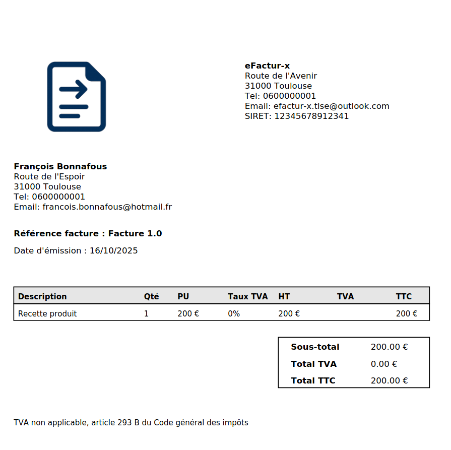
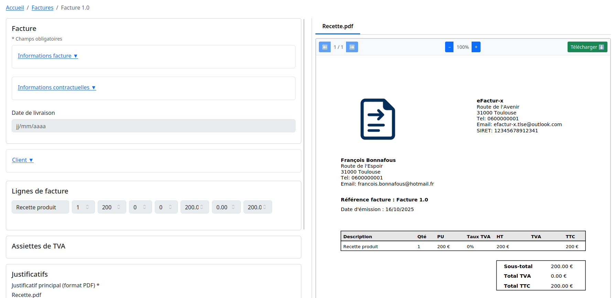

# eInvoicing – User Guide

## Etape 1 – Inscription
1. S'inscrire sur l'application  
   
2. Ajouter une adresse et définir un mot de passe  
   
3. Accepter les conditions  
   
4. Valider l'inscription via le mail de confirmation  
   

---

## Etape 2 – Éditer le profil vendeur
À la première connexion, il est nécessaire de créer un profil vendeur avec les informations minimales pour la facturation.

**Mentions minimales :**
- Nom légal
- Identifiant légal (SIRET pour les vendeurs français)
- Adresse
- Code postal
- Ville
- Pays (FR par défaut)

**Contrôles automatiques :**
- SIRET : format et clé
- Email : format
- Numéro de téléphone : format
- Code postal : format
- IBAN : format et clé
- BIC : format
- Présence des données obligatoires

> Un vendeur ne peut être créé si des informations obligatoires sont manquantes ou invalides.

---

## Etape 3 (facultatif) – Mettre à jour le répertoire client
- Menu : **Client → Créer**  
- Possibilité de créer un client depuis la fiche client ou directement à la création d’une facture s’il n’existe pas.  

**Contrôles automatiques pour les clients :**
- SIRET : format et clé
- Email : format
- Numéro de téléphone : format
- Code postal : format
- IBAN : format et clé
- BIC : format
- Présence des données obligatoires

> Si des données clients sont manquantes, elles doivent être complétées lors de la saisie de la facture.

---

## Etape 4 – Créer la facture
- Menu : **Facture → Créer**  

**Contrôles automatiques :**
- Validité des informations client (SIRET, email, téléphone, code postal)  
- Présence des informations obligatoires :
  - De la facture : référence, date d’émission, exercice fiscal, données client, au moins une ligne de facture et un justificatif
  - Du client : type, identification, adresse  

> Les informations saisies sur la facture mettent à jour automatiquement la fiche client.

**Fonctionnalités automatiques :**
- Calcul automatique des assiettes TVA
- Génération du justificatif de facture conforme

 
  

- La facture reste modifiable tant qu’elle n’a pas été transmise à une plateforme agréée.  
- Le document légal Factur-X (PDF/A-3) est accessible et téléchargeable, conforme à l’ISO 19005.  

 
 
 

---

## Etape 5 – Communiquer avec la plateforme agréée
1. **Envoyer la facture**

  

- Une fois mise à disposition, le statut de la facture est mis à jour et la facture ne peut plus être modifiée.  
  
---

2. **Demander le statut de la facture**

  

**Statuts possibles :**
- Mise à disposition
- Prise en charge
- Approuvée
- Approuvée partiellement
- En litige
- Suspendue
- Refusée
- Paiement transmis

**Règles de gestion :**
- Suspension → possibilité d’ajouter un complément et de réémettre la facture (statut passe à « Complétée »)  
- Refus → cycle terminé  
- Paiement transmis → obligation d’envoyer un statut d’encaissement pour clore le cycle

---

3. **Accuser l’encaissement d’une facture**

  

---

## Etape 6 – Piloter les factures
Le tableau de bord permet de suivre la facturation :  
- Identification des meilleurs clients  
- Évolution des ventes mensuelles  
- Statut des factures en cours de traitement  
- Liste des factures en retard de paiement  

